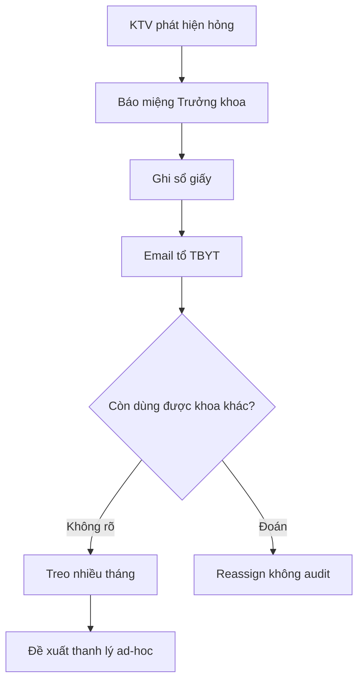
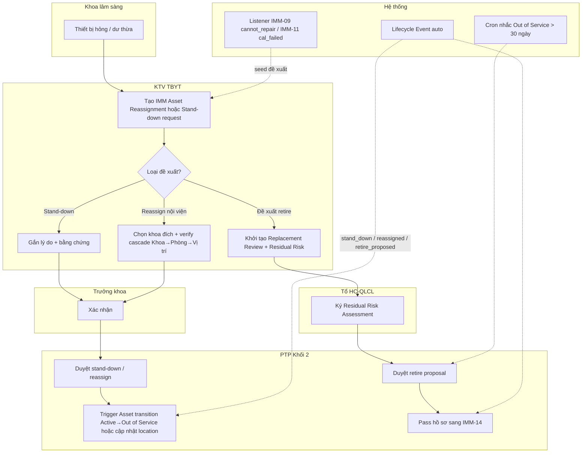
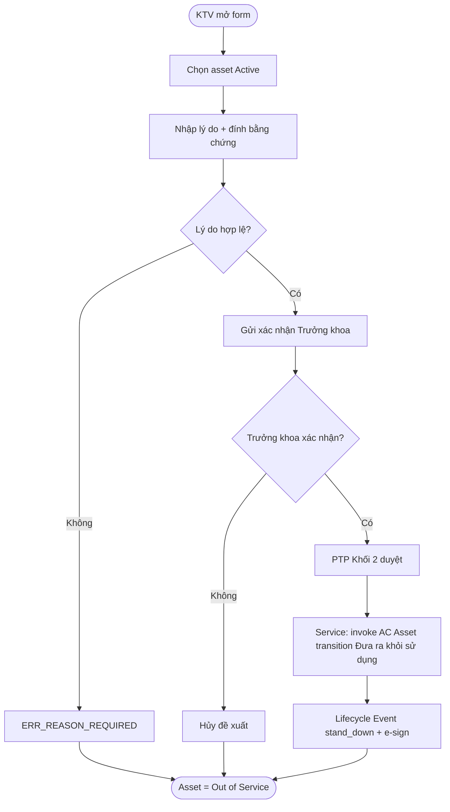
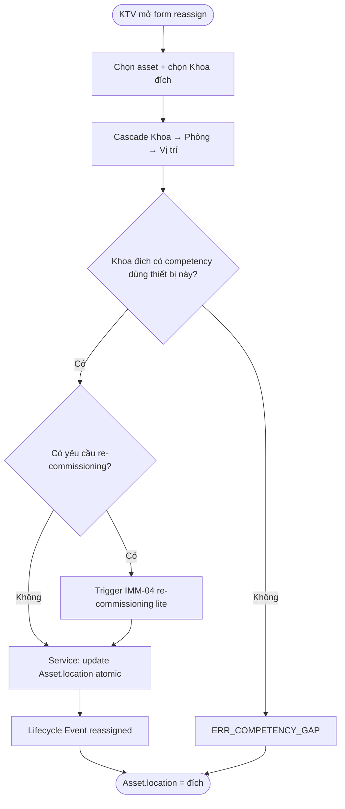
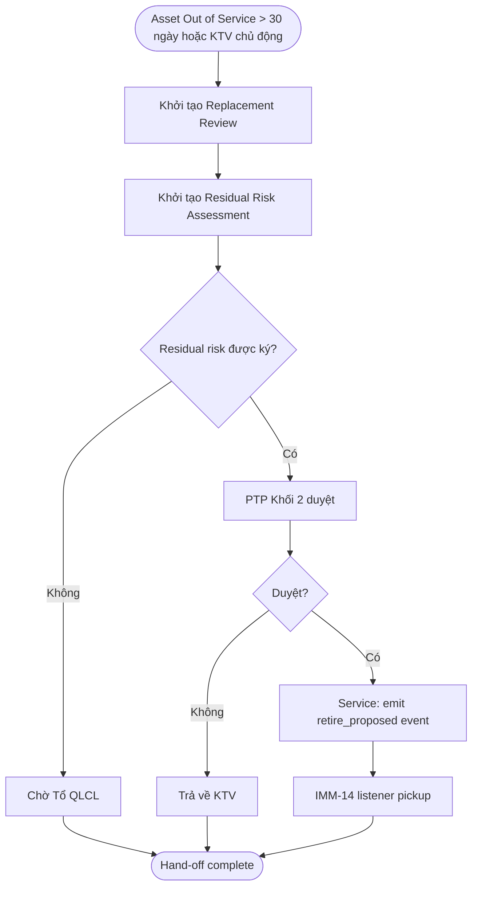
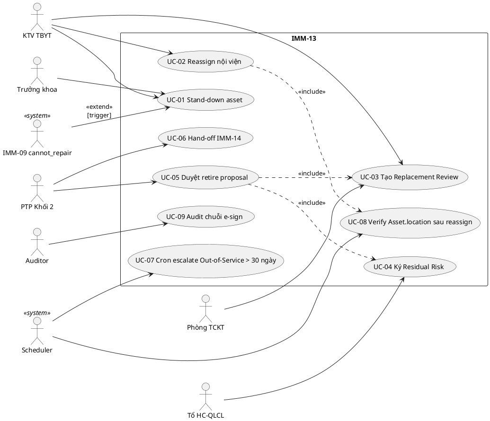
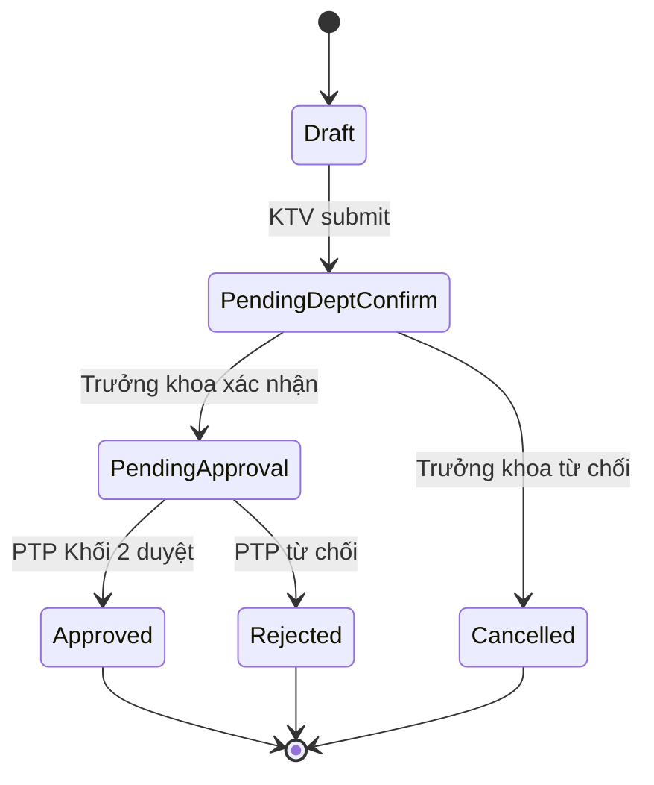

# 02 — Phân tích thiết kế nghiệp vụ (IMM-13)

| Mục | Giá trị |
|---|---|
| Module | IMM-13 — Ngừng sử dụng và điều chuyển |
| Phạm vi | Stand-down + Internal reassignment + Replacement review + Residual risk |
| Owner | BA: Tổ HC-QLCL & Risk · System Analyst: PTP Khối 2 |
| Liên kết | [03 Diagrams](./03_Diagrams.md) · [04 Backend](./04_Backend_Design.md) · [05 API](./05_API_Specification.md) · [06 Frontend](./06_Frontend_Design.md) · [IMM-14](../imm-14/README.md) |

> **Mục đích**: Định nghĩa nghiệp vụ "ngừng sử dụng và điều chuyển" như **giai đoạn tiền-giải nhiệm** trong Khối D. Module quyết định *thiết bị có nên được đưa khỏi vận hành tạm thời / vĩnh viễn*, *có nên được điều chuyển sang khoa khác trước khi retire*, và *risk còn lại* khi đề xuất sang IMM-14 để đóng vòng đời.

---

# Phần I — Module Overview

## I.0. Khảo sát hiện trạng

Hiện trạng tại các bệnh viện công VN trước khi có IMMIS (theo WHO HTM §3 và phỏng vấn nội bộ):

- Quyết định "ngừng sử dụng" thường được nói miệng giữa KTV và Trưởng khoa, **không có biên bản** hoặc chỉ có biểu mẫu giấy lưu rời rạc tại tổ TBYT. Khi audit, không truy được ai ra quyết định và lý do gì.
- Điều chuyển thiết bị giữa các khoa làm bằng email + sổ giấy. Asset registry trên ERPNext (nếu có) **không được cập nhật location**, dẫn đến tồn kho ảo.
- Quyết định "thay mới" (replacement) thường khởi nguồn từ tổ TBYT đề xuất rời rạc, **không gắn với risk score** hay cost-of-ownership thực tế. Hệ quả là đầu tư mua mới trùng lặp hoặc trễ.
- Khi thiết bị `cannot_repair` (kết luận từ IMM-09) hoặc `cal_failed` không khắc phục được (IMM-11), **không có "phễu hứng"** chuyên biệt — thiết bị bị bỏ ở góc kho cho đến khi có người nhớ đề xuất thanh lý.

So sánh với product compete:

| Tính năng | CMMS đơn lẻ (Maximo, eMaint) | ERPNext-Asset thuần | IMM-13 (mục tiêu) |
|---|---|---|---|
| Stand-down có e-sign + lý do bắt buộc | Optional | Không có | Bắt buộc |
| Internal reassignment có cập nhật location atomic | Có (ngắt rời) | Không cascade Asset state | Atomic + audit |
| Replacement review gắn risk + cost | Một phần | Không | Bắt buộc trước khi đề xuất IMM-14 |
| Residual risk assessment trước retire | Không chuẩn hóa | Không | Bắt buộc theo WHO §3.2 |

## I.1. Pitch

Khi một thiết bị y tế hỏng nặng, hết khả năng sửa, hoặc dư thừa tại khoa A nhưng thiếu ở khoa B, hiện không có một quy trình duy nhất để (a) đưa nó khỏi sử dụng có audit, (b) điều chuyển nội bộ trước khi nghĩ đến vứt bỏ, và (c) chuẩn bị hồ sơ "giải nhiệm" đúng cách. IMM-13 đóng phễu này: KTV và Trưởng khoa nhập đề xuất, hệ thống tính residual risk theo WHO HTM §3.2, ban điều hành duyệt, và nếu thiết bị không còn dùng được trong nội viện thì pass sang IMM-14 để đóng sổ. Mục tiêu là không thiết bị nào "biến mất" khỏi registry mà không có chữ ký số và biên bản.

## I.2. Vị trí trong WHO HTM lifecycle

Tick: ☐ Needs · ☐ Procurement · ☐ Install · ☑ Operation (cuối) · ☑ Maintenance (cuối) · ☑ Decommission (giai đoạn đầu)

- **Input** từ:
  - IMM-08 PM (phát hiện thiết bị end-of-life qua PM finding)
  - IMM-09 Repair (kết luận `cannot_repair` hoặc chi phí sửa > ngưỡng)
  - IMM-11 Calibration (kết quả `out_of_tolerance` không khắc phục được)
  - IMM-12 Incident (sự cố gây ngừng vĩnh viễn / không an toàn lâm sàng)
  - IMM-07 Performance (replacement signal: utilization < ngưỡng X tháng liên tiếp)
- **Output** sang:
  - IMM-14 Giải nhiệm (khi quyết định retire chính thức được duyệt → IMM-14 pickup hồ sơ)
  - IMM-01 Needs (khi quyết định "thay mới" → seed nhu cầu mới)
  - IMM-04 Installation (khi điều chuyển sang khoa khác cần re-commissioning)

## I.3. Stakeholders & Actors

| Vai trò | Người dùng thực | Quan tâm chính | Tần suất | Loại |
|---|---|---|---|---|
| KTV TBYT | Workshop / Nhóm TBYT | Khởi tạo đề xuất stand-down / reassign khi phát hiện thiết bị hỏng / dư | Tuần | Primary |
| Trưởng khoa lâm sàng | Mạng lưới TBYT nội viện | Xác nhận thiết bị thuộc khoa được/không được điều chuyển | Tuần | Primary |
| PTP Khối 2 | PTP phụ trách Khối 2 | Duyệt replacement review + chuyển sang IMM-14 | Tháng | Approver |
| Tổ HC-QLCL & Risk | Tổ HC-QLCL & Risk | Ký residual risk assessment | Tháng | Approver |
| Phòng TCKT | Nhóm KH-TC | Đối chiếu chi phí sửa vs giá trị còn lại trước khi quyết định | Tháng | Secondary |
| Auditor nội bộ | QMS Officer | Truy vết tại sao thiết bị bị stand-down, ai duyệt, có theo NĐ98 không | Quý | Auditor |
| Scheduler hệ thống | (system) | Cron nhắc đề xuất quá hạn, signal replacement từ IMM-07 | Hàng giờ | System |

## I.4. Scope

**In-scope:**
- Đề xuất `Stand-down` (Active → Out of Service) có lý do bắt buộc + e-sign.
- Đề xuất `Internal Reassignment` (chuyển khoa/phòng/vị trí) — cập nhật `AC Asset.location` atomic.
- `Replacement Review` — bảng đối chiếu cost-of-repair vs replacement-cost vs risk score.
- `Residual Risk Assessment` (theo WHO §3.2) — bảng risk × likelihood × impact × mitigation.
- `Retire Proposal` — đầu vào cho IMM-14.

**Out-of-scope:**
- Phát hành closure record / đối soát kế toán → IMM-14.
- Disposal / donation / sale logistics → IMM-14.
- Mua sắm thay thế → IMM-01/02/03.
- Decontamination + removal of patient data thực tế (vật lý) → IMM-14 §3.5/3.6.
- Chuyển trạng thái Active ↔ Under Maintenance / Under Repair / Calibrating (thuộc IMM-08/09/11).

**Assumptions:**
- `AC Asset Lifecycle` (8 states) đã có sẵn từ Wave 1; IMM-13 KHÔNG tạo state mới mà *điều khiển transition* `Đưa ra khỏi sử dụng` và `Khôi phục hoạt động`.
- Vị trí nội viện đã quản lý qua DocType `Location` (cây Khoa → Phòng → Vị trí).
- Lifecycle Event (`assetcore.utils.lifecycle.create_lifecycle_event`) là channel duy nhất ghi nhận thay đổi state Asset.

**Dependencies:**
- DocType: `AC Asset`, `Lifecycle Event`, `Location`, `Asset Repair` (IMM-09), `IMM Asset Calibration` (IMM-11), `Incident Report` (IMM-12).
- Module: IMM-04 (re-commissioning khi reassign), IMM-14 (downstream retire), IMM-07 (replacement signal upstream).
- External: tích hợp ERPNext Asset (master) — không modify core.

## I.5. KPI mục tiêu

| KPI | Định nghĩa | Baseline | Target | Đo ở đâu |
|---|---|---|---|---|
| Stand-down lead time | Từ lúc trigger (vd cannot_repair) → state Out of Service | *(Cần khảo sát baseline)* | ≤ 3 ngày làm việc | `Lifecycle Event` chuỗi `cannot_repair` → `stand_down` |
| Reassignment success rate | % đề xuất reassign được duyệt và Asset re-active tại khoa mới | *(Cần khảo sát baseline)* | ≥ 70% | DocType `IMM Asset Reassignment` (dự kiến) |
| Replacement review compliance | % thiết bị Out of Service có replacement review hoàn chỉnh trong 30 ngày | *(Cần khảo sát baseline)* | ≥ 90% | `IMM Replacement Review` (dự kiến) |
| Residual risk closure rate | % residual risk Item được mitigation hoặc transfer trước khi pass sang IMM-14 | *(Cần khảo sát baseline)* | 100% (gating) | `IMM Residual Risk` child table |
| Asset registry accuracy after reassign | % Asset có `location` khớp khoa thực tế sau 30 ngày reassign | *(Cần khảo sát baseline)* | ≥ 95% | Đối chiếu kiểm kê IMM-15 |

## I.6. Ràng buộc Compliance

| Quy định | Yêu cầu áp lên IMM-13 | Doc tham chiếu |
|---|---|---|
| NĐ 98/2021/NĐ-CP | Thiết bị y tế chuyển trạng thái phải lưu hồ sơ ≥ 5 năm + có chữ ký người ra quyết định | `../gmdn/Quyết định 3107_QĐ-BYT.pdf` |
| WHO HTM — Decommissioning §3.1 | Quyết định decommission phải gắn risk + cost assessment trước khi thực hiện | `../WHO/WHO - Decommissioning medical devices.md` §3.1–3.2 |
| WHO HTM §3.6 Removal of patient data | Trước khi reassign sang khoa khác, dữ liệu bệnh nhân trong thiết bị phải được xóa / sanitize (nếu có) | WHO §3.6 |
| ISO 13485 — kiểm soát thay đổi | Mọi quyết định stand-down ảnh hưởng dịch vụ lâm sàng phải qua change control | QMS PR-IMMIS-13-* |
| AC Asset Lifecycle — workflow gốc | Transition `Đưa ra khỏi sử dụng` đòi 2-role (`IMM Operations Manager` + `IMM QA Officer`) + e-sign | `../ba/Phase_04_Process_Workflow_Design/01_Workflow_Specification/Workflow_Specification.md` §1 |

## I.7. Risk & Open questions

| Risk | Likelihood | Impact | Giảm thiểu |
|---|---|---|---|
| Stand-down nhầm thiết bị đang dùng cho ca lâm sàng | Thấp | Cao | Bắt buộc xác nhận từ Trưởng khoa (2-role) trước khi commit transition |
| Reassign nhưng quên cập nhật `location` → asset registry sai | Trung bình | Trung bình | Atomic update trong service layer + verification trong scheduler hàng đêm |
| Replacement review bị bỏ qua → thiết bị "treo" Out of Service nhiều tháng | Cao | Trung bình | Cron hàng tuần escalate ticket > 30 ngày Out of Service |
| Residual risk không được đánh giá trước khi pass IMM-14 | Trung bình | Cao | Gate logic: IMM-14 reject hồ sơ thiếu residual risk signed-off |

| Open question | Owner | Deadline |
|---|---|---|
| Ngưỡng "chi phí sửa cao" để auto-trigger replacement review (vd > 50% giá trị còn lại?) | Phòng TCKT + PTP Khối 2 | *(Sprint Wave 3 — kickoff)* |
| Có cho phép reassign **xuyên cơ sở** (multi-site) không? | Trưởng phòng P.VT,TBYT | *(Sprint Wave 3 — kickoff)* |
| Thiết bị Class C/D theo NĐ98 có yêu cầu hồ sơ đặc biệt khi reassign không? | Tổ HC-QLCL & Risk | *(Cần khảo sát thêm)* |

## I.8. Roadmap thực thi

| Sprint | Hạng mục | Owner | Status |
|---|---|---|---|
| Wave 3 — Sprint 1 | DocType skeleton (`IMM Asset Reassignment`, `IMM Replacement Review`, `IMM Residual Risk`) + naming series | Tech Lead BE | Planned |
| Wave 3 — Sprint 2 | Service layer 3-tier + gắn vào `AC Asset` workflow transition `Đưa ra khỏi sử dụng` | BE Dev | Planned |
| Wave 3 — Sprint 3 | API layer + ErrorCode + integration test với IMM-09/11/12 (input) | BE Dev + QA | Planned |
| Wave 3 — Sprint 4 | FE views: list reassignment, list replacement review, residual risk form | FE Dev | Planned |
| Wave 3 — Sprint 5 | Cron scheduler + dashboard widget + e-sign flow | BE Dev + FE Dev | Planned |
| Wave 3 — Sprint 6 | UAT + handoff sang IMM-14 + permission audit | QA + BA | Planned |

---

# Phần II — Quy trình nghiệp vụ (Business Process)

## II.1. Phân biệt 3 khái niệm

- **Business Process** (file này): tổ chức làm thế nào để stand-down + reassign + đề xuất retire.
- **Use Case** (Phần III): từng tương tác giữa actor và hệ thống.
- **Workflow** (file 04 §III): state + transition của các DocType `IMM Asset Reassignment`, `IMM Replacement Review` (xem 04). Workflow của `AC Asset` đã có sẵn — IMM-13 chỉ *invoke*, không định nghĩa lại.

## II.2. As-Is process

Hiện trạng (không có IMMIS): KTV phát hiện thiết bị hỏng nặng → báo miệng Trưởng khoa → ghi sổ giấy → email tổ TBYT → có khi đợi 1–3 tháng để có biên bản → Trưởng phòng ký → đẩy sang phòng kế toán xin thanh lý → mất dấu hồ sơ kỹ thuật.

## II.3. Pain points

| # | Pain | Tác động |
|---|---|---|
| 1 | Không có e-sign + biên bản số khi stand-down | Audit không truy được người ra quyết định, vi phạm NĐ98 |
| 2 | Reassign không cập nhật location → tồn kho ảo | Kiểm kê IMM-15 sai, mua trùng lặp |
| 3 | Replacement review không có khung chuẩn | Đầu tư trùng hoặc trễ |
| 4 | Residual risk không được đánh giá có hệ thống | Rủi ro lâm sàng sót khi thiết bị bị reassign |
| 5 | Không có "phễu" hứng output từ IMM-09/11/12 cannot-repair / out-of-tolerance | Thiết bị bị "lãng quên" trong kho |

## II.4. To-Be process (với AssetCore)

## II.5. Decision points

| Điểm | Câu hỏi | Quy tắc |
|---|---|---|
| D1 — Loại đề xuất | Stand-down tạm / Reassign / Retire? | KTV chọn theo flag IMM-09/11/12 trigger; có thể chuyển từ Stand-down sang Retire sau review |
| D2 — Đủ điều kiện reassign? | Khoa đích có nhân lực / hạ tầng / cấp phép sử dụng thiết bị này không? | Check competency IMM-06 + check `Location` thuộc cơ sở y tế hợp lệ |
| D3 — Đề xuất retire có được duyệt? | Residual risk được ký? Replacement review có khuyến nghị rõ? | Bắt buộc cả 2 trước khi PTP Khối 2 duyệt |
| D4 — Cần re-commissioning sau reassign? | Thiết bị Class B/C/D + chuyển khoa khác chuyên ngành? | Auto-trigger IMM-04 re-commissioning lite |

## II.6. Process metrics

| Metric | Mục tiêu | Đo ở đâu |
|---|---|---|
| Lead time stand-down | ≤ 3 ngày làm việc | `Lifecycle Event` |
| Lead time reassign duyệt | ≤ 5 ngày làm việc | `IMM Asset Reassignment.workflow_state` |
| % đề xuất retire có residual risk signed-off | 100% | `IMM Residual Risk` |
| Audit-readiness | 100% record có chuỗi e-sign + lý do | Audit Trail (hash chain) |

## II.7. RACI matrix

| Hoạt động | KTV | Trưởng khoa | PTP Khối 2 | Tổ QLCL | TCKT | Auditor |
|---|---|---|---|---|---|---|
| Khởi tạo đề xuất | R/A | C | I | I | I | I |
| Xác nhận từ khoa | I | R/A | I | I | – | I |
| Ký Residual Risk | C | C | I | R/A | I | I |
| Đối chiếu cost / giá trị còn lại | I | – | C | I | R/A | I |
| Duyệt cuối | C | C | R/A | C | C | I |
| Hand-off IMM-14 | I | I | R/A | I | I | I |

## II.8. Exception flow

- **EX1 — Thiết bị stand-down nhưng có ca lâm sàng đang đặt lịch dùng**: hệ thống cảnh báo (check link với HIS scheduling nếu có), block transition cho đến khi Trưởng khoa override với reason "no clinical impact" + e-sign.
- **EX2 — Reassign nhưng khoa đích từ chối nhận**: trả về state `Pending` với note, gửi notify lại KTV. Sau 14 ngày không xử lý → auto cancel.
- **EX3 — Sau retire proposal, BE crash khi pass sang IMM-14**: hồ sơ ở state `Approved (pending IMM-14 ack)`, có cron retry 6 giờ/lần, sau 3 lần fail thì notify admin.

## II.9. So sánh As-Is vs To-Be

| Khía cạnh | As-Is | To-Be |
|---|---|---|
| Ghi nhận quyết định | Sổ giấy / email | DocType + e-sign + Lifecycle Event |
| Cập nhật location khi reassign | Thủ công, không nhất quán | Atomic trong service layer |
| Replacement review | Không có khung | Bảng cost vs risk chuẩn hóa |
| Residual risk | Không đánh giá | Bắt buộc, gating IMM-14 |
| Truy vết | Không truy được | Audit trail hash chain SHA-256 |

## II.10. Activity diagram per UC chính

### Activity — UC-IMM13-01 Stand-down một asset

### Activity — UC-IMM13-02 Reassign nội viện

### Activity — UC-IMM13-04 Đề xuất retire pass sang IMM-14

---

# Phần III — Use Case Specification (UML)

## III.1. Use Case Diagram

### III.1.a. Tổng quát

### III.1.b. Phân rã theo nhóm chức năng

**Nhóm A — Stand-down & Reassign (vận hành):** UC-01, UC-02, UC-08.

**Nhóm B — Replacement & Risk (governance):** UC-03, UC-04, UC-05.

**Nhóm C — Hand-off & Audit (lifecycle integrity):** UC-06, UC-07, UC-09.

## III.2. Actor catalog

| Actor | Loại | Mô tả | Goal chính |
|---|---|---|---|
| KTV TBYT | Primary | Người trực tiếp vận hành tổ TBYT | Khởi tạo đề xuất nhanh, đúng |
| Trưởng khoa | Primary | Người sử dụng thiết bị tại khoa | Xác nhận thiết bị có/không thể tiếp tục sử dụng |
| PTP Khối 2 | Approver | Điều phối Khối 2 | Duyệt cuối các quyết định ảnh hưởng vận hành |
| Tổ HC-QLCL | Approver | QMS Officer | Ký residual risk + đảm bảo compliance |
| Phòng TCKT | Secondary | Đối chiếu chi phí | Cung cấp giá trị còn lại để quyết định retire |
| Auditor | Auditor | Nội bộ + ngoại kiểm | Truy vết chuỗi quyết định |
| Scheduler | System | Cron Frappe | Auto-escalate, auto-verify |
| IMM-09/11/12 listener | System (External Module) | Trigger seed đề xuất | Đưa output các module operation vào "phễu" IMM-13 |

## III.3. Use Case Specifications

### UC-01: Stand-down asset

| Mục | Giá trị |
|---|---|
| ID | UC-IMM13-01 |
| Brief | KTV đề xuất đưa một asset Active sang Out of Service vì lý do hỏng / không an toàn / dư thừa |
| Primary actor | KTV TBYT |
| Pre-condition | Asset đang ở state Active; KTV có role `IMM HTM Engineer` |
| Post-condition | Asset chuyển state Out of Service; Lifecycle Event `stand_down` được tạo; e-sign lưu hash |
| Trigger | KTV chủ động hoặc IMM-09 emit `cannot_repair` |

#### Main flow
| Bước | Actor | System |
|---|---|---|
| 1 | KTV mở form Stand-down | Hiển thị danh sách Asset Active KTV có quyền |
| 2 | Chọn asset, nhập lý do, đính bằng chứng | Validate lý do bắt buộc, file ≤ 10MB |
| 3 | Submit để xác nhận | Gửi notify Trưởng khoa |
| 4 | Trưởng khoa xác nhận | Cập nhật state Pending Approval |
| 5 | PTP Khối 2 duyệt + e-sign | Service invoke transition `Đưa ra khỏi sử dụng` |
| 6 | (system) | Tạo Lifecycle Event + audit hash + notify auditor |

#### Alternative A1 — Trigger từ IMM-09
- 1.a. IMM-09 emit event `cannot_repair` → service IMM-13 auto-seed form với reason pre-filled.

#### Exception E1 — Asset có lịch lâm sàng đang đặt
- 5.a. System trả `ERR_ASSET_HAS_CLINICAL_BOOKING` → block transition; yêu cầu Trưởng khoa override + e-sign lý do "no clinical impact".

#### Special requirements
- Performance: form load < 1s với 5k asset.
- Security: 2-role gating (KTV + Trưởng khoa + PTP), e-sign re-auth.
- Audit: lifecycle event là channel duy nhất ghi nhận state transition.

### UC-02: Reassign nội viện

| Mục | Giá trị |
|---|---|
| ID | UC-IMM13-02 |
| Brief | Chuyển asset từ khoa A → khoa B trong cùng cơ sở |
| Primary actor | KTV TBYT |
| Pre-condition | Asset state ∈ {Active, Out of Service (cho phép tái sử dụng)} |
| Post-condition | `AC Asset.location` cập nhật; nếu cần re-commissioning → tạo IMM-04 lite |
| Trigger | KTV nhập tay |

#### Main flow
| Bước | Actor | System |
|---|---|---|
| 1 | KTV chọn asset + cascade Khoa → Phòng → Vị trí đích | Validate khoa tồn tại + competency |
| 2 | Trưởng khoa nguồn xác nhận | Cập nhật state |
| 3 | Trưởng khoa đích chấp nhận | Cập nhật state |
| 4 | PTP Khối 2 duyệt | Service: atomic update `Asset.location` + Lifecycle Event `reassigned` |

#### Alternative A1 — Cần re-commissioning
- 4.a. System detect Asset class B/C/D + khoa đích khác chuyên ngành → trigger IMM-04 lite.

#### Exception E1 — Khoa đích từ chối
- 3.a. Trả về state `Pending` + notify KTV + sau 14 ngày auto cancel (`ERR_REASSIGN_REJECTED`).

#### Special requirements
- Atomicity: cập nhật location + lifecycle event trong cùng transaction.
- Audit: ghi rõ khoa nguồn → đích trong audit.

### UC-03 → UC-09 (compact spec)

Các UC còn lại có flow tuyến tính, viết gọn dạng bảng. Spec đầy đủ Pre/Post/Main/Exception sẽ chốt ở Sprint Wave 3 (BA review):

| ID | Tên | Primary actor | Pre-condition | Post-condition | Exception chính |
|---|---|---|---|---|---|
| UC-IMM13-03 | Tạo Replacement Review | KTV (init) + TCKT (fill cost) | Asset OOS > 7 ngày hoặc IMM-07 signal | DocType state Submitted | TCKT thiếu cost > 7 ngày → escalate |
| UC-IMM13-04 | Ký Residual Risk | Tổ HC-QLCL | UC-03 submitted | ≥ 3 risk item có mitigation + e-sign QMS | Mitigation rỗng → block |
| UC-IMM13-05 | Duyệt retire proposal | PTP Khối 2 | UC-03 + UC-04 hoàn tất | State Approved + emit `retire_proposed` | IMM-14 fail → cron retry 3×/6h |
| UC-IMM13-06 | Hand-off IMM-14 | System | UC-05 approved | IMM-14 nhận payload đủ | Listener fail → enqueue |
| UC-IMM13-07 | Cron escalate OOS > 30 ngày | Scheduler | Daily 03:00 | Notify PTP về asset treo | – |
| UC-IMM13-08 | Verify location sau reassign | Scheduler | Daily | Asset.location khớp đề xuất gần nhất | Lệch → audit `location_mismatch` |
| UC-IMM13-09 | Audit chuỗi e-sign | Auditor | Hồ sơ approved | Verify hash chain | Hash gãy → cảnh báo |

## III.4. Use Case relationships

**`<<include>>`:**
| Caller | Includes | Lý do |
|---|---|---|
| UC-05 | UC-04 | Phải có residual risk signed trước khi duyệt |
| UC-05 | UC-03 | Phải có replacement review |
| UC-02 | UC-08 | Mỗi reassign cần verify location |

**`<<extend>>`:**
| Extender | Extends | Khi nào |
|---|---|---|
| IMM-09 cannot_repair listener | UC-01 | Khi IMM-09 kết luận không sửa được |
| IMM-11 cal_failed listener | UC-01 | Khi calibration thất bại không khắc phục |
| UC-04 trigger từ IMM-07 signal | UC-03 | Khi IMM-07 phát hiện replacement signal |

## III.5. UC ↔ User Story mapping

| Use Case | US ID | Note |
|---|---|---|
| UC-01 | IMM13-US-01, IMM13-US-02 | Stand-down chủ động + tự động |
| UC-02 | IMM13-US-03 | Reassign |
| UC-03 | IMM13-US-04 | Replacement review |
| UC-04 | IMM13-US-05 | Residual risk |
| UC-05 | IMM13-US-06 | Approval |
| UC-06 | IMM13-US-07 | Hand-off |
| UC-07 | IMM13-US-08 | Cron escalation |
| UC-09 | IMM13-US-09 | Audit |

## III.6. UC ↔ Sequence Diagram mapping

| Use Case | Sequence ID trong [03 Diagrams](./03_Diagrams.md) | Note |
|---|---|---|
| UC-01 | SEQ-01 | Stand-down |
| UC-02 | SEQ-02 | Reassign |
| UC-05 | SEQ-03 | Retire approval + hand-off |

---

# Phần IV — Functional Specifications

## IV.1. User Stories & Acceptance Criteria

### IMM13-US-01 — Stand-down chủ động

> Là **KTV TBYT**, tôi muốn **đề xuất stand-down một thiết bị tôi đang theo dõi**, để **đưa ra khỏi sử dụng có biên bản số**.

- Priority: Must
- Estimate: 5 SP
- AC:
  - **Given** asset đang Active, **When** KTV submit form với lý do hợp lệ, **Then** state đề xuất là `Pending Department Confirm` + notify Trưởng khoa.
  - **Given** Trưởng khoa và PTP Khối 2 đều e-sign, **When** transition `Đưa ra khỏi sử dụng` chạy, **Then** Asset → Out of Service + Lifecycle Event `stand_down` + audit hash.
- Ngoại lệ: nếu thiếu lý do → `ERR_REASON_REQUIRED`.

### IMM13-US-02 — Stand-down tự động từ IMM-09

> Là **System**, tôi muốn **auto-seed đề xuất stand-down** khi IMM-09 kết luận `cannot_repair`, để **không thiết bị nào "bỏ quên" trong kho**.

- Priority: Must · Estimate: 3 SP
- AC: trigger event → form pre-filled với evidence từ Asset Repair → đặt KTV phụ trách thiết bị làm assignee mặc định.

### IMM13-US-03 — Reassign nội viện

> Là **KTV**, tôi muốn **chuyển asset sang khoa khác**, để **tận dụng tối đa thiết bị trước khi nghĩ tới retire**.

- Priority: Must · Estimate: 5 SP
- AC: cascade Khoa → Phòng → Vị trí; cập nhật `AC Asset.location` atomic + Lifecycle Event `reassigned`.

### IMM13-US-04 → US-09 (compact)

| US ID | Là (role) | Muốn | Để | Priority | SP | AC chính |
|---|---|---|---|---|---|---|
| IMM13-US-04 | PTP Khối 2 | Xem bảng cost vs risk | Quyết định retire có căn cứ | Must | 5 | Risk score = (cost_repair / replacement_cost) × risk_factor; gating UC-05 |
| IMM13-US-05 | QMS Officer | Ký residual risk theo WHO §3.2 | Đảm bảo compliance khi retire | Must | 3 | ≥ 3 risk item có mitigation + e-sign hash |
| IMM13-US-06 | PTP Khối 2 | Duyệt retire proposal một chỗ | Không xem rời rạc nhiều file | Must | 3 | UI tổng hợp Review + Risk; e-sign |
| IMM13-US-07 | System | Emit `retire_proposed` event tin cậy | IMM-14 pickup không sót | Must | 3 | Retry 3 lần / 6h, sau đó notify admin |
| IMM13-US-08 | PTP Khối 2 | Nhận notify Asset OOS > 30 ngày chưa retire | Không thiết bị nào "treo" | Should | 2 | Cron daily, notify list rút gọn |
| IMM13-US-09 | Auditor | Xem chuỗi e-sign 1 retire proposal | Đảm bảo NĐ98 | Must | 2 | Endpoint trả full hash chain + verify |

## IV.2. Business Rules

| ID | Rule | Implement ở | Liên kết test |
|---|---|---|---|
| IMM13-BR-01 | Stand-down phải có 2-role e-sign (Trưởng khoa + PTP Khối 2) | Service `imm13.stand_down` | UT-IMM13-BR-01 |
| IMM13-BR-02 | Reassign phải atomic update `Asset.location` + Lifecycle Event | Service `imm13.reassign` | UT-IMM13-BR-02 |
| IMM13-BR-03 | Retire proposal block nếu thiếu Replacement Review hoặc Residual Risk | Service `imm13.approve_retire` | UT-IMM13-BR-03 |
| IMM13-BR-04 | Asset có clinical booking → block stand-down trừ khi override | Service + integration HIS | UT-IMM13-BR-04 |
| IMM13-BR-05 | Reassign sang khoa khác chuyên ngành (Class B/C/D) → auto-trigger IMM-04 lite | Service `imm13.reassign` | IT-IMM13-BR-05 |
| IMM13-BR-06 | Lifecycle Event là channel duy nhất ghi state Asset | Service (forbid direct ORM) | UT-IMM13-BR-06 |

## IV.3. State Machine

IMM-13 KHÔNG định nghĩa state machine cho `AC Asset` (đã có trong [`Workflow_Specification.md`](../ba/Phase_04_Process_Workflow_Design/01_Workflow_Specification/Workflow_Specification.md) §1). IMM-13 định nghĩa workflow cho **3 DocType riêng** (xem [04 §III](./04_Backend_Design.md)):

| State | Mô tả | Role chuyển | Action button |
|---|---|---|---|
| Draft | Mới khởi tạo | KTV | Save / Submit |
| PendingDeptConfirm | Chờ Trưởng khoa | Trưởng khoa | Confirm / Reject |
| PendingApproval | Chờ PTP Khối 2 | PTP Khối 2 | Approve / Reject |
| Approved | Đã duyệt | – | – |
| Rejected | Bị từ chối | KTV (resubmit) | Edit & resubmit |
| Cancelled | Hủy | – | – |

Map docstatus: Draft=0; PendingDeptConfirm/PendingApproval=0; Approved/Rejected=1; Cancelled=2.

## IV.4. Input — Output

**(a) Input fields** *(field detail — Sprint Wave 3 sau khi BE scaffold)*. Cascade quan trọng:

- `target_facility` → `target_department` → `target_room` → `target_location` (4 cấp, reset+reload mỗi cấp).
- `asset` chọn xong → `from_location` auto-fill từ `Asset.location` (read-only).
- `asset.classification` (A/B/C/D từ NĐ98) → quyết định có cần re-commissioning hay không.

**(b) Output records sinh ra:**
- `IMM Asset Reassignment` (DocType chính cho UC-02).
- `IMM Replacement Review` (DocType cho UC-03).
- `IMM Residual Risk` (DocType cho UC-04).
- `Lifecycle Event` (kiểu `stand_down`, `reassigned`, `retire_proposed`).
- `Audit Trail Entry` (hash chain).

**(c) Notification / side effect:**
- Notify Trưởng khoa khi PendingDeptConfirm.
- Notify PTP Khối 2 khi PendingApproval + cron escalation > 5 ngày.
- Emit event `retire_proposed` → IMM-14 listener.
- Notify auditor khi retire approved.

## IV.5. Edge cases & Errors

| ID | Edge case | Hành vi mong đợi | Error code |
|---|---|---|---|
| EC-01 | Asset đang ở state `Under Maintenance` mà KTV đề xuất stand-down | Block, yêu cầu close PM trước | `IMM13_ASSET_BUSY_PM` |
| EC-02 | Asset đang ở `Under Repair` mà đề xuất reassign | Block | `IMM13_ASSET_BUSY_REPAIR` |
| EC-03 | Concurrent: 2 KTV cùng submit reassign 1 asset | Optimistic lock, người sau nhận lỗi | `IMM13_CONCURRENT_UPDATE` |
| EC-04 | Trưởng khoa nguồn không trả lời > 14 ngày | Auto cancel | `IMM13_TIMEOUT_DEPT_CONFIRM` |
| EC-05 | Khoa đích không có competency dùng thiết bị (qua IMM-06) | Block | `IMM13_COMPETENCY_GAP` |
| EC-06 | Asset có booking lâm sàng đang chạy | Block trừ khi override | `IMM13_ASSET_HAS_CLINICAL_BOOKING` |
| EC-07 | IMM-14 listener fail 3 lần | Notify admin | `IMM13_HANDOFF_IMM14_FAIL` |
| EC-08 | Replacement Review thiếu cost từ TCKT | Block submit | `IMM13_REVIEW_COST_MISSING` |

*(Mã ErrorCode chính thức theo `services/shared/constants.py:ErrorCode` — Sprint Wave 3 sẽ chốt namespace `IMM13_*`).*

## IV.6. Out of scope & Open issues

**Out-of-scope**: phát hành closure record, đối soát kế toán, disposal logistics — đều thuộc IMM-14.

**Open issues**:
- Có hỗ trợ reassign multi-site không (Sprint Wave 3 kickoff).
- Ngưỡng "chi phí sửa cao" auto-trigger replacement review.

---

# Phần V — Yêu cầu phi chức năng (NFR)

| Nhóm | Yêu cầu cốt lõi | Target |
|---|---|---|
| V.1 Hiệu năng | API stand-down p95 / list 1k record / cron daily / query OOS>30d | < 800ms / < 1.2s / < 60s / < 200ms |
| V.2 Bảo mật | Frappe session + RBAC 3 cấp + e-sign SHA-256 (`signed_by/at/hash`) + audit hash chain qua `log_audit_event`. KHÔNG lưu patient data trong DocType IMM-13; nếu Asset chứa thì gọi sanitize service IMM-14 trước reassign (WHO §3.6) | OWASP Top 10 đáp ứng |
| V.3 Khả dụng | Uptime giờ HC / RPO / RTO | ≥ 99.5% / ≤ 24h / ≤ 4h |
| V.4 Khả mở rộng | 200–500 reassignment/năm/site (≪ IMM-09); multi-site 1 codebase N site | – |
| V.5 UX | WCAG 2.1 AA, Chrome/Edge ≥ 120, Firefox ≥ 122, tiếng Việt primary, cascade Khoa→Phòng→Vị trí responsive | – |
| V.6 Bảo trì | Coverage service / DocType / API; type hints + docstring (CLAUDE §15, CONVENTIONS §6) | ≥ 85% / 70% / 60% |
| V.7 Tuân thủ | NĐ98/2021 lưu hồ sơ ≥ 5 năm + audit hash chain; WHO HTM §3.1, §3.2, §3.6, §3.8; ISO 13485 change control (PR-IMMIS-13-*); phân tách trách nhiệm KTV ≠ Trưởng khoa ≠ PTP ≠ Auditor | Mandatory |

---

## DoD — File 02 hoàn chỉnh

- [x] I.0–I.8 đầy đủ
- [x] BPMN As-Is + To-Be ≥ 4 lane
- [x] ≥ 3 activity diagram per UC chính
- [x] UC diagram tổng quát + 3 nhóm phân rã
- [x] 9 UC có spec
- [x] 6 BR đánh số + nơi implement
- [x] 8 edge case
- [x] 7 nhóm NFR
- [ ] BA Lead + Tech Lead review (Sprint Wave 3 kickoff)
