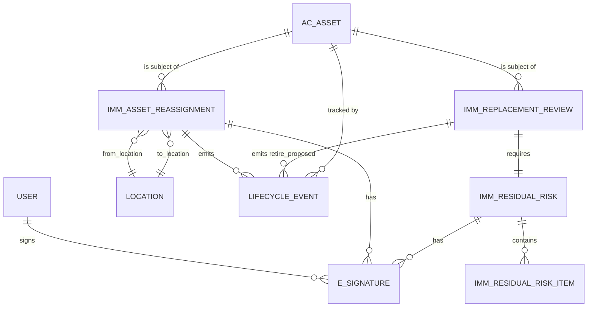
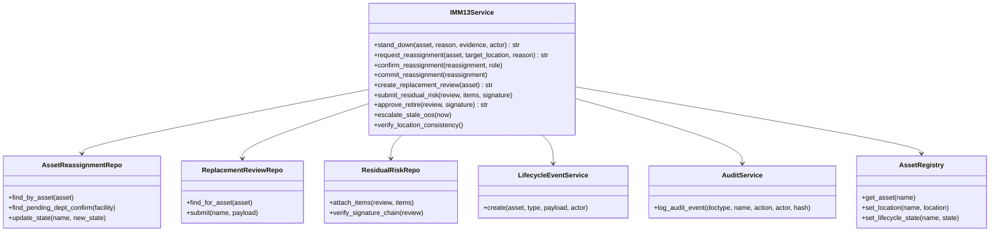
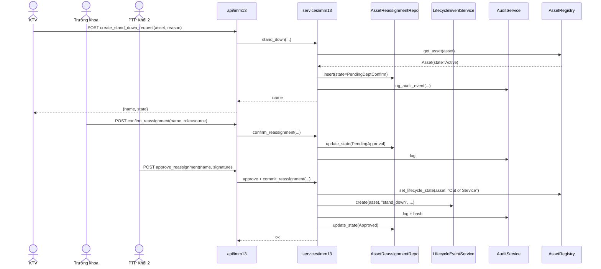
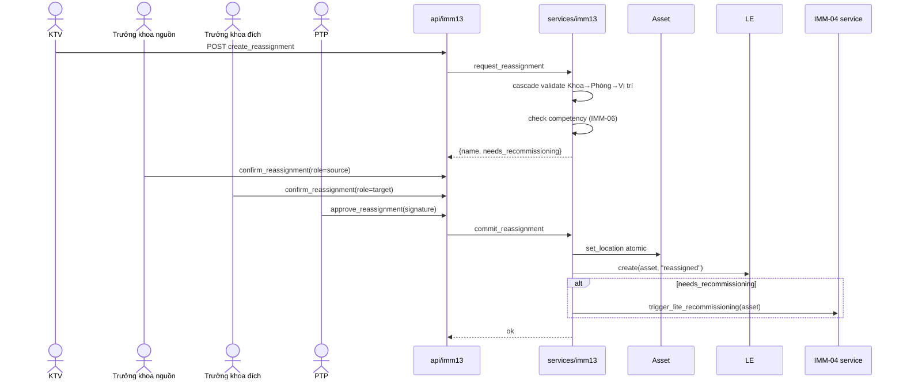
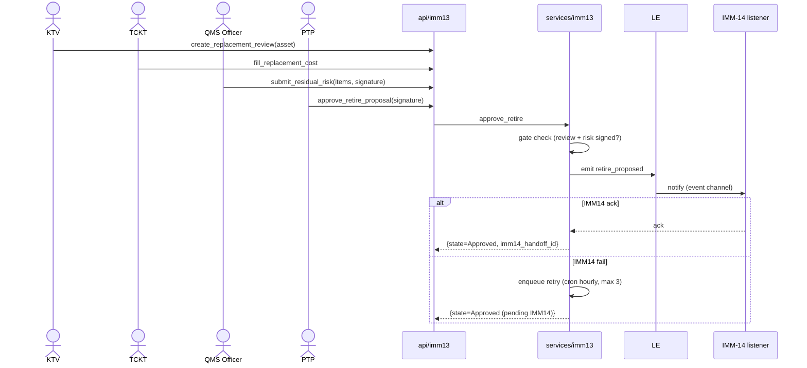
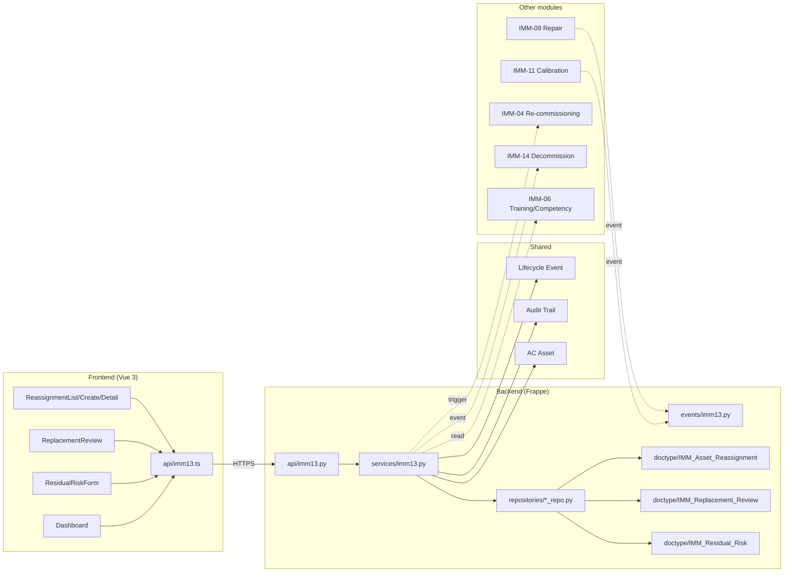

# 03 — Diagrams (IMM-13)

| Mục | Giá trị |
|---|---|
| Module | IMM-13 — Ngừng sử dụng và điều chuyển |
| Trạng thái | Skeleton — entity / class chốt sau Sprint Wave 3 (BE scaffold) |
| Liên kết | [02 Analysis](./02_Analysis_Design.md) · [04 Backend](./04_Backend_Design.md) |

> File này tổng hợp các diagram **đúc kết** từ 02 (BA) + 04 (BE). Để tránh lệch ground truth, không tạo entity/class chưa được liệt kê ở 04.

---

## I. ERD — Entity Relationship

**Hình 1.1 — ERD IMM-13** (entity-level skeleton — *field detail chốt trong Sprint Wave 3 sau khi BE scaffold; xem [04 §I](./04_Backend_Design.md#i-doctype-skeleton)*).

Quan hệ chính:
- 1 Asset → N Reassignment, N Replacement Review (N qua thời gian, không cùng lúc).
- 1 Replacement Review ↔ 1 Residual Risk (1-1 mandatory trước khi approve retire).
- Reassignment + Residual Risk đều có chuỗi e-signature (≥ 1 → N).
- Mọi thay đổi state Asset đi qua Lifecycle Event (xem [04 §IV hooks](./04_Backend_Design.md#iv-hooks)).

---

## II. Class Diagram (service layer)

**Hình 2.1 — Class diagram service layer** — strict 3-tier theo `CONVENTIONS.md §2`.

---

## III. Sequence Diagrams

### SEQ-01 — Stand-down (UC-01)

**Hình 3.1 — Stand-down sequence**.

### SEQ-02 — Reassign nội viện (UC-02)

**Hình 3.2 — Reassign sequence**.

### SEQ-03 — Retire approval + hand-off IMM-14 (UC-05/06)

**Hình 3.3 — Retire hand-off sequence**.

---

## IV. State diagram (consolidated)

(Đã có ở [02 §IV.3](./02_Analysis_Design.md#iv3-state-machine) cho `IMM Asset Reassignment`. Cho `IMM Replacement Review` và `IMM Residual Risk` xem [04 §III](./04_Backend_Design.md#iii-workflow).)

`AC Asset Lifecycle` KHÔNG vẽ lại ở đây — đã có canonical version trong [`Workflow_Specification.md`](../ba/Phase_04_Process_Workflow_Design/01_Workflow_Specification/Workflow_Specification.md) §1 (8 states · 16 transitions). IMM-13 chỉ *invoke* transition `Đưa ra khỏi sử dụng` và transition cập nhật location.

---

## V. Package / Component diagram

**Hình 5.1 — Package diagram IMM-13 + ngữ cảnh module**.

---

*Tất cả diagram là design intent; sau Sprint Wave 3 sẽ verify lại entity/field thực tế và regenerate.*
