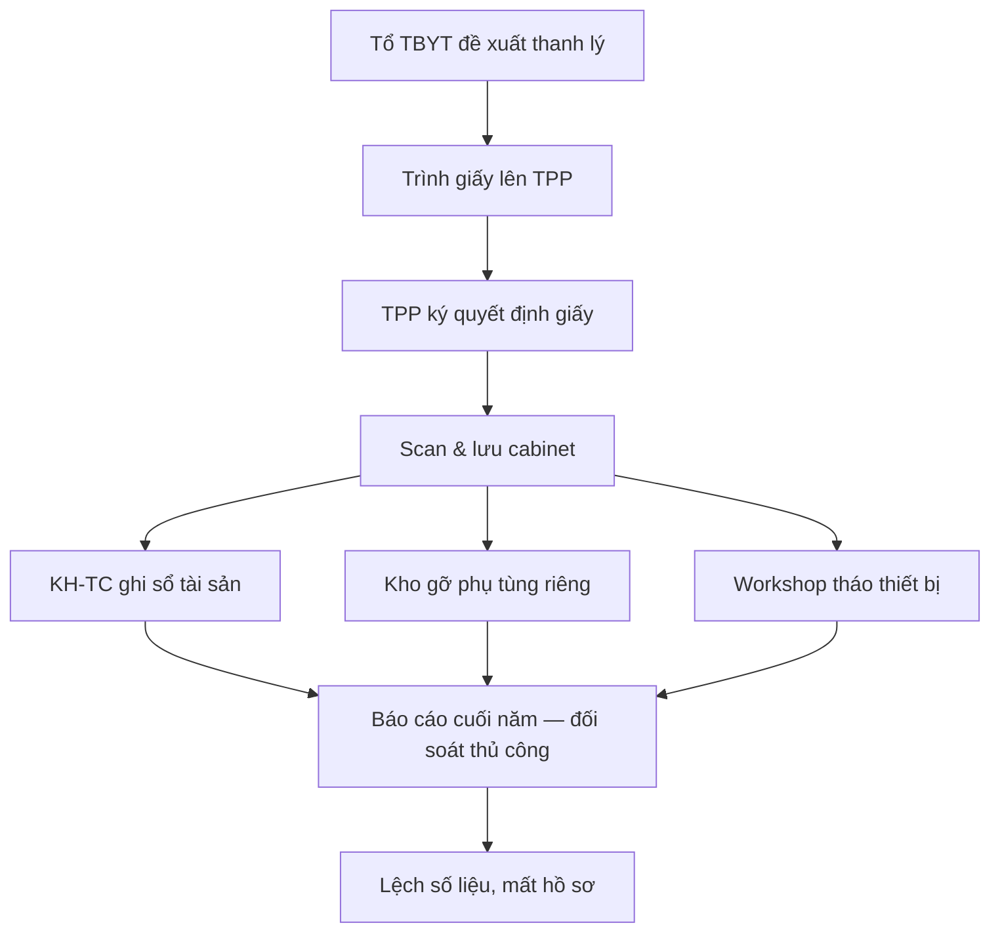
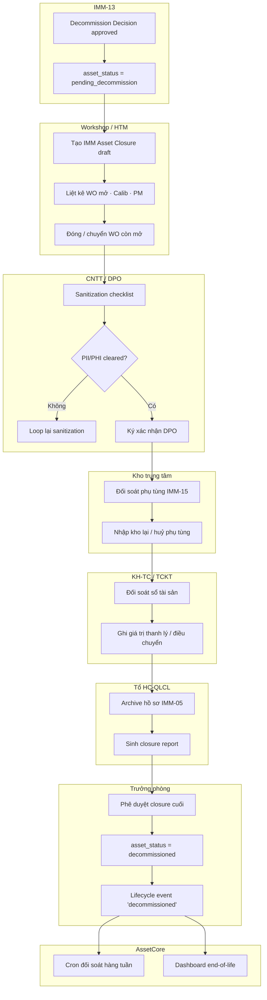

# 02 — Phân tích thiết kế nghiệp vụ (IMM-14 Giải nhiệm thiết bị)

| Mục | Giá trị |
|---|---|
| Module | IMM-14 — Giải nhiệm thiết bị |
| Phạm vi | Đóng vòng đời asset, đối soát kho – kế toán – hồ sơ, phát hành closure record |
| Owner | BA — Tổ HC-QLCL & Risk · System Analyst — CMMS/IMMIS |
| Liên kết | [03 Diagrams](./03_Diagrams.md) · [04 Backend](./04_Backend_Design.md) · [05 API](./05_API_Specification.md) · [06 Frontend](./06_Frontend_Design.md) |

> **Mục đích**: hợp đồng nghiệp vụ mô tả quy trình *đóng vĩnh viễn* vòng đời thiết bị y tế: từ khi nhận decision IMM-13 đến khi asset bị xoá khỏi inventory hoạt động và được lưu trữ kèm closure record để audit. Module phải bảo đảm 3 đối soát: **tài sản (asset registry) – kho (vật tư & phụ tùng) – kế toán (giá trị còn lại / thanh lý)**, kèm **hồ sơ pháp lý** (giấy phép, đăng ký lưu hành) đã được archive đúng quy định NĐ98/2021.

---

# Phần I — Module Overview

## I.0. Khảo sát hiện trạng (As-Is)

Tại đa số bệnh viện công VN, thanh lý / giải nhiệm thiết bị y tế đang chạy bằng giấy + Excel rời rạc:

- Quyết định thanh lý phát hành dạng giấy, ký tay, scan rồi lưu rời ở Phòng Vật tư – TBYT.
- Hồ sơ pháp lý (giấy phép, đăng ký lưu hành, hồ sơ định danh) lưu trong tủ; khi giải nhiệm thường KHÔNG có thao tác archive chính thức → khi audit không tìm được.
- Đối soát giữa **sổ tài sản** (Phòng TCKT), **kho phụ tùng** (Kho), và **registry kỹ thuật** (Tổ TBYT) thường lệch — phụ tùng còn tồn trong kho cho asset đã thanh lý vẫn chiếm chỗ.
- Dữ liệu bệnh nhân (PII / PHI) trên thiết bị (vd siêu âm, monitor, máy thở) thường KHÔNG có quy trình sanitization được kiểm soát.
- Báo cáo tổng kết end-of-life chậm — không có dashboard số lượng / chi phí / lý do giải nhiệm theo năm.

WHO Decommissioning §3.8 (Inventory system & decommissioning report, line 1313–1337) mô tả chính nỗi đau này: cần *one decommissioning document* để admin gỡ asset khỏi registry — phần lớn cơ sở chưa làm chuẩn.

## I.1. Pitch

IMM-14 đóng vòng đời thiết bị y tế bằng một **closure record** duy nhất, ràng buộc đối soát 3 chiều (tài sản – kho – kế toán) và bắt buộc archive hồ sơ pháp lý + sanitization dữ liệu trước khi xoá khỏi registry hoạt động. Người dùng bấm "Đóng vòng đời" → hệ thống tự kiểm tra điều kiện đóng (không còn WO mở, không còn calibration sắp tới, đã có Decommission Decision của IMM-13), cho phép nhập kết quả sanitization, gắn biên bản, đối soát phụ tùng tồn, ghi giá trị thanh lý / điều chuyển — kết thúc bằng asset chuyển trạng thái `decommissioned` không thể đảo ngược (trừ rollback có duyệt).

Giá trị đo được: tỉ lệ asset có closure record đầy đủ đạt 100% sau go-live, thời gian đóng giảm từ trung bình *~4 tuần* (thủ công) xuống *≤5 ngày làm việc*, 0% lệch sổ tài sản – kho khi audit cuối năm.

## I.2. Vị trí trong WHO HTM lifecycle

Module nằm tại **giai đoạn cuối** của lifecycle:

- ⬜ Needs · ⬜ Procurement · ⬜ Install · ⬜ Operation · ⬜ Maintenance · ✅ **Decommission**

WHO HTM xếp Decommission là pha cuối (Decommissioning Medical Devices, §3.1, line 990–1016). IMM-14 nhận input từ IMM-13 (quyết định ngừng sử dụng) và là *điểm thoát duy nhất* khỏi registry hoạt động — không có module nào khác được phép xoá asset.

## I.3. Stakeholders & Actors

| Vai trò | Người dùng thực | Quan tâm chính | Tần suất | Loại |
|---|---|---|---|---|
| Trưởng phòng P.VT,TBYT | 1 người / cơ sở | Phê duyệt closure cuối, ký quyết định thanh lý | Theo lô (hàng quý) | Approver |
| PTP Khối 2 | 1–2 người | Điều phối closure, đối soát kỹ thuật | Hàng tuần | Primary |
| Nhóm HTM / Workshop | 3–5 người | Thực thi sanitization, gỡ thiết bị, gắn biên bản | Hàng tuần | Primary |
| Tổ HC-QLCL & Risk | 2 người | Audit closure record, kiểm tra archive hồ sơ | Hàng tháng | Auditor |
| Phòng KH-TC / TCKT | 2 người | Đối soát giá trị tài sản, ghi thanh lý kế toán | Theo lô | Approver (mảng tài chính) |
| Kho trung tâm | 1–2 người | Đối soát phụ tùng tồn, nhập kho lại / huỷ | Hàng tuần | Primary (mảng kho) |
| CNTT / DPO | 1 người | Xác nhận sanitization PII/PHI | Theo asset có dữ liệu | Approver (data) |
| Ban kiểm toán nội bộ | 1 người | Đọc closure record cuối năm | Hàng năm | Auditor |

(Bắt buộc ≥1 Primary + 1 Auditor ✅)

## I.4. Scope

**In-scope**:

- Tiếp nhận asset đã có Decommission Decision từ IMM-13 (`asset_status = pending_decommission`).
- Đối soát 3 chiều: registry kỹ thuật ↔ kho phụ tùng ↔ sổ tài sản kế toán.
- Archive hồ sơ pháp lý (giấy phép, đăng ký lưu hành, hồ sơ định danh) — chuyển từ active sang archived.
- Sanitization dữ liệu (PII/PHI) — checklist + xác nhận của CNTT/DPO.
- Phát hành **Asset Closure Record** = chứng từ duy nhất đóng vòng đời.
- Cập nhật `asset_status = decommissioned` (final state) và lifecycle event `decommissioned`.
- Dashboard tổng kết end-of-life theo năm / lý do / phương thức xử lý cuối (disposal/donation/sale/trade-in).

**Out-of-scope**:

- Quyết định *có nên ngừng sử dụng hay không* — thuộc IMM-13.
- Quy trình thầu thanh lý / đấu giá — chỉ ghi nhận kết quả, không tổ chức thầu.
- Vật lý xử lý chất thải nguy hại → tham chiếu SOP xử lý chất thải y tế (ngoài phạm vi IMMIS).

**Assumptions**:

- IMM-13 đã hoàn tất và chuyển asset về `pending_decommission` trước khi IMM-14 được gọi.
- Kế toán dùng cùng mã asset_no với CMMS (giả định khớp; nếu lệch, xử lý ngoài hệ thống).

**Dependencies**:

- DocType: `AC Asset` (registry — IMM-04), `IMM Decommission Decision` (IMM-13), `IMM Asset Closure` (mới — IMM-14), `IMM Spare Part Stock` (IMM-15), `IMM Document` (IMM-05).
- Module ràng buộc: IMM-13 (input), IMM-15 (đối soát kho), IMM-05 (archive hồ sơ), IMM-08/09/11 (close work order còn mở).

## I.5. KPI mục tiêu

| KPI | Định nghĩa | Baseline | Target | Đo ở đâu |
|---|---|---|---|---|
| % asset có closure record đầy đủ | Asset trạng thái `decommissioned` có đủ 7 mục bắt buộc (decision, sanitization, đối soát kho, đối soát kế toán, archive hồ sơ, biên bản, giá trị cuối) / tổng asset đã giải nhiệm | *(Cần khảo sát baseline)* | 100% | `IMM Asset Closure` join `AC Asset` |
| Thời gian đóng trung bình | Ngày từ `pending_decommission` đến `decommissioned` | *(Cần khảo sát baseline)* | ≤5 ngày làm việc | Lifecycle event diff |
| % lệch sổ tài sản – kho cuối năm | Số asset đã giải nhiệm còn vướng phụ tùng tồn / tổng | *(Cần khảo sát baseline)* | 0% | Reconciliation report |
| % closure rollback | Closure phải mở lại sau khi `decommissioned` / tổng | *(Cần khảo sát baseline)* | <2% | Audit log |
| Tỉ lệ archive hồ sơ pháp lý đúng | Asset đã giải nhiệm có hồ sơ IMM-05 chuyển archived / tổng | *(Cần khảo sát baseline)* | 100% | IMM-05 status report |

WHO HTM (§3.8, line 1322–1337) đề xuất closure report bao gồm: date, type, location, condition, reasons, process, end status, cost, value, personnel — bộ KPI trên cover các trục này.

## I.6. Ràng buộc Compliance

| Quy định | Yêu cầu áp lên module | Doc tham chiếu |
|---|---|---|
| NĐ98/2021/NĐ-CP | Thanh lý / huỷ thiết bị y tế phải có biên bản, hồ sơ chứng minh; thiết bị có chứa nguồn phóng xạ / nguy cơ sinh học cần quy trình riêng | NĐ98/2021 §quy định thanh lý |
| QĐ 3107/QĐ-BYT (mã GMDN) | Mã GMDN giữ trong closure record để truy nguyên loại thiết bị về sau | `../gmdn/Quyết định 3107_QĐ-BYT.md` |
| QĐ 69/QĐ-BYT (phân loại A/B/C/D) | Asset loại C, D bắt buộc thêm bước đánh giá rủi ro WHO §3.2 | `../gmdn/Quyết định 69_QĐ-BYT.md` |
| WHO HTM Decommissioning | §3.1 quy trình 5 bước; §3.2 risk & cost; §3.6 data sanitization; §3.8 closure report | `../WHO/WHO - Decommissioning medical devices.md` |
| ISO 13485 (8.5) | Improvement / corrective — closure record là evidence cho non-conformance loop | ISO 13485:2016 |
| Luật bảo vệ dữ liệu y tế (NĐ13/2023, NĐ47/2024) | Sanitization PII/PHI bắt buộc cho thiết bị có lưu trữ dữ liệu bệnh nhân | NĐ13/2023, NĐ47/2024 |
| QC-IMMIS-04 (nội bộ) | Chính sách ngừng sử dụng – điều chuyển – giải nhiệm – đóng vòng đời | Architecture line 414 |

## I.7. Risk & Open questions

**Risk**

| Risk | Likelihood | Impact | Giảm thiểu |
|---|---|---|---|
| Sanitization PII/PHI bị bỏ qua → rò rỉ dữ liệu bệnh nhân | Trung bình | Cao (pháp lý + uy tín) | Bắt buộc gate CNTT/DPO ký xác nhận trước khi closure |
| Đối soát kho lệch — phụ tùng đã giải nhiệm vẫn còn trong kho | Cao | Trung bình | Cron tuần đối chiếu IMM-15 stock theo asset đã `decommissioned` |
| Closure rollback sai làm asset "sống lại" mâu thuẫn kế toán | Thấp | Cao | Workflow rollback phải có 2 chữ ký (Trưởng phòng + KH-TC) |
| Hồ sơ pháp lý chưa archive đã xoá registry | Trung bình | Cao (audit fail) | Validator chặn `decommissioned` nếu IMM-05 docs chưa `archived` |
| Thiếu closure record cho asset đã thanh lý trước go-live (legacy) | Cao | Trung bình | Có module migration tạo closure record dạng `legacy_imported` |

**Open questions**

| Open question | Owner | Deadline |
|---|---|---|
| Mã closure record có cần giữ format thống nhất với mã thanh lý kế toán? | KH-TC + CMMS | Sprint W3-1 |
| Sanitization cho thiết bị nhỏ không có ổ cứng — có cần checklist riêng? | CNTT + Workshop | Sprint W3-1 |
| Thiết bị donation / điều chuyển sang cơ sở khác — closure hay chỉ archive? | Trưởng phòng | Trước Đợt 3 kick-off |
| Có cần API trả closure record về HIS để cập nhật dashboard điều hành? | CMMS + CNTT | Sprint W3-2 |

## I.8. Roadmap thực thi

| Sprint | Hạng mục | Owner | Status |
|---|---|---|---|
| W3-1 | DocType + Workflow `IMM Asset Closure` (skeleton) | BE Team | Planned |
| W3-1 | Service `imm14.create_closure`, `imm14.reconcile`, `imm14.finalize` (3-tier) | BE Team | Planned |
| W3-2 | Tích hợp gate IMM-13 → IMM-14 (asset_status precondition) | BE Team | Planned |
| W3-2 | FE list + form closure (Vue 3 + Pinia) | FE Team | Planned |
| W3-3 | Dashboard end-of-life (số lượng / lý do / chi phí) | FE Team + BI | Planned |
| W3-3 | Cron đối soát kho IMM-15 ↔ asset đã decommissioned | BE Team | Planned |
| W3-4 | UAT + migration legacy asset | BA + QA | Planned |
| W3-4 | Go-live + handover QC-IMMIS-04 evidence pack | QLCL | Planned |

---

# Phần II — Quy trình nghiệp vụ (BPMN)

## II.1. Phân biệt 3 khái niệm

- **Business Process** = tổ chức làm thế nào (file này, phần II)
- **Use Case** = actor + system + goal (Phần III)
- **Workflow** = DocType state + transition (file [04 §III](./04_Backend_Design.md))

## II.2. As-Is process (chưa có hệ thống)

Bệnh viện hiện tại: Phòng VT-TBYT đề xuất thanh lý → Trưởng phòng ký giấy → KH-TC ghi sổ → Kho thông báo phụ tùng → thiết bị bị tháo dỡ → KHÔNG có một hồ sơ thống nhất, đối soát rời rạc.

## II.3. Pain points

| # | Pain | Tác động |
|---|---|---|
| 1 | Không có 1 hồ sơ closure thống nhất, mỗi phòng giữ 1 bản | Audit fail, mất evidence |
| 2 | Phụ tùng tồn kho không gỡ kịp khi asset thanh lý | Chiếm chỗ, sai số tồn kho |
| 3 | Sanitization dữ liệu bệnh nhân không có quy trình | Rủi ro rò rỉ PII/PHI, vi phạm NĐ13/2023 |
| 4 | Hồ sơ pháp lý không archive — khi audit không truy được | Vi phạm NĐ98/2021 |
| 5 | Báo cáo end-of-life làm thủ công cuối năm, mất 2–3 tuần | Chậm quyết định tái đầu tư |

## II.4. To-Be process (với AssetCore IMM-14)

## II.5. So sánh As-Is vs To-Be

| Tiêu chí | As-Is | To-Be |
|---|---|---|
| Hồ sơ trung tâm | Không | `IMM Asset Closure` duy nhất |
| Đối soát kho | Thủ công cuối năm | Online, gate trước closure |
| Sanitization PII/PHI | Không quy trình | Checklist bắt buộc + ký DPO |
| Archive hồ sơ pháp lý | Không liên kết | Auto chuyển IMM-05 → archived |
| Báo cáo end-of-life | Excel cuối năm | Dashboard real-time |

---

# Phần III — Use Case

## III.1. Actor

- **HTM Engineer** (Workshop / HTM): tạo và driver closure.
- **DPO / IT** (CNTT): ký sanitization.
- **Storekeeper** (Kho): đối soát phụ tùng.
- **Accountant** (KH-TC): đối soát giá trị tài sản.
- **QLCL Officer**: archive hồ sơ + audit closure.
- **Department Head** (Trưởng phòng VT-TBYT): phê duyệt cuối.
- **System / Cron**: đối soát định kỳ, sinh dashboard.

## III.2. Use Case list

| UC ID | Tên | Actor chính | Mô tả ngắn |
|---|---|---|---|
| UC-14-01 | Tạo closure record từ IMM-13 decision | HTM Engineer | Khởi tạo `IMM Asset Closure` cho asset `pending_decommission` |
| UC-14-02 | Đóng work order còn mở | HTM Engineer | Force close / transfer WO PM/CM/Calib trước closure |
| UC-14-03 | Sanitization PII/PHI | DPO | Check checklist sanitization, ký xác nhận |
| UC-14-04 | Đối soát phụ tùng kho | Storekeeper | Đối chiếu IMM-15 stock theo asset, nhập lại / huỷ |
| UC-14-05 | Đối soát giá trị tài sản | Accountant | Đối chiếu sổ tài sản, ghi giá trị thanh lý / điều chuyển |
| UC-14-06 | Archive hồ sơ pháp lý | QLCL Officer | Chuyển IMM-05 docs sang `archived`, gắn vào closure |
| UC-14-07 | Phê duyệt closure cuối | Department Head | Approve closure → asset chuyển `decommissioned` |
| UC-14-08 | Rollback closure | Department Head + Accountant | Mở lại closure trong vòng N ngày, đảo asset_status |
| UC-14-09 | Dashboard end-of-life | All | Xem KPI, lý do, chi phí giải nhiệm theo kỳ |
| UC-14-10 | Migration legacy closure | System | Import closure cho asset thanh lý trước go-live |

## III.3. UC chi tiết — UC-14-07 Phê duyệt closure cuối

- **Actor**: Department Head
- **Precondition**: Closure ở state `Pending Approval`. Sanitization đã ký, đối soát kho/kế toán xong, hồ sơ archive xong.
- **Trigger**: User mở closure và bấm "Phê duyệt".
- **Main flow**:
  1. System validate đầy đủ 7 mục bắt buộc (xem Phần IV business rule BR-14-01).
  2. System hiển thị summary: asset, lý do, phương thức xử lý cuối, giá trị, người ký.
  3. User xác nhận → workflow chuyển `Pending Approval → Closed`.
  4. System cập nhật `asset.asset_status = decommissioned`, sinh `Asset Lifecycle Event` type `decommissioned`.
  5. System đánh dấu `IMM Document` của asset thành `archived`.
  6. System emit hook `imm14_asset_closed` → IMM-15 cron, IMM-16 audit, dashboard.
- **Alt flow A1**: Nếu validate fail → block, hiển thị danh sách mục thiếu.
- **Alt flow A2**: Nếu user là người tạo closure → block (separation of duties).
- **Postcondition**: Asset không còn xuất hiện trong list active; xuất hiện trong list `decommissioned` chỉ-đọc.

## III.4. UC chi tiết — UC-14-08 Rollback closure

- **Actor**: Department Head + Accountant (cần 2 chữ ký).
- **Precondition**: Closure ở state `Closed`. Trong vòng `rollback_window_days` (config — gợi ý 30 ngày).
- **Trigger**: User mở closure và bấm "Yêu cầu rollback" + nhập lý do.
- **Main flow**:
  1. Workflow `Closed → Rollback Requested`. Notify Accountant.
  2. Accountant xác nhận → `Rollback Requested → Reopened`.
  3. Asset trở lại `pending_decommission`. Lifecycle event `closure_rolled_back`.
  4. Hồ sơ IMM-05 unarchive về trạng thái trước.
- **Alt flow**: Quá `rollback_window_days` → block, yêu cầu mở change request thủ công.
- **Postcondition**: Closure record giữ lại lịch sử rollback (audit trail).

---

# Phần IV — Functional specs

## IV.1. User stories

- **US-14-01**: Là HTM Engineer, tôi muốn tạo closure record từ asset đã có Decommission Decision để bắt đầu quy trình đóng vòng đời.
- **US-14-02**: Là DPO, tôi muốn xác nhận sanitization dữ liệu trước khi closure được duyệt để đảm bảo tuân thủ NĐ13/2023.
- **US-14-03**: Là Storekeeper, tôi muốn thấy danh sách phụ tùng tồn của asset để xử lý nhập lại hoặc huỷ.
- **US-14-04**: Là Accountant, tôi muốn ghi giá trị thanh lý / điều chuyển vào closure để khớp sổ tài sản.
- **US-14-05**: Là Department Head, tôi muốn duyệt closure cuối và biết hệ thống sẽ tự cập nhật status asset + archive hồ sơ.
- **US-14-06**: Là QLCL, tôi muốn xuất closure record cho audit cuối năm.
- **US-14-07**: Là Manager, tôi muốn dashboard end-of-life để biết lý do giải nhiệm và chi phí.

## IV.2. Acceptance Criteria (sample US-14-05)

- AC1: Khi closure ở `Pending Approval` và Department Head bấm Approve, system **phải** chạy validator BR-14-01 trước.
- AC2: Nếu thiếu bất kỳ trong 7 mục bắt buộc → reject, hiển thị thông báo cụ thể mục thiếu.
- AC3: Sau Approve, asset_status `pending_decommission → decommissioned` **trong cùng transaction**.
- AC4: Sau Approve, sinh đúng 1 `Asset Lifecycle Event` type `decommissioned`.
- AC5: Sau Approve, IMM-05 docs có `linked_asset = asset` chuyển `archived`; nếu fail, rollback toàn bộ transaction.
- AC6: Người tạo closure **không được** là người approve (separation of duties — block ở UI và BE).

## IV.3. Business rules

- **BR-14-01 (7 mục bắt buộc trước Approve)**: closure phải có (1) link Decommission Decision IMM-13, (2) sanitization signed, (3) reconciliation kho `done`, (4) reconciliation kế toán `done`, (5) hồ sơ IMM-05 ready-to-archive, (6) đã đóng/transfer mọi WO mở của asset, (7) phương thức xử lý cuối (disposal/donation/sale/trade-in/internal_reassignment).
- **BR-14-02 (Separation of duties)**: `created_by` ≠ `approved_by`.
- **BR-14-03 (Single closure per asset)**: chỉ 1 closure active per asset; tạo closure thứ 2 → reject.
- **BR-14-04 (Rollback window)**: rollback chỉ được phép trong `rollback_window_days` (mặc định 30); ngoài window → block, yêu cầu change control.
- **BR-14-05 (Sanitization gate)**: nếu `asset.has_patient_data = true` → DPO sign bắt buộc; nếu false → checklist optional nhưng vẫn ghi log.
- **BR-14-06 (Asset state lock)**: asset đã `decommissioned` không cho phép sửa từ bất kỳ module khác (gate ở `AC Asset.before_save`).
- **BR-14-07 (Hồ sơ pháp lý)**: nếu IMM-05 còn docs `active` cho asset, closure phải set chúng `archived` cùng transaction.
- **BR-14-08 (Phụ tùng tồn)**: nếu IMM-15 stock cho asset > 0, phải có quyết định "tái sử dụng / huỷ" cho từng dòng — không cho closure approve nếu còn dòng `pending`.

---

# Phần V — Non-functional requirements (NFR)

| Nhóm | Yêu cầu | Mức |
|---|---|---|
| Performance | Tạo closure draft P95 | <500 ms |
| Performance | Approve closure (validate + cập nhật asset + lifecycle event + archive docs) P95 | <2000 ms |
| Performance | Dashboard end-of-life load | <3 s với 5 năm dữ liệu |
| Security | Approve closure | RBAC role `IMM-14 Approver` (Trưởng phòng) only |
| Security | Sanitization sign | RBAC role `DPO` only |
| Security | Rollback | RBAC role `Trưởng phòng` + `KH-TC` (2-of-2) |
| Audit | Mọi state transition + giá trị tiền | log đầy đủ vào `IMM Audit Trail` |
| Reliability | Approve closure phải atomic — nếu archive IMM-05 fail → rollback toàn bộ | Yêu cầu transaction |
| Usability | Form closure cho HTM Engineer | Hoàn tất ≤10 phút |
| Compliance | Closure record xuất PDF | Dùng được làm evidence audit NĐ98 |
| Data | Sau `decommissioned`, asset chuyển vào view-only | Bắt buộc |
| Data | Closure record giữ ≥10 năm | Theo NĐ98 + ISO 13485 |

---

*Hết file 02 — IMM-14 Analysis & Design (from-scratch, BE chưa scaffold).*
