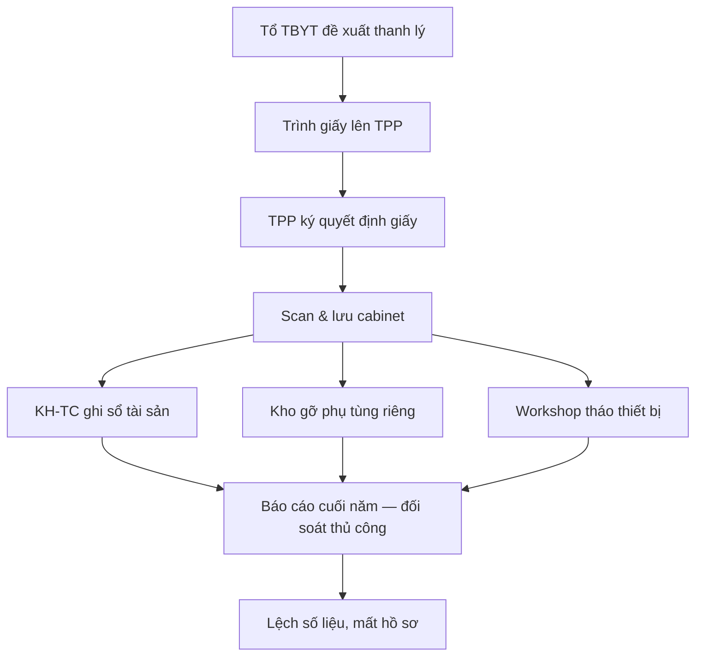
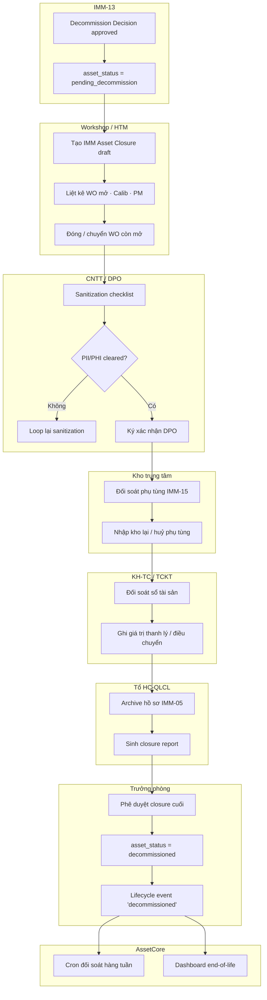

# 02 — Phân tích thiết kế nghiệp vụ (IMM-14 Giải nhiệm thiết bị)

| Mục | Giá trị |
|---|---|
| Module | IMM-14 — Giải nhiệm thiết bị |
| Phạm vi | Đóng vòng đời asset, đối soát kho – kế toán – hồ sơ, phát hành closure record |
| Owner | BA — Tổ HC-QLCL & Risk · System Analyst — CMMS/IMMIS |
| Liên kết | [03 Diagrams](./03_Diagrams.md) · [04 Backend](./04_Backend_Design.md) · [05 API](./05_API_Specification.md) · [06 Frontend](./06_Frontend_Design.md) |

> **Mục đích**: hợp đồng nghiệp vụ mô tả quy trình *đóng vĩnh viễn* vòng đời thiết bị y tế: từ khi nhận decision IMM-13 đến khi asset bị xoá khỏi inventory hoạt động và được lưu trữ kèm closure record để audit. Module phải bảo đảm 3 đối soát: **tài sản (asset registry) – kho (vật tư & phụ tùng) – kế toán (giá trị còn lại / thanh lý)**, kèm **hồ sơ pháp lý** (giấy phép, đăng ký lưu hành) đã được archive đúng quy định NĐ98/2021.

---

# Phần I — Module Overview

## I.0. Khảo sát hiện trạng (As-Is)

Tại đa số bệnh viện công VN, thanh lý / giải nhiệm thiết bị y tế đang chạy bằng giấy + Excel rời rạc:

- Quyết định thanh lý phát hành dạng giấy, ký tay, scan rồi lưu rời ở Phòng Vật tư – TBYT.
- Hồ sơ pháp lý (giấy phép, đăng ký lưu hành, hồ sơ định danh) lưu trong tủ; khi giải nhiệm thường KHÔNG có thao tác archive chính thức → khi audit không tìm được.
- Đối soát giữa **sổ tài sản** (Phòng TCKT), **kho phụ tùng** (Kho), và **registry kỹ thuật** (Tổ TBYT) thường lệch — phụ tùng còn tồn trong kho cho asset đã thanh lý vẫn chiếm chỗ.
- Dữ liệu bệnh nhân (PII / PHI) trên thiết bị (vd siêu âm, monitor, máy thở) thường KHÔNG có quy trình sanitization được kiểm soát.
- Báo cáo tổng kết end-of-life chậm — không có dashboard số lượng / chi phí / lý do giải nhiệm theo năm.

WHO Decommissioning §3.8 (Inventory system & decommissioning report, line 1313–1337) mô tả chính nỗi đau này: cần *one decommissioning document* để admin gỡ asset khỏi registry — phần lớn cơ sở chưa làm chuẩn.

## I.1. Pitch

IMM-14 đóng vòng đời thiết bị y tế bằng một **closure record** duy nhất, ràng buộc đối soát 3 chiều (tài sản – kho – kế toán) và bắt buộc archive hồ sơ pháp lý + sanitization dữ liệu trước khi xoá khỏi registry hoạt động. Người dùng bấm "Đóng vòng đời" → hệ thống tự kiểm tra điều kiện đóng (không còn WO mở, không còn calibration sắp tới, đã có Decommission Decision của IMM-13), cho phép nhập kết quả sanitization, gắn biên bản, đối soát phụ tùng tồn, ghi giá trị thanh lý / điều chuyển — kết thúc bằng asset chuyển trạng thái `decommissioned` không thể đảo ngược (trừ rollback có duyệt).

Giá trị đo được: tỉ lệ asset có closure record đầy đủ đạt 100% sau go-live, thời gian đóng giảm từ trung bình *~4 tuần* (thủ công) xuống *≤5 ngày làm việc*, 0% lệch sổ tài sản – kho khi audit cuối năm.

## I.2. Vị trí trong WHO HTM lifecycle

Module nằm tại **giai đoạn cuối** của lifecycle:

- ⬜ Needs · ⬜ Procurement · ⬜ Install · ⬜ Operation · ⬜ Maintenance · ✅ **Decommission**

WHO HTM xếp Decommission là pha cuối (Decommissioning Medical Devices, §3.1, line 990–1016). IMM-14 nhận input từ IMM-13 (quyết định ngừng sử dụng) và là *điểm thoát duy nhất* khỏi registry hoạt động — không có module nào khác được phép xoá asset.

## I.3. Stakeholders & Actors

| Vai trò | Người dùng thực | Quan tâm chính | Tần suất | Loại |
|---|---|---|---|---|
| Trưởng phòng P.VT,TBYT | 1 người / cơ sở | Phê duyệt closure cuối, ký quyết định thanh lý | Theo lô (hàng quý) | Approver |
| PTP Khối 2 | 1–2 người | Điều phối closure, đối soát kỹ thuật | Hàng tuần | Primary |
| Nhóm HTM / Workshop | 3–5 người | Thực thi sanitization, gỡ thiết bị, gắn biên bản | Hàng tuần | Primary |
| Tổ HC-QLCL & Risk | 2 người | Audit closure record, kiểm tra archive hồ sơ | Hàng tháng | Auditor |
| Phòng KH-TC / TCKT | 2 người | Đối soát giá trị tài sản, ghi thanh lý kế toán | Theo lô | Approver (mảng tài chính) |
| Kho trung tâm | 1–2 người | Đối soát phụ tùng tồn, nhập kho lại / huỷ | Hàng tuần | Primary (mảng kho) |
| CNTT / DPO | 1 người | Xác nhận sanitization PII/PHI | Theo asset có dữ liệu | Approver (data) |
| Ban kiểm toán nội bộ | 1 người | Đọc closure record cuối năm | Hàng năm | Auditor |

(Bắt buộc ≥1 Primary + 1 Auditor ✅)

## I.4. Scope

**In-scope**:

- Tiếp nhận asset đã có Decommission Decision từ IMM-13 (`asset_status = pending_decommission`).
- Đối soát 3 chiều: registry kỹ thuật ↔ kho phụ tùng ↔ sổ tài sản kế toán.
- Archive hồ sơ pháp lý (giấy phép, đăng ký lưu hành, hồ sơ định danh) — chuyển từ active sang archived.
- Sanitization dữ liệu (PII/PHI) — checklist + xác nhận của CNTT/DPO.
- Phát hành **Asset Closure Record** = chứng từ duy nhất đóng vòng đời.
- Cập nhật `asset_status = decommissioned` (final state) và lifecycle event `decommissioned`.
- Dashboard tổng kết end-of-life theo năm / lý do / phương thức xử lý cuối (disposal/donation/sale/trade-in).

**Out-of-scope**:

- Quyết định *có nên ngừng sử dụng hay không* — thuộc IMM-13.
- Quy trình thầu thanh lý / đấu giá — chỉ ghi nhận kết quả, không tổ chức thầu.
- Vật lý xử lý chất thải nguy hại → tham chiếu SOP xử lý chất thải y tế (ngoài phạm vi IMMIS).

**Assumptions**:

- IMM-13 đã hoàn tất và chuyển asset về `pending_decommission` trước khi IMM-14 được gọi.
- Kế toán dùng cùng mã asset_no với CMMS (giả định khớp; nếu lệch, xử lý ngoài hệ thống).

**Dependencies**:

- DocType: `AC Asset` (registry — IMM-04), `IMM Decommission Decision` (IMM-13), `IMM Asset Closure` (mới — IMM-14), `IMM Spare Part Stock` (IMM-15), `IMM Document` (IMM-05).
- Module ràng buộc: IMM-13 (input), IMM-15 (đối soát kho), IMM-05 (archive hồ sơ), IMM-08/09/11 (close work order còn mở).

## I.5. KPI mục tiêu

| KPI | Định nghĩa | Baseline | Target | Đo ở đâu |
|---|---|---|---|---|
| % asset có closure record đầy đủ | Asset trạng thái `decommissioned` có đủ 7 mục bắt buộc (decision, sanitization, đối soát kho, đối soát kế toán, archive hồ sơ, biên bản, giá trị cuối) / tổng asset đã giải nhiệm | *(Cần khảo sát baseline)* | 100% | `IMM Asset Closure` join `AC Asset` |
| Thời gian đóng trung bình | Ngày từ `pending_decommission` đến `decommissioned` | *(Cần khảo sát baseline)* | ≤5 ngày làm việc | Lifecycle event diff |
| % lệch sổ tài sản – kho cuối năm | Số asset đã giải nhiệm còn vướng phụ tùng tồn / tổng | *(Cần khảo sát baseline)* | 0% | Reconciliation report |
| % closure rollback | Closure phải mở lại sau khi `decommissioned` / tổng | *(Cần khảo sát baseline)* | <2% | Audit log |
| Tỉ lệ archive hồ sơ pháp lý đúng | Asset đã giải nhiệm có hồ sơ IMM-05 chuyển archived / tổng | *(Cần khảo sát baseline)* | 100% | IMM-05 status report |

WHO HTM (§3.8, line 1322–1337) đề xuất closure report bao gồm: date, type, location, condition, reasons, process, end status, cost, value, personnel — bộ KPI trên cover các trục này.

## I.6. Ràng buộc Compliance

| Quy định | Yêu cầu áp lên module | Doc tham chiếu |
|---|---|---|
| NĐ98/2021/NĐ-CP | Thanh lý / huỷ thiết bị y tế phải có biên bản, hồ sơ chứng minh; thiết bị có chứa nguồn phóng xạ / nguy cơ sinh học cần quy trình riêng | NĐ98/2021 §quy định thanh lý |
| QĐ 3107/QĐ-BYT (mã GMDN) | Mã GMDN giữ trong closure record để truy nguyên loại thiết bị về sau | `../gmdn/Quyết định 3107_QĐ-BYT.md` |
| QĐ 69/QĐ-BYT (phân loại A/B/C/D) | Asset loại C, D bắt buộc thêm bước đánh giá rủi ro WHO §3.2 | `../gmdn/Quyết định 69_QĐ-BYT.md` |
| WHO HTM Decommissioning | §3.1 quy trình 5 bước; §3.2 risk & cost; §3.6 data sanitization; §3.8 closure report | `../WHO/WHO - Decommissioning medical devices.md` |
| ISO 13485 (8.5) | Improvement / corrective — closure record là evidence cho non-conformance loop | ISO 13485:2016 |
| Luật bảo vệ dữ liệu y tế (NĐ13/2023, NĐ47/2024) | Sanitization PII/PHI bắt buộc cho thiết bị có lưu trữ dữ liệu bệnh nhân | NĐ13/2023, NĐ47/2024 |
| QC-IMMIS-04 (nội bộ) | Chính sách ngừng sử dụng – điều chuyển – giải nhiệm – đóng vòng đời | Architecture line 414 |

## I.7. Risk & Open questions

**Risk**

| Risk | Likelihood | Impact | Giảm thiểu |
|---|---|---|---|
| Sanitization PII/PHI bị bỏ qua → rò rỉ dữ liệu bệnh nhân | Trung bình | Cao (pháp lý + uy tín) | Bắt buộc gate CNTT/DPO ký xác nhận trước khi closure |
| Đối soát kho lệch — phụ tùng đã giải nhiệm vẫn còn trong kho | Cao | Trung bình | Cron tuần đối chiếu IMM-15 stock theo asset đã `decommissioned` |
| Closure rollback sai làm asset "sống lại" mâu thuẫn kế toán | Thấp | Cao | Workflow rollback phải có 2 chữ ký (Trưởng phòng + KH-TC) |
| Hồ sơ pháp lý chưa archive đã xoá registry | Trung bình | Cao (audit fail) | Validator chặn `decommissioned` nếu IMM-05 docs chưa `archived` |
| Thiếu closure record cho asset đã thanh lý trước go-live (legacy) | Cao | Trung bình | Có module migration tạo closure record dạng `legacy_imported` |

**Open questions**

| Open question | Owner | Deadline |
|---|---|---|
| Mã closure record có cần giữ format thống nhất với mã thanh lý kế toán? | KH-TC + CMMS | Sprint W3-1 |
| Sanitization cho thiết bị nhỏ không có ổ cứng — có cần checklist riêng? | CNTT + Workshop | Sprint W3-1 |
| Thiết bị donation / điều chuyển sang cơ sở khác — closure hay chỉ archive? | Trưởng phòng | Trước Đợt 3 kick-off |
| Có cần API trả closure record về HIS để cập nhật dashboard điều hành? | CMMS + CNTT | Sprint W3-2 |

## I.8. Roadmap thực thi

| Sprint | Hạng mục | Owner | Status |
|---|---|---|---|
| W3-1 | DocType + Workflow `IMM Asset Closure` (skeleton) | BE Team | Planned |
| W3-1 | Service `imm14.create_closure`, `imm14.reconcile`, `imm14.finalize` (3-tier) | BE Team | Planned |
| W3-2 | Tích hợp gate IMM-13 → IMM-14 (asset_status precondition) | BE Team | Planned |
| W3-2 | FE list + form closure (Vue 3 + Pinia) | FE Team | Planned |
| W3-3 | Dashboard end-of-life (số lượng / lý do / chi phí) | FE Team + BI | Planned |
| W3-3 | Cron đối soát kho IMM-15 ↔ asset đã decommissioned | BE Team | Planned |
| W3-4 | UAT + migration legacy asset | BA + QA | Planned |
| W3-4 | Go-live + handover QC-IMMIS-04 evidence pack | QLCL | Planned |

---

# Phần II — Quy trình nghiệp vụ (BPMN)

## II.1. Phân biệt 3 khái niệm

- **Business Process** = tổ chức làm thế nào (file này, phần II)
- **Use Case** = actor + system + goal (Phần III)
- **Workflow** = DocType state + transition (file [04 §III](./04_Backend_Design.md))

## II.2. As-Is process (chưa có hệ thống)

Bệnh viện hiện tại: Phòng VT-TBYT đề xuất thanh lý → Trưởng phòng ký giấy → KH-TC ghi sổ → Kho thông báo phụ tùng → thiết bị bị tháo dỡ → KHÔNG có một hồ sơ thống nhất, đối soát rời rạc.

## II.3. Pain points

| # | Pain | Tác động |
|---|---|---|
| 1 | Không có 1 hồ sơ closure thống nhất, mỗi phòng giữ 1 bản | Audit fail, mất evidence |
| 2 | Phụ tùng tồn kho không gỡ kịp khi asset thanh lý | Chiếm chỗ, sai số tồn kho |
| 3 | Sanitization dữ liệu bệnh nhân không có quy trình | Rủi ro rò rỉ PII/PHI, vi phạm NĐ13/2023 |
| 4 | Hồ sơ pháp lý không archive — khi audit không truy được | Vi phạm NĐ98/2021 |
| 5 | Báo cáo end-of-life làm thủ công cuối năm, mất 2–3 tuần | Chậm quyết định tái đầu tư |

## II.4. To-Be process (với AssetCore IMM-14)

## II.5. So sánh As-Is vs To-Be

| Tiêu chí | As-Is | To-Be |
|---|---|---|
| Hồ sơ trung tâm | Không | `IMM Asset Closure` duy nhất |
| Đối soát kho | Thủ công cuối năm | Online, gate trước closure |
| Sanitization PII/PHI | Không quy trình | Checklist bắt buộc + ký DPO |
| Archive hồ sơ pháp lý | Không liên kết | Auto chuyển IMM-05 → archived |
| Báo cáo end-of-life | Excel cuối năm | Dashboard real-time |

---

# Phần III — Use Case

## III.1. Actor

- **HTM Engineer** (Workshop / HTM): tạo và driver closure.
- **DPO / IT** (CNTT): ký sanitization.
- **Storekeeper** (Kho): đối soát phụ tùng.
- **Accountant** (KH-TC): đối soát giá trị tài sản.
- **QLCL Officer**: archive hồ sơ + audit closure.
- **Department Head** (Trưởng phòng VT-TBYT): phê duyệt cuối.
- **System / Cron**: đối soát định kỳ, sinh dashboard.

## III.2. Use Case list

| UC ID | Tên | Actor chính | Mô tả ngắn |
|---|---|---|---|
| UC-14-01 | Tạo closure record từ IMM-13 decision | HTM Engineer | Khởi tạo `IMM Asset Closure` cho asset `pending_decommission` |
| UC-14-02 | Đóng work order còn mở | HTM Engineer | Force close / transfer WO PM/CM/Calib trước closure |
| UC-14-03 | Sanitization PII/PHI | DPO | Check checklist sanitization, ký xác nhận |
| UC-14-04 | Đối soát phụ tùng kho | Storekeeper | Đối chiếu IMM-15 stock theo asset, nhập lại / huỷ |
| UC-14-05 | Đối soát giá trị tài sản | Accountant | Đối chiếu sổ tài sản, ghi giá trị thanh lý / điều chuyển |
| UC-14-06 | Archive hồ sơ pháp lý | QLCL Officer | Chuyển IMM-05 docs sang `archived`, gắn vào closure |
| UC-14-07 | Phê duyệt closure cuối | Department Head | Approve closure → asset chuyển `decommissioned` |
| UC-14-08 | Rollback closure | Department Head + Accountant | Mở lại closure trong vòng N ngày, đảo asset_status |
| UC-14-09 | Dashboard end-of-life | All | Xem KPI, lý do, chi phí giải nhiệm theo kỳ |
| UC-14-10 | Migration legacy closure | System | Import closure cho asset thanh lý trước go-live |

## III.3. UC chi tiết — UC-14-07 Phê duyệt closure cuối

- **Actor**: Department Head
- **Precondition**: Closure ở state `Pending Approval`. Sanitization đã ký, đối soát kho/kế toán xong, hồ sơ archive xong.
- **Trigger**: User mở closure và bấm "Phê duyệt".
- **Main flow**:
  1. System validate đầy đủ 7 mục bắt buộc (xem Phần IV business rule BR-14-01).
  2. System hiển thị summary: asset, lý do, phương thức xử lý cuối, giá trị, người ký.
  3. User xác nhận → workflow chuyển `Pending Approval → Closed`.
  4. System cập nhật `asset.asset_status = decommissioned`, sinh `Asset Lifecycle Event` type `decommissioned`.
  5. System đánh dấu `IMM Document` của asset thành `archived`.
  6. System emit hook `imm14_asset_closed` → IMM-15 cron, IMM-16 audit, dashboard.
- **Alt flow A1**: Nếu validate fail → block, hiển thị danh sách mục thiếu.
- **Alt flow A2**: Nếu user là người tạo closure → block (separation of duties).
- **Postcondition**: Asset không còn xuất hiện trong list active; xuất hiện trong list `decommissioned` chỉ-đọc.

## III.4. UC chi tiết — UC-14-08 Rollback closure

- **Actor**: Department Head + Accountant (cần 2 chữ ký).
- **Precondition**: Closure ở state `Closed`. Trong vòng `rollback_window_days` (config — gợi ý 30 ngày).
- **Trigger**: User mở closure và bấm "Yêu cầu rollback" + nhập lý do.
- **Main flow**:
  1. Workflow `Closed → Rollback Requested`. Notify Accountant.
  2. Accountant xác nhận → `Rollback Requested → Reopened`.
  3. Asset trở lại `pending_decommission`. Lifecycle event `closure_rolled_back`.
  4. Hồ sơ IMM-05 unarchive về trạng thái trước.
- **Alt flow**: Quá `rollback_window_days` → block, yêu cầu mở change request thủ công.
- **Postcondition**: Closure record giữ lại lịch sử rollback (audit trail).

---

# Phần IV — Functional specs

## IV.1. User stories

- **US-14-01**: Là HTM Engineer, tôi muốn tạo closure record từ asset đã có Decommission Decision để bắt đầu quy trình đóng vòng đời.
- **US-14-02**: Là DPO, tôi muốn xác nhận sanitization dữ liệu trước khi closure được duyệt để đảm bảo tuân thủ NĐ13/2023.
- **US-14-03**: Là Storekeeper, tôi muốn thấy danh sách phụ tùng tồn của asset để xử lý nhập lại hoặc huỷ.
- **US-14-04**: Là Accountant, tôi muốn ghi giá trị thanh lý / điều chuyển vào closure để khớp sổ tài sản.
- **US-14-05**: Là Department Head, tôi muốn duyệt closure cuối và biết hệ thống sẽ tự cập nhật status asset + archive hồ sơ.
- **US-14-06**: Là QLCL, tôi muốn xuất closure record cho audit cuối năm.
- **US-14-07**: Là Manager, tôi muốn dashboard end-of-life để biết lý do giải nhiệm và chi phí.

## IV.2. Acceptance Criteria (sample US-14-05)

- AC1: Khi closure ở `Pending Approval` và Department Head bấm Approve, system **phải** chạy validator BR-14-01 trước.
- AC2: Nếu thiếu bất kỳ trong 7 mục bắt buộc → reject, hiển thị thông báo cụ thể mục thiếu.
- AC3: Sau Approve, asset_status `pending_decommission → decommissioned` **trong cùng transaction**.
- AC4: Sau Approve, sinh đúng 1 `Asset Lifecycle Event` type `decommissioned`.
- AC5: Sau Approve, IMM-05 docs có `linked_asset = asset` chuyển `archived`; nếu fail, rollback toàn bộ transaction.
- AC6: Người tạo closure **không được** là người approve (separation of duties — block ở UI và BE).

## IV.3. Business rules

- **BR-14-01 (7 mục bắt buộc trước Approve)**: closure phải có (1) link Decommission Decision IMM-13, (2) sanitization signed, (3) reconciliation kho `done`, (4) reconciliation kế toán `done`, (5) hồ sơ IMM-05 ready-to-archive, (6) đã đóng/transfer mọi WO mở của asset, (7) phương thức xử lý cuối (disposal/donation/sale/trade-in/internal_reassignment).
- **BR-14-02 (Separation of duties)**: `created_by` ≠ `approved_by`.
- **BR-14-03 (Single closure per asset)**: chỉ 1 closure active per asset; tạo closure thứ 2 → reject.
- **BR-14-04 (Rollback window)**: rollback chỉ được phép trong `rollback_window_days` (mặc định 30); ngoài window → block, yêu cầu change control.
- **BR-14-05 (Sanitization gate)**: nếu `asset.has_patient_data = true` → DPO sign bắt buộc; nếu false → checklist optional nhưng vẫn ghi log.
- **BR-14-06 (Asset state lock)**: asset đã `decommissioned` không cho phép sửa từ bất kỳ module khác (gate ở `AC Asset.before_save`).
- **BR-14-07 (Hồ sơ pháp lý)**: nếu IMM-05 còn docs `active` cho asset, closure phải set chúng `archived` cùng transaction.
- **BR-14-08 (Phụ tùng tồn)**: nếu IMM-15 stock cho asset > 0, phải có quyết định "tái sử dụng / huỷ" cho từng dòng — không cho closure approve nếu còn dòng `pending`.

---

# Phần V — Non-functional requirements (NFR)

| Nhóm | Yêu cầu | Mức |
|---|---|---|
| Performance | Tạo closure draft P95 | <500 ms |
| Performance | Approve closure (validate + cập nhật asset + lifecycle event + archive docs) P95 | <2000 ms |
| Performance | Dashboard end-of-life load | <3 s với 5 năm dữ liệu |
| Security | Approve closure | RBAC role `IMM-14 Approver` (Trưởng phòng) only |
| Security | Sanitization sign | RBAC role `DPO` only |
| Security | Rollback | RBAC role `Trưởng phòng` + `KH-TC` (2-of-2) |
| Audit | Mọi state transition + giá trị tiền | log đầy đủ vào `IMM Audit Trail` |
| Reliability | Approve closure phải atomic — nếu archive IMM-05 fail → rollback toàn bộ | Yêu cầu transaction |
| Usability | Form closure cho HTM Engineer | Hoàn tất ≤10 phút |
| Compliance | Closure record xuất PDF | Dùng được làm evidence audit NĐ98 |
| Data | Sau `decommissioned`, asset chuyển vào view-only | Bắt buộc |
| Data | Closure record giữ ≥10 năm | Theo NĐ98 + ISO 13485 |

---

---

# Phần VI — Wave 2 MVP: Cổng "Hồ sơ giải nhiệm" (Decommission Closure Gate)

> **Self-Correction (2026-06-04).** Phần I–V mô tả IMM-14 *đầy đủ* (reconciliation 3-chiều, archive IMM-05, rollback, dashboard) = mục tiêu Đợt 3. **Vòng 2 chỉ làm một lát cắt hẹp** = closure-record + gate + audit + entrypoint FE. Phần VI là hợp đồng CHỐT cho vòng 2; các phần khác giữ làm `[ROADMAP]`.

## VI.1. Đề mục & 5 câu hỏi domain

- **WHO HTM stage:** Giai đoạn 6 — Decommission. WHO §3.6 (data sanitization), §3.8 (decommissioning report / inventory removal).
- **NĐ98 article:** thanh lý/huỷ thiết bị y tế cần hồ sơ chứng minh + biên bản; phân loại C/D (High/Critical) ràng buộc thêm xử lý dữ liệu (NĐ13/2023 PII/PHI).
- **Stakeholder owns step:** Trưởng phòng VT-TBYT (Department Head) ký duyệt closure; HTM Engineer khởi tạo.
- **Lifecycle event produced:** `decommissioned` (qua `transition_asset_status`).
- **Hậu quả nếu data sai:** asset bị xoá khỏi vận hành mà không có evidence sanitization → rò rỉ PII/PHI + audit fail NĐ98; hoặc asset đang dở phiếu bảo trì bị thanh lý → WO mồ côi (NEG-09 chặn).

## VI.2. Scope-fence vòng 2

**In:** DocType `Asset Decommission` (submittable) · gate chặn `lifecycle_status=Decommissioned` nếu chưa có closure approved trỏ đúng asset · side-effect khi Approve (transition + lifecycle event + audit + cancel pending depreciation, **reuse cơ chế có sẵn**) · idempotent + terminal · entrypoint FE thật trên màn asset detail (IMM-00).

**Out:** IMM-13 stand-down/reassignment/replacement-review · đối soát kho IMM-15 / sổ kế toán · IMM-05 archive · rollback 2-step · donation/sale logistics · dashboard end-of-life · print format. (Tất cả = `[ROADMAP]` Đợt 3.)

## VI.3. GATE chính (đo được) — acceptance

1. **KHÔNG** asset nào sang `lifecycle_status='Decommissioned'` nếu chưa tồn tại 1 `Asset Decommission` docstatus=1 (Approved) trỏ đúng asset. Gọi `transition_asset_status(to=Decommissioned)` khi chưa có record hợp lệ → raise `InvalidAssetTransition`/`ServiceError(BAD_STATE)` (message VI), `lifecycle_status` GIỮ NGUYÊN.
2. Record bắt buộc đủ trường trước Approve: `disposal_method` ∈ {Huỷ, Điều chuyển/Donation, Bán/Trade-in, Lưu trữ} + `patient_data_sanitized`=true (BẮT BUỘC với risk High/Critical = NĐ98 C/D, WHO §3.6) + `decommission_reason` ≥ 20 ký tự + `responsible`. Thiếu → throw, không submit.
3. Approve thành công → tự (a) `transition_asset_status→Decommissioned` (qua state-machine guard + NEG-09 GIỮ NGUYÊN), (b) đúng 1 `Asset Lifecycle Event` `decommissioned` `root_record`=tên closure, (c) 1 `IMM Audit Trail` `State Change` với `change_summary` chứa `disposal_method` + `patient_data_sanitized`. Pending depreciation → Cancelled (reuse `_cancel_pending_depreciation`).
4. Idempotent + terminal: asset đã Decommissioned → tạo/Approve closure thứ 2 bị chặn. Approve 2 lần cùng record → no double event, no double cancel depreciation.
5. FE: nút "Giải nhiệm thiết bị" trên màn asset detail mở modal → gọi API mới; nhãn VI 100%; lỗi gate → toast cảnh báo (không "Lỗi hệ thống").

## VI.4. Business rules vòng 2 (chi tiết → `04 §IX.4`)

BR-14-W2-01 (GATE) · -02 (disposal_method) · -03 (sanitization gate risk C/D) · -04 (reason ≥ 20) · -05 (responsible) · -06 (terminal/idempotent) · -07 (single active per asset) · -08 (no double effect) + reuse NEG-09.

> **Lưu ý reuse (KHÔNG viết lại):** `transition_asset_status` (services/imm00.py:92) đã có state machine + NEG-09 + lifecycle event `decommissioned` + audit `State Change` + `_cancel_pending_depreciation`. Service IMM-14 vòng 2 CHỈ orchestrate (validate field + gọi transition với reason chứa disposal_method/patient_data_sanitized). Spec BE/FE/API CHỐT ở `04 §IX`, `05 §6`, `06 §11`.

---

# Phần VII — Wave 2 Vòng 2: Danh sách "Biên bản giải nhiệm" (Decommission register / tra cứu)

> **Delta so với bản trước (2026-07-02).** Phần VI đã CHỐT *write-path* (tạo + duyệt closure). Vòng 2 bổ sung **read/list surface** để tra cứu & báo cáo hồ sơ giải nhiệm — WHO §3.8 (decommissioning report / inventory removal register) yêu cầu danh mục thiết bị đã giải nhiệm truy vết được cho audit NĐ98. Trước vòng này module IMM-14 **vô hình** trên FE (sidebar `items: []`, không route riêng — chỉ vào được qua nút trên màn asset detail). Phần VII biến IMM-14 thành module tra-cứu-được.

## VII.1. Đề mục & 5 câu hỏi domain

- **WHO HTM stage:** Giai đoạn 6 — Decommission. **WHO §3.8** — "inventory system & decommissioning report": bệnh viện phải giữ **register** thiết bị đã giải nhiệm (ngày, phương thức xử lý, người chịu trách nhiệm) làm evidence.
- **NĐ98 article:** hồ sơ thanh lý/huỷ phải **lưu trữ + tra cứu được** (≥10 năm, xem NFR Phần V). Danh sách này là entrypoint tra cứu evidence.
- **Stakeholder owns step:** Tổ HC-QLCL & Risk + Auditor tra cứu/xuất báo cáo; Commissioning/Compliance Manager theo dõi. (Đọc = mọi vai có `decommission.read`.)
- **Lifecycle event produced:** KHÔNG — read-only, không sinh event/record (không mutate). Đây là surface *đọc* thuần.
- **Hậu quả nếu data sai:** rò hồ sơ ngoài quyền (list bỏ qua DocPerm) → lộ thông tin thanh lý tài sản/PII scope khác; hoặc count≠rows → báo cáo sai số lượng thiết bị đã giải nhiệm (audit NĐ98 fail). → RBAC + invariant count==rows là bắt buộc (VII.4).

## VII.2. Scope-fence (Boundaries)

**Always (In-scope vòng này):**
- 1 endpoint đọc: `assetcore.api.imm14.list_decommissions(filters, page, page_size)` — envelope `{data, pagination}` mirror `list_compliance_findings` (imm16).
- 1 route FE `/decommissions` + `DecommissionListView` (bảng, filter, empty-state, pagination, row-click → `/assets/:asset`).
- 1 mục sidebar IMM-14 "Biên bản giải nhiệm" (`items: []` → có 1 item) → module hết vô hình.
- Read đi qua **DocPerm** `Asset Decommission` (KHÔNG `ignore_permissions`) — xem ADR-IMM14-LIST-01.

**Never (Out — giữ `[ROADMAP]` Đợt 3):**
- KHÔNG trang chi tiết `/decommissions/:name` riêng (row-click điều hướng về **asset**, không mở closure detail — closure detail vẫn là ROADMAP; `get_decommission` đã có nhưng chưa gắn route).
- KHÔNG export/PDF, KHÔNG dashboard end-of-life, KHÔNG reconciliation/rollback (Phần I–V).
- KHÔNG thêm/sửa field DocType `Asset Decommission` (schema đã đủ — chỉ đọc).
- KHÔNG free-text search / or_filters ở vòng này (chỉ 3 filter equality: `workflow_state`, `disposal_method`, `asset`).

## VII.3. GATE chính (đo được) — acceptance

1. `GET list_decommissions` trả envelope `{data:[...], pagination:{page,page_size,total,total_pages,...}}`; mặc định `order_by="decommissioned_on desc, creation desc"` (fallback creation desc khi `decommissioned_on` NULL cho record Draft).
2. Mỗi row đủ 9 khoá: `name` (DECOM-YYYY-####), `asset`, `asset_name_snapshot`, `risk_classification_snapshot`, `workflow_state`, `disposal_method`, `decommissioned_on`, `responsible`, `responsible_name` (full name resolve từ User — **KHÔNG rò email**, mirror `get_decommission`, theo LL-FE-53 / user_source policy).
3. Filter đo được: `workflow_state` ∈ {Draft, Approved, Cancelled}, `disposal_method` ∈ {Huỷ, Điều chuyển/Donation, Bán/Trade-in, Lưu trữ}, `asset` — mỗi filter thu hẹp đúng tập; filters rỗng `{}` → toàn bộ theo scope quyền.
4. **RBAC (VII.4):** user thiếu `decommission.read` → `PermissionError` (cap-403) hoặc tập rỗng theo scope; KHÔNG rò hồ sơ ngoài quyền. **Invariant count==rows** giữ.
5. FE `/decommissions` render bảng nhãn VI 100% (cột + trạng thái + empty-state); row-click → `/assets/:asset`; sidebar có mục "Biên bản giải nhiệm" (cap `decommission.read`).

## VII.4. Business rules vòng 2 (read-path)

- **BR-14-W2-09 (RBAC-DocPerm):** endpoint gọi `rbac.require("decommission.read")` (cap → `("Asset Decommission","read")`, rbac.py:112) + list đi qua `frappe.get_list(..., ignore_permissions=False)`. KHÔNG dùng `BaseRepository.list` (nó gọi `frappe.get_all` = bỏ qua DocPerm). Xem ADR-IMM14-LIST-01.
- **BR-14-W2-10 (count==rows invariant):** `pagination.total` PHẢI đếm trong **cùng permission scope** với rows (nếu về sau thêm `permission_query_conditions` cho `Asset Decommission` thì total vẫn khớp drill). KHÔNG dùng `frappe.db.count` (bỏ qua PQC → over-count). Hiện `Asset Decommission` chưa có hook PQC (hooks.py:390) nên role-level DocPerm quyết định; invariant vẫn phải test.
- **BR-14-W2-11 (no email leak):** `responsible_name` = `frappe.db.get_value("User", responsible, "full_name")`; KHÔNG trả `responsible` email ra cột hiển thị (chỉ dùng làm khoá điều hướng/không hiển thị email). Theo user_source policy.
- **BR-14-W2-12 (read-only):** endpoint KHÔNG mutate — không sinh Lifecycle Event / Audit Trail (khác write-path VI.3).

## VII.5. Quyết định kiến trúc (ADR)

### ADR-IMM14-LIST-01: List đi qua DocPerm (get_list) thay vì BaseRepository.list (get_all)
- **Status**: Accepted
- **Date**: 2026-07-02
- **Context**: Mirror `list_compliance_findings` (imm16) dùng `ComplianceFindingRepo.list` → `BaseRepository.list` → `frappe.get_all` (mặc định `ignore_permissions=True`, bỏ qua DocPerm + PQC). Acceptance IMM-14 yêu cầu **KHÔNG ignore_permissions**: hồ sơ giải nhiệm chứa thông tin thanh lý tài sản + `responsible` — không được rò ngoài quyền. `Asset Decommission` có DocPerm read cho 5 vai (Super Admin, Commissioning Manager, Compliance Manager, Commissioning User, Auditor read-only).
- **Decision**: `list_decommissions` gọi `rbac.require("decommission.read")` (cap-gate) **và** liệt kê bằng `frappe.get_list("Asset Decommission", ..., ignore_permissions=False)` (áp DocPerm + PQC). Total đếm trong cùng scope (get_list-based, không `frappe.db.count`).
- **Alternatives**: (a) tái dùng `BaseRepository.list` như imm16 — loại vì dùng `get_all` = bỏ qua DocPerm (vi phạm acceptance + rủi ro rò dữ liệu). (b) Thêm `permission_query_conditions` hook — chưa cần vì DocPerm role-level đã đủ scope cho vòng này; để ROADMAP nếu cần vendor/dept isolation.
- **Consequences**: lệch nhẹ pattern imm16 (đáng, vì tài liệu này chứa dữ liệu nhạy cảm hơn findings). count==rows phải test tường minh (BR-14-W2-10). Nếu Đợt 3 thêm PQC, total-path đã đúng sẵn — không phải refactor.

### ADR-IMM14-LIST-02: Row-click điều hướng về Asset, không mở Closure detail
- **Status**: **Superseded by ADR-IMM14-DETAIL-03 (2026-07-10)** — ~~Accepted 2026-07-02~~
- **Date**: 2026-07-02
- **Context**: Chưa có route/detail-view cho closure record ở vòng này (Never-scope VII.2). Người dùng cần "từ danh sách → xem thiết bị".
- **Decision**: click row → `router.push('/assets/' + row.asset)` (màn asset detail đã tồn tại, IMM-00). Cột "Số hồ sơ" chỉ hiển thị (không phải link tới closure detail).
- **Alternatives**: mở `/decommissions/:name` — loại (chưa build closure detail view; `get_decommission` chưa gắn route → ROADMAP Đợt 3).
- **Consequences**: closure detail view là ROADMAP; nếu Đợt 3 build, đổi target row-click sang closure detail + cột "Số hồ sơ" thành link (không phá vỡ list).
- **⚠️ Superseded (2026-07-10):** vòng 17 build `DecommissionDetailView` (route `/decommissions/:id`) + đổi drill row → biên bản. Lý do đảo quyết định: ADR-IMM14-DETAIL-03 (VIII.5). Giữ ADR này làm lịch sử — KHÔNG xoá.

*Hết Phần VII.*

---

# Phần VIII — Vòng 17: Màn Chi tiết & DUYỆT biên bản giải nhiệm (server-driven CTA) — CHỐT

> **Self-Correction (2026-07-10).** VII.2 (Never-scope) + ADR-IMM14-LIST-02 chốt "KHÔNG trang chi tiết `/decommissions/:name`, row-click → asset". Vòng 17 **đảo quyết định đó**: build `DecommissionDetailView` (route `/decommissions/:id`) render biên bản + gate DUYỆT theo cờ **server-driven `can_approve`** (KHÔNG hardcode docstatus/workflow_state=== — GATE-8/LL-FE-51). Lý do: (a) hồ sơ draft docstatus=0 "mồ côi" (tạo thành công nhưng approve bị 403 do worker cũ / thiếu submit) hiện KHÔNG có bề mặt để approver mở & duyệt lại — chỉ drill về asset là ngõ cụt; (b) tách `create` ≠ `approve` cần một màn đọc-rồi-duyệt độc lập với modal create trên AssetDetail. Endpoint `get_decommission` đã tồn tại (chưa gắn route) → vòng 17 enrich thêm 2 cờ + gắn route. **KHÔNG** đụng schema DocType, **KHÔNG** cấp/nới DocPerm.

## VIII.1. Đề mục & 5 câu hỏi domain

- **WHO HTM stage:** Giai đoạn 6 — Decommission. **WHO §3.8** (register) + **§3.6** (patient-data sanitization gate). Màn chi tiết là surface để người có quyền **đọc biên bản** rồi **ký duyệt** (đóng closure gate) — không phải re-tạo.
- **NĐ98:** hồ sơ thanh lý phải lưu trữ + tra cứu + **có người ký duyệt chịu trách nhiệm** (audit trail). Nút Duyệt sinh lifecycle event `decommissioned` + audit "State Change" (qua write-path VI, KHÔNG nhân bản).
- **Stakeholder owns step:** người **duyệt** = vai có capability `decommission.approve` (DocPerm submit=1: AssetCore Super Admin / Commissioning Manager / Compliance Manager). Người **xem** = mọi vai `decommission.read` (thêm Commissioning User create=1/submit=0 + Auditor read-only).
- **Lifecycle event produced:** GET detail = KHÔNG (read-only). Nút Duyệt = write-path VI (event `decommissioned` do `transition_asset_status` lo). Vòng 17 KHÔNG thêm event mới.
- **Hậu quả nếu data sai:** (a) CTA Duyệt render sai (dead-control) cho user thiếu quyền → click → 403 khó hiểu / hoặc bypass gate; (b) rò `asset` Link-id thô / `responsible` email thô ra UI (PII, user_source policy); (c) `can_approve` lệch SoT với `approve_decommission` → FE cho bấm nhưng BE chặn (drift), hoặc ẩn nút dù duyệt được. → cờ `can_approve` PHẢI dẫn xuất từ **cùng SoT** mà `approve_decommission` enforce.

## VIII.2. Scope-fence (Boundaries)

**Always (In-scope vòng 17):**
- Route FE `/decommissions/:id` → `DecommissionDetailView.vue` (`frontend/src/views/eol/`) render biên bản từ `getDecommission(name)`.
- `get_decommission` (BE) enrich thêm **2 cờ**: `can_approve` (int 0/1) + `approve_blocked_reason` (chuỗi VI, rỗng khi `can_approve=1`). Dẫn xuất từ SoT `_evaluate_approvability(doc)` (04 §X.2) — cùng điều kiện `approve_decommission` enforce.
- CTA "Duyệt giải nhiệm" **chỉ render khi `can_approve===1`** (server-driven). `can_approve=0` → KHÔNG nút + hiện hint = `approve_blocked_reason` (no dead-control, LL-FE-47).
- Drill: `DecommissionListView` row-click → `/decommissions/:id` (biên bản). Link tới asset giữ ở **vị trí phụ** (nút/nhãn "Xem thiết bị" trong màn chi tiết + optional icon-link trong row).
- Hồ sơ draft docstatus=0 mồ côi reachable qua list → mở detail → duyệt được bởi approver.

**Never (Out — giữ nguyên/ROADMAP):**
- KHÔNG hardcode `docstatus===`/`workflow_state===` để gate CTA (GATE-8/LL-FE-51) — chỉ `can_approve===1`.
- KHÔNG thêm/sửa field DocType `Asset Decommission` (schema đủ) — chỉ enrich response.
- KHÔNG cấp/nới DocPerm mới; KHÔNG đổi capability map. Ai duyệt được = DocPerm submit hiện có.
- KHÔNG build nút Huỷ/Cancel/Amend/rollback trên detail (ROADMAP Đợt 3). Vòng 17 chỉ có 1 CTA: Duyệt.
- KHÔNG duplicate logic gate: `can_approve` KHÔNG reimplement field-rule — reuse `validate_before_approve` + atoms terminal/docstatus/capability.
- KHÔNG rò `asset` Link-id thô / `responsible` email thô ra UI (dùng `asset_name` / `responsible_name`).

## VIII.3. GATE chính (đo được) — acceptance

1. Route `/decommissions/:id` tồn tại → `DecommissionDetailView` render: `asset_name` (KHÔNG asset-id thô), `responsible_name` (KHÔNG email thô), `disposal_method` (nhãn VI qua SSoT enum), `decommission_reason`, `patient_data_sanitized` + `sanitization_note`, `risk_classification_snapshot`, badge trạng thái VI (Draft→Bản nháp / Approved→Đã duyệt / Cancelled→Đã huỷ), `decommissioned_on` (format dd/MM/yyyy, NULL→"—").
2. `get_decommission` trả thêm `can_approve` (int 0/1) = `rbac.can('decommission.approve')` **AND** `docstatus==0` **AND** gate tiền-điều-kiện đạt (không terminal record, asset chưa Decommissioned, `validate_before_approve` không raise); kèm `approve_blocked_reason` (chuỗi VI, rỗng ⇔ `can_approve=1`). Invariant: `approve_blocked_reason != "" ⇔ can_approve == 0`.
3. CTA "Duyệt giải nhiệm" render **⇔ `can_approve===1`**; bấm → `approveDecommission(name)` → asset `lifecycle_status=Decommissioned`, badge đổi "Đã duyệt", CTA tự ẩn (refetch detail → `can_approve` về 0 với reason "Hồ sơ đã được duyệt."). `can_approve=0` → KHÔNG nút + hiện hint `approve_blocked_reason`.
4. `DecommissionListView` row-click → `/decommissions/:id` (biên bản). Hồ sơ draft docstatus=0 mồ côi reachable + duyệt được bởi approver. Link asset ở vị trí phụ.
5. **Không hồi quy quyền:** Super Admin / Compliance Manager / Commissioning Manager (submit=1) mở draft → `can_approve=1`, thấy CTA. Commissioning User (create=1/submit=0) mở CÙNG biên bản → xem được, CTA ẩn, `approve_blocked_reason="Bạn không đủ quyền duyệt giải nhiệm."`. KHÔNG cấp/nới DocPerm.
6. TDD xanh THẬT: `bench --site miyano run-tests` (test_imm14) → "Ran N OK"; FE `decommissionDetailCtaGate.test.ts` pass + `npm run typecheck` (prod) 0 error.

## VIII.4. Business rules vòng 17

- **BR-14-W2-13 (can_approve = single SoT):** `can_approve` + `approve_blocked_reason` dẫn xuất từ `_evaluate_approvability(doc)` (04 §X.2). Predicate compose ĐÚNG các atom mà `approve_decommission` enforce: `rbac.can('decommission.approve')` · `docstatus==0` (docstatus 1 → "đã duyệt", 2 → "đã huỷ") · asset chưa Decommissioned · `validate_before_approve(doc)` không raise. KHÔNG viết lại field-rule (reuse hàm validate hiện có, bắt raise → lấy message VI).
- **BR-14-W2-14 (CTA server-driven):** FE gate CTA CHỈ theo `can_approve===1`; KHÔNG `docstatus===`/`workflow_state===` (GATE-8/LL-FE-51). Trạng thái/flag lạ → degrade an toàn = KHÔNG nút (no dead-control).
- **BR-14-W2-15 (no PII leak ở detail):** render `asset_name` (fallback `asset` chỉ khi name rỗng) + `responsible_name`; KHÔNG render `responsible` email / `asset` Link-id thô. Enum `disposal_method` render as-is (SSoT, exempt dịch — LL-FE-53). Trạng thái qua StatusBadge VI (KHÔNG raw EN).
- **BR-14-W2-16 (no new grant):** enrich chỉ ĐỌC (`rbac.can` = boolean, không raise; `frappe.has_permission`). KHÔNG đổi DocPerm/capability map. `approve_decommission` giữ `rbac.require('decommission.approve')` (cap-403 nếu POST khi thiếu quyền) — FE ẩn nút chỉ là UX, BE vẫn là SoT.

## VIII.5. Quyết định kiến trúc (ADR)

### ADR-IMM14-DETAIL-03: Build DecommissionDetailView + drill row → biên bản (supersedes LIST-02)
- **Status**: Accepted
- **Date**: 2026-07-10
- **Context**: ADR-IMM14-LIST-02 (row-click → asset, KHÔNG detail view) tạo ngõ cụt: hồ sơ draft docstatus=0 "mồ côi" (create thành công nhưng approve bị 403 worker-cũ / user thiếu submit) không có bề mặt để approver mở & duyệt lại. `create` (modal trên AssetDetail) ≠ `approve` cần màn đọc-rồi-duyệt riêng. `get_decommission` đã tồn tại nhưng chưa gắn route.
- **Decision**: build `views/eol/DecommissionDetailView.vue` + route `/decommissions/:id` (cap `decommission.read`). `DecommissionListView` row-click → `/decommissions/:id`. Link tới asset chuyển xuống **vị trí phụ** (nút "Xem thiết bị" trong detail; row vẫn có thể có icon-link phụ tới asset).
- **Alternatives**: (a) giữ LIST-02 (drill→asset) — loại: ngõ cụt cho draft mồ côi, không tách create/approve. (b) thêm nút Approve ngay trong list row — loại: nút hành động submit trong bảng đọc dễ mis-click + không có chỗ đọc đủ thông tin biên bản trước khi ký.
- **Consequences**: route mới + view mới + test mới. Drill đổi target (list test cập nhật: row-click assert `/decommissions/:id` thay `/assets/:asset`). Không phá gate/RBAC (chỉ đọc). LIST-02 superseded (giữ lịch sử).

### ADR-IMM14-APPROVE-04: can_approve dẫn xuất từ SoT chung `_evaluate_approvability` (no duplicate logic)
- **Status**: Accepted
- **Date**: 2026-07-10
- **Context**: Acceptance yêu cầu CTA server-driven (GATE-8/LL-FE-51) — FE KHÔNG hardcode docstatus/workflow_state===. `get_decommission` phải phát `can_approve` phản ánh ĐÚNG những gì `approve_decommission` sẽ enforce (nếu lệch → FE cho bấm nhưng BE chặn, hoặc ẩn nút dù duyệt được). Mẫu có sẵn: `services/imm05.py:273` (`data["can_approve"]=int(rbac.can("doc.approve"))`) + `DocumentDetailView.vue` gate `can_approve===1`.
- **Decision**: factor `_evaluate_approvability(doc) -> tuple[int, str]` trong `services/imm14.py` làm **SoT duy nhất**. Predicate reuse: `rbac.can('decommission.approve')` + guard docstatus (0/1/2) + terminal-asset + gọi `validate_before_approve(doc)` trong try/except (KHÔNG copy field-rule). `get_decommission` gọi predicate → set 2 cờ. `approve_decommission` giữ enforcement qua `doc.submit()` (controller `validate` = `validate_before_approve`) + guard terminal/docstatus hiện có — **cùng atoms** predicate dùng ⇒ không drift. Reason VI resolve qua `format_message(MSG.*, ctx)` (registry, KHÔNG hardcode chuỗi).
- **Alternatives**: (a) FE tự suy `can_approve` từ docstatus — loại (dead-gate, drift, vi phạm GATE-8). (b) duplicate điều kiện trong `get_decommission` — loại (2 nơi sửa → lệch). (c) chạy thật `doc.submit()` trong get để test-approvability — loại (side-effect trong GET, sai HTTP-verb semantics; dùng `validate_before_approve` read-only thay thế).
- **Consequences**: thêm 3 MSG entry (no-permission / already-approved / cancelled) vào registry. `get_decommission` chạy `validate_before_approve` (read-only, không mutate) mỗi lần đọc — chi phí nhỏ (in-memory field check). Predicate là điểm mở rộng khi Đợt 3 thêm điều kiện duyệt (SoD…) → sửa 1 nơi.

*Hết Phần VIII.*

---

*Hết file 02 — IMM-14 Analysis & Design. Phần I–V = thiết kế đầy đủ Đợt 3; Phần VI = write-path CHỐT vòng 2; Phần VII = read/list surface CHỐT vòng 2 (2026-07-02); Phần VIII = detail-view + server-driven approve gate CHỐT vòng 17 (2026-07-10).*
