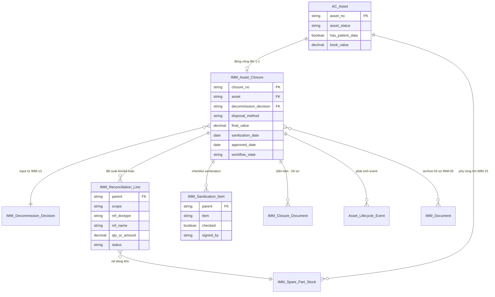
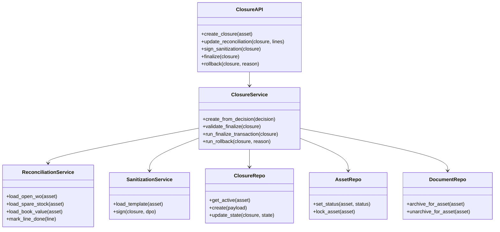
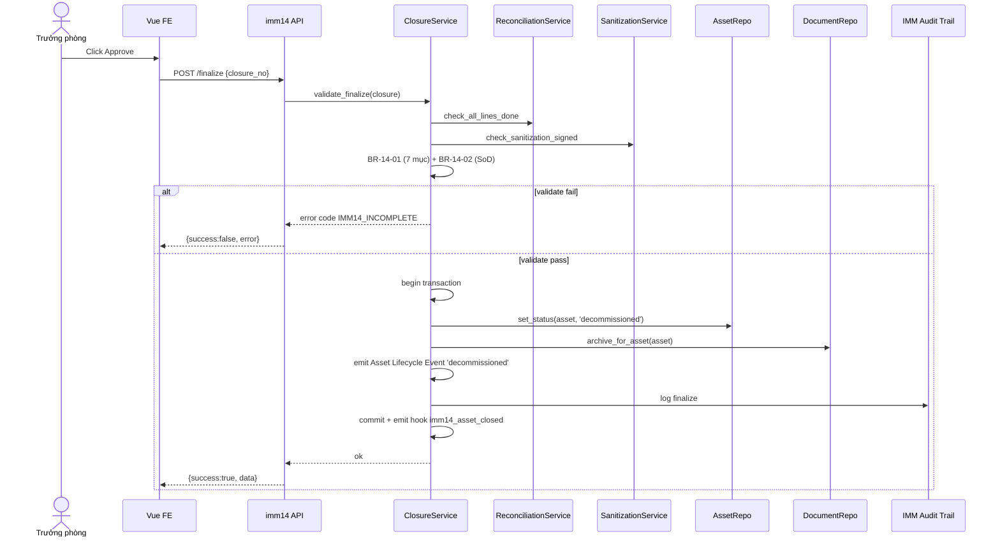
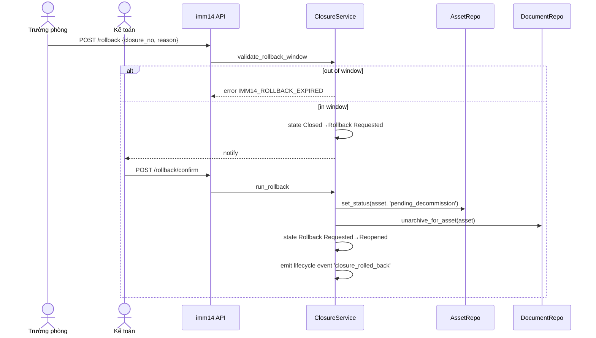
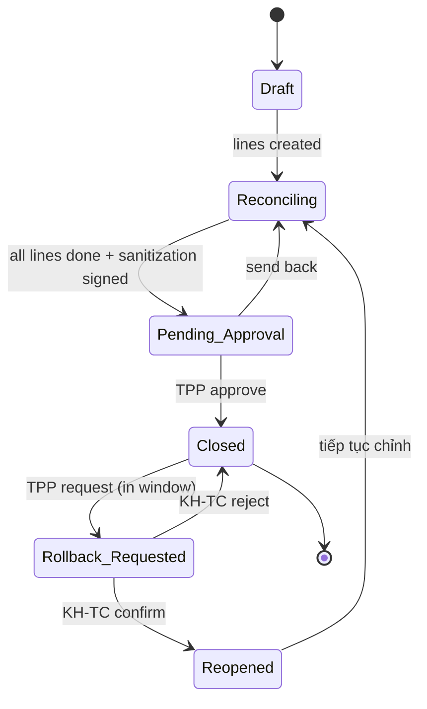
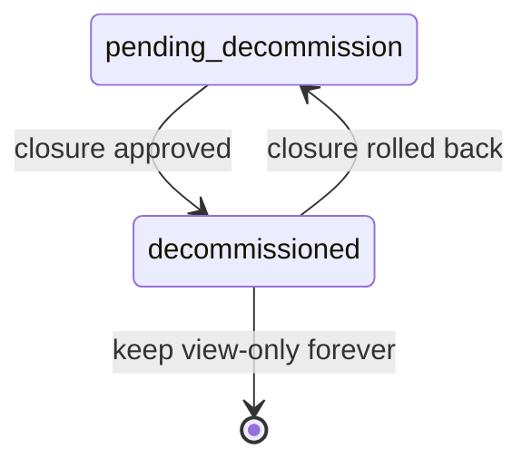
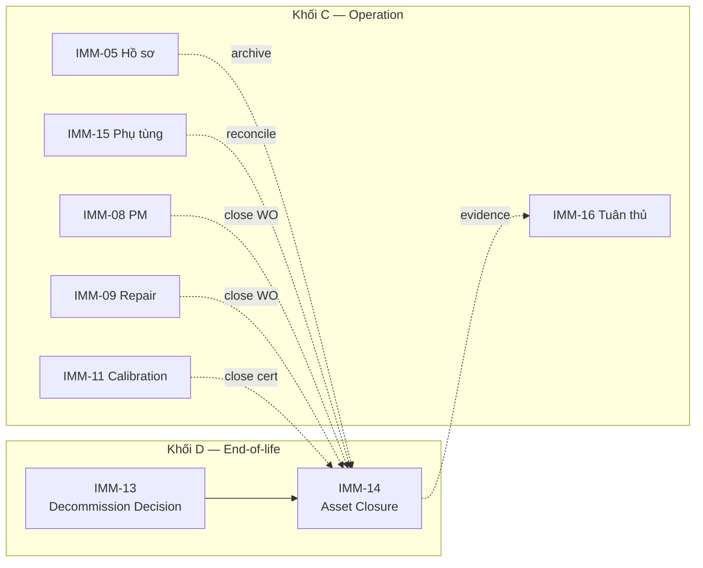

# 03 — Diagrams (IMM-14 Giải nhiệm thiết bị)

| Mục | Giá trị |
|---|---|
| Module | IMM-14 — Giải nhiệm thiết bị |
| Phạm vi | ERD + Class + Sequence + State |
| Owner | System Analyst + BE Architect |
| Liên kết | [02 Analysis](./02_Analysis_Design.md) · [04 Backend](./04_Backend_Design.md) |

> Diagram dạng overview cho module from-scratch. Chi tiết field DocType và service shape sẽ chốt khi BE scaffold (Đợt 3) — xem [04 Backend Design](./04_Backend_Design.md).

---

## 1. ERD — Entity quan hệ chính

*Hình 1.1 — ERD chính của IMM-14. Quan hệ `}o--o{` với `IMM Document` thể hiện archive cross-module.*

---

## 2. Class diagram — Service layer (3-tier)

*Hình 2.1 — Class diagram tuân thủ kiến trúc 3-tier (`assetcore-be-module`): API → Service → Repository. ReconciliationService và SanitizationService là sub-service tách theo bounded context.*

---

## 3. Sequence — UC-14-07 Phê duyệt closure cuối

*Hình 3.1 — Sequence finalize closure. Toàn bộ thao tác trong một transaction; nếu archive hồ sơ IMM-05 fail → rollback (NFR Reliability).*

---

## 4. Sequence — UC-14-08 Rollback closure

*Hình 4.1 — Rollback cần 2 bước (TPP yêu cầu, KH-TC xác nhận) — implement BR-14-04.*

---

## 5. State diagram — IMM Asset Closure

*Hình 5.1 — State machine. Mapping docstatus chi tiết xem [04 §III](./04_Backend_Design.md).*

---

## 6. State diagram — Asset (góc nhìn IMM-14)

*Hình 6.1 — Asset chỉ vào `decommissioned` qua IMM-14. Nguồn vào `pending_decommission` là IMM-13.*

---

## 7. Package diagram — IMM-14 trong AssetCore

*Hình 7.1 — Vị trí IMM-14 trong tổng thể; cross-link xem [00 hồ sơ kiến trúc](../architecture/Ho_so_kien_truc_IMMIS.md) line 260.*

---

*Hết file 03 — diagrams overview. Khi BE scaffold xong, bổ sung Sequence chi tiết cho UC-14-01, UC-14-04 và Component diagram microservice nếu tách.*
