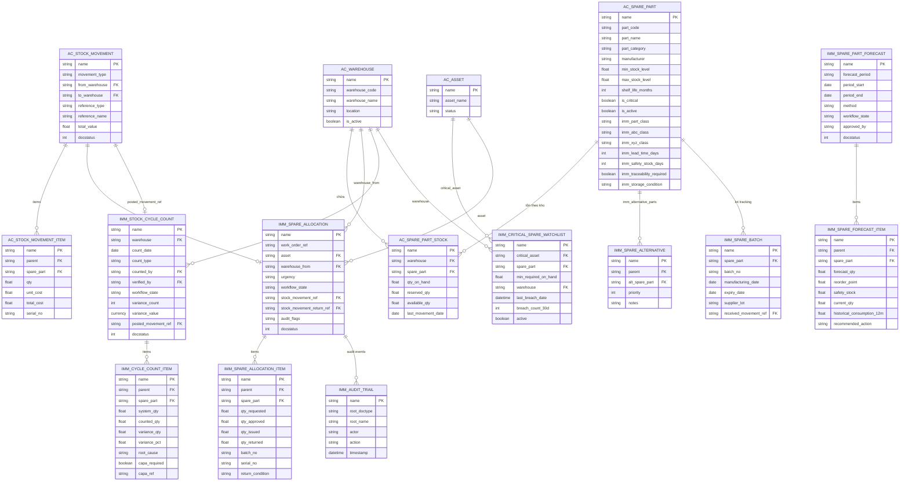
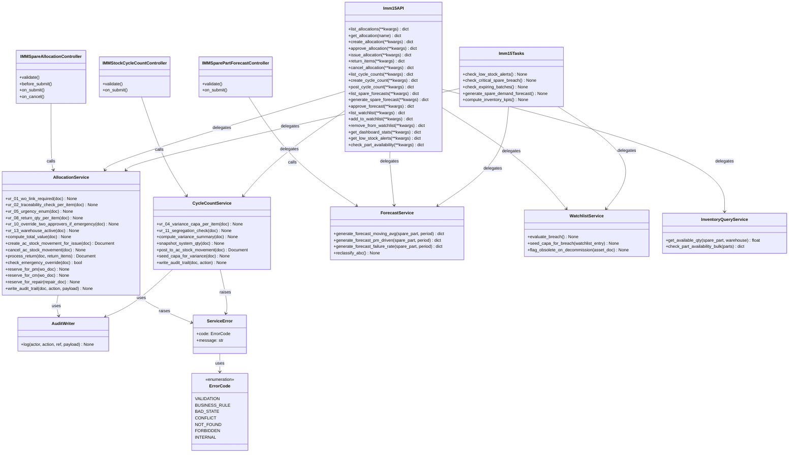
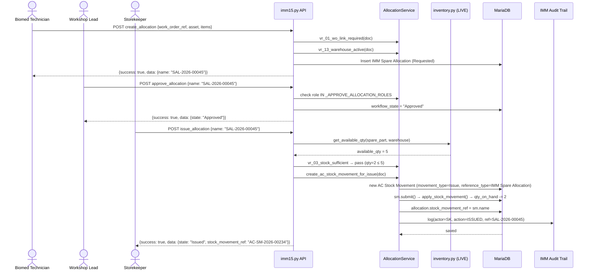
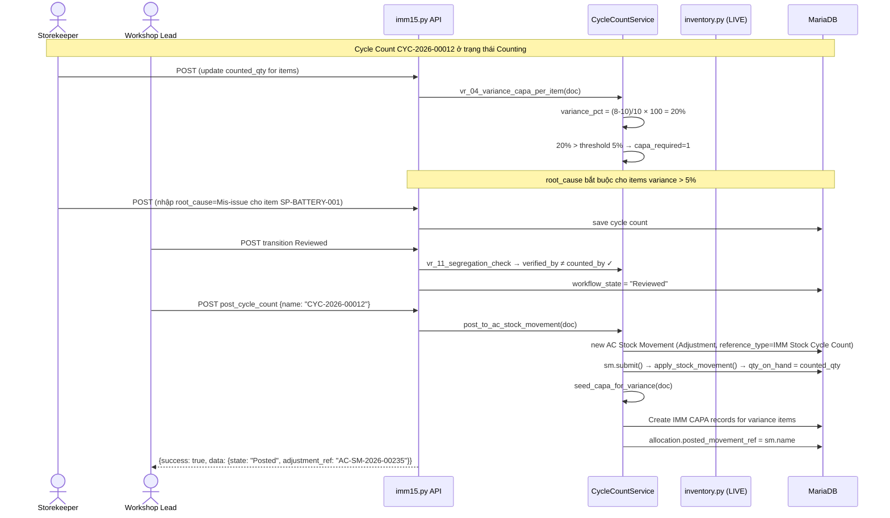
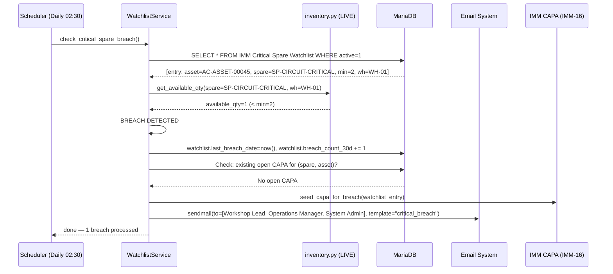

# 03 — Sơ đồ kỹ thuật — IMM-15 Theo dõi tồn kho phụ tùng

> ⚠️ Module PLANNED — Wave 3. AC Inventory Backbone LIVE; IMM transaction layer chưa triển khai.

| Thuộc tính | Giá trị |
|---|---|
| Module | IMM-15 — Spare Parts Inventory Tracking |
| Phiên bản | 0.1.0 |
| Ngày | 2026-05-08 |
| Trạng thái | PLANNED |

---

## I. Entity-Relationship Diagram



---

## II. Class Diagram



---

## III. Sequence Diagrams

### III.1 Luồng Issue Allocation → AC Stock Movement



### III.2 Luồng Cycle Count → Posted



### III.3 Luồng Watchlist Breach Alert



---

## IV. Communication Diagram (Cross-module)

```
IMM-08 (PM Work Order)
  │  [hook] before_submit → allocation_service.reserve_for_pm(wo_doc)
  │  → Tạo IMM Spare Allocation (Requested) với items từ imm_planned_spares
  └──────────────────────────────────► IMM-15 Spare Allocation

IMM-09 (Repair Work Order)
  │  [hook] before_submit → allocation_service.reserve_for_repair(repair_doc)
  │  → Thin wrapper tạo IMM Spare Allocation từ Spare Parts Used child
  └──────────────────────────────────► IMM-15 Spare Allocation

IMM-12 (CM Work Order)
  │  [Emergency path] urgency=Emergency → bypass VR-15-03 double-approval
  └──────────────────────────────────► IMM-15 Spare Allocation (Emergency)

IMM-13 / IMM-14 (Decommission)
  │  [hook] AC Asset.status=Decommissioned
  │  → watchlist_service.flag_obsolete_on_decommission(asset_doc)
  │  → AC Spare Part.imm_obsolete_review_required = 1
  └──────────────────────────────────► IMM-15 (AC Spare Part CF)

IMM-15 (Stock Movement submitted)
  │  [data] AC Stock Movement (Issue/Receipt/Adjustment)
  │  → AC Spare Part Stock.qty_on_hand updated via apply_stock_movement()
  └──────────────────────────────────► AC Inventory backbone (LIVE)

IMM-15 (Watchlist breach)
  │  [data] breach_count, accuracy_pct → Compliance KPI
  └──────────────────────────────────► IMM-16 (Compliance Monitoring)

IMM-15 (Forecast)
  │  [data] historical_consumption → failure_rate driven forecast
  │  [data] failure_rate từ IMM-17 → forecast_qty
  └──────────────────────────────────► IMM-17 (Predictive Maintenance)

IMM-15 (Stock accuracy %, breach hours)
  │  [data] KPI snapshot daily → dashboard
  └──────────────────────────────────► IMM-16 Compliance Score

IMM-03 (Vendor Scorecard quarterly)
  │  [data] spare fill rate per vendor → Scorecard dimension "Spare"
  └──────────────────────────────────► IMM-15 → IMM-03 Scorecard pipeline
```

---

## V. Package Diagram

```
assetcore/
│
├── api/
│   ├── inventory.py              ← LIVE (30 endpoints — master/movement)
│   └── imm15.py                  ← PLANNED (~16 endpoints — transaction)
│                                    (create_allocation, approve_allocation,
│                                     issue_allocation, return_items,
│                                     create_cycle_count, post_cycle_count,
│                                     generate_spare_forecast, approve_forecast,
│                                     list_watchlist, add_to_watchlist,
│                                     get_dashboard_stats, check_part_availability)
│
├── services/
│   ├── inventory.py              ← LIVE (get_available_qty, _upsert_stock, check_low_stock)
│   └── imm15.py                  ← PLANNED
│                                    allocation_service.*
│                                    cycle_count_service.*
│                                    forecast_service.*
│                                    watchlist_service.*
│                                    inventory_query.*
│                                    audit_writer.*
│
├── tasks.py                      ← 5 scheduler IMM-15 (PLANNED)
│                                    check_low_stock_alerts (daily 02:00)
│                                    check_critical_spare_breach (daily 02:30)
│                                    check_expiring_batches (daily 03:00, gated)
│                                    generate_spare_demand_forecast (monthly 1st 02:00)
│                                    compute_inventory_kpis (daily 04:00)
│
├── assetcore/
│   ├── doctype/
│   │   ├── [LIVE — AC backbone]/
│   │   │   ├── ac_spare_part/
│   │   │   ├── ac_spare_part_stock/
│   │   │   ├── ac_stock_movement/ (+ item)
│   │   │   ├── ac_warehouse/
│   │   │   └── ac_uom/
│   │   │
│   │   └── [PLANNED — IMM-15 layer]/
│   │       ├── imm_spare_allocation/ (+ item)
│   │       ├── imm_stock_cycle_count/ (+ item)
│   │       ├── imm_spare_part_forecast/ (+ item)
│   │       ├── imm_critical_spare_watchlist/
│   │       ├── imm_spare_alternative/ (child for CF)
│   │       └── imm_spare_batch/ (gated)
│   │
│   ├── workflow/
│   │   ├── imm_15_allocation_workflow.json   ← 6 states / 9 transitions (PLANNED)
│   │   └── imm_15_cycle_count_workflow.json  ← 4 states / 5 transitions (PLANNED)
│   │
│   └── views/inventory/          ← LIVE (11 screens)
│       │   SparePartListView, SparePartDetailView
│       │   StockLevelView, StockMovementListView
│       │   WarehouseListView, UomConversionView ...
│       └── [PLANNED — IMM-15 additional screens]
│           AllocationListView, AllocationDetailView
│           CycleCountListView, CycleCountDetailView
│           WatchlistView, SparePartForecastView
│           Imm15DashboardView
│
├── fixtures/
│   ├── imm15_custom_fields.json  ← 7 CF + IMM Spare Alternative + Property Setter (PLANNED)
│   ├── imm15_workflows.json      ← 2 workflows (PLANNED)
│   └── imm15_critical_watchlist_seed.json  ← Top-50 critical assets (PLANNED)
│
├── patches/
│   └── v3_2_00x/
│       ├── apply_imm15_custom_fields.py
│       ├── deploy_imm15_doctypes.py
│       ├── install_imm15_workflows.py
│       ├── backfill_imm_part_class.py
│       └── seed_watchlist_top50.py
│
└── tests/
    ├── test_imm15_services.py
    ├── test_imm15_api.py
    ├── doctype/imm_spare_allocation/test_imm_spare_allocation.py
    ├── doctype/imm_stock_cycle_count/test_imm_stock_cycle_count.py
    └── doctype/imm_spare_part_forecast/test_imm_spare_part_forecast.py
```
