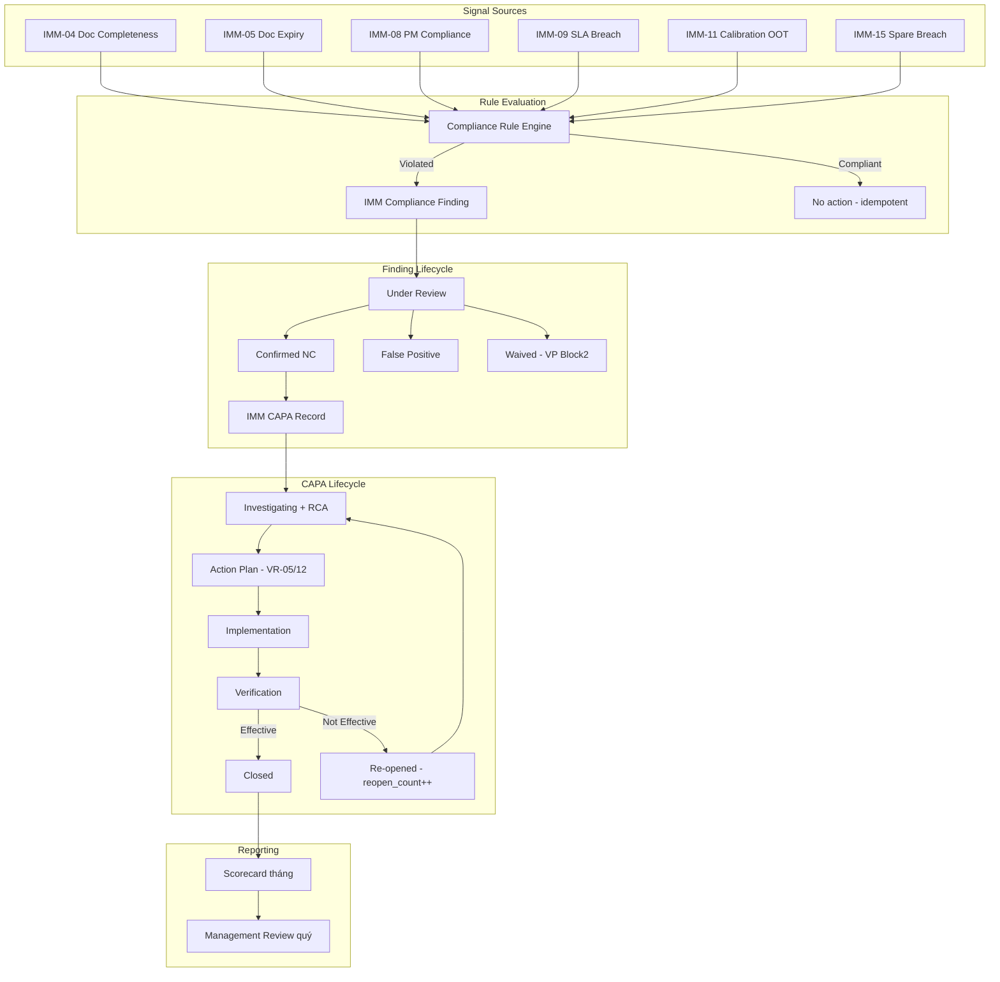
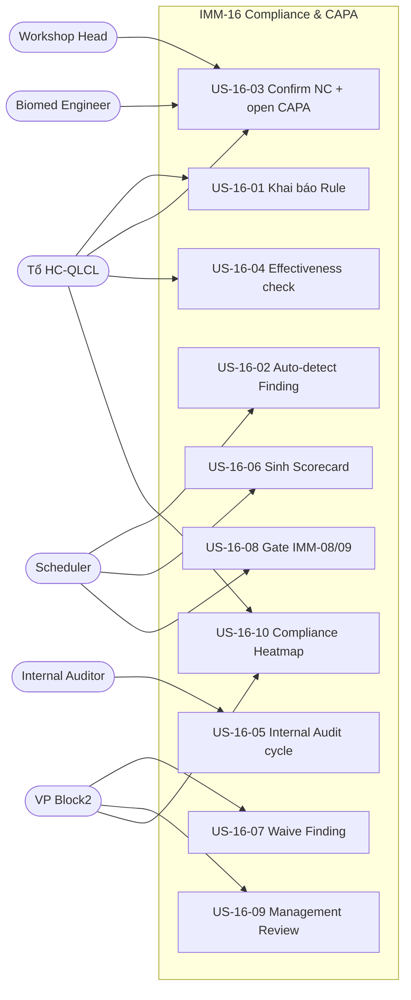

# 02 — Phân tích thiết kế nghiệp vụ — IMM-16 Compliance Monitoring & CAPA

| Mục | Giá trị |
|---|---|
| Module | IMM-16 — Compliance Monitoring & CAPA |
| Phạm vi | Per-module |
| Owner | BA + System Analyst |
| Liên kết | [03 Diagrams](./03_Diagrams.md) · [04 Backend](./04_Backend_Design.md) · [05 API](./05_API_Specification.md) · [06 Frontend](./06_Frontend_Design.md) |
| Chuẩn tham chiếu | ISO 13485:2016 §8.2.4, §8.5, §5.6; WHO HTM 5.4; NĐ 98/2021/NĐ-CP §35-§38 |

> ✅ Module IMPLEMENTED — Wave 2 (`services/imm16.py`, `api/imm16.py`, 11 DocType folders: compliance_rule/finding/scorecard, capa_record/action_step, internal_audit/supplier_audit, audit_checklist_item, audit_finding, management_review, scorecard rows). Cập nhật 2026-05-14.

---

# Phần I — Module Overview

## I.0. Khảo sát hiện trạng

Hiện trạng tại bệnh viện (As-Is), trước khi có AssetCore IMM-16:

- **Theo dõi tuân thủ thủ công**: Tổ HC-QLCL theo dõi compliance qua báo cáo Excel/Word định kỳ — không có rule engine, vi phạm chỉ phát hiện sau audit nội bộ hoặc khi đã có sự cố.
- **CAPA rời rạc**: Non-conformance được mở qua email/sổ tay; không có SLA, không escalation tự động khi quá hạn; effectiveness check không bắt buộc → CAPA "đóng trên giấy" nhưng vấn đề tái diễn.
- **Internal Audit thiếu chuẩn hóa**: Audit theo ISO 13485 §8.2.4 thực hiện 1–2 lần/năm bằng checklist Word; Major NC không bắt buộc link CAPA; finding bị bỏ sót giữa các kỳ audit.
- **Không có Compliance Scorecard**: Không có chỉ số tổng hợp tháng/quý cho từng module/khoa → Lãnh đạo không thấy được trend, không biết khoa nào "nóng".
- **Management Review hình thức**: Theo ISO 13485 §5.6 phải có MR quý nhưng hiện chỉ có biên bản Word, không link Scorecard/CAPA, không có gate "MR missed → block scorecard publish".
- **Audit trail phân tán**: Hồ sơ NC/CAPA lưu nhiều nơi (mạng nội bộ, email, sổ tay) — không đáp ứng NĐ 98/2021 §35-§38 yêu cầu data retention 10 năm có truy nguyên.

Tham chiếu chéo: WHO HTM §5.4 (Quality Management) mô tả pattern này phổ biến tại các cơ sở y tế chưa có CMMS/IMMIS — cần tự động hoá rule + scorecard + MR loop để đạt continual improvement.

## I.1. Pitch

Bệnh viện hiện thiếu cơ chế tổng hợp và theo dõi tuân thủ nội bộ một cách có hệ thống — PM compliance thấp ở khoa ICU không được cảnh báo tự động, CAPA mở quá hạn không được leo thang đúng cấp, và Management Review theo ISO 13485 §5.6 không có hồ sơ chuẩn hóa. IMM-16 là **Compliance & CAPA Backbone** của AssetCore: tổng hợp tín hiệu tuân thủ từ mọi module IMM (IMM-04 đến IMM-15), tự động phát hiện non-conformance qua rule engine, quản lý vòng đời CAPA trên nền `IMM CAPA Record` đã LIVE, sinh Compliance Scorecard tháng và phục vụ Management Review quý theo ISO 13485 §5.6. Mục tiêu: overall compliance score ≥ 90%, CAPA overdue rate ≤ 5%, Management Review hàng quý đúng chu kỳ.

## I.2. Vị trí trong WHO HTM lifecycle

| Phase | Chạm? | Ghi chú |
|---|---|---|
| Needs | ✅ | BR từ needs assessment |
| Procurement | ✅ | Supplier qualification audit (cross-link IMM-03) |
| Installation | ✅ | IMM-04 doc completeness → Compliance Finding |
| Operation | ✅ **chính** | PM/Calibration/SLA compliance → Findings; Work Order gate |
| Maintenance | ✅ **chính** | IMM-08/09/11/12 signal feed; CAPA lifecycle |
| Decommission | ✅ | Block decommission nếu CAPA/Audit open (IMM-13/14) |

Input: Tín hiệu tuân thủ từ IMM-04/05/06/08/09/10/11/12/15.
Output: Compliance Finding, CAPA Record lifecycle, Scorecard tháng, Management Review quý, compliance gate cho IMM-08/09/13/14.

## I.3. Stakeholders & Actors

> **Roles ánh xạ vào 30-role catalog** (post-patch `v3_2.001_module_role_redesign`). Persona nghiệp vụ (Tổ HC-QLCL, VP Block2, Workshop Head, Internal Auditor) được giữ ở cột "Persona thực địa" để BA dễ đối chiếu, role hệ thống cấp quyền lấy từ `assetcore/fixtures/role.json`.

| Role hệ thống (30-role catalog) | Persona thực địa | Quan tâm chính | Tần suất | Loại |
|---|---|---|---|---|
| **Compliance Manager** | Tổ HC-QLCL / QA Lead | Rule config, Finding triage, CAPA oversight, Scorecard publish, Audit lead, MR finalize, Waive Finding | Daily | Primary |
| **Compliance User** | Internal Auditor / khoa phòng | Checklist audit, raise NC, tạo CAPA cấp khoa, action owner | Per audit / Daily | Primary |
| **Corrective Manager** (IMM-09) | Workshop Head / Trưởng phân xưởng | Action owner xưởng, theo dõi CAPA mức xưởng, escalation Level 2 | Daily | Secondary |
| **Corrective User** (IMM-09) | Biomed Engineer / HTM Technician | Thực hiện CAPA action step kỹ thuật | Per step | Secondary |
| **PM User** (IMM-08) | KTV PM | Bị block WO khi asset có CAPA Critical (BR-16-09) | Daily | Consumer |
| **AssetCore Auditor** | Auditor QMS | Read-only audit trail, immutability, traceability NĐ98 | Monthly | Auditor |
| **AssetCore Super Admin** | CMMS Admin / IT | Full admin, override, scheduler giám sát | Ad-hoc | System Admin |
| **AssetCore System User** | Mọi nhân viên đăng nhập | Xem Dashboard, Heatmap (read-only) | Weekly | Stakeholder |
| System (Scheduler) | Frappe Scheduler | Auto-eval rule, scorecard, escalation | Auto | System |

## I.4. Scope

**In-scope:**

| # | Chức năng |
|---|---|
| F-01 | Compliance Rule Engine (declarative, versioned, change control) |
| F-02 | Auto Compliance Evaluation (scheduler idempotent upsert Finding) |
| F-03 | Manual Finding Entry |
| F-04 | Internal Audit Cycle (Plan → Checklist → Finding → Reporting → Close) |
| F-05 | NC / CAPA Lifecycle (extend `IMM CAPA Record` workflow sub-states) |
| F-06 | Root Cause Analysis (reuse `IMM RCA Record` LIVE) |
| F-07 | CAPA Effectiveness Check + Re-open nếu Not Effective |
| F-08 | Compliance Scorecard tháng (immutable sau publish) |
| F-09 | Management Review quý (ISO 13485 §5.6) |
| F-10 | Compliance Heatmap (Module × Department matrix) |
| F-11 | Cross-module Gate IMM-08/09 (BR-16-09 block WO Submit) |
| F-12 | Waiver Process (VP Block2 approval + expiry) |
| F-13 | Audit Trail bắt buộc (hash chain `IMM Audit Trail` LIVE) |
| F-14 | Escalation Matrix (CAPA quá hạn → email theo level) |
| F-15 | Integration ingestion (IMM-04/05/06/08/09/10/11/12/15) |

**Out-of-scope:**

| # | Chức năng | Module phụ trách |
|---|---|---|
| 1 | Quản lý hồ sơ tài liệu thiết bị | IMM-05 |
| 2 | Lịch PM, Calibration | IMM-08, IMM-11 |
| 3 | Vendor recall / FSCA / vigilance | IMM-10 (external) |
| 4 | Vendor-side audit (`IMM Supplier Audit` LIVE) | IMM-03 |
| 5 | RCA infrastructure (5-Why, Fishbone modeling) | IMM-12 (đã LIVE qua `IMM RCA Record`) |
| 6 | Predictive analytics | IMM-17 |
| 7 | Electronic signature pháp lý | v2.0 (FDA 21 CFR Part 11) |
| 8 | External regulator submission | Phase 2 |

**Dependencies:**

- IMM-00 Foundation: `IMM CAPA Record` LIVE, `IMM Audit Trail` LIVE, `IMM RCA Record` LIVE, `services/imm00.py` LIVE
- IMM-04/05/06/08/09/10/11/12/15: signal sources
- IMM-08/09: compliance gate injection point (hooks trong `services/imm08.py`, `services/imm09.py`)
- IMM-13/14: decommission gate consumer

## I.5. KPI mục tiêu

| KPI | Định nghĩa | Baseline | Target | Đo ở đâu |
|---|---|---|---|---|
| Overall Compliance Score | % rules evaluated không vi phạm | N/A | ≥ 90% | `get_dashboard_stats` |
| CAPA Overdue Rate | % CAPA quá hạn / tổng CAPA mở | N/A | ≤ 5% | `get_capa_aging` |
| Findings Critical Open | Số Finding severity=Critical chưa close | N/A | = 0 | Dashboard KPI card |
| Management Review Compliance | Mỗi quý ≥ 1 MR Closed | N/A | 100% | `check_management_review_due` |
| CAPA Effectiveness Rate | % CAPA close với effectiveness=Effective | N/A | ≥ 85% | `get_dashboard_stats` |
| Rule Evaluation Coverage | % active rules chạy đúng chu kỳ | N/A | 100% | `run_compliance_evaluation` |

## I.6. Ràng buộc Compliance

| Quy định | Yêu cầu áp lên module | Doc tham chiếu |
|---|---|---|
| ISO 13485:2016 §8.2.4 | Internal Audit bắt buộc + checklist + CAPA link cho Major NC | PR-IMMIS-16-01 |
| ISO 13485:2016 §8.5 | CAPA toàn vòng đời: root cause → action plan → verification | PR-IMMIS-16-02 |
| ISO 13485:2016 §5.6 | Management Review quý + input/output + minutes | PR-IMMIS-16-03 |
| WHO HTM 5.4 | Quality Management — internal governance & continual improvement | — |
| NĐ 98/2021 §35-§38 | Mọi NC/CAPA có hồ sơ; data retention ≥ 10 năm | Điều 35-38 |
| ISO 14971 (via QMS) | Risk-based prioritization cho CAPA (imm_risk_level field) | — |

Tham chiếu QMS artifact (Architecture line ~398–402): bộ tài liệu IMMIS-16 gồm `PR-IMMIS-16-01..04`, `WI-IMMIS-16-01..05`, `BM-IMMIS-16-01`, `HS-LOG/REC/REP-IMMIS-16-*`, `KPI-DASH-IMMIS-16` — chủ sở hữu Tổ HC-QLCL & Risk + CMMS/IMMIS + PTP1/PTP2; lưu tại `QMS điện tử/IMMIS/16-*` và `BI/IMMIS`. Chi tiết QMS doc tree dùng `docs/ba/Phase_05_QMS_Governance_Design/` (đặc biệt `03_CAPA_Workflow_Spec`, `07_Management_Review_Spec`, `09_Internal_Audit_Plan_Checklist`).

## I.7. Risk & Open questions

| ID | Risk / Open question | Mức | Mitigation / Owner |
|---|---|---|---|
| RQ-16-01 | Rule Engine quá nhạy → flood Finding (false positive) làm Tổ HC-QLCL ngợp | Cao | VR-01 enforce threshold rõ; cycle pilot 1 quý + tinh chỉnh; whitelist khoa pilot trước. Owner: Tổ HC-QLCL |
| RQ-16-02 | Cross-module gate BR-16-09 block nhầm WO khẩn cấp khi asset có CAPA Critical | Cao | Cho phép VP Block2 override + log audit trail; 4 ô SLA escalation. Owner: PTP Khối 2 |
| RQ-16-03 | Backwards compatibility với CAPA Record dữ liệu cũ (IMM-12) khi extend workflow 6 sub-states | Trung | Migration patch idempotent; map status cũ → workflow_state mới; smoke test trên dữ liệu staging. Owner: CMMS Admin |
| RQ-16-04 | Scorecard immutability bị bypass qua sửa DB trực tiếp | Trung | DB-level guard + controller `validate()` + Frappe Version + `IMM Audit Trail` hash chain. Owner: CMMS Admin |
| RQ-16-05 | Management Review quý bị missed → block toàn bộ scorecard publish quý sau (cascade) | Trung | Email reminder 14/7/3 ngày trước hạn quý; VP Block2 escalation. Owner: VP Block2 |
| RQ-16-06 | Phụ thuộc nhiều module signal source (IMM-04/05/08/09/11/15) — module thượng nguồn chậm Wave làm IMM-16 không có data | Trung | Plug-and-play ingestion: rule chỉ activate khi source module ready; hiển thị "no data" thay vì lỗi. Owner: Tech Lead |
| RQ-16-07 | i18n error message chưa đầy đủ tiếng Việt cho 12 VR | Thấp | Sprint post-Wave: rà soát toàn bộ `frappe._()` trong service. Owner: BA |
| RQ-16-08 | Electronic signature pháp lý (FDA 21 CFR Part 11) chưa có → ảnh hưởng audit quốc tế | Thấp | Đẩy v2.0; hiện dùng Frappe user + IP + timestamp đủ NĐ 98. Owner: Tech Lead |

*Mức risk được cập nhật mỗi sprint review. RACI risk owner sẽ chuyển trạng thái Open → Mitigated → Closed sau khi controls active.*

## I.8. Roadmap thực thi

| Sprint | Scope | Deliverable | Phụ thuộc |
|---|---|---|---|
| Đợt 2 — Sprint 1 | DocType scaffold | `IMM Compliance Rule`, `IMM Compliance Finding`, `IMM Internal Audit`, `IMM Compliance Scorecard`, `IMM Management Review` (5 DocType PLANNED) + extend `IMM CAPA Record` workflow 6 sub-states | IMM-00 LIVE |
| Đợt 2 — Sprint 2 | Service layer 3-tier | `services/imm16_rule.py`, `imm16_finding.py`, `imm16_capa.py`, `imm16_audit.py`, `imm16_scorecard.py`, `imm16_mr.py` + repository split | DocType ready |
| Đợt 2 — Sprint 3 | Scheduler + Cross-module gate | `run_compliance_evaluation`, `update_compliance_scorecard`, `check_capa_due_imm16`, `check_audit_milestones`, `check_management_review_due` + hook BR-16-09 vào `services/imm08.py` + `services/imm09.py` | Service ready, IMM-08/09 LIVE |
| Đợt 2 — Sprint 4 | API + FE Sitemap | 30 endpoints `assetcore.api.imm16.*` + Pinia store + 15 routes (Rule list, Finding workbench, CAPA detail, Audit cycle, Scorecard, MR, Heatmap) | Service ready |
| Đợt 2 — Sprint 5 | UAT + Hardening | UAT-IMM16-01..12 pass; STRIDE security review; load test 50k findings; documentation cuối | All above |
| Đợt 2 — Release | Go-live pilot | Pilot 2 khoa (ICU, OR) trước; production toàn viện sau 1 tháng pilot | UAT pass |
| v2.0 (sau go-live) | Predictive + e-Signature | ML-driven rule suggestion (cross-link IMM-17); FDA 21 CFR Part 11 e-sig | IMM-17 ready |

Phụ thuộc liên module (đọc cùng `assetcore-integration-patterns`): IMM-16 ingest từ 9 module thượng nguồn + inject gate vào IMM-08/09/13/14. Bất kỳ thay đổi schema/API ở các module nguồn phải báo cho Owner IMM-16 trước 1 sprint.

---

# Phần II — Quy trình nghiệp vụ (BPMN)

## II.1. As-Is process

Tổ HC-QLCL hiện theo dõi compliance thủ công qua báo cáo Excel định kỳ — không có cơ chế tự động phát hiện vi phạm, CAPA được quản lý rời rạc qua email/sổ tay, không có Scorecard chuẩn hóa. Management Review có biên bản Word nhưng không liên kết với CAPA hay Scorecard.

## II.2. Pain points

| # | Pain | Tác động |
|---|---|---|
| 1 | Không có rule engine tự động → tuân thủ kiểm tra thủ công, bỏ sót | Vi phạm không phát hiện kịp, rủi ro kiểm định |
| 2 | CAPA quản lý trong Excel → không có SLA, không escalation | CAPA quá hạn không được xử lý |
| 3 | Internal Audit không có checklist chuẩn → finding bị bỏ sót | ISO 13485 §8.2.4 không được đáp ứng đầy đủ |
| 4 | Scorecard không tồn tại → không biết compliance trend | Không cải tiến có cơ sở |
| 5 | Management Review không link với CAPA/Scorecard → không đầy đủ |  NĐ98 §35-38 không compliance |

## II.3. To-Be process



## II.4. Decision points

| Điểm | Câu hỏi | Quy tắc |
|---|---|---|
| Rule evaluation | Rule violated threshold? | Có → upsert Finding (idempotent) |
| Finding review | Confirmed NC hay False Positive? | Tổ HC-QLCL / Internal Auditor quyết |
| Finding waive | Có thể waive? | Chỉ VP Block2, VR-04 enforce |
| Advance CAPA to Action Plan | Root cause method chọn? | VR-05 enforce |
| Advance CAPA to Closed | Effectiveness = Effective? | VR-07 block nếu Not Effective |
| Audit close | Tất cả Major NC đã link CAPA? | VR-08 block nếu còn Major NC thiếu link |
| Publish Scorecard | Quý trước có MR Closed? | VR-10 block nếu không có MR |
| Submit WO (IMM-08/09) + Commissioning (IMM-04) | Asset có Critical CAPA mở? (SoT `is_capa_open`: status NOT IN Closed — gồm `Overdue`) | BR-16-09 block submit/commission |

## II.5. RACI matrix

| Hoạt động | QLCL | Int. Auditor | WS Head | Biomed | VP2 | Admin | System |
|---|---|---|---|---|---|---|---|
| Khai báo Rule | R/A | — | — | — | — | R/A | — |
| Đánh giá Rule | I | — | — | — | — | I | R/A |
| Tạo Finding manual | R/A | R | R | R | — | R/A | — |
| Confirm NC | R/A | R | — | — | — | R/A | — |
| Waive Finding | — | — | — | — | R/A | R/A | — |
| Plan Audit | R/A | R | — | — | — | R/A | — |
| Execute Checklist | R | R/A | — | — | — | R/A | — |
| Close Audit | R/A | — | — | — | R | R/A | — |
| CAPA Lifecycle | R/A | R | R | R | A | R/A | — |
| Publish Scorecard | R/A | — | — | — | R/A | R/A | — |
| Finalize MR | C | — | — | — | R/A | R/A | — |
| Escalation | I | — | I | — | I | I | R/A |

## II.6. Exception flows

**E1 — CAPA Re-open (Not Effective):**
Sau effectiveness check = Not Effective → `imm_reopen_count++`, `workflow_state = Re-opened → Investigating` → CAPA quay lại vòng phân tích root cause. BR-16-03 enforce VR-07.

**E2 — Audit close bị block (Major NC chưa CAPA):**
VR-08 block close_audit nếu còn Audit Finding row severity=Major chưa có `imm_capa_link`. Auditor phải link CAPA trước.

**E3 — Scorecard publish bị block (thiếu MR):**
VR-10 block publish nếu quý trước không có Management Review status=Closed. VP Block2 phải tạo và finalize MR quý trước.

---

# Phần III — Use Case Specification

## III.0. Use Case Diagram

> Note: section bổ sung light-touch để khớp template §III.1 (UC Diagram). Numbering của các sub-section dưới giữ nguyên (Actor catalog vẫn ở III.1, Use Case Specifications ở III.2) — xem `_REPORT.md` trong cùng thư mục để biết khuyến nghị chuẩn hoá numbering trong sprint sau.

### III.0.a. Biểu đồ use case tổng quát



### III.0.b. Phân rã theo nhóm chức năng

| Nhóm | Use Cases | Actor chính |
|---|---|---|
| Rule Management | US-16-01 | Tổ HC-QLCL |
| Finding Lifecycle | US-16-02, US-16-03, US-16-07 | Scheduler, Tổ HC-QLCL, VP Block2 |
| CAPA Lifecycle | US-16-03, US-16-04 | Tổ HC-QLCL, Workshop Head, Biomed |
| Audit Cycle | US-16-05 | Internal Auditor |
| Reporting & Governance | US-16-06, US-16-09, US-16-10 | Scheduler, VP Block2 |
| Cross-module Gate | US-16-08 | Scheduler / Service validator |

## III.1. Actor catalog

| Actor | Loại | Mô tả | Goal chính |
|---|---|---|---|
| Tổ HC-QLCL | Primary | Full owner của compliance module | Rule → Finding → CAPA → Scorecard |
| Internal Auditor | Primary | Thực hiện checklist audit | Ghi NC, raise Finding |
| Workshop Head | Secondary | Action owner cấp xưởng | Thực hiện CAPA, theo dõi escalation |
| VP Block2 | Approver | Phê duyệt waiver, close audit, sign Scorecard, chair MR | Governance cuối cùng |
| Scheduler | System | Frappe scheduler | Auto eval rule, scorecard, escalation |
| Auditor QMS | Auditor | Kiểm tra audit trail | Traceability + immutability |

## III.2. Use Case Specifications

### US-16-01 — Khai báo Compliance Rule

```gherkin
As Tổ HC-QLCL,
I want khai báo 1 rule mới (source IMM-08, threshold PM compliance < 90%),
So that hệ thống tự động đánh giá định kỳ.

Scenario: Tạo rule hợp lệ
  Given tôi có role Tổ HC-QLCL
  When tôi POST /api/method/assetcore.api.imm16.create_rule với
    {rule_code: "R-IMM08-PM-COMP-90",
     source_module: "IMM-08",
     category: "PM",
     severity: "High",
     threshold_definition: {"metric":"pm_compliance_pct","op":"<","value":90},
     evaluation_frequency: "Monthly",
     owner_role: "Workshop Head"}
  Then response.success = true
  And rule.is_active = 1
  And rule.version = "1.0"

Scenario: Threshold JSON không hợp lệ (VR-01)
  When threshold_definition thiếu key "metric"
  Then response.success = false
  And response.code = "VALIDATION_ERROR"
  And response.error contains "VR-01: Threshold rule không hợp lệ"
```

### US-16-02 — Auto-detect Finding qua scheduler

```gherkin
As System,
When scheduler run_compliance_evaluation chạy theo frequency của rule,
I evaluate rule và upsert Finding nếu vi phạm threshold.

Scenario: PM compliance khoa ICU = 78% (< 90%)
  Given rule R-IMM08-PM-COMP-90 active, frequency=Monthly
  When scheduler evaluation kích hoạt vào ngày 1 tháng
  Then sinh IMM Compliance Finding với
    severity="High", current_value=78, threshold_value=90,
    source_record="department:ICU", status="Open"
  And idempotent: chạy lại cùng ngày không tạo bản ghi mới
```

### US-16-03 — Confirm NC & open CAPA Record

```gherkin
As Tổ HC-QLCL,
When Finding ở Under Review,
I confirm là NC và mở CAPA Record.

Scenario: Open CAPA từ Finding
  Given finding ở "Under Review" với severity="High"
  When POST confirm_finding(name) → status "Confirmed NC"
  And POST link_to_capa(finding) → tạo IMM CAPA Record mới (imm00.create_capa)
  Then capa.source_type="Compliance Finding"
  And capa.imm_compliance_finding_ref=finding.name
  And finding.capa_ref=capa.name
  And finding.status="Resolved" sau khi capa.status="Closed"
```

### US-16-04 — Effectiveness check & Re-open

```gherkin
As Tổ HC-QLCL,
When CAPA Record ở workflow_state "Verification",
I run effectiveness check sau N tuần monitoring.

Scenario: Effective → Close
  Given capa workflow_state="Verification"
  When POST perform_effectiveness_check(name, result="Effective", evidence)
  Then capa.status="Closed", workflow_state="Closed"
  And effectiveness_check="Effective"

Scenario: Not Effective → Re-open
  When POST perform_effectiveness_check(name, result="Not Effective", evidence)
  Then capa.status="In Progress", workflow_state="Investigating"
  And capa.imm_reopen_count += 1
  And BR-16-03 throw nếu cố Close mà chưa Effective
```

### US-16-05 — Internal Audit cycle

```gherkin
As Lead Auditor,
I plan và execute internal audit cho scope đã định.

Scenario: Plan audit
  Given audit_code="A-2026-Q2-MAINT", scope_modules=[IMM-08, IMM-11]
  When POST create_audit({...})
  Then audit.status="Planned"
  And scheduler check_audit_milestones cảnh báo 7 ngày trước planned_start

Scenario: Execute checklist + ghi Audit Finding
  Given audit ở "In Progress"
  When complete_audit_checklist với 1 item finding_status="Major NC"
  Then sinh IMM Compliance Finding tự động
  And ghi 1 row Audit Finding với severity=Major, imm_finding_link=finding.name

Scenario: Close audit — block Major NC chưa CAPA
  Given audit ở "Reporting", có 1 Major NC chưa có imm_capa_link
  When close_audit(name)
  Then VR-08 throw "Còn 1 Major NC chưa mở CAPA" (BR-16-04)
```

### US-16-06 — Compliance Scorecard sinh tự động

```gherkin
As System,
On 1st of month at 03:00,
I aggregate findings tháng trước và sinh Scorecard Draft.

Scenario: Sinh scorecard tháng (BR-16-11 — chỉ tính finding ĐÃ phân định)
  Given findings tháng 4/2026 (sau khi loại False Positive):
    | adjudicated-compliant (Resolved/Waived/Closed) | 90 |
    | non_compliant (Confirmed NC)                   | 18 |
    | pending (Open/Under Review — CHƯA phân định)   | 12 |
  When scheduler update_compliance_scorecard chạy
  Then sinh IMM Compliance Scorecard {period_year:2026, period_month:4}
  # mẫu số = chỉ finding ĐÃ adjudicated = 90 + 18 = 108 (pending KHÔNG vào mẫu số)
  And score_pct = compliant / (compliant + non_compliant) * 100
                = 90 / (90 + 18) * 100 = 83.33%
  And compliant_count = 90, non_compliant_count = 18, pending_count = 12
  And status="Draft", is_published=0

Scenario: Publish scorecard
  Given scorecard "Draft"
  When VP Block2 POST publish_scorecard(name)
  Then is_published=1
  And BR-16-07: sửa scorecard sau publish → VR-09 throw
```

### US-16-07 — Waive Finding (BR-16-06)

```gherkin
As VP Block2,
When 1 Finding hợp lý không cần CAPA,
I waive với reason + expiry.

Scenario: Waive thành công
  Given finding "Under Review", role=VP Block2
  When POST waive_finding(name, waiver_reason≥50chars, evidence, expiry>today)
  Then finding.status="Waived"

Scenario: Block waive nếu không phải VP Block2
  Given role=Workshop Head
  When POST waive_finding(...)
  Then response.code="FORBIDDEN"
```

### US-16-08 — Gate IMM-08/09 (BR-16-09)

```gherkin
As IMM-08/09 service validator,
Before submitting Work Order on asset,
I check IMM-16 compliance status.

Scenario: Asset có CAPA Critical OPEN
  Given asset AC-ASSET-2026-0001 có CAPA với imm_risk_level="Critical", status="In Progress"
  When WO validate gọi gate_wo_submit → check_asset_compliance_status(asset)
  Then response = {blocked: true, reasons[0]={ref:"CAPA-2026-00007", status:"In Progress"}}
  And WO submit bị frappe.throw: "...có CAPA Critical đang mở... (BR-16-09)"

Scenario: INVARIANT dưới cron — Critical CAPA flip Open→Overdue VẪN block
  Given asset A có 1 CAPA imm_risk_level="Critical", status="Open" (due_date < today)
  And check_asset_compliance_status(A).blocked == True   # trước cron
  When scheduler check_capa_overdue() flip status A → "Overdue"
  Then check_asset_compliance_status(A).blocked VẪN == True  # byte-for-byte cùng tập SoT
  And reasons[0].status == "Overdue"                          # status thật, không nuốt
  And gate_wo_submit chặn WO submit (frappe.throw)            # hiện KHÔNG chặn = lỗ phải vá

Scenario: Closed → true-negative (không chặn)
  Given asset B chỉ có CAPA Critical status="Closed"
  Then check_asset_compliance_status(B).blocked == False

Scenario: Non-Critical Overdue → KHÔNG chặn (imm_risk_level filter giữ nguyên)
  Given asset C có CAPA imm_risk_level="High", status="Overdue"
  Then check_asset_compliance_status(C).blocked == False

Scenario: FE pre-flight banner (PMWorkOrderCreateView — IMM-08) — cảnh báo SỚM, parity với gate
  Given user mở form tạo phiếu PM đột xuất
  When user chọn asset AC-ASSET-2026-0001 (có CAPA Critical OPEN)
  Then FE gọi imm16.ts::checkAssetComplianceStatus → canonical endpoint check_asset_compliance_status
  And banner cảnh báo HIỆN NGAY sau panel assetMeta (role=alert, aria-live=assertive, severity=warning)
       TRƯỚC khi user soạn xong form — KHÔNG đợi submit mới frappe.throw
  And banner liệt kê reasons[] verbatim: "CAPA-2026-00007 — Quá hạn" (status dịch qua translateStatus SSoT, 0 English leak)
  And nút "Tạo lệnh" disable (hoặc reactive-throw lúc submit nhưng banner đã cảnh báo)
  And gateResult.blocked (FE) === blocked do check_asset_compliance_status trả (parity, KHÔNG inline-compute ở FE)

Scenario: asset không block / rỗng / fetch lỗi → banner ẩn (fail-safe)
  Given asset không có Critical CAPA mở (blocked=false) HOẶC asset_ref rỗng HOẶC endpoint trả 403/lỗi
  Then banner ẩn, nút "Tạo lệnh" bình thường, KHÔNG blank trang (try-catch/allSettled)
```

> **Canonical endpoint (collapse Vòng 16):** chỉ CÒN 1 def delegate trực tiếp `svc.check_asset_compliance_status` = `check_asset_compliance_status` (canonical, FE imm16.ts:513 trỏ tới). `check_asset_compliance` (legacy) → alias mỏng gọi lại hàm canonical. Chi tiết §05_API_Specification.md §3.8.1.

### US-16-09 — Management Review quý

```gherkin
As VP Block2 (Chair),
Each quarter I hold Management Review per ISO 13485 §5.6.

Scenario: Tạo + finalize MR
  When POST create_management_review(...) + finalize_management_review(name, minutes_doc)
  Then MR.status="Minutes Approved" → "Closed"
  And MR.scorecard_ref link Scorecard published
  And output_actions table có items với owner + due_date

Scenario: Block KPI publish nếu missed (BR-16-08)
  Given quý 2 đã hết, không có MR
  When publish_scorecard(scorecard)
  Then throw code "MR_MISSING_QUARTERLY" (VR-10)
```

### US-16-10 — Compliance Heatmap

```gherkin
As VP Block2 / Tổ HC-QLCL,
I want xem heatmap module × department,
So that nhìn ra điểm yếu nhanh.

Acceptance:
  GET get_compliance_heatmap → matrix
  rows = modules (IMM-04..15)
  cols = departments (ICU, OR, ER, ...)
  filter kỳ = evaluation_date BETWEEN [start, end)   # BR-16-12 period-anchor canonical
                    # KHÔNG lọc detected_date — phải CÙNG field với Scorecard
  cell = score_pct  # CÙNG công thức compute_compliance_rate như Scorecard (BR-16-11)
                    # cell.score = compliant / (compliant + non_compliant) * 100
                    # pending (Open/Under Review) KHÔNG vào mẫu số của cell
  click cell → drill-down list_findings filtered
```

---

# Phần IV — Functional Requirements

## IV.1. Business Rules

| ID | Rule | Implement ở | Chuẩn |
|---|---|---|---|
| BR-16-01 | Finding severity ≥ High → mở CAPA Record trong 5 NLV | `check_capa_due` + Finding `validate()` | ISO 13485 §8.5 |
| BR-16-02 | CAPA Critical >30 ngày chưa close → escalate VP Block2 + Trưởng phòng | `check_capa_due_imm16` scheduler | Internal |
| BR-16-03 | CAPA Close chỉ khi `effectiveness_check=Effective`; Not Effective → Re-open + `imm_reopen_count++` | CAPA Record `validate()` via doc_events | ISO 13485 §8.5 |
| BR-16-04 | Audit Major NC → CAPA Record + change control link nếu thay đổi master/process | `close_audit` validator VR-08 | ISO 13485 §8.2.4 |
| BR-16-05 | Compliance Rule thay đổi threshold/severity → change control versioned | Rule controller `before_save` VR-11 | ISO 13485 §4.2 |
| BR-16-06 | Waiver chỉ VP Block2 + reason ≥ 50 chars + evidence + expiry | `waive_finding` API role check VR-04 | Internal |
| BR-16-07 | Scorecard published immutable; sửa → tạo restate phiên bản mới | Scorecard `validate()` VR-09 | ISO 13485 §4.2 |
| BR-16-08 | Mỗi quý ≥1 Management Review; missed → block scorecard publish | `publish_scorecard` validator VR-10 | ISO 13485 §5.6 |
| BR-16-09 | Asset có CAPA `imm_risk_level=Critical` AND **CAPA đang mở (SoT `is_capa_open` / `_open_capa_filter`, imm00 — BR-00-15: `status NOT IN ('Closed')`)** → block WO Submit (IMM-08/09) **+ commissioning (IMM-04)**. **INVARIANT dưới cron**: `'Overdue'` ∈ tập mở (Overdue NOT IN Closed) → 1 Critical CAPA mở chặn gate cả TRƯỚC (status `Open`) lẫn SAU khi `check_capa_overdue` flip `Open→Overdue` (byte-for-byte cùng tập, count không tụt). KHÔNG inline `status IN (Open, In Progress, Pending Verification)` (bỏ sót `Overdue` → lỗ gate). Closed → true-negative (không chặn). `reasons[].status` trả status thật (vd `'Overdue'`) — không nuốt. Non-Critical (High/Medium/Low) KHÔNG chặn dù Overdue (`imm_risk_level='Critical'` filter giữ nguyên). | `check_asset_compliance_status()` (imm16) gọi `imm00._open_capa_filter()`; wired `gate_wo_submit` validate IMM-08/09 + `services/imm04.py` commissioning gate | Internal gate · ISO 13485 §8.5.2 |
| BR-16-10 | Mọi thay đổi Finding/CAPA/Audit/Scorecard ghi `IMM Audit Trail` (hash chain) + Frappe Version | `track_changes=1` + `imm00.log_audit_event` | NĐ 98 |
| BR-16-11 | Compliance-rate chỉ tính trên finding ĐÃ phân định (adjudicated). `compliant` = Resolved/Waived/Closed; `non_compliant` = Confirmed NC; `pending` = Open/Under Review → KHÔNG vào mẫu số. False Positive đã loại từ filter. `score_pct = round(compliant/(compliant+non_compliant)*100, 2)`; nếu adjudicated=0 → 100.0. Scorecard + Heatmap CÙNG gọi 1 SoT `compute_compliance_rate()` (không nhân bản công thức inline). | `services/imm16.py::compute_compliance_rate()` gọi bởi `generate_scorecard()` + `get_compliance_heatmap()` | ISO 13485 §8.4 (data analysis) |
| BR-16-12 | **Period-anchor canonical = `evaluation_date`.** MỌI view lọc finding theo kỳ (YYYY-MM) PHẢI lọc trên `evaluation_date` — KHÔNG dùng `detected_date`. Lý do: `evaluation_date` (Date) là ngày assessment khớp chu kỳ review tháng của Scorecard VÀ là thành phần khóa idempotency `(rule, source_record, evaluation_date)` = định nghĩa hệ thống "finding thuộc kỳ nào"; `detected_date` (Datetime) là event-timestamp có thể lệch kỳ do lag adjudication (vd phát hiện T2, đánh giá/xác nhận T3). Hệ quả nếu vi phạm: Scorecard và Heatmap cùng module/kỳ chọn 2 TẬP finding KHÁC nhau → `score_pct` lệch, vi phạm BR-16-11 ("CÙNG dataset CÙNG 1 score"). | `services/imm16.py::generate_scorecard()` (đã đúng `evaluation_date`) + `get_compliance_heatmap()` (PHẢI đổi từ `detected_date` → `evaluation_date`) | ISO 13485 §8.4 |

## IV.2. Validation Rules

| VR ID | Field / Trigger | Rule | Error Message |
|---|---|---|---|
| VR-01 | Rule.threshold_definition | JSON valid + `metric/op/value` mandatory | "VR-01: Threshold rule không hợp lệ. Cần `metric`, `op`, `value`." |
| VR-02 | Rule.evaluation_frequency | IN (Realtime, Hourly, Daily, Weekly, Monthly, Quarterly) | "VR-02: Frequency không hợp lệ." |
| VR-03 | Finding.severity | IN (Low, Medium, High, Critical) | "VR-03: Severity không hợp lệ." |
| VR-04 | Finding waive | `waiver_reason` ≥ 50 chars + `evidence` reqd + `expiry_date > today` | "VR-04: Waiver thiếu lý do/evidence/expiry hợp lệ." |
| VR-05 | CAPA.imm_root_cause_method | IN (5-Why, Fishbone, FMEA, FTA, Other) khi advance to "Action Plan" | "VR-05: Phải chọn phương pháp phân tích root cause." |
| VR-06 | CAPA.effectiveness_check | IN (Effective, Partially Effective, Not Effective) khi → Closed | "VR-06: Effectiveness check chưa hoàn tất." |
| VR-07 | CAPA Close | `effectiveness_check == "Effective"` (BR-16-03) | "VR-07: Không thể Close khi effectiveness chưa Effective." |
| VR-08 | Audit close | Tất cả Audit Finding row severity=Major phải có `imm_capa_link` set | "VR-08: Còn {n} Major NC chưa mở CAPA." |
| VR-09 | Scorecard publish | `is_published=1` → block edit (BR-16-07) | "VR-09: Scorecard đã publish, không thể sửa. Hãy tạo restate mới." |
| VR-10 | Mgmt Review missed gate | Quý trước thiếu MR Closed → block publish scorecard quý sau | "VR-10: Quý {q} chưa có Management Review." |
| VR-11 | Rule version change | Threshold/severity thay đổi → `change_summary` reqd + version bump | "VR-11: Thay đổi rule yêu cầu Tóm tắt thay đổi (change control)." |
| VR-12 | CAPA due_date | `due_date > today` khi advance vào "Action Plan" | "VR-12: Hạn hoàn thành phải sau hôm nay." |

## IV.3. State Machine — CAPA Workflow (extend IMM CAPA Record)

| workflow_state | mapped status | docstatus | Ghi chú |
|---|---|---|---|
| Open | Open | 0 | Khởi tạo |
| Investigating | In Progress | 0 | Đang RCA (link imm_rca_ref) |
| Action Plan | In Progress | 0 | RCA xong, lập kế hoạch (VR-05/12) |
| Implementation | In Progress | 0 | Đang thực thi action steps |
| Verification | Pending Verification | 0 | Đợi effectiveness_check |
| Closed | Closed | 1 | effectiveness_check=Effective (BR-16-03) |
| Re-opened | In Progress | 0 | imm_reopen_count++ (Not Effective) |

## IV.4. State Machine — Finding Workflow

| State | doc_status | Ghi chú |
|---|---|---|
| Open | 0 | Auto từ scheduler hoặc manual |
| Under Review | 0 | Triage bởi Tổ HC-QLCL |
| Confirmed NC | 0 | Xác nhận là vi phạm |
| False Positive | 0 | Không phải NC thực |
| Waived | 1 | VP Block2 approve waiver |
| Resolved | 1 | CAPA linked → Closed |
| Closed | 2 | Final |

---

# Phần V — Yêu cầu phi chức năng

## V.1. Hiệu năng

| ID | Metric | Target |
|---|---|---|
| NFR-16-01 | `list_findings` P95 (50k records) | < 2s |
| NFR-16-02 | Rule evaluation throughput (200 rules/run) | < 5 phút |
| NFR-16-03 | Idempotent finding upsert | UNIQUE (rule + source_record + evaluation_date) |
| NFR-16-04 | Heatmap render (10×15 cell) | < 1s |
| NFR-16-05 | `get_dashboard_stats` P95 | < 1s |

## V.2. Bảo mật

- Authentication: Frappe session + API token
- RBAC: 9 roles với DocPerm granular per DocType
- Waive: chỉ `_WAIVE_ROLES = {VP Block2, CMMS Admin}`
- Publish Scorecard: chỉ `_PUBLISH_SCORECARD_ROLES = {Tổ HC-QLCL, VP Block2, CMMS Admin}`
- Finalize MR: chỉ `_FINALIZE_MR_ROLES = {VP Block2, CMMS Admin}`
- Scorecard immutability: DB-level guard + controller `validate()`
- Audit trail: `IMM Audit Trail` hash chain LIVE + Frappe `track_changes=1`

## V.3. Khả dụng

| Metric | Target |
|---|---|
| Uptime giờ hành chính | ≥ 99.5% |
| Concurrent users | 50 users không degradation |
| Scheduler jobs | 0 missed run |

## V.4. Dữ liệu & Tuân thủ

- Data retention: ≥ 10 năm (NĐ98)
- Scorecard immutable sau publish: DB-level + controller
- Audit trail: mọi thao tác track qua Frappe Version + `IMM Audit Trail` hash chain
- i18n: Error messages qua `frappe._()` tiếng Việt
- Backwards compatibility: CAPA Record dữ liệu cũ (IMM-12) không vỡ qua migration patch

## V.5. Thông báo

- Email escalation: < 5 phút từ scheduler trigger (NFR-16-11)
- Realtime dashboard: `frappe.publish_realtime` events cho Finding/CAPA state changes

---

## DoD — File 02 hoàn chỉnh

### I. Module Overview
- [x] Pitch ≤ 6 câu, WHO HTM position rõ
- [x] Wave 2 IMPLEMENTED
- [x] ≥ 6 KPI có số target
- [x] Compliance NĐ98 + WHO HTM + ISO 13485

### II. Business Process
- [x] ≥ 5 pain point
- [x] To-Be flowchart đủ luồng
- [x] Decision points có quy tắc
- [x] RACI đủ hoạt động

### III. Use Cases
- [x] US-16-01 → US-16-10 đầy đủ Gherkin

### IV. Functional Requirements
- [x] 10 Business Rules BR-16-01 → 10
- [x] 12 Validation Rules VR-01 → 12
- [x] State machine CAPA + Finding

### V. NFR
- [x] 5 performance metric có target số
- [x] Security + audit trail
- [x] Compliance NĐ98
