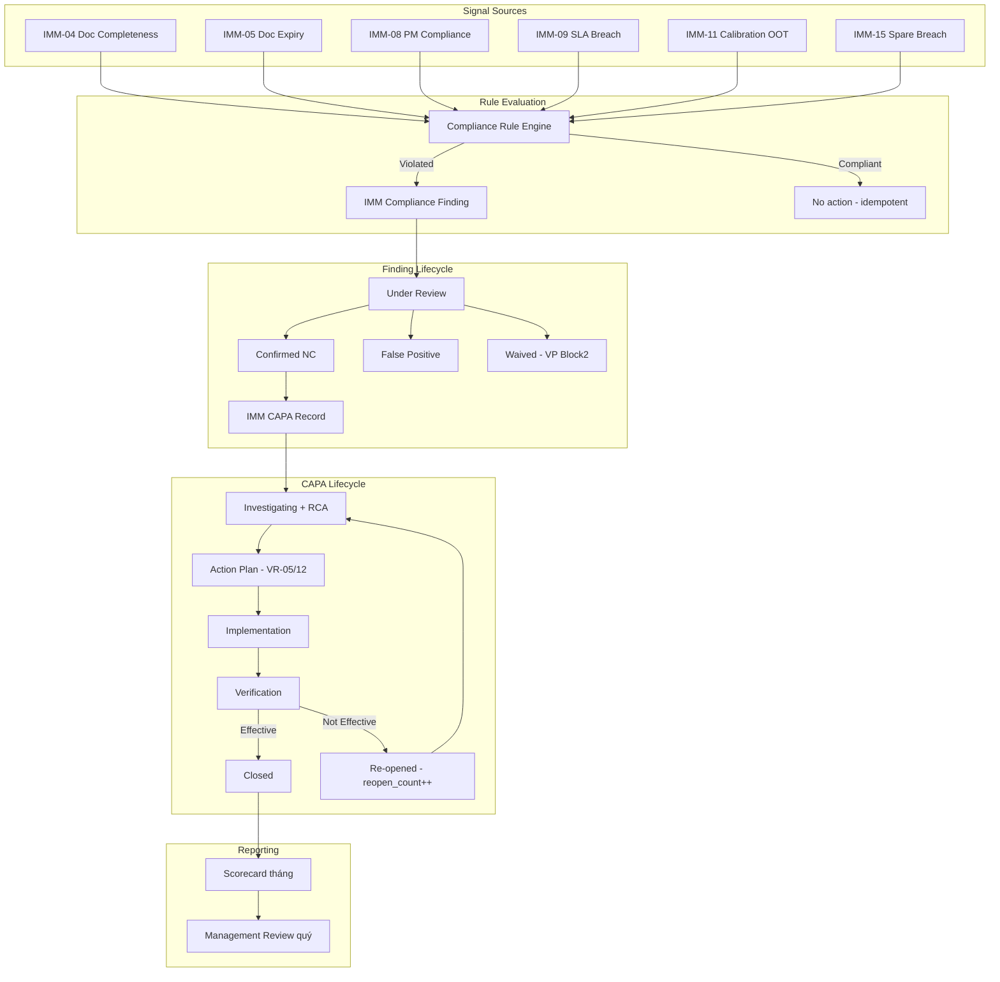

# 02 — Phân tích thiết kế nghiệp vụ — IMM-16 Compliance Monitoring & CAPA

| Mục | Giá trị |
|---|---|
| Module | IMM-16 — Compliance Monitoring & CAPA |
| Phạm vi | Per-module |
| Owner | BA + System Analyst |
| Liên kết | [03 Diagrams](./03_Diagrams.md) · [04 Backend](./04_Backend_Design.md) · [05 API](./05_API_Specification.md) · [06 Frontend](./06_Frontend_Design.md) |
| Chuẩn tham chiếu | ISO 13485:2016 §8.2.4, §8.5, §5.6; WHO HTM 5.4; NĐ 98/2021/NĐ-CP §35-§38 |

> ✅ Module IMPLEMENTED — Wave 2 (`services/imm16.py`, `api/imm16.py`, 11 DocType folders: compliance_rule/finding/scorecard, capa_record/action_step, internal_audit/supplier_audit, audit_checklist_item, audit_finding, management_review, scorecard rows). Cập nhật 2026-05-14.

---

# Phần I — Module Overview

## I.0. Khảo sát hiện trạng

Hiện trạng tại bệnh viện (As-Is), trước khi có AssetCore IMM-16:

- **Theo dõi tuân thủ thủ công**: Tổ HC-QLCL theo dõi compliance qua báo cáo Excel/Word định kỳ — không có rule engine, vi phạm chỉ phát hiện sau audit nội bộ hoặc khi đã có sự cố.
- **CAPA rời rạc**: Non-conformance được mở qua email/sổ tay; không có SLA, không escalation tự động khi quá hạn; effectiveness check không bắt buộc → CAPA "đóng trên giấy" nhưng vấn đề tái diễn.
- **Internal Audit thiếu chuẩn hóa**: Audit theo ISO 13485 §8.2.4 thực hiện 1–2 lần/năm bằng checklist Word; Major NC không bắt buộc link CAPA; finding bị bỏ sót giữa các kỳ audit.
- **Không có Compliance Scorecard**: Không có chỉ số tổng hợp tháng/quý cho từng module/khoa → Lãnh đạo không thấy được trend, không biết khoa nào "nóng".
- **Management Review hình thức**: Theo ISO 13485 §5.6 phải có MR quý nhưng hiện chỉ có biên bản Word, không link Scorecard/CAPA, không có gate "MR missed → block scorecard publish".
- **Audit trail phân tán**: Hồ sơ NC/CAPA lưu nhiều nơi (mạng nội bộ, email, sổ tay) — không đáp ứng NĐ 98/2021 §35-§38 yêu cầu data retention 10 năm có truy nguyên.

Tham chiếu chéo: WHO HTM §5.4 (Quality Management) mô tả pattern này phổ biến tại các cơ sở y tế chưa có CMMS/IMMIS — cần tự động hoá rule + scorecard + MR loop để đạt continual improvement.

## I.1. Pitch

Bệnh viện hiện thiếu cơ chế tổng hợp và theo dõi tuân thủ nội bộ một cách có hệ thống — PM compliance thấp ở khoa ICU không được cảnh báo tự động, CAPA mở quá hạn không được leo thang đúng cấp, và Management Review theo ISO 13485 §5.6 không có hồ sơ chuẩn hóa. IMM-16 là **Compliance & CAPA Backbone** của AssetCore: tổng hợp tín hiệu tuân thủ từ mọi module IMM (IMM-04 đến IMM-15), tự động phát hiện non-conformance qua rule engine, quản lý vòng đời CAPA trên nền `IMM CAPA Record` đã LIVE, sinh Compliance Scorecard tháng và phục vụ Management Review quý theo ISO 13485 §5.6. Mục tiêu: overall compliance score ≥ 90%, CAPA overdue rate ≤ 5%, Management Review hàng quý đúng chu kỳ.

## I.2. Vị trí trong WHO HTM lifecycle

| Phase | Chạm? | Ghi chú |
|---|---|---|
| Needs | ✅ | BR từ needs assessment |
| Procurement | ✅ | Supplier qualification audit (cross-link IMM-03) |
| Installation | ✅ | IMM-04 doc completeness → Compliance Finding |
| Operation | ✅ **chính** | PM/Calibration/SLA compliance → Findings; Work Order gate |
| Maintenance | ✅ **chính** | IMM-08/09/11/12 signal feed; CAPA lifecycle |
| Decommission | ✅ | Block decommission nếu CAPA/Audit open (IMM-13/14) |

Input: Tín hiệu tuân thủ từ IMM-04/05/06/08/09/10/11/12/15.
Output: Compliance Finding, CAPA Record lifecycle, Scorecard tháng, Management Review quý, compliance gate cho IMM-08/09/13/14.

## I.3. Stakeholders & Actors

> **Roles ánh xạ vào 30-role catalog** (post-patch `v3_2.001_module_role_redesign`). Persona nghiệp vụ (Tổ HC-QLCL, VP Block2, Workshop Head, Internal Auditor) được giữ ở cột "Persona thực địa" để BA dễ đối chiếu, role hệ thống cấp quyền lấy từ `assetcore/fixtures/role.json`.

| Role hệ thống (30-role catalog) | Persona thực địa | Quan tâm chính | Tần suất | Loại |
|---|---|---|---|---|
| **Compliance Manager** | Tổ HC-QLCL / QA Lead | Rule config, Finding triage, CAPA oversight, Scorecard publish, Audit lead, MR finalize, Waive Finding | Daily | Primary |
| **Compliance User** | Internal Auditor / khoa phòng | Checklist audit, raise NC, tạo CAPA cấp khoa, action owner | Per audit / Daily | Primary |
| **Corrective Manager** (IMM-09) | Workshop Head / Trưởng phân xưởng | Action owner xưởng, theo dõi CAPA mức xưởng, escalation Level 2 | Daily | Secondary |
| **Corrective User** (IMM-09) | Biomed Engineer / HTM Technician | Thực hiện CAPA action step kỹ thuật | Per step | Secondary |
| **PM User** (IMM-08) | KTV PM | Bị block WO khi asset có CAPA Critical (BR-16-09) | Daily | Consumer |
| **AssetCore Auditor** | Auditor QMS | Read-only audit trail, immutability, traceability NĐ98 | Monthly | Auditor |
| **AssetCore Super Admin** | CMMS Admin / IT | Full admin, override, scheduler giám sát | Ad-hoc | System Admin |
| **AssetCore System User** | Mọi nhân viên đăng nhập | Xem Dashboard, Heatmap (read-only) | Weekly | Stakeholder |
| System (Scheduler) | Frappe Scheduler | Auto-eval rule, scorecard, escalation | Auto | System |

## I.4. Scope

**In-scope:**

| # | Chức năng |
|---|---|
| F-01 | Compliance Rule Engine (declarative, versioned, change control) |
| F-02 | Auto Compliance Evaluation (scheduler idempotent upsert Finding) |
| F-03 | Manual Finding Entry |
| F-04 | Internal Audit Cycle (Plan → Checklist → Finding → Reporting → Close) |
| F-05 | NC / CAPA Lifecycle (extend `IMM CAPA Record` workflow sub-states) |
| F-06 | Root Cause Analysis (reuse `IMM RCA Record` LIVE) |
| F-07 | CAPA Effectiveness Check + Re-open nếu Not Effective |
| F-08 | Compliance Scorecard tháng (immutable sau publish) |
| F-09 | Management Review quý (ISO 13485 §5.6) |
| F-10 | Compliance Heatmap (Module × Department matrix) |
| F-11 | Cross-module Gate IMM-08/09 (BR-16-09 block WO Submit) |
| F-12 | Waiver Process (VP Block2 approval + expiry) |
| F-13 | Audit Trail bắt buộc (hash chain `IMM Audit Trail` LIVE) |
| F-14 | Escalation Matrix (CAPA quá hạn → email theo level) |
| F-15 | Integration ingestion (IMM-04/05/06/08/09/10/11/12/15) |

**Out-of-scope:**

| # | Chức năng | Module phụ trách |
|---|---|---|
| 1 | Quản lý hồ sơ tài liệu thiết bị | IMM-05 |
| 2 | Lịch PM, Calibration | IMM-08, IMM-11 |
| 3 | Vendor recall / FSCA / vigilance | IMM-10 (external) |
| 4 | Vendor-side audit (`IMM Supplier Audit` LIVE) | IMM-03 |
| 5 | RCA infrastructure (5-Why, Fishbone modeling) | IMM-12 (đã LIVE qua `IMM RCA Record`) |
| 6 | Predictive analytics | IMM-17 |
| 7 | Electronic signature pháp lý | v2.0 (FDA 21 CFR Part 11) |
| 8 | External regulator submission | Phase 2 |

**Dependencies:**

- IMM-00 Foundation: `IMM CAPA Record` LIVE, `IMM Audit Trail` LIVE, `IMM RCA Record` LIVE, `services/imm00.py` LIVE
- IMM-04/05/06/08/09/10/11/12/15: signal sources
- IMM-08/09: compliance gate injection point (hooks trong `services/imm08.py`, `services/imm09.py`)
- IMM-13/14: decommission gate consumer

## I.5. KPI mục tiêu

| KPI | Định nghĩa | Baseline | Target | Đo ở đâu |
|---|---|---|---|---|
| Overall Compliance Score | % rules evaluated không vi phạm | N/A | ≥ 90% | `get_dashboard_stats` |
| CAPA Overdue Rate | % CAPA quá hạn / tổng CAPA mở | N/A | ≤ 5% | `get_capa_aging` |
| Findings Critical Open | Số Finding severity=Critical chưa close | N/A | = 0 | Dashboard KPI card |
| Management Review Compliance | Mỗi quý ≥ 1 MR Closed | N/A | 100% | `check_management_review_due` |
| CAPA Effectiveness Rate | % CAPA close với effectiveness=Effective | N/A | ≥ 85% | `get_dashboard_stats` |
| Rule Evaluation Coverage | % active rules chạy đúng chu kỳ | N/A | 100% | `run_compliance_evaluation` |

## I.6. Ràng buộc Compliance

| Quy định | Yêu cầu áp lên module | Doc tham chiếu |
|---|---|---|
| ISO 13485:2016 §8.2.4 | Internal Audit bắt buộc + checklist + CAPA link cho Major NC | PR-IMMIS-16-01 |
| ISO 13485:2016 §8.5 | CAPA toàn vòng đời: root cause → action plan → verification | PR-IMMIS-16-02 |
| ISO 13485:2016 §5.6 | Management Review quý + input/output + minutes | PR-IMMIS-16-03 |
| WHO HTM 5.4 | Quality Management — internal governance & continual improvement | — |
| NĐ 98/2021 §35-§38 | Mọi NC/CAPA có hồ sơ; data retention ≥ 10 năm | Điều 35-38 |
| ISO 14971 (via QMS) | Risk-based prioritization cho CAPA (imm_risk_level field) | — |

Tham chiếu QMS artifact (Architecture line ~398–402): bộ tài liệu IMMIS-16 gồm `PR-IMMIS-16-01..04`, `WI-IMMIS-16-01..05`, `BM-IMMIS-16-01`, `HS-LOG/REC/REP-IMMIS-16-*`, `KPI-DASH-IMMIS-16` — chủ sở hữu Tổ HC-QLCL & Risk + CMMS/IMMIS + PTP1/PTP2; lưu tại `QMS điện tử/IMMIS/16-*` và `BI/IMMIS`. Chi tiết QMS doc tree dùng `docs/ba/Phase_05_QMS_Governance_Design/` (đặc biệt `03_CAPA_Workflow_Spec`, `07_Management_Review_Spec`, `09_Internal_Audit_Plan_Checklist`).

## I.7. Risk & Open questions

| ID | Risk / Open question | Mức | Mitigation / Owner |
|---|---|---|---|
| RQ-16-01 | Rule Engine quá nhạy → flood Finding (false positive) làm Tổ HC-QLCL ngợp | Cao | VR-01 enforce threshold rõ; cycle pilot 1 quý + tinh chỉnh; whitelist khoa pilot trước. Owner: Tổ HC-QLCL |
| RQ-16-02 | Cross-module gate BR-16-09 block nhầm WO khẩn cấp khi asset có CAPA Critical | Cao | Cho phép VP Block2 override + log audit trail; 4 ô SLA escalation. Owner: PTP Khối 2 |
| RQ-16-03 | Backwards compatibility với CAPA Record dữ liệu cũ (IMM-12) khi extend workflow 6 sub-states | Trung | Migration patch idempotent; map status cũ → workflow_state mới; smoke test trên dữ liệu staging. Owner: CMMS Admin |
| RQ-16-04 | Scorecard immutability bị bypass qua sửa DB trực tiếp | Trung | DB-level guard + controller `validate()` + Frappe Version + `IMM Audit Trail` hash chain. Owner: CMMS Admin |
| RQ-16-05 | Management Review quý bị missed → block toàn bộ scorecard publish quý sau (cascade) | Trung | Email reminder 14/7/3 ngày trước hạn quý; VP Block2 escalation. Owner: VP Block2 |
| RQ-16-06 | Phụ thuộc nhiều module signal source (IMM-04/05/08/09/11/15) — module thượng nguồn chậm Wave làm IMM-16 không có data | Trung | Plug-and-play ingestion: rule chỉ activate khi source module ready; hiển thị "no data" thay vì lỗi. Owner: Tech Lead |
| RQ-16-07 | i18n error message chưa đầy đủ tiếng Việt cho 12 VR | Thấp | Sprint post-Wave: rà soát toàn bộ `frappe._()` trong service. Owner: BA |
| RQ-16-08 | Electronic signature pháp lý (FDA 21 CFR Part 11) chưa có → ảnh hưởng audit quốc tế | Thấp | Đẩy v2.0; hiện dùng Frappe user + IP + timestamp đủ NĐ 98. Owner: Tech Lead |

*Mức risk được cập nhật mỗi sprint review. RACI risk owner sẽ chuyển trạng thái Open → Mitigated → Closed sau khi controls active.*

## I.8. Roadmap thực thi

| Sprint | Scope | Deliverable | Phụ thuộc |
|---|---|---|---|
| Đợt 2 — Sprint 1 | DocType scaffold | `IMM Compliance Rule`, `IMM Compliance Finding`, `IMM Internal Audit`, `IMM Compliance Scorecard`, `IMM Management Review` (5 DocType PLANNED) + extend `IMM CAPA Record` workflow 6 sub-states | IMM-00 LIVE |
| Đợt 2 — Sprint 2 | Service layer 3-tier | `services/imm16_rule.py`, `imm16_finding.py`, `imm16_capa.py`, `imm16_audit.py`, `imm16_scorecard.py`, `imm16_mr.py` + repository split | DocType ready |
| Đợt 2 — Sprint 3 | Scheduler + Cross-module gate | `run_compliance_evaluation`, `update_compliance_scorecard`, `check_capa_due_imm16`, `check_audit_milestones`, `check_management_review_due` + hook BR-16-09 vào `services/imm08.py` + `services/imm09.py` | Service ready, IMM-08/09 LIVE |
| Đợt 2 — Sprint 4 | API + FE Sitemap | 30 endpoints `assetcore.api.imm16.*` + Pinia store + 15 routes (Rule list, Finding workbench, CAPA detail, Audit cycle, Scorecard, MR, Heatmap) | Service ready |
| Đợt 2 — Sprint 5 | UAT + Hardening | UAT-IMM16-01..12 pass; STRIDE security review; load test 50k findings; documentation cuối | All above |
| Đợt 2 — Release | Go-live pilot | Pilot 2 khoa (ICU, OR) trước; production toàn viện sau 1 tháng pilot | UAT pass |
| v2.0 (sau go-live) | Predictive + e-Signature | ML-driven rule suggestion (cross-link IMM-17); FDA 21 CFR Part 11 e-sig | IMM-17 ready |

Phụ thuộc liên module (đọc cùng `assetcore-integration-patterns`): IMM-16 ingest từ 9 module thượng nguồn + inject gate vào IMM-08/09/13/14. Bất kỳ thay đổi schema/API ở các module nguồn phải báo cho Owner IMM-16 trước 1 sprint.

---

# Phần II — Quy trình nghiệp vụ (BPMN)

## II.1. As-Is process

Tổ HC-QLCL hiện theo dõi compliance thủ công qua báo cáo Excel định kỳ — không có cơ chế tự động phát hiện vi phạm, CAPA được quản lý rời rạc qua email/sổ tay, không có Scorecard chuẩn hóa. Management Review có biên bản Word nhưng không liên kết với CAPA hay Scorecard.

## II.2. Pain points

| # | Pain | Tác động |
|---|---|---|
| 1 | Không có rule engine tự động → tuân thủ kiểm tra thủ công, bỏ sót | Vi phạm không phát hiện kịp, rủi ro kiểm định |
| 2 | CAPA quản lý trong Excel → không có SLA, không escalation | CAPA quá hạn không được xử lý |
| 3 | Internal Audit không có checklist chuẩn → finding bị bỏ sót | ISO 13485 §8.2.4 không được đáp ứng đầy đủ |
| 4 | Scorecard không tồn tại → không biết compliance trend | Không cải tiến có cơ sở |
| 5 | Management Review không link với CAPA/Scorecard → không đầy đủ |  NĐ98 §35-38 không compliance |

## II.3. To-Be process



## II.4. Decision points

| Điểm | Câu hỏi | Quy tắc |
|---|---|---|
| Rule evaluation | Rule violated threshold? | Có → upsert Finding (idempotent) |
| Finding review | Confirmed NC hay False Positive? | Tổ HC-QLCL / Internal Auditor quyết |
| Finding waive | Có thể waive? | Chỉ VP Block2, VR-04 enforce |
| Advance CAPA to Action Plan | Root cause method chọn? | VR-05 enforce |
| Advance CAPA to Closed | Effectiveness = Effective? | VR-07 block nếu Not Effective |
| Audit close | Tất cả Major NC đã link CAPA? | VR-08 block nếu còn Major NC thiếu link |
| Publish Scorecard | Quý trước có MR Closed? | VR-10 block nếu không có MR |
| Submit WO (IMM-08/09) + Commissioning (IMM-04) | Asset có Critical CAPA mở? (SoT `is_capa_open`: status NOT IN Closed — gồm `Overdue`) | BR-16-09 block submit/commission |

## II.5. RACI matrix

| Hoạt động | QLCL | Int. Auditor | WS Head | Biomed | VP2 | Admin | System |
|---|---|---|---|---|---|---|---|
| Khai báo Rule | R/A | — | — | — | — | R/A | — |
| Đánh giá Rule | I | — | — | — | — | I | R/A |
| Tạo Finding manual | R/A | R | R | R | — | R/A | — |
| Confirm NC | R/A | R | — | — | — | R/A | — |
| Waive Finding | — | — | — | — | R/A | R/A | — |
| Plan Audit | R/A | R | — | — | — | R/A | — |
| Execute Checklist | R | R/A | — | — | — | R/A | — |
| Close Audit | R/A | — | — | — | R | R/A | — |
| CAPA Lifecycle | R/A | R | R | R | A | R/A | — |
| Publish Scorecard | R/A | — | — | — | R/A | R/A | — |
| Finalize MR | C | — | — | — | R/A | R/A | — |
| Escalation | I | — | I | — | I | I | R/A |

## II.6. Exception flows

**E1 — CAPA Re-open (Not Effective):**
Sau effectiveness check = Not Effective → `imm_reopen_count++`, `workflow_state = Re-opened → Investigating` → CAPA quay lại vòng phân tích root cause. BR-16-03 enforce VR-07.

**E2 — Audit close bị block (Major NC chưa CAPA):**
VR-08 block close_audit nếu còn Audit Finding row severity=Major chưa có `imm_capa_link`. Auditor phải link CAPA trước.

**E3 — Scorecard publish bị block (thiếu MR):**
VR-10 block publish nếu quý trước không có Management Review status=Closed. VP Block2 phải tạo và finalize MR quý trước.

---

# Phần III — Use Case Specification

## III.0. Use Case Diagram

> Note: section bổ sung light-touch để khớp template §III.1 (UC Diagram). Numbering của các sub-section dưới giữ nguyên (Actor catalog vẫn ở III.1, Use Case Specifications ở III.2) — xem `_REPORT.md` trong cùng thư mục để biết khuyến nghị chuẩn hoá numbering trong sprint sau.

### III.0.a. Biểu đồ use case tổng quát


### III.0.b. Phân rã theo nhóm chức năng

| Nhóm | Use Cases | Actor chính |
|---|---|---|
| Rule Management | US-16-01 | Tổ HC-QLCL |
| Finding Lifecycle | US-16-02, US-16-03, US-16-07 | Scheduler, Tổ HC-QLCL, VP Block2 |
| CAPA Lifecycle | US-16-03, US-16-04 | Tổ HC-QLCL, Workshop Head, Biomed |
| Audit Cycle | US-16-05 | Internal Auditor |
| Reporting & Governance | US-16-06, US-16-09, US-16-10 | Scheduler, VP Block2 |
| Cross-module Gate | US-16-08 | Scheduler / Service validator |

## III.1. Actor catalog

| Actor | Loại | Mô tả | Goal chính |
|---|---|---|---|
| Tổ HC-QLCL | Primary | Full owner của compliance module | Rule → Finding → CAPA → Scorecard |
| Internal Auditor | Primary | Thực hiện checklist audit | Ghi NC, raise Finding |
| Workshop Head | Secondary | Action owner cấp xưởng | Thực hiện CAPA, theo dõi escalation |
| VP Block2 | Approver | Phê duyệt waiver, close audit, sign Scorecard, chair MR | Governance cuối cùng |
| Scheduler | System | Frappe scheduler | Auto eval rule, scorecard, escalation |
| Auditor QMS | Auditor | Kiểm tra audit trail | Traceability + immutability |

## III.2. Use Case Specifications

### US-16-01 — Khai báo Compliance Rule

```gherkin
As Tổ HC-QLCL,
I want khai báo 1 rule mới (source IMM-08, threshold PM compliance < 90%),
So that hệ thống tự động đánh giá định kỳ.

Scenario: Tạo rule hợp lệ
  Given tôi có role Tổ HC-QLCL
  When tôi POST /api/method/assetcore.api.imm16.create_rule với
    {rule_code: "R-IMM08-PM-COMP-90",
     source_module: "IMM-08",
     category: "PM",
     severity: "High",
     threshold_definition: {"metric":"pm_compliance_pct","op":"<","value":90},
     evaluation_frequency: "Monthly",
     owner_role: "Workshop Head"}
  Then response.success = true
  And rule.is_active = 1
  And rule.version = "1.0"

Scenario: Threshold JSON không hợp lệ (VR-01)
  When threshold_definition thiếu key "metric"
  Then response.success = false
  And response.code = "VALIDATION_ERROR"
  And response.error contains "VR-01: Threshold rule không hợp lệ"
```

### US-16-02 — Auto-detect Finding qua scheduler

```gherkin
As System,
When scheduler run_compliance_evaluation chạy theo frequency của rule,
I evaluate rule và upsert Finding nếu vi phạm threshold.

Scenario: PM compliance khoa ICU = 78% (< 90%)
  Given rule R-IMM08-PM-COMP-90 active, frequency=Monthly
  When scheduler evaluation kích hoạt vào ngày 1 tháng
  Then sinh IMM Compliance Finding với
    severity="High", current_value=78, threshold_value=90,
    source_record="department:ICU", status="Open"
  And idempotent: chạy lại cùng ngày không tạo bản ghi mới
```

### US-16-03 — Confirm NC & open CAPA Record

```gherkin
As Tổ HC-QLCL,
When Finding ở Under Review,
I confirm là NC và mở CAPA Record.

Scenario: Open CAPA từ Finding
  Given finding ở "Under Review" với severity="High"
  When POST confirm_finding(name) → status "Confirmed NC"
  And POST link_to_capa(finding) → tạo IMM CAPA Record mới (imm00.create_capa)
  Then capa.source_type="Compliance Finding"
  And capa.imm_compliance_finding_ref=finding.name
  And finding.capa_ref=capa.name
  And finding.status="Resolved" sau khi capa.status="Closed"
```

### US-16-04 — Effectiveness check & Re-open

```gherkin
As Tổ HC-QLCL,
When CAPA Record ở workflow_state "Verification",
I run effectiveness check sau N tuần monitoring.

Scenario: Effective → Close
  Given capa workflow_state="Verification"
  When POST perform_effectiveness_check(name, result="Effective", evidence)
  Then capa.status="Closed", workflow_state="Closed"
  And effectiveness_check="Effective"

Scenario: Not Effective → Re-open
  When POST perform_effectiveness_check(name, result="Not Effective", evidence)
  Then capa.status="In Progress", workflow_state="Investigating"
  And capa.imm_reopen_count += 1
  And BR-16-03 throw nếu cố Close mà chưa Effective
```

### US-16-05 — Internal Audit cycle

```gherkin
As Lead Auditor,
I plan và execute internal audit cho scope đã định.

Scenario: Plan audit
  Given audit_code="A-2026-Q2-MAINT", scope_modules=[IMM-08, IMM-11]
  When POST create_audit({...})
  Then audit.status="Planned"
  And scheduler check_audit_milestones cảnh báo 7 ngày trước planned_start

Scenario: Execute checklist + ghi Audit Finding
  Given audit ở "In Progress"
  When complete_audit_checklist với 1 item finding_status="Major NC"
  Then sinh IMM Compliance Finding tự động
  And ghi 1 row Audit Finding với severity=Major, imm_finding_link=finding.name

Scenario: Complete checklist → chuyển Reporting (khôi phục state chết)
  Given audit ở "In Progress"
  When complete_audit_checklist(items)
  Then audit.status="Reporting"   # KHÔNG còn kẹt In Progress
  And ghi ĐÚNG 1 audit-event event_type="audit_checklist_completed"

Scenario: Verdict từng mục round-trip (CR-27b — silent-verdict-loss)
  Given audit ở "In Progress" có checklist_items
  When complete_audit_checklist(items=[{idx:1, finding_status:"Compliant"},
                                       {idx:2, finding_status:"Major NC"},
                                       {idx:3, finding_status:"N/A"}])
  And re-fetch get_audit(audit)
  Then checklist_items[idx=1].result == "Conforming"       # KHÔNG rỗng
  And  checklist_items[idx=2].result == "Non-Conforming"
  And  checklist_items[idx=3].result == "Not Applicable"
  # Trước fix: LUÔN rỗng (assign child.finding_status/clause_ref là no-op câm)

Scenario: finding_status lạ/thiếu → giữ nguyên result cũ (không set giá trị lạ)
  Given item idx=1 đã có result="Conforming"
  When complete_audit_checklist(items=[{idx:1, finding_status:"???"}])
  Then checklist_items[idx=1].result vẫn == "Conforming"   # KHÔNG overwrite bằng rác

Scenario: Complete checklist bị chặn khi chưa Bắt đầu
  Given audit ở "Planned"   # chưa start
  When complete_audit_checklist(items)
  Then BAD_STATE — không cho nhập bảng kiểm (bỏ nhánh PLANNED)

Scenario: Close audit — chặn jump-skip (chưa Reporting)
  Given audit ở "Planned" HOẶC "In Progress"
  When close_audit(name)
  Then BAD_STATE "Audit phải ở trạng thái Reporting trước khi đóng"

Scenario: Close audit — block Major NC chưa CAPA
  Given audit ở "Reporting", có 1 Major NC chưa có imm_capa_link
  When close_audit(name)
  Then VR-08 throw "Còn 1 Major NC chưa mở CAPA" (BR-16-04, FIN-008)

Scenario: get_audit trả CTA-hint server-driven
  Given audit ở <status>
  When GET get_audit(name)
  Then allowed_transitions == {Planned:['start'], In Progress:['complete_checklist'],
       Reporting:['close'], Closed:[], (rỗng/lạ):[]}[status]
  And can_operate == rbac.can('compliance.write')
  And can_close == rbac.can('compliance.submit')

Scenario: get_capa trả CTA-hint server-driven (ADR-IMM-16-03)
  Given CAPA ở workflow_state <ws>, caller có compliance.write
  When GET get_capa(name)
  Then allowed_transitions == sorted(_CAPA_TRANSITIONS[<ws>])   # Open:['Investigating'],
       # Investigating:['Action Plan'], Action Plan:['Implementation'],
       # Implementation:['Verification'], Verification:['Closed','Re-opened'],
       # Re-opened:['Investigating'], Closed:[]
  And can_advance == True

Scenario: get_capa — caller KHÔNG có compliance.write
  Given CAPA ở workflow_state bất kỳ, caller thiếu compliance.write
  When GET get_capa(name)
  Then allowed_transitions == []   # gate quyền dồn vào hint
  And can_advance == False

Scenario: Bất biến parity emit ⊆ guard (test khóa)
  Given CAPA ở workflow_state <ws>, caller có compliance.write
  When với mỗi T ∈ get_capa(name).allowed_transitions: advance_capa_state(name, T)
  Then KHÔNG raise INVALID_STATE "Không thể chuyển từ <ws> sang T"
  # (có thể raise validation downstream VR-05/VR-12… — KHÔNG phải lỗi state-machine)

Scenario: Mỗi thao tác vòng đời ghi ĐÚNG 1 audit-event
  Given đếm IMM Audit Trail của audit = N
  When start_audit → +1 (audit_started); complete_audit_checklist → +1 (audit_checklist_completed);
       close_audit → +1 (audit_closed)
  Then đếm tăng đúng 1 mỗi thao tác (CLAUDE.md §5, NĐ98)

Scenario: get_management_review trả CTA-hint server-driven (ADR-IMM-16-04)
  Given MR ở status <status>
  When GET get_management_review(name)
  Then allowed_transitions == sorted(_MR_TRANSITIONS.get(<status>, []))
       # Draft:['Held'], Held:['Minutes Approved'], Minutes Approved:['Closed'],
       # Closed/lạ:[]  (safe-default .get — KHÔNG KeyError)
  And can_advance == rbac.can('compliance.submit')
  And can_close  == rbac.can('compliance.submit')

Scenario: QTV (AssetCore Super Admin) duyệt + đóng MR được (root-cause "không duyệt được dù đủ quyền")
  Given user CHỈ mang role 'AssetCore Super Admin' (⇒ has_permission('IMM CAPA Record','submit')=True ⇒ rbac.can('compliance.submit')=True)
  When advance_mr_state(Draft→Held) rồi advance_mr_state(Held→Minutes Approved)
  Then cả hai OK (KHÔNG FORBIDDEN); và Frappe workflow-engine "IMM-16 Management Review Workflow" cho phép AssetCore Super Admin ở 3 transition (fixtures/workflow.json)
  When finalize_management_review(Minutes Approved→Closed, minutes_doc, output_actions)
  Then MR Closed OK (workflow transition 'Đóng' allow AssetCore Super Admin)

Scenario: Bất biến parity emit ⊆ guard cho MR (test khóa)
  Given MR ở status <status>
  When target ∈ get_management_review(name).allowed_transitions
  Then nếu target=='Closed' → finalize_management_review chấp nhận (không INVALID_STATE);
       else advance_mr_state(name, target) KHÔNG raise INVALID_STATE
  And target NGOÀI _MR_TRANSITIONS[<status>] → advance_mr_state reject INVALID_STATE
```

### US-16-06 — Compliance Scorecard sinh tự động

```gherkin
As System,
On 1st of month at 03:00,
I aggregate findings tháng trước và sinh Scorecard Draft.

Scenario: Sinh scorecard tháng (BR-16-11 — chỉ tính finding ĐÃ phân định)
  Given findings tháng 4/2026 (sau khi loại False Positive):
    | adjudicated-compliant (Resolved/Waived/Closed) | 90 |
    | non_compliant (Confirmed NC)                   | 18 |
    | pending (Open/Under Review — CHƯA phân định)   | 12 |
  When scheduler update_compliance_scorecard chạy
  Then sinh IMM Compliance Scorecard {period_year:2026, period_month:4}
  # mẫu số = chỉ finding ĐÃ adjudicated = 90 + 18 = 108 (pending KHÔNG vào mẫu số)
  And score_pct = compliant / (compliant + non_compliant) * 100
                = 90 / (90 + 18) * 100 = 83.33%
  And compliant_count = 90, non_compliant_count = 18, pending_count = 12
  And status="Draft", is_published=0

Scenario: Publish scorecard
  Given scorecard "Draft"
  When VP Block2 POST publish_scorecard(name)
  Then is_published=1
  And BR-16-07: sửa scorecard sau publish → VR-09 throw
```

### US-16-07 — Waive Finding (BR-16-06)

```gherkin
As VP Block2,
When 1 Finding hợp lý không cần CAPA,
I waive với reason + expiry.

Scenario: Waive thành công
  Given finding "Under Review", role=VP Block2
  When POST waive_finding(name, waiver_reason≥50chars, evidence, expiry>today)
  Then finding.status="Waived"

Scenario: Block waive nếu không phải VP Block2
  Given role=Workshop Head
  When POST waive_finding(...)
  Then response.code="FORBIDDEN"
```

### US-16-08 — Gate IMM-08/09 (BR-16-09)

```gherkin
As IMM-08/09 service validator,
Before submitting Work Order on asset,
I check IMM-16 compliance status.

Scenario: Asset có CAPA Critical OPEN
  Given asset AC-ASSET-2026-0001 có CAPA với imm_risk_level="Critical", status="In Progress"
  When WO validate gọi gate_wo_submit → check_asset_compliance_status(asset)
  Then response = {blocked: true, reasons[0]={ref:"CAPA-2026-00007", status:"In Progress"}}
  And WO submit bị frappe.throw: "...có CAPA Critical đang mở... (BR-16-09)"

Scenario: INVARIANT dưới cron — Critical CAPA flip Open→Overdue VẪN block
  Given asset A có 1 CAPA imm_risk_level="Critical", status="Open" (due_date < today)
  And check_asset_compliance_status(A).blocked == True   # trước cron
  When scheduler check_capa_overdue() flip status A → "Overdue"
  Then check_asset_compliance_status(A).blocked VẪN == True  # byte-for-byte cùng tập SoT
  And reasons[0].status == "Overdue"                          # status thật, không nuốt
  And gate_wo_submit chặn WO submit (frappe.throw)            # hiện KHÔNG chặn = lỗ phải vá

Scenario: Closed → true-negative (không chặn)
  Given asset B chỉ có CAPA Critical status="Closed"
  Then check_asset_compliance_status(B).blocked == False

Scenario: Non-Critical Overdue → KHÔNG chặn (imm_risk_level filter giữ nguyên)
  Given asset C có CAPA imm_risk_level="High", status="Overdue"
  Then check_asset_compliance_status(C).blocked == False

Scenario: FE pre-flight banner (PMWorkOrderCreateView — IMM-08) — cảnh báo SỚM, parity với gate
  Given user mở form tạo phiếu PM đột xuất
  When user chọn asset AC-ASSET-2026-0001 (có CAPA Critical OPEN)
  Then FE gọi imm16.ts::checkAssetComplianceStatus → canonical endpoint check_asset_compliance_status
  And banner cảnh báo HIỆN NGAY sau panel assetMeta (role=alert, aria-live=assertive, severity=warning)
       TRƯỚC khi user soạn xong form — KHÔNG đợi submit mới frappe.throw
  And banner liệt kê reasons[] verbatim: "CAPA-2026-00007 — Quá hạn" (status dịch qua translateStatus SSoT, 0 English leak)
  And nút "Tạo lệnh" disable (hoặc reactive-throw lúc submit nhưng banner đã cảnh báo)
  And gateResult.blocked (FE) === blocked do check_asset_compliance_status trả (parity, KHÔNG inline-compute ở FE)

Scenario: asset không block / rỗng / fetch lỗi → banner ẩn (fail-safe)
  Given asset không có Critical CAPA mở (blocked=false) HOẶC asset_ref rỗng HOẶC endpoint trả 403/lỗi
  Then banner ẩn, nút "Tạo lệnh" bình thường, KHÔNG blank trang (try-catch/allSettled)
```

> **Canonical endpoint (collapse Vòng 16):** chỉ CÒN 1 def delegate trực tiếp `svc.check_asset_compliance_status` = `check_asset_compliance_status` (canonical, FE imm16.ts:513 trỏ tới). `check_asset_compliance` (legacy) → alias mỏng gọi lại hàm canonical. Chi tiết §05_API_Specification.md §3.8.1.

### US-16-09 — Management Review quý

```gherkin
As VP Block2 (Chair),
Each quarter I hold Management Review per ISO 13485 §5.6.

Scenario: Tạo + finalize MR
  When POST create_management_review(...) + finalize_management_review(name, minutes_doc)
  Then MR.status="Minutes Approved" → "Closed"
  And MR.scorecard_ref link Scorecard published
  And output_actions table có items với owner + due_date

Scenario: Block KPI publish nếu missed (BR-16-08)
  Given quý 2 đã hết, không có MR
  When publish_scorecard(scorecard)
  Then throw code "MR_MISSING_QUARTERLY" (VR-10)
```

### US-16-10 — Compliance Heatmap

```gherkin
As VP Block2 / Tổ HC-QLCL,
I want xem heatmap module × department,
So that nhìn ra điểm yếu nhanh.

Acceptance:
  GET get_compliance_heatmap → matrix
  rows = modules (IMM-04..15)
  cols = departments (ICU, OR, ER, ...)
  filter kỳ = evaluation_date BETWEEN [start, end)   # BR-16-12 period-anchor canonical
                    # KHÔNG lọc detected_date — phải CÙNG field với Scorecard
  cell = score_pct  # CÙNG công thức compute_compliance_rate như Scorecard (BR-16-11)
                    # cell.score = compliant / (compliant + non_compliant) * 100
                    # pending (Open/Under Review) KHÔNG vào mẫu số của cell
  click cell → drill-down list_findings filtered
```

---

# Phần IV — Functional Requirements

## IV.1. Business Rules

| ID | Rule | Implement ở | Chuẩn |
|---|---|---|---|
| BR-16-01 | Finding severity ≥ High → mở CAPA Record trong 5 NLV | `check_capa_due` + Finding `validate()` | ISO 13485 §8.5 |
| BR-16-02 | **CAPA quá hạn → leo thang tiered ĐỘC LẬP theo effective-risk** (Vòng 13, RC-CAPA-ESC). Effective-risk SoT = `imm_risk_level` khi High/Critical, else fallback `severity`-normalized (Critical→Critical) — `severity='Critical'` escalate đúng dù `imm_risk_level` rỗng/Medium. Critical: ≥1d→Level-1 (`responsible`), ≥3d→Level-1+Level-2 (`responsible`+`Compliance Manager`). High: ≥3d→Level-2; <3d không. Medium/Low: KHÔNG escalate. Idempotent qua field `escalation_level` (cron daily KHÔNG re-send tier cũ) + 1 audit record/tier (CLAUDE.md §5). | `check_capa_due` → `_escalate_capa` / `_capa_escalation_severity` / `_record_capa_escalation` (`services/imm16.py`); field `escalation_level` (IMM CAPA Record) | Internal · NĐ98 Art.67 · ISO 13485 §8.5.2 |
| BR-16-03 | CAPA Close chỉ khi `effectiveness_check=Effective`; Not Effective → Re-open + `imm_reopen_count++` | CAPA Record `validate()` via doc_events | ISO 13485 §8.5 |
| BR-16-04 | Audit Major NC → CAPA Record + change control link nếu thay đổi master/process | `close_audit` validator VR-08 | ISO 13485 §8.2.4 |
| BR-16-05 | Compliance Rule thay đổi threshold/severity → change control versioned | Rule controller `before_save` VR-11 | ISO 13485 §4.2 |
| BR-16-06 | Waiver chỉ VP Block2 + reason ≥ 50 chars + evidence + expiry | `waive_finding` API role check VR-04 | Internal |
| BR-16-07 | Scorecard published immutable; sửa → tạo restate phiên bản mới | Scorecard `validate()` VR-09 | ISO 13485 §4.2 |
| BR-16-08 | Mỗi quý ≥1 Management Review; missed → block scorecard publish | `publish_scorecard` validator VR-10 | ISO 13485 §5.6 |
| BR-16-09 | Asset có CAPA `imm_risk_level=Critical` AND **CAPA đang mở (SoT `is_capa_open` / `_open_capa_filter`, imm00 — BR-00-15: `status NOT IN ('Closed')`)** → block WO Submit (IMM-08/09) **+ commissioning (IMM-04)**. **INVARIANT dưới cron**: `'Overdue'` ∈ tập mở (Overdue NOT IN Closed) → 1 Critical CAPA mở chặn gate cả TRƯỚC (status `Open`) lẫn SAU khi `check_capa_overdue` flip `Open→Overdue` (byte-for-byte cùng tập, count không tụt). KHÔNG inline `status IN (Open, In Progress, Pending Verification)` (bỏ sót `Overdue` → lỗ gate). Closed → true-negative (không chặn). `reasons[].status` trả status thật (vd `'Overdue'`) — không nuốt. Non-Critical (High/Medium/Low) KHÔNG chặn dù Overdue (`imm_risk_level='Critical'` filter giữ nguyên). | `check_asset_compliance_status()` (imm16) gọi `imm00._open_capa_filter()`; wired `gate_wo_submit` validate IMM-08/09 + `services/imm04.py` commissioning gate | Internal gate · ISO 13485 §8.5.2 |
| BR-16-10 | Mọi thay đổi Finding/CAPA/Audit/Scorecard ghi `IMM Audit Trail` (hash chain) + Frappe Version. **Vòng đời Internal Audit ghi ĐÚNG 1 record/thao tác**: `start_audit`→`audit_started`, `complete_audit_checklist`→`audit_checklist_completed`, `close_audit`→`audit_closed` (mỗi record `asset=''`, `ref_doctype='IMM Internal Audit'`, `ref_name`, `from_status`/`to_status`). | `track_changes=1` + `utils.lifecycle.log_audit_event` | NĐ 98 · CLAUDE.md §5 |
| BR-16-11 | Compliance-rate chỉ tính trên finding ĐÃ phân định (adjudicated). `compliant` = Resolved/Waived/Closed; `non_compliant` = Confirmed NC; `pending` = Open/Under Review → KHÔNG vào mẫu số. False Positive đã loại từ filter. `score_pct = round(compliant/(compliant+non_compliant)*100, 2)`; nếu adjudicated=0 → 100.0. Scorecard + Heatmap CÙNG gọi 1 SoT `compute_compliance_rate()` (không nhân bản công thức inline). | `services/imm16.py::compute_compliance_rate()` gọi bởi `generate_scorecard()` + `get_compliance_heatmap()` | ISO 13485 §8.4 (data analysis) |
| BR-16-13 | **Verdict từng mục checklist persist QUA `result` (round-trip) — CR-27b.** `complete_audit_checklist` map DTO `finding_status` → child `result` bằng SSoT `_FINDING_STATUS_TO_RESULT` (`Compliant→Conforming`, `Minor NC`/`Major NC`→`Non-Conforming`, `N/A→Not Applicable`); unknown/thiếu → giữ `result` cũ. Mọi value ∈ options Select `result`. Cấm assign `child.finding_status`/`child.clause_ref` (field không tồn tại → no-op câm → verdict mất). Re-fetch `get_audit` PHẢI trả `checklist_items[i].result` = giá trị map (KHÔNG rỗng). | `services/imm16.py::complete_audit_checklist` + dict `_FINDING_STATUS_TO_RESULT`; child `imm_audit_checklist_item.result` | ISO 13485 §8.2.4 (internal audit records) |
| BR-16-12 | **Period-anchor canonical = `evaluation_date`.** MỌI view lọc finding theo kỳ (YYYY-MM) PHẢI lọc trên `evaluation_date` — KHÔNG dùng `detected_date`. Lý do: `evaluation_date` (Date) là ngày assessment khớp chu kỳ review tháng của Scorecard VÀ là thành phần khóa idempotency `(rule, source_record, evaluation_date)` = định nghĩa hệ thống "finding thuộc kỳ nào"; `detected_date` (Datetime) là event-timestamp có thể lệch kỳ do lag adjudication (vd phát hiện T2, đánh giá/xác nhận T3). Hệ quả nếu vi phạm: Scorecard và Heatmap cùng module/kỳ chọn 2 TẬP finding KHÁC nhau → `score_pct` lệch, vi phạm BR-16-11 ("CÙNG dataset CÙNG 1 score"). | `services/imm16.py::generate_scorecard()` (đã đúng `evaluation_date`) + `get_compliance_heatmap()` (PHẢI đổi từ `detected_date` → `evaluation_date`) | ISO 13485 §8.4 |

## IV.2. Validation Rules

| VR ID | Field / Trigger | Rule | Error Message |
|---|---|---|---|
| VR-01 | Rule.threshold_definition | JSON valid + `metric/op/value` mandatory | "VR-01: Threshold rule không hợp lệ. Cần `metric`, `op`, `value`." |
| VR-02 | Rule.evaluation_frequency | IN (Realtime, Hourly, Daily, Weekly, Monthly, Quarterly) | "VR-02: Frequency không hợp lệ." |
| VR-03 | Finding.severity | IN (Low, Medium, High, Critical) | "VR-03: Severity không hợp lệ." |
| VR-04 | Finding waive | `waiver_reason` ≥ 50 chars + `evidence` reqd + `expiry_date > today` | "VR-04: Waiver thiếu lý do/evidence/expiry hợp lệ." |
| VR-05 | CAPA.imm_root_cause_method | IN (5-Why, Fishbone, FMEA, FTA, Other) khi advance to "Action Plan" | "VR-05: Phải chọn phương pháp phân tích root cause." |
| VR-06 | CAPA.effectiveness_check | IN (Effective, Partially Effective, Not Effective) khi → Closed | "VR-06: Effectiveness check chưa hoàn tất." |
| VR-07 | CAPA Close | `effectiveness_check == "Effective"` (BR-16-03) | "VR-07: Không thể Close khi effectiveness chưa Effective." |
| VR-08 | Audit close | Tất cả Audit Finding row severity=Major phải có `imm_capa_link` set | "VR-08: Còn {n} Major NC chưa mở CAPA." |
| VR-09 | Scorecard publish | `is_published=1` → block edit (BR-16-07) | "VR-09: Scorecard đã publish, không thể sửa. Hãy tạo restate mới." |
| VR-10 | Mgmt Review missed gate | Quý trước thiếu MR Closed → block publish scorecard quý sau | "VR-10: Quý {q} chưa có Management Review." |
| VR-11 | Rule version change | Threshold/severity thay đổi → `change_summary` reqd + version bump | "VR-11: Thay đổi rule yêu cầu Tóm tắt thay đổi (change control)." |
| VR-12 | CAPA due_date | `due_date > today` khi advance vào "Action Plan" | "VR-12: Hạn hoàn thành phải sau hôm nay." |
| VR-13 | Audit close state-guard | `close_audit` chỉ khi `status == Reporting` (chặn jump-skip từ Planned/In Progress) | "Audit phải ở trạng thái Reporting trước khi đóng." (`BAD_STATE`) |

## IV.3. State Machine — CAPA Workflow (extend IMM CAPA Record)

| workflow_state | mapped status | docstatus | Ghi chú |
|---|---|---|---|
| Open | Open | 0 | Khởi tạo |
| Investigating | In Progress | 0 | Đang RCA (link imm_rca_ref) |
| Action Plan | In Progress | 0 | RCA xong, lập kế hoạch (VR-05/12) |
| Implementation | In Progress | 0 | Đang thực thi action steps |
| Verification | Pending Verification | 0 | Đợi effectiveness_check |
| Closed | Closed | 1 | effectiveness_check=Effective (BR-16-03) |
| Re-opened | In Progress | 0 | imm_reopen_count++ (Not Effective) |

## IV.4. State Machine — Finding Workflow

| State | doc_status | Ghi chú |
|---|---|---|
| Open | 0 | Auto từ scheduler hoặc manual |
| Under Review | 0 | Triage bởi Tổ HC-QLCL |
| Confirmed NC | 0 | Xác nhận là vi phạm |
| False Positive | 0 | Không phải NC thực |
| Waived | 1 | VP Block2 approve waiver |
| Resolved | 1 | CAPA linked → Closed |
| Closed | 2 | Final |

**CTA-hint contract (server-driven, `get_finding.allowed_transitions`) — SoT cho nút màn FindingDetail:**

| `status` | `allowed_transitions` | Ghi chú |
|---|---|---|
| Open / Under Review | `[Confirmed NC, False Positive, Waived]` | 3 CTA phân định |
| Confirmed NC | `[Waived]` | + `can_create_capa` route CAPA |
| False Positive / Resolved / Waived / Closed | `[]` | terminal — 0 CTA đổi trạng thái |

> `Resolved` tới qua **auto-cascade** (CAPA Closed → Finding Resolved) + `Closed` qua **workflow-engine** — cả hai KHÔNG phải status-CTA của cán bộ ⇒ ngoài codomain `allowed_transitions`. Chi tiết map + guard: `04_Backend_Design.md §III.B.1`.

### ADR-IMM-16-01: Server-driven CTA cho FindingDetail (`allowed_transitions` + `can_create_capa`)

- **Status**: Accepted
- **Date**: 2026-07-09
- **Context**: FindingDetailView.vue gate 5 CTA (Xác nhận NC / Đánh dấu sai / Miễn áp dụng / Tạo CAPA / Liên kết CAPA) bằng so `finding.status ===` client-side (dead-gate) → desync khỏi SoT `FindingStatus`: `canConfirm=['Open','Under Review']` loại Confirmed NC dù BE `ACTIVE` gồm nó; nút Liên kết CAPA hardcode inline `status==='Confirmed NC'`. Vi phạm GATE-8/LL-FE-51 (đối xứng imm08/09/12 đã chuyển server-driven).
- **Decision**: `get_finding` emit `allowed_transitions[] = _FINDING_VALID_TRANSITIONS.get(status, [])` (map TẬP TRUNG keyed bằng `FindingStatus.*`) + cờ `can_create_capa = status=='Confirmed NC' && !capa_ref`. FE render MỖI CTA bằng `capability('compliance.write') && (allowed_transitions.includes(<đích>) | can_create_capa)` — 0 so status client-side. Guard BE (defense-in-depth) siết/thêm `BAD_STATE`: confirm/mark-false-positive ∈ `REVIEWABLE={Open,Under Review}`, waive ∈ `WAIVABLE={Open,Under Review,Confirmed NC}`.
- **Alternatives**:
  - *Đồng bộ `FindingStatus.ACTIVE` 2 phía rồi vẫn so status client-side* (theo phác thảo đề mục) — LOẠI: vẫn dead-gate, chỉ dời điểm desync; không mở rộng cho CTA khác (mark-false/waive/CAPA).
  - *Nhồi `'Closed'` vào `allowed_transitions` để đại diện eligibility CAPA* (option đề mục) — LOẠI: `Closed` KHÔNG có service-action từ Confirmed NC (dual-track, workflow-only) ⇒ hint dối; overload ngữ nghĩa transition với CAPA. Thay bằng cờ riêng `can_create_capa`.
- **Consequences**:
  - **Self-Correction map**: `Confirmed NC → ['Waived']` (KHÔNG `['Waived','Closed']` như phác thảo — xem lý do trên); `Resolved` không trong codomain (auto-cascade). Terminal → `[]`.
  - Desync đóng ở CẢ 2 tầng: display (map ⊆ guard-permitted, FE không hiện nút BE từ chối) + guard (siết `confirm_finding` ACTIVE→REVIEWABLE ⇒ confirm 1 Confirmed NC nay raise `BAD_STATE`; thêm guard cho mark-false/waive vốn thiếu). BE phải cập nhật test cũ nếu assert hành vi lỏng.
  - Đổi hiển thị có chủ đích: Waive ẩn trên `Resolved` (trước hiện); Tạo/Liên kết CAPA gate bằng `can_create_capa` thay 2 chỗ hardcode.
  - Thêm 2 field response (forward-compat optional) + 2 set `FindingStatus.REVIEWABLE/WAIVABLE`. KHÔNG migration schema, KHÔNG đổi workflow JSON.

### ADR-IMM-16-05: Finding dual-track lockstep `workflow_state ⇄ status` (đóng desync)

- **Status**: Accepted — **SUPERSEDES** mệnh đề "workflow_state là track song song decorative, service KHÔNG chạm" trong ADR-IMM-16-01 (§V.1 note). ADR-IMM-16-01 phần CTA-map GIỮ NGUYÊN hiệu lực.
- **Date**: 2026-07-12
- **Context**: Workflow `imm_16_finding_workflow.json` **is_active=1**, bound qua `workflow_state_field="workflow_state"`. Service-action Finding (`confirm_finding`@imm16:1353, `mark_false_positive`, `waive_finding`, `close_finding` + cascade `capa_record_on_update`@716) đặt `doc.status` NHƯNG KHÔNG chạm `doc.workflow_state` ⇒ workflow_state **đọng `'Open'` vĩnh viễn** trên workflow đang ACTIVE trong khi status marches. RED đo được: tạo Finding Open → `confirm_finding` → `status='Confirmed NC'` nhưng `workflow_state='Open'`. Đây là DESYNC bug (không phải dual-track có chủ đích).
- **Decision**: SAU mỗi transition-fn, sync `workflow_state = status` (lockstep) bằng `frappe.db.set_value(DOCTYPE, name, {"workflow_state": <status>}, update_modified=False)` — cascade CAPA gộp 2 field 1 call. Mirror IMM-12 (`imm12.py:797/938/1568` — dual-track lockstep proven) + CAPA/MR (ADR-IMM-16-03/04 "đặt CẢ HAI"). 7 giá trị `FindingStatus` == 7 tên state workflow EXACT ⇒ mirror 1-1.
- **Alternatives**:
  - *`doc.save()` set cả `status` + `workflow_state`* — LOẠI: Frappe v15 `model/workflow.py::validate_workflow` raise `WorkflowPermissionError` khi đổi `workflow_state` sang state không kề. `confirm_finding` nhảy `Open→Confirmed NC` (bỏ qua Under Review) — workflow 0 cạnh trực tiếp ⇒ throw. `db.set_value` ghi SQL trực tiếp, bypass validate cycle.
  - *Đi qua `apply_workflow` engine (walk từng cạnh)* — LOẠI: over-engineering; Open→Confirmed NC không có đường 1-cạnh; buộc thêm hop Under Review vô nghĩa cho confirm trực tiếp.
  - *Thêm cạnh trực tiếp `Open→{Confirmed NC,False Positive,Waived}` vào workflow JSON* — LOẠI: sửa `imm_16_finding_workflow.json`/fixtures = **HARD-STOP reload/migrate** (thuộc USER) + rủi ro phá gate admin-override (root cause #1 GREEN 22/22).
- **Consequences**:
  - Đóng desync: reload sau mỗi transition ⇒ `workflow_state == status` (lockstep). workflow_state nay truthful cho `permission_query_conditions` + desk workflow UI.
  - INVARIANT guard (§III.B.2 INV-16-A/B/C) chống drift codomain map ⇄ next_state workflow. EXCEPTION_EDGES = {Resolved, Closed}.
  - KHÔNG migration schema, KHÔNG đổi workflow JSON/fixtures, KHÔNG đụng gate admin-override.

### ADR-IMM-16-06: Surface CTA `start_review` — phân định phantom `Under Review`

- **Status**: Accepted
- **Date**: 2026-07-12
- **Context**: Workflow có cạnh `Open→Under Review` ("Bắt đầu xem xét") NHƯNG 0 service-driver ⇒ **phantom**. Đồng thời `Under Review` là status SỐNG: KPI `pending = (Open, Under Review)` (@test:957), Finding tạo trực tiếp với status này, và là source trong `_FINDING_VALID_TRANSITIONS` + `REVIEWABLE`. Acceptance yêu cầu BA phân định: gỡ khỏi workflow HOẶC (ghi EXCEPTION_EDGE + bổ sung CTA start_review).
- **Decision**: **Surface** — thêm service-CTA `start_review(name, reviewer_note="")` (Open→Under Review, guard `status != Open → BAD_STATE`, lockstep workflow_state) + thêm `FindingStatus.UNDER_REVIEW` vào `_FINDING_VALID_TRANSITIONS[Open]`. Under Review thành **map-target hạng nhất có driver THẬT** ⇒ EXCEPTION_EDGES thu về đúng {Resolved, Closed} (2 cạnh acceptance nêu). Đối xứng vòng 12 IMM-12 `reopen_incident` (surface cạnh orphan thành CTA).
- **Alternatives**:
  - *Branch A — gỡ cạnh `Open→Under Review` khỏi workflow JSON* — LOẠI: sửa workflow JSON = **HARD-STOP migrate**; phá KPI `pending` (Under Review vẫn là status sống); phá nút desk "Bắt đầu xem xét"; để Under Review reachable-chỉ-qua-direct-create (vẫn orphan-ish).
  - *Giữ Under Review làm EXCEPTION_EDGE thứ 3 (không driver)* — LOẠI: acceptance nêu EXCEPTION_EDGES đúng 2 (Resolved, Closed); để phantom không-driver = nợ kỹ thuật, kém hơn surface.
- **Consequences**:
  - +1 endpoint `start_review` (whitelist POST; api count 52→53) + service fn + set `FindingStatus.START_REVIEWABLE=(OPEN,)`.
  - FE FindingDetailView +1 CTA `canStartReview = canWrite && allowed_transitions.includes('Under Review')` → nút "Bắt đầu xem xét". `canConfirm/canMarkFalse/canWaive` KHÔNG regress (fixtures test hardcode, không có 'Under Review' ⇒ nút mới không hiện trong test cũ).
  - INV-16-B GREEN: `wf_next_state − codomain == {Resolved, Closed}`.

## IV.5. State Machine — Internal Audit Workflow (canonical path)

DocType `IMM Internal Audit`, field `status` (SoT nghiệp vụ, options `Planned / In Progress / Reporting / Closed` — đã có sẵn) song song `workflow_state` (workflow-engine `IMM-16 Internal Audit Workflow`). **Các service-action đặt `status` trực tiếp**; CTA màn InternalAuditDetail phát từ `status` (không so `workflow_state`). Máy trạng thái theo lối vòng đời audit (Plan → Execute checklist → Report → Close):

| `status` | doc_status | `allowed_transitions` (action-key, SoT `_AUDIT_VALID_TRANSITIONS`) | Service-action | Ghi chú |
|---|---|---|---|---|
| Planned | 0 | `['start']` | `start_audit` (Planned → In Progress) | Bắt đầu audit |
| In Progress | 0 | `['complete_checklist']` | `complete_audit_checklist` (In Progress → **Reporting**) | Nhập bảng kiểm + auto-Finding Major/Minor NC; **kết thúc chuyển Reporting** (khôi phục state chết) |
| Reporting | 0 | `['close']` | `close_audit` (Reporting → Closed) | VR-08 (Major NC phải link CAPA) + VR-13 (chỉ từ Reporting) |
| Closed | 1 | `[]` | — | Terminal — 0 CTA đổi trạng thái |
| (rỗng / lạ) | — | `[]` | — | **Safe-default** `_AUDIT_VALID_TRANSITIONS.get(status, [])` — KHÔNG KeyError |

> **`allowed_transitions` = action-key** (`start` / `complete_checklist` / `close`), KHÔNG phải tên status-đích như bên Finding (§IV.4). Lý do: 3 CTA audit là hành động vòng đời 1-1 với endpoint, không phải "chọn 1 trong nhiều status-đích" — action-key khớp trực tiếp `1..1` với endpoint FE gọi (dễ map, không cần bảng phụ status→endpoint).

**CTA-hint contract (server-driven, `get_audit.allowed_transitions` + 2 cờ capability) — SoT cho nút màn InternalAuditDetail:**

| `status` | `allowed_transitions` | Cờ capability đi kèm | CTA hiển thị |
|---|---|---|---|
| Planned | `['start']` | `can_operate` (`compliance.write`) | Bắt đầu |
| In Progress | `['complete_checklist']` | `can_operate` (`compliance.write`) | Editor bảng kiểm → Hoàn tất bảng kiểm |
| Reporting | `['close']` | `can_close` (`compliance.submit`) | Đóng |
| Closed / (rỗng/lạ) | `[]` | — | 0 CTA |

- `can_operate = rbac.can('compliance.write')` — gate nút Bắt đầu + editor bảng kiểm (User+).
- `can_close = rbac.can('compliance.submit')` — gate nút Đóng (Manager). Derive **SERVER-SIDE** trong `get_audit`; FE KHÔNG so role client-side.
- Mỗi CTA = `<cờ tương ứng> && allowed_transitions.includes('<action-key>')`. Thiếu cờ HOẶC action-key vắng → CTA ẩn.

### ADR-IMM-16-02: Server-driven CTA + khôi phục state Reporting + chặn jump-skip cho InternalAuditDetail

- **Status**: Accepted
- **Date**: 2026-07-10
- **Context**: 3 lỗi trên canonical path (`services/imm16.py` get_audit 1446 / start_audit 1462 / complete_audit_checklist 1478 / close_audit 1533 — bộ wired vào `api/imm16.py` + FE):
  1. **State `Reporting` CHẾT**: `complete_audit_checklist` cập nhật checklist + auto-Finding nhưng **KHÔNG set `status = Reporting`** → audit kẹt ở `In Progress`, không bao giờ tới `Reporting` qua canonical path (chỉ legacy `submit_audit_findings` mới set Reporting). CTA `Đóng` (chỉ ở Reporting) không bao giờ xuất hiện đúng lối.
  2. **`close_audit` cho jump-skip**: chỉ chặn khi `status == Closed`, KHÔNG kiểm `Reporting` → có thể đóng thẳng từ `Planned`/`In Progress`, bỏ qua bước nhập bảng kiểm (vi phạm ISO 13485 §8.2.4 — audit phải có checklist trước khi close).
  3. **Dead-gate FE**: `InternalAuditDetailView.vue` gate CTA bằng so `audit.status ===` client-side (vi phạm GATE-8/LL-FE-51 — đối xứng imm08/09/12/Finding đã chuyển server-driven).
  - Phụ: 3 thao tác canonical **KHÔNG ghi audit-trail** → thiếu record (vi phạm CLAUDE.md §5, NĐ98 QMS).
- **Decision**:
  - `get_audit` emit `allowed_transitions[] = _AUDIT_VALID_TRANSITIONS.get(status, [])` (map TẬP TRUNG keyed `AuditStatus.*`) + 2 cờ derive server `can_operate = rbac.can('compliance.write')`, `can_close = rbac.can('compliance.submit')`.
  - `complete_audit_checklist`: siết guard **chỉ từ `In Progress`** (bỏ nhánh `PLANNED` — chặn bỏ qua bước Bắt đầu); cuối thân **set `status = Reporting`** (khôi phục state chết).
  - `close_audit`: thêm guard `status != Reporting → BAD_STATE 'Audit phải ở trạng thái Reporting trước khi đóng'` (chặn jump-skip); giữ VR-08 (FIN-008) + Reporting → Closed.
  - Mỗi `start_audit` / `complete_audit_checklist` / `close_audit` ghi **ĐÚNG 1** `log_audit_event(asset='', ref_doctype='IMM Internal Audit', ref_name, event_type=audit_started/audit_checklist_completed/audit_closed, from_status, to_status)`.
  - FE gate MỖI CTA bằng cờ + `allowed_transitions.includes('<action-key>')` — gỡ toàn bộ `audit.status ===`.
- **Alternatives**:
  - *`allowed_transitions` chứa tên status-đích (`['In Progress']`…) như Finding* — LOẠI: audit là action vòng đời 1-1 endpoint; action-key (`start`/`complete_checklist`/`close`) map trực tiếp, không cần bảng phụ status→endpoint; giảm rủi ro desync.
  - *Để `complete_audit_checklist` nhận cả `Planned` (giữ nhánh cũ) cho tiện* — LOẠI: cho nhập bảng kiểm khi chưa Bắt đầu = bỏ qua state `In Progress` (mất mốc `actual_start`, sai audit-trail chuỗi thao tác).
  - *Đóng audit trực tiếp từ In Progress nếu 0 Major NC (bỏ VR-13)* — LOẠI: ISO 13485 §8.2.4 yêu cầu report trước close; Reporting là mốc bắt buộc để rà finding + link CAPA.
  - *Sửa legacy `submit_audit_findings`/`close_internal_audit` thay vì canonical* — LOẠI (cho round khôi-phục-state cũ): 2 hàm legacy KHÔNG wired vào api/FE; canonical là lối người dùng thực đi. **[Self-Correction round 22 — CR-WF-16-AUDIT]** Round này KHÔNG "giữ legacy y nguyên" nữa: legacy vẫn KHÔNG-wired + KHÔNG-xóa (giữ whitelist backward-compat) NHƯNG **guard state SIẾT về linear-machine** (submit chỉ In Progress, close_internal chỉ Reporting) để đóng lỗ **guard-permissive** (skip-start / close-từ-Planned né VR-13/VR-08) — xem ADR-IMM-16-09 / §III.C.2. Cân nhắc trước ("giữ nguyên") chỉ xét khía cạnh *wiring*, KHÔNG xét *guard-permissive*; round 22 bổ khuyết.
- **Consequences**:
  - Reporting sống lại trên canonical path; luồng đúng: `Planned →(start)→ In Progress →(complete_checklist + auto-Finding)→ Reporting →(link CAPA + close, VR-08/VR-13)→ Closed`.
  - Thêm 3 field response `get_audit` (forward-compat optional): `allowed_transitions` + `can_operate` + `can_close`. KHÔNG migration schema, KHÔNG đổi DocType/workflow JSON (status enum + 4 state đã có sẵn).
  - +1 audit-trail record mỗi thao tác (đếm tăng đúng 1 — test-anchor `test_imm16`).
  - Test BE cũ assert `complete_audit_checklist` chấp nhận `Planned` HOẶC không kiểm status sau close → phải cập nhật theo guard mới.

---

## IV.6. State Machine — CAPA Workflow (`_CAPA_TRANSITIONS`, CTA-hint contract)

DocType `IMM CAPA Record`, field `workflow_state` (SoT stage, workflow `IMM-16 CAPA Workflow`) song song `status` (SoT lifecycle — cron `check_capa_overdue` flip `Overdue` KHÔNG đổi `workflow_state`). **CTA màn CAPADetail phát từ `workflow_state`** qua `_CAPA_TRANSITIONS` (dict giá trị `set`, mà `advance_capa_state` cũng đọc để enforce — 1 SoT). Codomain = **tên workflow_state-đích** (KHÁC action-key của Audit §IV.5) = tham số `target_state` của `advance_capa_state`.

| `workflow_state` | `allowed_transitions` (khi `can_advance`, SoT `_CAPA_TRANSITIONS`) | CTA hiển thị | Endpoint |
|---|---|---|---|
| Open | `['Investigating']` | Bắt đầu điều tra | `advance_capa_state` |
| Investigating | `['Action Plan']` | Lập kế hoạch hành động (modal VR-05 method + VR-12 due_date) | `advance_capa_state` |
| Action Plan | `['Implementation']` | Bắt đầu thực thi | `advance_capa_state` |
| Implementation | `['Verification']` | Chuyển sang xác minh | `advance_capa_state` |
| Verification | `['Closed', 'Re-opened']` | Đóng CAPA / Mở lại do chưa hiệu quả | **`perform_effectiveness_check`** (thu `result`) |
| Re-opened | `['Investigating']` | Bắt đầu điều tra | `advance_capa_state` |
| Closed | `[]` | 0 CTA (badge "đã đóng") | — |
| (caller thiếu `compliance.write`) | `[]` ∀ state | 0 CTA (hint "không đủ quyền") | — |

- `allowed_transitions` = `sorted(_CAPA_TRANSITIONS.get(workflow_state, set()))` khi caller có `compliance.write`; `[]` khi không (gate quyền dồn vào hint). `sorted()` cho thứ tự xác định. Terminal `Closed` → `[]` (safe-default `.get`).
- `can_advance` = `rbac.can('compliance.write')` derive SERVER-SIDE. Mỗi CTA = `can_advance && allowed_transitions.includes('<đích>')`; 2 nút hiệu quả (Verification) gate bằng `.includes('Closed')` / `.includes('Re-opened')` — thay `isVerification` hardcode.
- **`allowed_transitions` = tên workflow_state-đích** (KHÔNG action-key). Lý do (KHÁC Audit): CAPA đã có `advance_capa_state(name, target_state)` nhận thẳng tên state-đích — codomain khớp 1-1 tham số hàm, KHÔNG cần bảng phụ. `Verification→{Closed,Re-opened}` đi qua `perform_effectiveness_check` trên FE (thu `result`) nhưng vẫn nằm trong CÙNG `_CAPA_TRANSITIONS['Verification']` (SoT thống nhất, bất biến parity không vỡ).

### ADR-IMM-16-03: Server-driven CTA cho CAPADetail (`allowed_transitions` + `can_advance`)

- **Status**: Accepted
- **Date**: 2026-07-10
- **Context**: `CAPADetailView.vue` (lines 34-41) gate 6 CTA vòng đời bằng client-map hardcode `TRANSITIONS: Record<string, Transition[]>` + `isVerification = wfState === 'Verification'` (vi phạm GATE-8/LL-FE-51 — đối xứng imm08/09/12/Finding/Audit đã chuyển server-driven). Hệ quả: (1) QMS/QTV thấy/bấm action lệch quyền — client-map KHÔNG biết caller có `compliance.write` hay không, hiện nút rồi BE FORBIDDEN; (2) desync khi workflow `IMM-16 CAPA Workflow` / `_CAPA_TRANSITIONS` đổi cạnh — client-map câm lặng lệch khỏi SoT. `advance_capa_state` (guard `_require_qa_or_admin` + `_CAPA_TRANSITIONS` INVALID_STATE) đã đúng, chỉ FE lệch.
- **Decision**: `get_capa` emit `allowed_transitions[] = sorted(_CAPA_TRANSITIONS.get(workflow_state, set()))` (CÙNG dict `advance_capa_state` enforce — KHÔNG nguồn thứ hai) khi caller có `compliance.write`, `[]` khi không; + cờ `can_advance = rbac.can('compliance.write')`. FE render MỖI CTA bằng `can_advance && allowed_transitions.includes('<đích>')`; 2 nút hiệu quả Verification gate bằng `.includes('Closed')` / `.includes('Re-opened')` (thay `isVerification`). XOÁ HOÀN TOÀN client-map `TRANSITIONS`. `advance_capa_state` + `_require_qa_or_admin` GIỮ NGUYÊN (guard cứng defense-in-depth).
- **Alternatives**:
  - *`allowed_transitions` = action-key (`start`/`plan`/…) như Audit* — LOẠI: `advance_capa_state` đã nhận thẳng tên state-đích (`target_state`); dùng tên state khớp 1-1 tham số, KHÔNG cần bảng phụ action-key→endpoint. (Audit khác vì mỗi action là endpoint riêng.)
  - *Giữ client-map nhưng thêm filter theo capability ở FE* — LOẠI: capability check ở client = leo quyền được (localStorage patch); SoT quyền phải ở server. Nhồi cả gate quyền vào `allowed_transitions=[]` (server) là 1 nguồn.
  - *Emit `allowed_transitions` bất kể quyền + cờ can_advance riêng (như Finding/Audit)* — CÂN NHẮC nhưng chọn gate `[]` khi thiếu quyền cho CAPA: đề mục chốt "= [] khi caller KHÔNG có compliance.write" → 1 hint duy nhất lái toàn bộ nút (đơn giản hoá FE, giảm rủi ro quên `&& canWrite`). `can_advance` vẫn phát để hint phân nhánh thông điệp (không-quyền vs hết-cạnh).
  - *Đổi `_CAPA_TRANSITIONS` từ `set` sang `list` để có thứ tự* — LOẠI: đụng `advance_capa_state` (yêu cầu GIỮ NGUYÊN); `sorted()` trong get_capa đủ cho thứ tự xác định mà KHÔNG sửa map.
- **Consequences**:
  - Thêm 2 field response `get_capa` (forward-compat optional): `allowed_transitions` + `can_advance`. KHÔNG migration schema, KHÔNG đổi DocType/workflow JSON (`_CAPA_TRANSITIONS` + 7 state đã có).
  - FE gỡ `interface Transition` + `TRANSITIONS` map + `isVerification` → SoT edge chỉ còn ở BE.
  - Nhãn CTA (verb-phrase VN) hardcode trên nút rời trong `<template>` (mirror Finding/Audit) — nút "Bắt đầu điều tra" phủ CẢ Open lẫn Re-opened (bỏ nuance "…lại" cho 1 SoT nhãn; nếu cần phân biệt, keyed-by-target label map thuần hiển thị, KHÔNG tái lập edge-map).
  - Bất biến parity có test khóa (04 §III.D.1 (a)-(d) / 07 §III.4d): emit = guard-domain; hint ⊆ guard-permitted; thiếu quyền → `[]`+`False`; full-quyền AssetCore → non-empty + advance thành công.

### ADR-IMM-16-07: Reconcile-guard `_CAPA_TRANSITIONS` ⇄ `imm_16_capa_workflow.json` (INVARIANT 2 chiều edge-by-edge, EXCEPTION_EDGES=∅)

- **Status**: Accepted
- **Date**: 2026-07-13
- **Context**: `_CAPA_TRANSITIONS` (SSoT sinh `allowed_transitions` → CTA CAPADetailView, ADR-IMM-16-03) và workflow-engine `imm_16_capa_workflow.json` (is_active=1) là **hai artefact tách rời** mô tả CÙNG state-machine CAPA 6-state (Open→…→Closed + vòng Re-opened). ADR-IMM-16-03 đã khoá parity **map ⇄ advance-guard** (emit = guard-domain, §III.D.1 (a)-(d)) NHƯNG **CHƯA** khoá parity **map ⇄ workflow-JSON**. Drift map↔workflow (sửa 1 bên quên bên kia) ⇒ CTA dead/bypass (map thừa cạnh) HOẶC CTA câm (workflow thừa cạnh, map không surface → nút duyệt CAPA biến mất). Acceptance CR-WF-16-CAPA yêu cầu guard bất-biến 2 chiều, mirror Finding R14 / cycle-count R11.
- **Decision**: Thêm **TEST-ONLY** invariant `TestCapaWorkflowInvariant` (`test_imm16.py`) đối soát **cặp `(state → next_state)` EDGE-by-EDGE, 2 chiều**: INV-16-CAPA-1 (`map_edges − wf_edges == ∅`) + INV-16-CAPA-2 (`wf_edges − map_edges == ∅`), với `_CAPA_EXCEPTION_EDGES = frozenset()` (∅). Cộng: codomain (keys ∪ values) ⊆ 7 state hợp lệ + terminal `Closed` ∉ keys. **0 service .py change** (map ĐÃ verify in-sync 7-cạnh-khớp-1-1 lúc grounding), **0 workflow-JSON change**, 0 reload, 0 migrate.
- **Alternatives**:
  - *So codomain `next_state` only (như Finding INV-16-A/B)* — LOẠI: bỏ sót drift "đúng đích, sai nguồn" (vd cạnh giả `Open→Verification` — đích Verification hợp lệ nhưng nguồn sai). CAPA đối soát EDGE để bắt cả 2 loại drift. (Finding chấp nhận codomain vì có cạnh CAPA-auto + terminal 0-driver làm EXCEPTION; CAPA đối xứng hoàn toàn nên EDGE khả thi và chặt hơn.)
  - *Đưa `_CAPA_EXCEPTION_EDGES` vào `services/imm16.py` (như `_FINDING_EXCEPTION_EDGES` R14)* — LOẠI: round này TEST-ONLY (map in-sync sẵn); thêm hằng service = service .py change vi phạm acceptance. R14 đổi service vì CÓ sửa map (thêm UNDER_REVIEW) nên hằng ở service hợp lý; ở đây không. Hằng đặt test-level.
  - *Assert cứng `== set()` thay vì so `_CAPA_EXCEPTION_EDGES`* — LOẠI: khi tương lai thêm cạnh workflow cố-ý-không-surface (auto-advance), phải sửa assert nhiều chỗ + mất chỗ khai báo miễn trừ tường minh. 1 hằng `_CAPA_EXCEPTION_EDGES` = 1 SoT cho ngoại lệ (đổi thì bồi cạnh + ADR).
  - *Sửa workflow JSON cho "gọn"* — LOẠI: đổi `imm_16_capa_workflow.json`/fixtures = HARD-STOP reload/migrate (thuộc USER) + rủi ro phá gate admin-override. Map đã khớp workflow ⇒ KHÔNG cần đổi gì.
- **Consequences**:
  - +1 class test `TestCapaWorkflowInvariant` (4 TC: INV-1, INV-2, codomain⊆7-state, terminal-Closed) + 1 loader `_load_capa_workflow_edges()`. `test_imm16` count tăng đúng +4.
  - Mọi drift map↔workflow tương lai FAIL ngay ở test với message nêu rõ cạnh + hệ quả (dead/câm). RED-before chứng minh: strip `Verification→Re-opened` khỏi map → INV-16-CAPA-2 FAIL; restore → GREEN.
  - KHÔNG regress: `test_get_capa_allowed_transitions_by_state`@543 + `test_allowed_transitions_parity_with_advance_guard`@591 (parity map⇄guard, ADR-IMM-16-03) + `TestWorkflowAdminOverride`/`TestSourceWorkflowFiles` (`test_workflow_admin_override.py`) KHÔNG đụng — round TEST-ONLY 0 sửa map/JSON.
  - **Boundaries** chi tiết ở `04_Backend_Design.md §III.D.2`.

### ADR-IMM-16-08: Reconcile-guard `_MR_TRANSITIONS` ⇄ `imm_16_mr_workflow.json` (INVARIANT 2 chiều edge-by-edge, EXCEPTION_EDGES=∅) — đóng nốt quartet IMM-16

- **Status**: Accepted
- **Date**: 2026-07-13
- **Context**: `_MR_TRANSITIONS` (SSoT sinh `allowed_transitions` → 3 CTA ManagementReviewDetail, ADR-IMM-16-04) và workflow-engine `imm_16_mr_workflow.json` (is_active=1) là **hai artefact tách rời** mô tả CÙNG state-machine MR 4-state tuyến tính (Draft → Held → Minutes Approved → Closed). ADR-IMM-16-04 đã khoá parity **map ⇄ advance/finalize-guard** (emit = guard-domain, §III.F.1 (a)-(d)) NHƯNG **CHƯA** khoá parity **map ⇄ workflow-JSON**. Drift map↔workflow (sửa 1 bên quên bên kia) ⇒ CTA dead/bypass (map thừa cạnh) HOẶC CTA câm (workflow thừa cạnh, map không surface → nút duyệt/đóng MR biến mất, MR kẹt state). Đây là workflow **thứ 4/4 (cuối cùng) của IMM-16** — đóng nốt **quartet reconcile-guard** cùng Finding (ADR-IMM-16-06/§III.B.2, R14) và CAPA (ADR-IMM-16-07/§III.D.2, R19). Acceptance CR-WF-16-MR yêu cầu guard bất-biến 2 chiều, mirror CAPA R19 / Finding R14 / Incident R12.
- **Decision**: Thêm **TEST-ONLY** invariant `TestMRWorkflowInvariant` (`test_imm16.py`) đối soát **cặp `(state → next_state)` EDGE-by-EDGE, 2 chiều**: INV-16-MR-1 (`map_edges − wf_edges == ∅`) + INV-16-MR-2 (`wf_edges − map_edges == ∅`), với `_MR_EXCEPTION_EDGES = frozenset()` (∅). Cộng: codomain (keys ∪ values) ⊆ 4 state hợp lệ + terminal `Closed` ∉ keys. **0 service .py change** (`_MR_TRANSITIONS`/`get_management_review`/`advance_mr_state`/`finalize_management_review` ĐÃ verify in-sync 3-cạnh-khớp-1-1 lúc grounding), **0 workflow-JSON change** (admin-override Super Admin + System Manager đã có sẵn cả 3 cạnh), 0 reload, 0 migrate.
- **Alternatives**:
  - *So codomain `next_state` only (như Finding INV-16-A/B)* — LOẠI: bỏ sót drift "đúng đích, sai nguồn" (vd cạnh giả `Draft→Minutes Approved` — đích hợp lệ nhưng nguồn skip Held). MR đối soát EDGE để bắt cả 2 loại drift. MR **đối xứng hoàn toàn** (3 cạnh 1-1) nên EDGE khả thi và chặt hơn — giống CAPA, KHÁC Finding (Finding chấp nhận codomain vì có cạnh CAPA-auto-cascade + terminal 0-driver làm EXCEPTION).
  - *Đưa `_MR_EXCEPTION_EDGES` vào `services/imm16.py` (như `_FINDING_EXCEPTION_EDGES` R14)* — LOẠI: round này TEST-ONLY (map in-sync sẵn); thêm hằng service = service .py change vi phạm acceptance. R14 đổi service vì CÓ sửa map (thêm UNDER_REVIEW) nên hằng ở service hợp lý; ở đây không. Hằng đặt test-level (đối xứng `_CAPA_EXCEPTION_EDGES` R19).
  - *Assert cứng `== set()` thay vì so `_MR_EXCEPTION_EDGES`* — LOẠI: khi tương lai thêm cạnh workflow cố-ý-không-surface (auto-advance), phải sửa assert nhiều chỗ + mất chỗ khai báo miễn trừ tường minh. 1 hằng `_MR_EXCEPTION_EDGES` = 1 SoT cho ngoại lệ (đổi thì bồi cạnh + ADR).
  - *Sửa workflow JSON / map cho "gọn"* — LOẠI: đổi `imm_16_mr_workflow.json`/fixtures = HARD-STOP reload/migrate (thuộc USER) + rủi ro phá gate admin-override (Super Admin + System Manager đã đủ 3 cạnh). Map đã khớp workflow ⇒ KHÔNG cần đổi gì.
- **Consequences**:
  - +1 class test `TestMRWorkflowInvariant` (4 TC: INV-1, INV-2, codomain⊆4-state, terminal-Closed) + 1 loader `_load_mr_workflow_edges()`. `test_imm16` count tăng đúng **+4**.
  - Mọi drift map↔workflow tương lai FAIL ngay ở test với message nêu rõ cạnh + hệ quả (dead/câm). RED-before chứng minh: strip `Held→Minutes Approved` khỏi map → INV-16-MR-2 FAIL (`'workflow có cạnh Held→Minutes Approved KHÔNG surface (CTA câm — nút duyệt MR mất)'`); restore → GREEN.
  - KHÔNG regress: `TestMRLifecycle` (`test_get_mr_emits_allowed_transitions_per_status`@1044 + `test_mr_allowed_transitions_subset_of_guard` + `test_super_admin_can_advance_and_close_mr`, parity map⇄guard ADR-IMM-16-04) + `TestCapaWorkflowInvariant` + `TestFindingWorkflowInvariant` + `TestWorkflowAdminOverride`/`TestSourceWorkflowFiles` (`test_workflow_admin_override.py`) KHÔNG đụng — round TEST-ONLY 0 sửa map/JSON.
  - **Đóng quartet reconcile IMM-16**: cả 4 state-machine (Finding/CAPA/MR + Internal Audit) nay có server-driven CTA; guard reconcile map⇄workflow-JSON 2 chiều phủ Finding (R14) + CAPA (R19) + MR (R20). ~~*(¹ Internal Audit §III.C khoá parity map⇄guard qua ADR-IMM-16-02; reconcile map⇄JSON edge-by-edge cho Audit — nếu cần — là backlog riêng, KHÔNG thuộc round này.)*~~ **[Self-Correction round 22]** "backlog riêng" của Internal Audit **ĐÃ ĐÓNG** bởi **ADR-IMM-16-09 / §III.C.2 (R22 — CR-WF-16-AUDIT)**: reconcile map⇄JSON cho Audit dùng **resolver action-key→state** (KHÁC 3 workflow kia codomain=state) ⇒ quartet reconcile map⇄JSON nay đủ 4/4 (Finding R14 codomain-only, CAPA R19 + MR R20 edge-by-edge, Internal Audit R22 resolver-bridged).
  - **Boundaries** chi tiết ở `04_Backend_Design.md §III.F.2`.

---

### ADR-IMM-16-09: Reconcile-guard `_AUDIT_VALID_TRANSITIONS` ⇄ `imm_16_internal_audit.json` qua resolver action-key→state + siết legacy guard-permissive — HOÀN TẤT quartet IMM-16

- **Status**: Accepted
- **Date**: 2026-07-13
- **Context**: `_AUDIT_VALID_TRANSITIONS` (SSoT sinh `allowed_transitions` → 3 CTA InternalAuditDetail, ADR-IMM-16-02) và workflow-engine `imm_16_internal_audit.json` (is_active=1) mô tả CÙNG state-machine Audit **4-state tuyến tính** (Planned → In Progress → Reporting → Closed). ADR-IMM-16-02 đã khoá parity **map ⇄ handler-guard** + khôi phục state Reporting + chặn jump-skip canonical; NHƯNG **CHƯA** khoá parity **map ⇄ workflow-JSON** — đây chính là "backlog riêng" mà ADR-IMM-16-08 (footnote ¹, R20) defer. **Khác-biệt cốt-lõi vs 3 workflow kia trong quartet**: `_AUDIT_VALID_TRANSITIONS` codomain = **ACTION-KEY** (`start`/`complete_checklist`/`close`), KHÔNG phải status-đích (Finding/CAPA/MR codomain=state) ⇒ KHÔNG thể so edge-by-edge trực tiếp với `next_state` graph. Đồng thời phát hiện **guard-permissive** trên 2 legacy path whitelisted-nhưng-FE-orphaned: `submit_audit_findings` nhận `{In Progress, Planned}`→Reporting (Planned→Reporting = skip-start), `close_internal_audit` nhận mọi non-Closed→Closed (close-từ-Planned/In Progress bỏ qua cổng Reporting + VR-08). Acceptance CR-WF-16-AUDIT yêu cầu (a) INVARIANT reconcile 2 chiều + (b) [BA] quyết số phận legacy: siết linear HOẶC deprecate.
- **Decision**:
  1. **Resolver SSoT `_AUDIT_ACTION_TO_NEXT_STATE`** (action-key→AuditStatus) đặt trong `services/imm16.py` cạnh `_AUDIT_VALID_TRANSITIONS` — nguồn DUY NHẤT dịch action→state để reconcile. Keys == `{start, complete_checklist, close}` = 3 handler whitelisted; values ⊆ AuditStatus enum. INVARIANT `TestAuditWorkflowInvariant` (5 TC) đối soát: keys==states[], resolver-keys==3-handler, no-orphan-action, values⊆enum, **∀ state: `{resolver[a] for a in map[state]}` == `{next_state cạnh workflow}`** (INV-AUD-5, RED→GREEN).
  2. **Legacy = SIẾT về linear-machine** (KHÔNG deprecate-remove): guard `submit_audit_findings` `∈{In Progress,Planned}` → `= In Progress`; `close_internal_audit` `≠Closed` → `= Reporting` (VR-13 parity). Guard-detect test AA-16-13/14 (RED-before: guard cũ cho skip → GREEN sau siết). Whitelist GIỮ ⇒ 0 API-count drift (52 endpoint không đổi); chỉ guard state siết.
  3. **0 workflow-JSON / fixtures change** — map ⇄ workflow đã in-sync (resolver bắc cầu khớp 1-1: Planned→In Progress, In Progress→Reporting, Reporting→Closed). Resolver + INVARIANT + guard-siết đều ở `services/imm16.py` + `test_imm16.py`.
- **Alternatives**:
  - *So edge-by-edge trực tiếp như CAPA/MR (không resolver)* — LOẠI: codomain map là action-key, KHÔNG so được với `next_state`(=state) nếu không dịch. Resolver là cầu bắt buộc + đồng thời là SSoT cho status-đích 3 handler (pinned, chống hardcode-rời).
  - *Deprecate-remove 2 legacy khỏi whitelist* — LOẠI (chọn siết thay thế): remove đổi API-count (52→50) ⇒ doc drift + rủi ro caller-ngoài (dù hiện 0 consumer). Siết-guard đóng lỗ guard-permissive mà GIỮ backward-compat surface — an toàn hơn, đúng "KHÔNG để Planned bỏ qua In Progress / close từ Planned".
  - *Giữ legacy y nguyên (chỉ INVARIANT)* — LOẠI: bỏ lửng guard-permissive = lỗ compliance (audit đóng-từ-Planned bỏ qua công-việc-audit + né VR-08 = gian lận audit-trail NĐ98/ISO 13485 §8.2.2). Acceptance buộc [BA] quyết.
  - *Refactor 3 canonical handler dùng resolver (`doc.status = resolver["start"]`)* — LOẠI khỏi round này: đụng runtime 3 handler live-green (rủi ro + reload). Handler giữ literal, resolver là SSoT reconcile; INVARIANT + lifecycle test pin literal khớp resolver. Backlog nếu muốn DRY thêm.
- **Consequences**:
  - +1 class test `TestAuditWorkflowInvariant` (5 TC INV-AUD-1..5) + 2 loader (`_load_audit_workflow_state_edges`/`_load_audit_workflow_states`) + 2 guard-detect (AA-16-13/14). `test_imm16` count tăng (đọc `Ran N OK` dòng cuối).
  - +1 constant `_AUDIT_ACTION_TO_NEXT_STATE` (services/imm16.py, additive — 0 đổi runtime `get_audit`/canonical trio) + 2 guard siết (submit/close legacy — **cần worker reload để có hiệu lực LIVE**, HARD-STOP USER deploy; test-runner re-import fresh nên verify GREEN không cần reload).
  - Mọi drift map↔workflow tương lai FAIL ngay với message `'DRIFT <state>: map ≠ workflow'`. RED-before chứng minh THẬT: resolver `start→Reporting` ⇒ INV-AUD-5 FAIL `'DRIFT Planned: map ≠ workflow (map→[Reporting] vs workflow→[In Progress])'`; revert → GREEN.
  - KHÔNG regress: `TestAuditServerDrivenLifecycle` (AA-16-1..12 get_audit allowed_transitions/capability/canonical-guard/audit-trail) + `TestFinding/Capa/MrWorkflowInvariant` + `test_workflow_admin_override` (22-workflow admin coverage, `Ran 10 OK`) — 0 đụng workflow JSON ⇒ admin-override intact, 0 reload/migrate.
  - **HOÀN TẤT quartet reconcile map⇄workflow-JSON IMM-16** (4/4): Finding R14 (codomain-only) · CAPA R19 + MR R20 (edge-by-edge state) · **Internal Audit R22 (resolver-bridged action-key)**.
  - **Boundaries** chi tiết ở `04_Backend_Design.md §III.C.2`.

**Boundaries (Always / Never) — ADR-IMM-16-09:**
- **Always**: resolver `_AUDIT_ACTION_TO_NEXT_STATE` = 1 SSoT action→state (INVARIANT pin 3 handler khớp); INVARIANT parse workflow JSON trực tiếp (oracle độc lập); guard canonical trio + legacy đều state-linear (start←Planned, complete←In Progress, close/submit/close_internal←source đúng); FE gate CTA bằng `allowed_transitions.includes(<action>) && <cờ quyền>===true` (đã có, GATE-8/LL-FE-51).
- **Never**: KHÔNG sửa `imm_16_internal_audit.json`/fixtures/workflow.json (HARD-STOP reload/migrate — map đã in-sync); KHÔNG để legacy `submit_audit_findings`/`close_internal_audit` nhận source skip-state (Planned→Reporting / Planned→Closed); KHÔNG hardcode `audit.status===` client-side gate nút; KHÔNG bịa action-key ngoài 3 handler whitelisted vào resolver/map; KHÔNG remove legacy khỏi whitelist round này (đổi API-count = doc drift, deprecate ở backlog nếu cần).

**CTA-hint contract (server-driven, `get_management_review.allowed_transitions` + 2 cờ capability) — SoT cho nút màn ManagementReviewDetail:**

| `status` | `allowed_transitions` | CTA hiển thị | Endpoint |
|---|---|---|---|
| Draft | `['Held']` | Đánh dấu Đã họp | `advance_mr_state(name,'Held')` |
| Held | `['Minutes Approved']` | Phê duyệt Biên bản | `advance_mr_state(name,'Minutes Approved')` |
| Minutes Approved | `['Closed']` | Đóng và xuất biên bản | `finalize_management_review(name, minutes_doc, actions)` |
| Closed / rỗng / lạ | `[]` | 0 CTA (terminal, safe-default `.get`) | — |

> Codomain `allowed_transitions` = tên **status-đích** (KHÔNG action-key như Audit) — khớp 1-1 tham số `target_state` của `advance_mr_state`. Nhãn CTA khớp EXACT workflow `IMM-16 Management Review Workflow` (`'Đánh dấu Đã họp' / 'Phê duyệt Biên bản' / 'Đóng'`). Đích `'Closed'` KHÔNG đi qua `advance_mr_state` (nó reject `'Closed'` với VALIDATION "Dùng finalize_management_review để đóng MR") mà qua `finalize_management_review` — invariant hint ⊆ guard vẫn giữ vì `'Closed'` được finalize chấp nhận. Chi tiết map + guard: `04_Backend_Design.md §III.F.1`.

**Boundaries (Always / Never) — ADR-IMM-16-04:**
- **Always**: `allowed_transitions` dẫn xuất từ CÙNG `_MR_TRANSITIONS` mà `advance_mr_state`/`finalize` enforce (1 SoT); guard BE giữ nguyên (defense-in-depth); FE gate nút bằng `allowed_transitions.includes(<đích>) && <cờ quyền>===true`; nhãn CTA khớp EXACT workflow JSON; 3 field optional (degrade `?? []`/`?? false` → 0 CTA).
- **Never**: KHÔNG map thứ hai/client-map edge (`NEXT_LABEL`) trên FE; KHÔNG so `status ===` / `status === 'Minutes Approved'` client-side để gate nút; KHÔNG hiện nút khi thiếu quyền rồi để BE trả 403 (dead-control); KHÔNG hardcode role-name để cấp quyền (dùng capability `compliance.submit` + DocPerm/workflow.json SoT); KHÔNG đổi DocType/workflow JSON (`_MR_TRANSITIONS` + 4 state đã có).

### ADR-IMM-16-04: Server-driven CTA cho ManagementReviewDetail (`allowed_transitions` + `can_advance` + `can_close`)

- **Status**: Accepted
- **Date**: 2026-07-10
- **Context**: `ManagementReviewDetailView.vue` (lines 29-36) gate 3 CTA vòng đời bằng **client-map hardcode** `NEXT_LABEL: Record<string,{label,target}>` + `canClose = status === 'Minutes Approved'` (vi phạm GATE-8/LL-FE-51). Đây là workflow IMM-16 **thứ 4/4 — cái DUY NHẤT chưa server-driven** (Finding/Audit/CAPA đã chuyển ADR-16-01/02/03). Hệ quả 2 lỗi: (1) **dead-control** — MỌI user xem-được (kể cả read-only) thấy/bấm nút rồi BE `FORBIDDEN` 403, vì client-map KHÔNG biết caller có `compliance.submit` hay không; (2) desync khi `_MR_TRANSITIONS` / workflow JSON đổi cạnh — client-map câm lặng lệch khỏi SoT. `advance_mr_state`/`finalize_management_review` (guard `rbac.can('compliance.submit')` + `_MR_TRANSITIONS` INVALID_STATE) đã đúng, chỉ FE lệch.
- **Decision**: `get_management_review` emit `allowed_transitions[] = sorted(_MR_TRANSITIONS.get(doc.status, []))` (CÙNG dict `advance_mr_state`/`finalize` enforce — KHÔNG nguồn thứ hai) — phát **vô điều kiện** (KHÔNG gate bằng cờ, mirror Finding/Audit, KHÁC CAPA); + 2 cờ `can_advance = rbac.can('compliance.submit')` và `can_close = rbac.can('compliance.submit')` (cùng capability — MR chỉ có 1 chủ thể duyệt/đóng là Manager+). FE render: nút 'Đánh dấu Đã họp'/'Phê duyệt Biên bản' bằng `allowed_transitions.includes('Held'|'Minutes Approved') && can_advance===true`; nút 'Đóng và xuất biên bản' bằng `allowed_transitions.includes('Closed') && can_close===true`. XOÁ HOÀN TOÀN client-map `NEXT_LABEL` + `canClose = status===...`. Guard BE GIỮ NGUYÊN (defense-in-depth).
- **Alternatives**:
  - *`allowed_transitions` = action-key (`hold`/`approve`/`close`) như Audit* — LOẠI: `advance_mr_state` nhận thẳng tên state-đích (`target_state`); dùng tên state khớp 1-1 tham số, KHÔNG cần bảng action-key→endpoint (Audit khác vì mỗi action là endpoint riêng).
  - *1 cờ `can_advance` duy nhất, bỏ `can_close`* — LOẠI: đề mục chốt 2 khoá tường minh `can_advance` + `can_close` (đối xứng Audit `can_operate`/`can_close`) dù cùng bind `compliance.submit` — tách khoá cho FE gate 2 nhóm nút độc lập + forward-compat nếu sau này tách quyền đóng.
  - *Gate `allowed_transitions=[]` khi thiếu quyền (như CAPA)* — LOẠI cho MR: chọn phát vô điều kiện + cờ riêng (như Finding/Audit) để FE phân nhánh thông điệp "không đủ quyền" vs "hết cạnh"; gate cuối vẫn là `&& can_advance/can_close===true`.
- **Consequences**:
  - Thêm 3 field response `get_management_review` (forward-compat optional): `allowed_transitions` + `can_advance` + `can_close`. KHÔNG migration schema, KHÔNG đổi DocType/workflow JSON (`_MR_TRANSITIONS` + 4 state đã có).
  - FE gỡ `interface`/`const NEXT_LABEL` + `canClose = status==='Minutes Approved'` + `nextStep` → SoT edge chỉ còn ở BE. Degrade an toàn: 3 field `undefined` (BE cũ/lỗi) → `?? []` / `?? false` → 0 CTA (KHÔNG dead-control).
  - **RBAC verify (KHÔNG cần patch)**: `compliance.submit` bind `('IMM CAPA Record','submit')`; `AssetCore Super Admin` đã có `submit=1` trên IMM CAPA Record (DocPerm JSON) ⇒ `rbac.can('compliance.submit')=True` cho QTV. Workflow `IMM-16 Management Review Workflow` (fixtures/workflow.json) đã allow AssetCore Super Admin ở CẢ 3 transition (Draft→Held, Held→Minutes Approved, Minutes Approved→Closed). ⇒ **SoT capability→role KHÔNG thiếu grant** — root-cause "QTV không duyệt được" ở đây là dead-control FE + (nếu site chưa backfill) thiếu Super Admin trên workflow transition (đã xử lý bởi `backfill_workflow_admin`, xem STATE V5). Nếu test LIVE cho thấy grant vẫn thiếu → bổ sung vào SoT (DocPerm JSON / workflow.json fixture), KHÔNG hardcode role-name rời rạc.
  - Bất biến parity có test khóa (04 §III.F.1 (a)-(d) / 07 §III.4e): emit = guard-domain; hint ⊆ guard-permitted ('Closed'→finalize, khác→advance_mr_state); thiếu quyền → `can_advance/can_close=False`; full-quyền AssetCore → advance + finalize thành công.

---

# Phần V — Yêu cầu phi chức năng

## V.1. Hiệu năng

| ID | Metric | Target |
|---|---|---|
| NFR-16-01 | `list_findings` P95 (50k records) | < 2s |
| NFR-16-02 | Rule evaluation throughput (200 rules/run) | < 5 phút |
| NFR-16-03 | Idempotent finding upsert | UNIQUE (rule + source_record + evaluation_date) |
| NFR-16-03b | **Idempotent CAPA escalation** (Vòng 13) | `escalation_level` (Int) lưu tier cao nhất đã gửi → `check_capa_due` chạy lặp cùng ngày KHÔNG re-send tier cũ; mỗi tier mới = đúng 1 IMM Audit Trail. `_escalate_capa` 0 query phụ/CAPA (đọc từ row select sẵn — INV-CAPA-ESC-4). |
| NFR-16-04 | Heatmap render (10×15 cell) | < 1s |
| NFR-16-05 | `get_dashboard_stats` P95 | < 1s |

## V.2. Bảo mật

- Authentication: Frappe session + API token
- RBAC: 9 roles với DocPerm granular per DocType
- Waive: chỉ `_WAIVE_ROLES = {VP Block2, CMMS Admin}`
- Publish Scorecard: chỉ `_PUBLISH_SCORECARD_ROLES = {Tổ HC-QLCL, VP Block2, CMMS Admin}`
- Finalize MR: chỉ `_FINALIZE_MR_ROLES = {VP Block2, CMMS Admin}`
- Scorecard immutability: DB-level guard + controller `validate()`
- Audit trail: `IMM Audit Trail` hash chain LIVE + Frappe `track_changes=1`

## V.3. Khả dụng

| Metric | Target |
|---|---|
| Uptime giờ hành chính | ≥ 99.5% |
| Concurrent users | 50 users không degradation |
| Scheduler jobs | 0 missed run |

## V.4. Dữ liệu & Tuân thủ

- Data retention: ≥ 10 năm (NĐ98)
- Scorecard immutable sau publish: DB-level + controller
- Audit trail: mọi thao tác track qua Frappe Version + `IMM Audit Trail` hash chain
- i18n: Error messages qua `frappe._()` tiếng Việt
- Backwards compatibility: CAPA Record dữ liệu cũ (IMM-12) không vỡ qua migration patch

## V.5. Thông báo

- Email escalation: < 5 phút từ scheduler trigger (NFR-16-11)
- Realtime dashboard: `frappe.publish_realtime` events cho Finding/CAPA state changes

---

## DoD — File 02 hoàn chỉnh

### I. Module Overview
- [x] Pitch ≤ 6 câu, WHO HTM position rõ
- [x] Wave 2 IMPLEMENTED
- [x] ≥ 6 KPI có số target
- [x] Compliance NĐ98 + WHO HTM + ISO 13485

### II. Business Process
- [x] ≥ 5 pain point
- [x] To-Be flowchart đủ luồng
- [x] Decision points có quy tắc
- [x] RACI đủ hoạt động

### III. Use Cases
- [x] US-16-01 → US-16-10 đầy đủ Gherkin

### IV. Functional Requirements
- [x] 10 Business Rules BR-16-01 → 10
- [x] 12 Validation Rules VR-01 → 12
- [x] State machine CAPA + Finding

### V. NFR
- [x] 5 performance metric có target số
- [x] Security + audit trail
- [x] Compliance NĐ98
