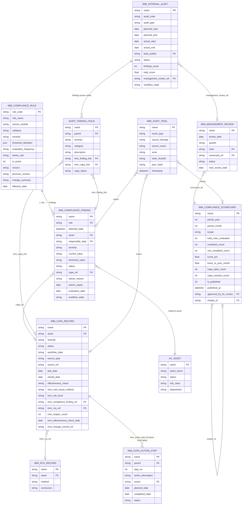

# 03 — Sơ đồ kiến trúc — IMM-16 Compliance Monitoring & CAPA

| Mục | Giá trị |
|---|---|
| Module | IMM-16 — Compliance Monitoring & CAPA |
| Phiên bản | 1.0.0-rc.2 |
| Ngày cập nhật | 2026-05-14 |
| Owner | Tech Lead + System Analyst |
| Liên kết | [02 Analysis](./02_Analysis_Design.md) · [04 Backend](./04_Backend_Design.md) · [05 API](./05_API_Specification.md) |

> ✅ IMPLEMENTED — Wave 2. Diagrams phản ánh DocType + workflow + service đã merge.

---

# Phần I — ERD (Entity-Relationship Diagram)



---

# Phần II — Class Diagram

> ⚠️ Pending implementation — Wave 3

```
┌─────────────────────────────────────────────────────────────────┐
│                    services/imm16.py                            │
│                                                                 │
│  class RuleEvaluator:                                           │
│    + evaluate(rule: dict, context: dict) → EvalResult           │
│    - _fetch_metric(rule, context) → Any                         │
│    - _compare(current, op, threshold) → bool                    │
│                                                                 │
│  class FindingUpsertor:                                         │
│    + upsert(rule, source_record, eval_date, current_value) → str│
│    - _build_finding_doc(rule, ...) → Document                   │
│                                                                 │
│  class ScorecardAggregator:                                     │
│    + build(period_year, period_month, scope) → str              │
│    - _aggregate_by_module(findings) → list                      │
│    - _aggregate_by_department(findings) → list                  │
│                                                                 │
│  class EscalationMatrix:                                        │
│    + escalate(capa_record: dict) → None                         │
│    - _compute_level(risk_level, overdue_days) → str             │
│    - _send_email(recipients, capa) → None                       │
│    - _log_escalation(capa, level) → None                        │
│                                                                 │
│  class ComplianceGate:                                          │
│    + check_asset(asset: str) → GateResult                       │
│    - _has_critical_open_capa(asset) → list[str]                 │
│                                                                 │
│  # doc_events hooks (không modify core controller)              │
│  def capa_record_validate(doc, method=None) → None              │
│  def capa_record_on_update(doc, method=None) → None             │
│  def gate_wo_submit(doc, method=None) → None                    │
└─────────────────────────────────────────────────────────────────┘

┌─────────────────────────────────────────────────────────────────┐
│              DocType Controllers (mới — PLANNED)                │
│                                                                 │
│  class IMMComplianceRule(Document):                             │
│    + validate()                                                 │
│    + before_save()                                              │
│    - vr_01_threshold_json_schema()                              │
│    - vr_02_evaluation_frequency()                               │
│    - vr_11_rule_change_summary()                                │
│    - _bump_version(current: str) → str                          │
│                                                                 │
│  class IMMComplianceFinding(Document):                          │
│    + validate()                                                 │
│    + before_save()                                              │
│    - vr_03_severity_enum()                                      │
│    - vr_04_waiver_complete()                                    │
│                                                                 │
│  class IMMInternalAudit(Document):                              │
│    + validate()                                                 │
│    - _check_major_nc_capa_links() → int                         │
│                                                                 │
│  class IMMComplianceScorecard(Document):                        │
│    + validate()                                                 │
│    - vr_09_scorecard_immutable()                                │
│                                                                 │
│  class IMMManagementReview(Document):                           │
│    + validate()                                                 │
│    - _auto_compute_quarter()                                    │
└─────────────────────────────────────────────────────────────────┘

┌─────────────────────────────────────────────────────────────────┐
│                    api/imm16.py                                 │
│  (30 @frappe.whitelist() endpoints)                             │
│                                                                 │
│  # Rule Management                                              │
│  list_rules, get_rule, create_rule, update_rule, deactivate_rule│
│                                                                 │
│  # Finding Lifecycle                                            │
│  list_findings, get_finding, confirm_finding,                   │
│  mark_false_positive, waive_finding, link_to_capa               │
│                                                                 │
│  # Audit                                                        │
│  list_audits, create_audit, start_audit,                        │
│  complete_audit_checklist, close_audit                          │
│                                                                 │
│  # CAPA                                                         │
│  create_capa_from_finding, advance_capa_state,                  │
│  perform_effectiveness_check, reopen_capa                       │
│                                                                 │
│  # Scorecard                                                    │
│  list_scorecards, get_current_scorecard,                        │
│  get_scorecard_by_period, publish_scorecard                     │
│                                                                 │
│  # Management Review                                            │
│  list_management_reviews, create_management_review,             │
│  finalize_management_review                                     │
│                                                                 │
│  # Dashboard / Reports / Gate                                   │
│  get_dashboard_stats, get_compliance_heatmap,                   │
│  get_capa_aging, get_overdue_actions,                           │
│  check_asset_compliance_status                                  │
└─────────────────────────────────────────────────────────────────┘

Dependencies (Reuse LIVE):
  services/imm00.py: create_capa, close_capa, check_capa_overdue, log_audit_event
  IMM CAPA Record (DocType LIVE — extend via Custom Fields)
  Audit Finding (Child LIVE — extend via Custom Fields)
  IMM RCA Record (DocType LIVE)
  IMM Audit Trail (DocType LIVE — hash chain)
```

---

# Phần III — Sequence Diagrams

> ⚠️ Pending implementation — Wave 3

## III.1. Annual/Monthly Compliance Evaluation Run

```
Scheduler                RuleEvaluator         FindingUpsertor      IMM Audit Trail
    │                         │                      │                    │
    │─ run_compliance_evaluation() ──────────────────>│                   │
    │                         │                      │                    │
    │  for each active rule:  │                      │                    │
    │─ evaluate(rule, ctx) ──>│                      │                    │
    │                         │─ _fetch_metric() ─>DB│                    │
    │                         │<─ current_value ──────│                    │
    │                         │─ _compare(cur, op, thr)                   │
    │<─ EvalResult(violated=T)│                      │                    │
    │                         │                      │                    │
    │─ upsert(rule, src, date, val) ─────────────────>│                   │
    │                         │                      │─ check UNIQUE idx ─>DB
    │                         │                      │<─ not exists ───────│
    │                         │                      │─ insert Finding ───>DB
    │                         │                      │─ publish_realtime()│
    │                         │                      │─ log_audit_event() >│
    │                         │                      │                    │─ write IMM Audit Trail
    │<─ finding_name ──────────────────────────────────│                    │
    │                         │                      │                    │
    │  (next rule iteration)  │                      │                    │
```

## III.2. CAPA Effectiveness Check → Re-open Flow

```
FE (QLCL)               API (imm16)            Service (imm16)        IMM CAPA Record
    │                        │                       │                      │
    │─ POST perform_effectiveness_check ────────────>│                      │
    │  {name, result="Not Effective", evidence}      │                      │
    │                        │                       │                      │
    │                        │─ set effectiveness_check ──────────────────>│
    │                        │─ set imm_effectiveness_evidence             │
    │                        │─ capa_record_validate() ───────────────────>│
    │                        │   VR-07: result != "Effective"              │
    │                        │   → skip Close validation                   │
    │                        │─ set workflow_state="Re-opened" ───────────>│
    │                        │─ set workflow_state="Investigating" ────────>│
    │                        │─ imm_reopen_count += 1 ─────────────────────>│
    │                        │─ log_audit_event(actor, "reopened") ───────>IMM Audit Trail
    │                        │─ cascade: Finding → stays "Confirmed NC"   │
    │<─ {success:true, new_state:"Investigating", imm_reopen_count:1}     │
    │                        │                       │                      │
```

## III.3. Scorecard Publish + Quarterly MR Gate

```
VP Block2               API (imm16)            Service (imm16)        MariaDB
    │                        │                       │                   │
    │─ POST publish_scorecard({name}) ──────────────>│                   │
    │                        │                       │                   │
    │                        │─ get scorecard doc ──────────────────────>│
    │                        │<─ {period_year:2026, period_month:4}      │
    │                        │                       │                   │
    │                        │─ vr_10_quarterly_mr_gate() ──────────────>│
    │                        │   find MR WHERE quarter="Q1-2026" AND     │
    │                        │   status="Closed"                         │
    │                        │<─ [] (no MR found) ──────────────────────│
    │<─ {success:false, code:"MR_MISSING_QUARTERLY", error:"VR-10..."} │
    │                        │                       │                   │
    │─ (creates Q1 MR + finalizes) ─────────────────>│                   │
    │─ POST publish_scorecard({name}) ──────────────>│                   │
    │                        │─ vr_10 check again ──────────────────────>│
    │                        │<─ [{name:"MR-2026-0001",status:"Closed"}] │
    │                        │─ is_published=1 ─────────────────────────>│
    │                        │─ published_at=now() ─────────────────────>│
    │                        │─ log_audit_event("published") ───────────>IMM Audit Trail
    │                        │─ publish_realtime("imm16:scorecard_published")
    │<─ {success:true, data:{name, is_published:1, score_pct:87.5}}     │
```

---

# Phần IV — Communication Diagram (Cross-module)

> ⚠️ Pending implementation — Wave 3

```
┌─────────────────────────────────────────────────────────────────────┐
│                    IMM-16 Cross-module Integration                  │
│                                                                     │
│  SIGNAL SOURCES (IN) ──────────────────────────────────────────     │
│                                                                     │
│  IMM-04 (Asset Commissioning)                                       │
│    on_submit → eval_imm04_realtime()                                │
│    metric: commissioning_doc_completeness                           │
│                                ▼                                    │
│  IMM-05 (Asset Document)      ┌─────────────────────────┐          │
│    on_update → eval_imm05_realtime() │ IMM-16 Compliance  │         │
│    metrics: doc_expired_count,│      │ Rule Engine         │         │
│             doc_expiring_30d  │      │ (services/imm16.py) │         │
│                               │      └──────────┬──────────┘         │
│  IMM-06 (Training)            │                 │                    │
│    metric: training_overdue   │       upsert_finding() (idempotent)  │
│                               │                 │                    │
│  IMM-08 (PM Work Order)       │                 ▼                    │
│    on_submit → eval_imm08_realtime()  IMM Compliance Finding         │
│    metric: pm_compliance_pct  │       (FND-.YYYY.-.#####)            │
│    validate → gate_wo_submit()│                 │                    │
│             ← block if BR-16-09 ←──────────────┘                    │
│                                                                     │
│  IMM-09 (CM Work Order)                                             │
│    on_submit → eval_imm09_realtime()                                │
│    metric: repair_sla_breach_count                                  │
│    validate → gate_wo_submit() ← block if BR-16-09                  │
│                                                                     │
│  IMM-10 (Post-market)                                               │
│    external recall → create NC Finding manually                     │
│                                                                     │
│  IMM-11 (Calibration)                                               │
│    on_submit → eval_imm11_realtime()                                │
│    metrics: calibration_overdue_count, oot_count                    │
│                                                                     │
│  IMM-12 (Corrective)                                                │
│    shares IMM CAPA Record (_DT_CAPA = "IMM CAPA Record")            │
│    IMM-16 extends same record with Custom Fields                    │
│                                                                     │
│  IMM-15 (Spare Parts)                                               │
│    metric: critical_spare_breach_count                              │
│                                                                     │
│  CONSUMERS (OUT) ──────────────────────────────────────────         │
│                                                                     │
│  IMM-08/09 ← check_asset_compliance_status() (BR-16-09)            │
│    Block WO Submit if CAPA Critical OPEN                            │
│                                                                     │
│  IMM-13/14 (Decommission)                                           │
│    Block decommission if audit/CAPA OPEN                            │
│                                                                     │
│  IMM-17 (Predictive)                                                │
│    Compliance trend signal → predictive model                       │
│                                                                     │
│  QMS Layer                                                          │
│    Management Review report → ISO 13485 §5.6                       │
└─────────────────────────────────────────────────────────────────────┘
```

---

# Phần V — Package Diagram (File Layout)

> ⚠️ Pending implementation — Wave 3

```
assetcore/
├── assetcore/
│   ├── doctype/
│   │   ├── imm_capa_record/                     ← LIVE (reuse + Custom Fields)
│   │   │   ├── imm_capa_record.json
│   │   │   └── imm_capa_record.py
│   │   ├── audit_finding/                       ← LIVE child (reuse + Custom Fields)
│   │   │   └── audit_finding.json
│   │   ├── imm_audit_trail/                     ← LIVE (hash chain)
│   │   ├── imm_rca_record/                      ← LIVE
│   │   │
│   │   ├── imm_compliance_rule/                 ← PLANNED
│   │   │   ├── imm_compliance_rule.json
│   │   │   └── imm_compliance_rule.py
│   │   ├── imm_compliance_finding/              ← PLANNED
│   │   │   ├── imm_compliance_finding.json
│   │   │   └── imm_compliance_finding.py
│   │   ├── imm_internal_audit/                  ← PLANNED
│   │   │   ├── imm_internal_audit.json
│   │   │   └── imm_internal_audit.py
│   │   ├── imm_audit_checklist_item/            ← PLANNED (child)
│   │   ├── imm_capa_action_step/                ← PLANNED (child Custom Field)
│   │   ├── imm_compliance_scorecard/            ← PLANNED
│   │   │   ├── imm_compliance_scorecard.json
│   │   │   └── imm_compliance_scorecard.py
│   │   └── imm_management_review/               ← PLANNED
│   │       ├── imm_management_review.json
│   │       └── imm_management_review.py
│   │
│   ├── custom/
│   │   ├── imm_capa_record_imm16.json           ← PLANNED (11 Custom Fields)
│   │   └── audit_finding_imm16.json             ← PLANNED (2 Custom Fields)
│   │
│   └── workflow/
│       ├── imm_16_finding_workflow.json         ← PLANNED
│       ├── imm_16_audit_workflow.json           ← PLANNED
│       ├── imm_16_capa_workflow.json            ← PLANNED (EXTEND existing)
│       └── imm_16_mr_workflow.json              ← PLANNED
│
├── api/
│   └── imm16.py                                 ← PLANNED (~30 endpoints)
│
├── services/
│   ├── imm00.py                                 ← LIVE (reuse)
│   └── imm16.py                                 ← PLANNED (rule engine + scorecard + gate)
│
├── fixtures/
│   ├── imm16_custom_field_capa_record.json      ← PLANNED
│   ├── imm16_custom_field_audit_finding.json    ← PLANNED
│   ├── imm16_compliance_rules_baseline.json     ← PLANNED (≥40 rules)
│   ├── imm16_audit_checklist_template.json      ← PLANNED
│   └── imm16_role_internal_auditor.json         ← PLANNED
│
├── patches/
│   └── v0_2/
│       └── migrate_capa_record_workflow_state.py ← PLANNED
│
└── tasks.py                                      ← EXTEND (5 new entries)

frontend/src/
├── views/
│   ├── ComplianceDashboard.vue                  ← PLANNED
│   ├── ComplianceHeatmap.vue                    ← PLANNED
│   ├── RuleListView.vue                         ← PLANNED
│   ├── RuleDetailView.vue                       ← PLANNED
│   ├── FindingListView.vue                      ← PLANNED
│   ├── FindingDetailView.vue                    ← PLANNED
│   ├── AuditListView.vue                        ← PLANNED
│   ├── AuditDetailView.vue                      ← PLANNED
│   ├── CapaKanbanView.vue                       ← PLANNED
│   ├── CapaDetailView.vue                       ← PLANNED
│   ├── ScorecardListView.vue                    ← PLANNED
│   ├── ScorecardDetailView.vue                  ← PLANNED
│   └── MgmtReviewView.vue                       ← PLANNED
├── components/imm16/
│   ├── WaiveFindingModal.vue                    ← PLANNED
│   └── EffectivenessCheckModal.vue              ← PLANNED
├── stores/
│   └── imm16Store.ts                            ← PLANNED
├── api/
│   └── imm16.ts                                 ← PLANNED
└── types/
    └── imm16.ts                                 ← PLANNED
```
