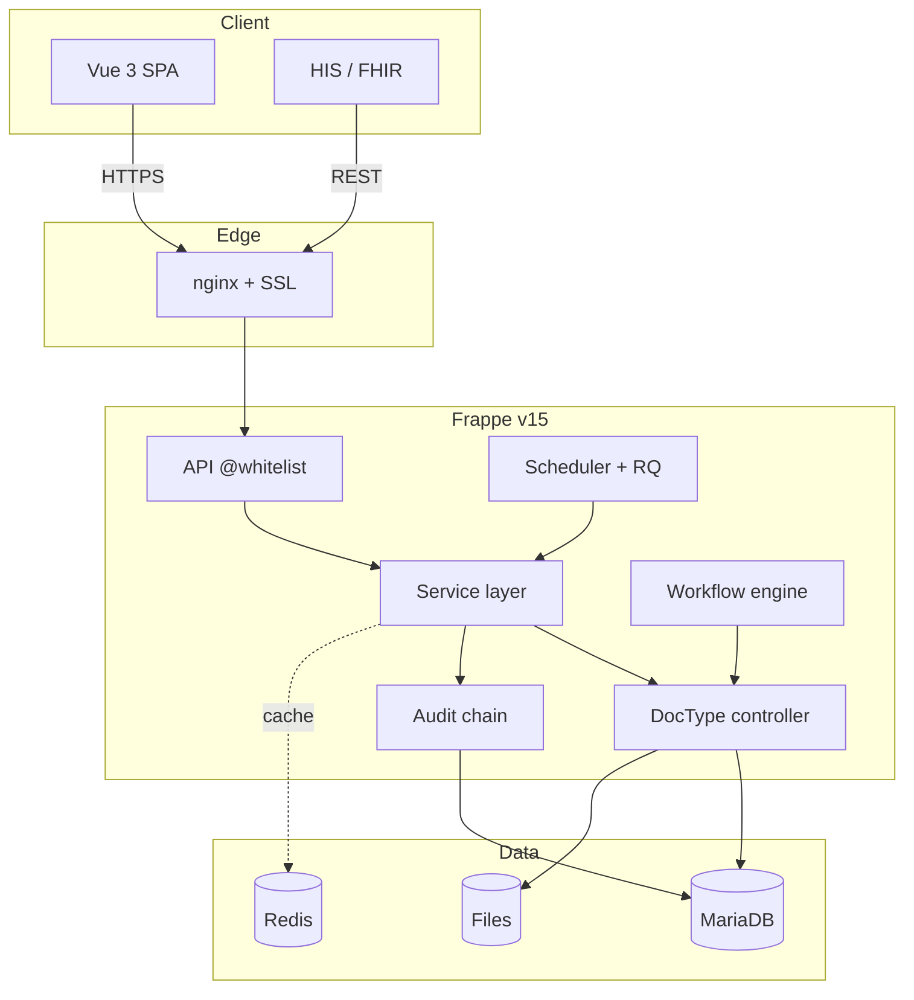

# 01 — Kiến trúc & Công nghệ & Quy trình Agile

| Mục | Giá trị |
|---|---|
| Phạm vi | **Toàn dự án** (project-wide, viết 1 lần) |
| Owner | Tech Lead / Solution Architect / Scrum Master |
| Cập nhật khi | Đổi component lớn, đổi tier, thêm dependency, đổi Agile cadence |

> **Mục đích**: Bản đồ chiến lược — kiến trúc hệ thống, công nghệ sử dụng, và quy trình Agile. 3 phần độc lập nhưng dùng chung cho mọi module.

---

# Phần I — Kiến trúc hệ thống (System Architecture)

## I.1. Goals & Non-goals
**Viết gì**: 4-6 architecture goal (compliance-first, 3-tier strict, module composable, vendor isolation, multi-site...) + 3-4 non-goal (không SaaS multi-tenant, không offline-first...).

## I.2. Component diagram
**Viết gì**: Sơ đồ Mermaid `flowchart` cho 4 tier: Client / Edge / App / Data + External integration. Show request flow (mũi tên có nhãn).



## I.3. Layer responsibilities
**Viết gì**: Bảng `Layer · File path · Trách nhiệm · Cấm`. Mỗi tier có nguyên tắc rõ (vd "Service không biết HTTP context").

## I.4. Module composition
**Viết gì**: Sơ đồ Mermaid show inter-module dependency + nguyên tắc chia sẻ qua master / Lifecycle Event / Audit (KHÔNG import service chéo).

## I.5. Deployment topology
**Viết gì**: Sơ đồ + bảng spec server (CPU/RAM/disk) cho ≥ 1 kịch bản (single-hospital). Multi-hospital + DR nếu áp dụng.

## I.6. Cross-cutting concerns
**Viết gì**: Mục con cho mỗi: Auth, RBAC, Audit chain, Logging, Caching, Background jobs, i18n, Observability. Mỗi mục 3-5 dòng.

## I.7. Architecture principles
**Viết gì**: List 5-8 quy tắc cứng (trích từ `CLAUDE.md §5`). Mỗi quy tắc 1 câu.

## I.8. Quality attributes
**Viết gì**: Bảng `Attribute · Target số · Cách đảm bảo`. Ưu tiên: Availability, Performance, Security, Compliance, Maintainability, Auditability.

## I.9. Roadmap kiến trúc
**Viết gì**: Wave 1/2/3 + long-term — mỗi wave 3-5 bullet.

---

# Phần II — Công nghệ sử dụng (Tech Stack)

## II.1. Stack overview
**Viết gì**: Sơ đồ Mermaid theo 4 nhóm: Frontend / Backend / Data / Edge. Mỗi node = 1 component.

## II.2. Backend
**Viết gì**: Bảng `Component · Version · Lý do chọn · Alternative đã loại`. Cover: Frappe, ERPNext, Python, MariaDB, Redis. Liệt kê python deps tiêu biểu trong `requirements.txt`.

## II.3. Frontend
**Viết gì**: Bảng tương tự. Cover: Vue, TypeScript, Pinia, Vue Router, TanStack Query, Tailwind, vue-i18n, axios, vueuse, qrcode, persistedstate. Dev tool: Vite, vue-tsc, eslint, postcss.

## II.4. KHÔNG dùng (rejected list)
**Viết gì**: Bảng `Tool · Lý do loại`. Bắt buộc cover: chart library lớn (Chart.js/ECharts), icon library lớn (FontAwesome), Lodash, Moment.js, UI framework (Element-Plus/Vuetify), jsPDF/html2canvas. Thêm 1 trong các mục này → mở ADR.

## II.5. Edge / DevOps
**Viết gì**: Bảng cover: nginx, supervisor, certbot, bench, Node, npm, git, Sentry SDK.

## II.6. Integration stack
**Viết gì**: 2 bảng — đã có (Email, socket.io, file storage, backup) + roadmap (FHIR, HIS, SMS, SSO).

## II.7. Testing stack
**Viết gì**: Bảng `Tier · Tool · Note`. Cover: BE unit/integration, FE typecheck/lint, E2E (Playwright optional), Performance (k6), Security (ZAP/Burp).

## II.8. Versioning & upgrade
**Viết gì**: Quy tắc semver app version, cadence upgrade Frappe/ERPNext/dependency (security patch / minor / major).

## II.9. License compliance
**Viết gì**: License accepted (MIT/BSD/Apache/ISC) + cấm (GPL/AGPL/proprietary). Audit cadence + tool.

## II.10. Performance budget
**Viết gì**: Bảng `Bundle/Asset · Target · Đo`. Cover: FE main bundle gzip, FCP, TTI, BE API p95, DB query p95.

---

# Phần III — Quy trình Agile / Scrum

## III.1. Sprint cadence
**Viết gì**: Length (2 tuần), ngày Planning/Daily/Refinement/Review/Retro, release cadence.

## III.2. Roles
**Viết gì**: Bảng `Role · Trách nhiệm · Người`. Cover: PO, SM, Tech Lead, BA Lead, QA Lead, DevOps, QMS Officer, BE Dev, FE Dev, End-user representative.

## III.3. Ceremonies
**Viết gì**: Cho mỗi ceremony (Planning, Daily, Refinement, Review, Retro): thời lượng, agenda 3-5 bước, output.

## III.4. Estimation
**Viết gì**: Story sizing (Fibonacci 1/2/3/5/8/13). Capacity formula. Velocity = avg 3 sprint gần nhất.

## III.5. Definition of Ready (DoR)
**Viết gì**: Checklist 8-10 mục — story phải tick đủ mới được commit sprint. Cover: title format, AC, link UC/Spec, estimate ≤ 8, dependency, mockup, owner, edge cases.

## III.6. Definition of Done (DoD)
**Viết gì**: Checklist 4 nhóm — Code (merge, lint, test, coverage, review), Doc (02-09 cập nhật), Deploy (staging + smoke), Validate (PO accept).

## III.7. Map doc ↔ Agile phase
**Viết gì**: Bảng `Phase · File · Khi viết` — full lifecycle.

## III.8. Branch & PR strategy
**Viết gì**: Branch convention (`master`, `release/`, `feature/`, `hotfix/`). PR title format. CI gate.

## III.9. Communication
**Viết gì**: Bảng `Channel · Mục đích · Cadence`. Slack, email tuần, demo, quarterly review.

---

# Phần IV — Quy chuẩn Coding & Giao tiếp (Coding & Communication Standards)

> Nguyên tắc cứng cấp dự án, áp dụng cho **mọi module**. File 04 / 05 / 06 chi tiết hóa.

## IV.1. Quy ước ngôn ngữ
**Viết gì**: 3 mục con —

### IV.1.a. Code (BE Python + FE TypeScript)
- **Bắt buộc tiếng Anh** mọi nơi: variable, function, class, file name, module name, branch name, commit message.
- snake_case cho Python, camelCase cho TS, PascalCase cho class / type / DocType.
- KHÔNG đặt tên có dấu tiếng Việt trong code (`tao_wo()` ❌ → `create_work_order()` ✓).
- Comment + docstring: tiếng Anh ưu tiên cho public function (vì FE/đối tác đọc); tiếng Việt OK cho note nội bộ phức tạp.

### IV.1.b. Data lưu BE (database value)
- **Có thể tiếng Việt** với data text-content hiển thị cho user (vd `description`, `note`, `symptom`).
- Field **name**: tiếng Anh (theo §IV.1.a).
- Field **label** trong DocType JSON: **tiếng Việt** (vì FE Frappe-native đọc trực tiếp).
- Enum value: tiếng Anh (vd `priority="Emergency"`); label hiển thị tiếng Việt qua i18n (`Khẩn cấp`).
- Naming series, autoname format: tiếng Anh + số (`WO-RP-.YYYY.-.#####`).

### IV.1.c. FE — UI hiển thị cho end-user
- **BẮT BUỘC tiếng Việt 100%** mọi label, button, message, toast, error inline, placeholder. Mọi.
- **KHÔNG dùng mã code / ID làm tên hiển thị**. Vd: hiển thị `Máy theo dõi bệnh nhân — BS Nội tim mạch` thay vì `AC-MON-0042`.
- **Mã code** (UDI, serial, mã WO) khi cần hiển thị → đặt **nhỏ phía dưới** tên tự nhiên, font-mono, `text-xs text-slate-500`. Pattern:
  ```
  Máy theo dõi bệnh nhân
  AC-MON-0042 · S/N: PHILIPS-MX450-2024
  ```
- Technical token (mã ErrorCode hiện trong dev console, mã workflow state trong URL) giữ tiếng Anh — KHÔNG hiển thị cho end-user.

## IV.2. API & Response Standards
**Viết gì**: Yêu cầu cứng cho mọi endpoint @whitelist —

### IV.2.a. Tài liệu tập trung
- Mọi API phải có entry trong **API Catalog tổng hợp** (file 05 §0).
- Mọi schema (request + response) có TypeScript interface tương ứng cho FE — không để FE đoán field.

### IV.2.b. Type chuẩn hóa hai đầu BE ↔ FE
- BE: dùng dataclass / Pydantic / TypedDict cho DTO (file 03 §II §3.5 Class diagram).
- FE: tạo `frontend/src/types/imm<XX>.ts` mirror exact field name + type của BE response.
- Sai lệch type giữa 2 đầu = bug — phát hiện ở CI (vue-tsc fail).

### IV.2.c. Envelope chuẩn AssetCore — `{success, data | error+code}`
AssetCore dùng envelope **custom** thay Frappe `message` default — qua helper `_ok()` / `_err()` trong `assetcore/api/imm<XX>.py`:

**Success**:
```json
{ "success": true, "data": <payload> }
```

**Error**:
```json
{
  "success": false,
  "error": "Thiết bị đã ngưng sử dụng.",
  "code": "BAD_STATE",
  "fields": { "asset": "Thiết bị đã ngưng sử dụng" }
}
```

- HTTP status **luôn 200** khi service raise `ServiceError` (helper catch + return `_err`). Phân biệt success/error qua field `success` trong body, KHÔNG qua HTTP code.
- HTTP ≠ 200 chỉ khi: 401 (session expired — Frappe interceptor), 403 (CSRF / role-level Frappe), 500 (unhandled exception — phải hạn chế).
- App-level `code`: identifier string thuần — định nghĩa trong `services/shared/constants.py:ErrorCode` (xem §IV.2.d).
- **CẤM**: trả raw traceback / stacktrace / SQL error / file path. Service raise `ServiceError`, helper convert.

### IV.2.d. ErrorCode — actual values (no prefix)
String identifier thuần, KHÔNG prefix kiểu `STATE_*` / `VALIDATION_*`:

| BE code | FE map | Khi nào |
|---|---|---|
| `NOT_FOUND` | `NOT_FOUND` | Resource không tồn tại |
| `FORBIDDEN` | `FORBIDDEN` | Không có quyền |
| `UNAUTHORIZED` | `UNAUTHORIZED` | Chưa đăng nhập |
| `VALIDATION` | `VALIDATION_ERROR` | Input invalid |
| `BUSINESS_RULE` | `BUSINESS_RULE_VIOLATION` | Vi phạm rule nghiệp vụ |
| `CONFLICT` | `CONFLICT` | Concurrent modify / unique violate |
| `BAD_STATE` | `BAD_STATE` | State machine fail |
| `DUPLICATE` | `DUPLICATE` | Đã tồn tại |
| `INVALID_PARAMS` | `INVALID_PARAMS` | Param malformed |
| `RATE_LIMITED` | `RATE_LIMITED` | Quá ngưỡng |
| `INTERNAL` | `INTERNAL_ERROR` | Lỗi hệ thống |

Khi thêm code mới: cập nhật `assetcore/services/shared/constants.py:ErrorCode` (BE) + `frontend/src/api/errors.ts:ErrorCode` (FE) + bảng mapping trong 05 §1.4.

## IV.3. UI / UX Standards
**Viết gì**: Áp dụng cho mọi FE feature — chi tiết hóa ở file 06.

### IV.3.a. State quản lý tập trung
- Server state (data từ BE): **TanStack Vue Query** (cache + refetch + dedupe).
- Client state (filter, sidebar, modal open): **Pinia store**.
- KHÔNG đặt server data trong Pinia state. KHÔNG đặt UI state vào TanStack Query.

### IV.3.b. Linked / Cascade fields
- Field phụ thuộc field khác → cascade auto:
  - Ví dụ: `Khoa / phòng` → load `Tủ thiết bị` thuộc khoa → load `Asset` thuộc tủ.
  - Khi user đổi field cha → field con **reset + reload options**.
- Mỗi cascade dùng `<LinkSearch>` với prop `filters` phụ thuộc field cha — không free-text.
- Validate cuối: BE re-check parent-child consistency (FE convenience, BE truth).

### IV.3.c. Input tight (chống nhập sai)
- **Ưu tiên picker / dropdown / radio** thay vì free-text khi domain hữu hạn:
  - Date → `<DateInput>` mask `dd/mm/yyyy` (KHÔNG `<input type="text">`)
  - Số có đơn vị → number + select unit (KHÔNG free-text `35°C`)
  - Enum → `<RadioChip>` hoặc `<SmartSelect>` (KHÔNG nhập tay)
  - Reference DocType → `<LinkSearch>` (KHÔNG copy-paste mã)
- **Validate inline trước khi submit**: button submit disabled khi form còn lỗi — không cho user thử submit + nhận error sau.
- **Mask input** với format có cấu trúc: serial (alphanumeric pattern), mã thiết bị, số điện thoại, datetime.
- **Confirm modal** với hành động không undo được (Submit final, Approve, Decommission, Cancel sau Submit).
- **Required marker** (`*` đỏ) sau label — luôn có cho field bắt buộc.
- **Error message inline** dưới field — `text-rose-600 text-xs`, không generic.

---

## DoD — File 01 hoàn chỉnh

### I. Architecture
- [ ] Sơ đồ component vẽ rõ 4 tier
- [ ] Mỗi layer có file path + trách nhiệm + cấm
- [ ] Module composition + nguyên tắc inter-module
- [ ] Deployment topology cho ≥ 1 kịch bản
- [ ] 8 cross-cutting concern đầy đủ
- [ ] Architecture principles ≥ 5
- [ ] Quality attributes có target số
- [ ] Reviewed bởi Solution Architect + 4 lead

### II. Tech Stack
- [ ] Mọi component có version + lý do chọn
- [ ] "Không dùng" có ≥ 5 entry
- [ ] License check cadence
- [ ] Versioning policy + upgrade cadence
- [ ] Performance budget có số
- [ ] Reviewed bởi Tech Lead + DevOps

### III. Agile Process
- [ ] Cadence rõ
- [ ] Roles có người cụ thể
- [ ] Ceremonies có agenda + output
- [ ] DoR ≥ 8 tick · DoD đủ 4 nhóm
- [ ] Branch + PR strategy
- [ ] Reviewed bởi SM + PO + Tech Lead

### IV. Coding & Communication Standards
- [ ] Quy ước ngôn ngữ Code / BE / FE rõ
- [ ] Quy chuẩn API: catalog tổng hợp + type chuẩn 2 đầu + error/success code chuẩn
- [ ] Quy chuẩn UI/UX: state tập trung + cascade field + tight validation
- [ ] Reviewed bởi Tech Lead + BE Lead + FE Lead
