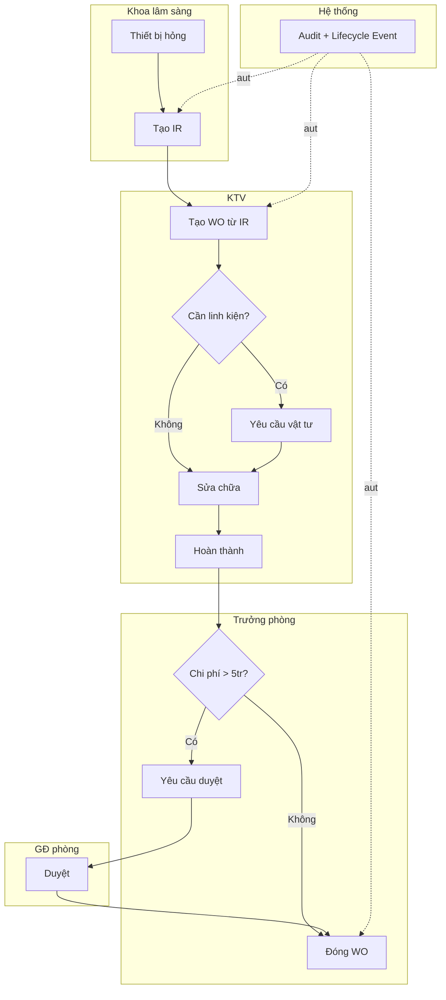
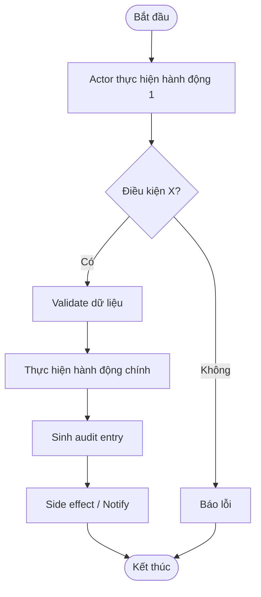
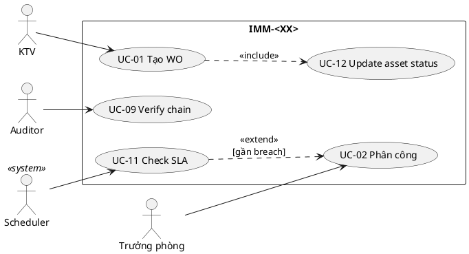

# 02 — Phân tích thiết kế nghiệp vụ (Analysis & Design)

| Mục | Giá trị |
|---|---|
| Module | IMM-`<XX>` — `<tên>` |
| Phạm vi | Per-module |
| Owner | BA + System Analyst |
| Liên kết | 03 Diagrams · 04 Backend · 05 API · 06 Frontend |

> **Mục đích**: Phân tích nghiệp vụ end-to-end — module overview, quy trình BPMN, use case UML, functional specs (user stories + AC + business rules). Đây là hợp đồng giữa BA và Dev.

---

# Phần I — Module Overview

## I.0. Khảo sát hiện trạng
**Viết gì**: 2-3 đoạn so sánh giải pháp hiện có (As-Is) — bệnh viện đang làm thế nào, công cụ gì, hạn chế gì. Bảng so sánh với product compete (nếu có) theo cột tính năng. Đây là phần BA "đặt vấn đề" — chứng minh tại sao module cần.
**Mẹo**: Nguồn dữ liệu: phỏng vấn end-user, audit log Excel hiện tại, sổ giấy.

## I.1. Pitch (1 đoạn)
**Viết gì**: 3-5 câu — vấn đề user gặp, giải pháp module, giá trị đo được. Không jargon kỹ thuật.

## I.2. Vị trí trong WHO HTM lifecycle
**Viết gì**: Tick các phase module chạm: Needs · Procurement · Install · Operation · Maintenance · Decommission. Giải thích nhận input/output từ module nào.

## I.3. Stakeholders & Actors
**Viết gì**: Bảng 5 cột — `Vai trò · Người dùng thực · Quan tâm chính · Tần suất dùng · Loại (Primary/Secondary/Approver/Auditor/External)`.
**Mẹo**: Bắt buộc ≥ 1 Primary + 1 Auditor.

## I.4. Scope
**Viết gì**: 4 sub-list — In-scope · Out-of-scope · Assumptions · Dependencies (DocType phụ thuộc, module ràng buộc, integration ngoài).

## I.5. KPI mục tiêu
**Viết gì**: Bảng `KPI · Định nghĩa · Baseline · Target · Đo ở đâu`. ≥ 3 KPI có số.

## I.6. Ràng buộc Compliance
**Viết gì**: Bảng `Quy định · Yêu cầu áp lên module · Doc tham chiếu`. Bắt buộc check NĐ98/2021 + WHO HTM. ISO 13485 + nội bộ QMS nếu có.

## I.7. Risk & Open questions
**Viết gì**: 2 bảng — `Risk · Likelihood · Impact · Giảm thiểu` + `Open question · Owner · Deadline`.

## I.8. Roadmap thực thi
**Viết gì**: Bảng sprint — `Sprint · Hạng mục · Owner · Status`. ≥ 5 sprint.

---

# Phần II — Quy trình nghiệp vụ (Business Process / BPMN)

## II.1. Phân biệt 3 khái niệm
- **Business Process** = tổ chức làm thế nào (file này)
- **Use Case** = actor + system + goal (Phần III)
- **Workflow** = DocType state + transition (file 04 §III)

## II.2. As-Is process (chưa có hệ thống)
**Viết gì**: 1 đoạn mô tả + 1 swimlane Mermaid. Để chỉ ra pain point.

## II.3. Pain points
**Viết gì**: Bảng `# · Pain · Tác động`. ≥ 3 pain point.

## II.4. To-Be process (với AssetCore)
**Viết gì**: Swimlane Mermaid với ≥ 4 lane (Khoa LS · KTV · Sup · App · Vendor · System). Highlight async event, audit auto, cron.



## II.5. Decision points
**Viết gì**: Bảng `Điểm · Câu hỏi · Quy tắc`. Mỗi decision có ngưỡng / business rule rõ.

## II.6. Process metrics
**Viết gì**: Bảng `Metric · Mục tiêu · Đo ở đâu`. MTTR, time-to-assignment, % SLA, % audit-readiness.

## II.7. RACI matrix
**Viết gì**: Bảng — cột là role, hàng là hoạt động. Cell ghi `R/A/C/I`.

## II.8. Exception flow
**Viết gì**: 2-3 exception ít gặp nhưng quan trọng. Mỗi exception 3-5 dòng.

## II.9. So sánh As-Is vs To-Be
**Viết gì**: Bảng 2 cột so sánh từng khía cạnh.

## II.10. Activity diagram per UC chính
**Viết gì**: Khác §II.4 (swimlane process tổ chức) — Activity diagram cho **1 UC cụ thể** show flow chi tiết của UC đó (start → action → decision → end). Vẽ Mermaid `flowchart TD`.

**Khi nào vẽ**: cho UC có flow > 5 bước hoặc có ≥ 1 nhánh decision. Bỏ qua UC đơn giản (CRUD 1-2 step). Thường 3-5 activity diagram per module.



**Mẹo**: Activity diagram khác Sequence diagram (file 03 §III) ở chỗ Activity focus **business flow** (decision/action), Sequence focus **message theo thời gian** giữa object.

---

# Phần III — Use Case Specification (UML)

## III.1. Use Case Diagram
**Viết gì**: Theo pattern đồ án — chia làm **2 cấp**:

### III.1.a. Biểu đồ use case tổng quát
1 biểu đồ duy nhất show **tất cả actor** + **tất cả UC chính** + quan hệ `<<include>>` `<<extend>>`. Giúp người đọc thấy bức tranh toàn cảnh.

### III.1.b. Biểu đồ use case phân rã (theo nhóm chức năng)
Khi biểu đồ tổng quát có > 8-10 UC, tách thành các biểu đồ phân rã. Mỗi biểu đồ phân rã = 1 nhóm chức năng có ràng buộc nội bộ cao + tách biệt nhóm khác. Mỗi biểu đồ chỉ show actor + UC liên quan đến nhóm đó.

**Cách phân nhóm** (chọn theo bản chất module — không cố định):
- Theo **lifecycle phase**: Authentication · Onboarding · Operation · Closeout
- Theo **đối tượng**: CRUD entity A · CRUD entity B · Cross-entity action
- Theo **vai trò actor**: Action của user thường · Action của Supervisor · Action của Auditor · Action của Vendor / External
- Theo **concern kỹ thuật**: Workflow / Approval · Audit / Trace · Dashboard / Report · Cron / Background · External integration

**Mẹo**: Mỗi biểu đồ phân rã ≤ 6 UC. Quá thì split tiếp. Đặt tên nhóm rõ ràng — đọc tên biết ngay nội dung.



## III.2. Actor catalog
**Viết gì**: Bảng `Actor · Loại (Primary/Secondary/System/External) · Mô tả · Goal chính`.

## III.3. Use Case Specifications
**Viết gì**: 1 spec/UC theo template dưới. Tối thiểu cover mọi UC trong diagram.

```markdown
### UC-XX: <Tên>

| Mục | Giá trị |
|---|---|
| ID | UC-IMM<XX>-<NN> |
| Brief | <1 câu> |
| Primary actor | <…> |
| Pre-condition | – <…> |
| Post-condition | – <…> |
| Trigger | <event> |

#### Main flow
| Bước | Actor | System |
|---|---|---|
| 1 | <action> | <response> |

#### Alternative A1 — <khi nào>
- <số.a>. <bước>

#### Exception E1 — <khi nào>
- <số.a>. <error code + handle>

#### Special requirements
- Performance / Security / Audit
```

## III.4. Use Case relationships
**Viết gì**: 2 bảng — `<<include>>` (caller bắt buộc gọi) + `<<extend>>` (chạy khi điều kiện).

## III.5. UC ↔ User Story mapping
**Viết gì**: Bảng `Use Case · US ID · Note`. 1-1 hoặc 1-N.

## III.6. UC ↔ Sequence Diagram mapping
**Viết gì**: Bảng `Use Case · Sequence ID trong 03 Diagrams · Note`.

---

# Phần IV — Functional Specifications

## IV.1. User Stories & Acceptance Criteria
**Viết gì**: Mỗi story có ID `<MÃ>-US-<NN>` + format "Là `<role>`, tôi muốn `<…>`, để `<…>`" + Priority (Must/Should/Could) + Estimate + AC theo Given-When-Then (≥ 2 case) + ngoại lệ.
**Mẹo**: AC phải test-able và observable.

## IV.2. Business Rules
**Viết gì**: Bảng `ID · Rule · Implement ở · Liên kết test`. ID dạng `<MÃ>-BR-<NN>`.

## IV.3. State Machine
**Viết gì**: Mermaid `stateDiagram-v2` show states + transitions. Bảng `State · Mô tả · Role có quyền chuyển · Action button hiển thị`. Map docstatus.

## IV.4. Input — Output
**Viết gì**: 3 mục con — (a) Input fields với validation + **liên kết phụ thuộc giữa fields** (cascade, vd field B chỉ valid khi field A chọn → reset+reload), (b) Output records sinh ra (DocType), (c) Notification / side effect.

**Mẹo**: Mọi field-pair có quan hệ phụ thuộc phải declare rõ. FE sẽ implement cascade theo file 06 §7d.

## IV.5. Edge cases & Errors
**Viết gì**: Bảng `ID · Edge case · Hành vi mong đợi · Error code (BE)`. ≥ 5 edge case (concurrency, permission, state mismatch, network, validation).
**Mẹo**: Error code phải có entry trong `services/shared/constants.py:ErrorCode`.

## IV.6. Out of scope & Open issues
**Viết gì**: 2 list ngắn — out-of-scope confirm lại + open question có owner + deadline.

---

# Phần V — Yêu cầu phi chức năng (Non-Functional Requirements)

> Yêu cầu KHÔNG mô tả "làm gì" mà mô tả "phải đạt mức nào". Mỗi NFR phải đo được — không nói chung chung.

## V.1. Hiệu năng (Performance)
**Viết gì**: Bảng `Metric · Target · Đo ở đâu`. Cover:
- API endpoint p95 latency
- Page load time (FCP, TTI)
- Throughput (req/s, đồng thời user)
- DB query p95
- Cron job duration

## V.2. Bảo mật (Security)
**Viết gì**: Cover:
- Authentication: Frappe session + API key + (roadmap) 2FA
- Authorization: RBAC 3 cấp (Role + DocPerm + User Permission)
- Audit trail: hash chain SHA-256 mọi mutation
- Compliance: NĐ98/2021 + WHO HTM + ISO 13485 (nếu áp)
- Data sensitivity: KHÔNG lưu patient data
- OWASP Top 10 đáp ứng

## V.3. Khả dụng (Availability)
**Viết gì**: Bảng `Metric · Target`:
- Uptime (vd ≥ 99.5% giờ làm việc)
- MTBF (mean time between failure)
- RPO / RTO cho DR

## V.4. Khả mở rộng (Scalability)
**Viết gì**:
- Số user đồng thời (vd ≥ 100 concurrent)
- Dataset size: số record/DocType chính (vd 100k WO/site)
- Multi-site: 1 codebase, N site độc lập

## V.5. Khả dụng UX (Usability)
**Viết gì**:
- WCAG 2.1 AA contrast / keyboard nav / focus visible
- Browser support (Chrome ≥ 120, Edge ≥ 120, Firefox ≥ 122; Safari ≥ 17 best-effort)
- Ngôn ngữ: tiếng Việt primary, tiếng Anh secondary (nếu có)
- Responsive: desktop-first ≥ 1280, tablet ≥ 768
- Onboarding: KTV mới dùng được trong < 30 phút training

## V.6. Bảo trì (Maintainability)
**Viết gì**:
- Code coverage: service ≥ 85%, DocType ≥ 70%, API ≥ 60%
- Doc coverage: mỗi public service function có docstring + AC
- Onboarding: junior dev productive trong < 1 tuần
- Linting: ESLint + Prettier + ruff/black 100% pass
- Tech debt budget: ≤ 20% sprint capacity

## V.7. Tuân thủ (Compliance) — bắt buộc với HTM
**Viết gì**:
- Lưu hồ sơ ≥ 5 năm (NĐ98)
- Audit truy xuất qua hash chain (NĐ98)
- Phân tách trách nhiệm (KTV ≠ Approver ≠ Auditor)
- Document control workflow (PR/WI Effective/Obsolete)

---

## DoD — File 02 hoàn chỉnh

### I. Module Overview
- [ ] **Khảo sát hiện trạng** có ≥ 2 đoạn As-Is + ≥ 1 bảng compete (nếu có)
- [ ] Pitch ≤ 5 câu, không jargon
- [ ] Lifecycle phase + lifecycle position rõ
- [ ] ≥ 1 Primary + 1 Auditor stakeholder
- [ ] Scope cả In + Out + Assumption + Dependency
- [ ] ≥ 3 KPI có target số
- [ ] ≥ 1 ràng buộc compliance

### II. Business Process
- [ ] As-Is + ≥ 3 pain point
- [ ] To-Be swimlane ≥ 4 lane (render được)
- [ ] Decision points có quy tắc
- [ ] RACI cho mọi hoạt động chính
- [ ] ≥ 2 exception flow
- [ ] **Activity diagram per UC** vẽ cho ≥ 4 UC chính (khác swimlane process)

### III. Use Case Spec
- [ ] **Use case diagram tổng quát** render
- [ ] **Use case diagram phân rã theo nhóm chức năng** (≥ 3 nhóm, mỗi nhóm ≤ 6 UC)
- [ ] Actor catalog ≥ 4 actor
- [ ] Mỗi UC có textual spec đầy đủ (pre/post/main/≥1 alt/≥1 exception)
- [ ] ≥ 1 quan hệ include + ≥ 1 extend (nếu hợp lý)
- [ ] Mapping UC ↔ US đầy đủ

### IV. Functional Specs
- [ ] Mọi User Story có ID + AC Given-When-Then ≥ 2 case
- [ ] Business Rules đánh số + nơi implement
- [ ] State machine vẽ rõ
- [ ] ≥ 5 edge case
- [ ] Error code có ErrorCode entry

### V. Non-Functional Requirements
- [ ] 7 nhóm NFR đầy đủ (Performance, Security, Availability, Scalability, Usability, Maintainability, Compliance)
- [ ] Mỗi NFR có target số đo được
- [ ] Compliance section đối chiếu NĐ98 + WHO HTM rõ
- [ ] Reviewed bởi BA Lead + Tech Lead + đại diện end-user + (nếu chạm compliance) QMS Officer
