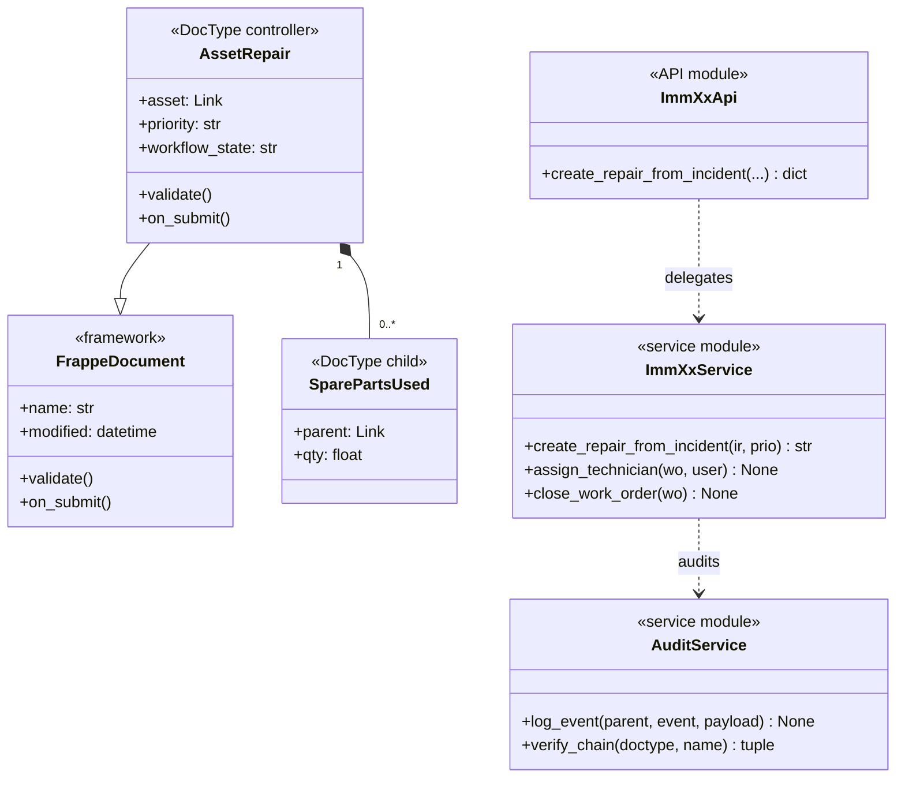
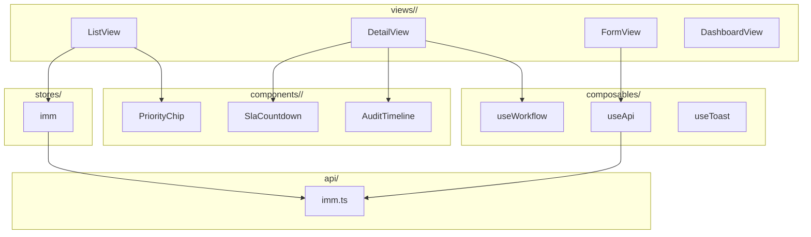

# 03 — Biểu đồ kỹ thuật (UML Diagrams)

| Mục | Giá trị |
|---|---|
| Module | IMM-`<XX>` |
| Phạm vi | Per-module |
| Owner | System Analyst / Tech Lead / DBA |
| Liên kết | 02 Analysis & Design (Use Case) · 04 Backend Design (impl) |

> **Mục đích**: Tất cả biểu đồ UML cấp kỹ thuật — ERD (data), Class (code structure), Sequence (flow theo thời gian), Communication (component topology). Mỗi biểu đồ phục vụ 1 audience khác nhau.

---

# Phần I — Entity Relationship Diagram (ERD)

## I.1. ERD logic
**Viết gì**: Mermaid `erDiagram` cho mọi entity module sở hữu + entity tham chiếu cross-module. Mỗi entity show attribute chính + PK/FK.

```mermaid
erDiagram
    AC_ASSET ||--o{ ASSET_REPAIR : "has"
    AC_ASSET ||--o{ LIFECYCLE_EVENT : "emits"
    INCIDENT_REPORT ||--o| ASSET_REPAIR : "triggers"
    ASSET_REPAIR ||--o{ SPARE_PARTS_USED : "consumes"
    ASSET_REPAIR ||--o{ IMM_AUDIT_TRAIL : "logs"
    ASSET_REPAIR }o--|| USER : "assigned_to"

    AC_ASSET {
        string name PK
        string serial UNIQUE
        Link device_model FK
        Select status
    }
    ASSET_REPAIR {
        string name PK
        Link asset FK
        Select source_type
        DynamicLink source_name FK
        Select priority
        Datetime sla_due_at
        string workflow_state
    }
    IMM_AUDIT_TRAIL {
        Link parent_doctype FK
        string parent_name FK
        string event_type
        string prev_hash
        string hash
    }
```

## I.2. Cardinality cheatsheet
**Viết gì**: Bảng quy ước Mermaid notation (`||--o{`, `}o--||`, `}o--o{`, `||--||`). Giải thích 1:1, 1:N, M:N.

## I.3. Entity catalog
**Viết gì**: 2 phần — (a) Entities module sở hữu: mô tả + DocType file path + naming series + lifecycle + volume dự kiến. (b) Entities tham chiếu cross-module: bảng `Entity · Owner module · Vai trò ở module này`.

## I.4. Data dictionary (Schema CSDL chi tiết)
**Viết gì**: **1 bảng riêng cho MỖI entity / DocType** (cả entity sở hữu lẫn entity tham chiếu chính). Mỗi bảng có cột: `Field · Type · Length · Required · Default · PII · Validation · Mô tả`. Đánh dấu PII rõ.

**Pattern**:

```markdown
### Bảng N.X: <DocType name>

| Field | Type | Length | Required | Default | PII | Validation | Mô tả |
|---|---|---|---|---|---|---|---|
| name | varchar | 30 | ✓ | autoname | — | format <pattern> | PK |
| <field> | <type> | ... | ... | ... | ... | ... | ... |
```

**Mẹo**: Khi module có ≥ 5 DocType, mỗi DocType 1 bảng riêng — không gộp tất cả vào 1 bảng dài (khó đọc, khó in báo cáo). Đánh số bảng liên tục `Bảng N.1`, `Bảng N.2` … để tự động xuất danh mục bảng biểu (file 11).

## I.5. Constraints & indexes
**Viết gì**: 3 mục con — Unique constraints, FK logic (Frappe Link), Indexes (đăng ký trong DocType JSON `search_fields` hoặc patch).

## I.6. Naming conventions
**Viết gì**: Bảng `Object · Convention · Ví dụ`. Cover: Entity logic, DocType file, DB table, Field, FK field, Boolean, Datetime, Date, Count/Sum, Enum.

## I.7. Mapping ERD → DocType
**Viết gì**: Bảng `Concept ERD · DocType JSON tương ứng`. Cấm: tạo DocType cho mỗi sub-type entity, lưu data redundancy không có lý do.

## I.8. Volume & retention
**Viết gì**: Bảng `Entity · Volume/năm/site · Retention · Archive policy`. NĐ98 yêu cầu ≥ 5 năm cho audit-relevant.

## I.9. Data classification & PII
**Viết gì**: Bảng `Loại data · Trường · Sensitivity (Low/Medium/High) · Storage/Transport`. Khẳng định KHÔNG lưu patient data.

---

# Phần II — Class Diagram

## II.1. Class Diagram — 2 cấp (theo pattern đồ án)

### II.1.a. Biểu đồ lớp tổng quát
**Viết gì**: Mermaid `classDiagram` show 4 layer (DocType controller, Service, API, Repository optional) + framework (Frappe Document, Workflow). Mỗi class chỉ có **attribute + method chính** (không cần đầy đủ).

### II.1.b. Biểu đồ lớp chi tiết per major class
**Viết gì**: Cho mỗi class lớn (≥ 10 attribute hoặc ≥ 5 method public), vẽ 1 biểu đồ riêng với **đầy đủ** attribute (+ type, visibility) + method (+ signature, return type, exception).

**Khi nào vẽ chi tiết**: cho class quan trọng nhất của module — thường 3-5 class / module:
- Controller chính (DocType controller chính của module)
- Service module chính (gom phần lớn business logic)
- Service cross-cutting nếu module sở hữu (audit, SLA, scoring engine…)
- DTO / Value Object phức tạp
- Class hierarchy có inheritance / strategy pattern

```mermaid
classDiagram
    class AssetRepair {
        <<DocType controller>>
        +name: str
        +asset: Link AC Asset
        +source_type: Select
        +source_name: DynamicLink
        +priority: Select{Normal,Urgent,Emergency}
        +symptom_description: Text
        +assignee: Link User
        +workflow_state: str
        +sla_due_at: datetime
        +opened_at: datetime
        +closed_at: datetime
        +total_cost: Currency
        +diagnosis_note: Text
        +internal_note: Text
        +cancellation_reason: Text
        +validate() None
        +before_save() None
        +on_submit() None
        +on_update_after_submit() None
        +on_cancel() None
        -_compute_total_cost() None
    }
```

**Mẹo**: Class diagram tổng giúp hiểu **kiến trúc**; class diagram chi tiết giúp hiểu **nội tại 1 class**. Bổ sung lẫn nhau.



## II.2. Layer mapping
**Viết gì**: Mermaid `flowchart` show class group theo layer + dependency direction (API → Service → DocType → Framework).

## II.3. Class catalog
**Viết gì**: Mục con cho mỗi nhóm class: DocType controllers (file + inherits + hooks), Service modules (file + public + private + dependencies), API modules, Repository (optional), DTO, Enum (ErrorCode), Exception (ServiceError).

## II.4. Relationships glossary
**Viết gì**: Bảng `Symbol · Mermaid syntax · Ý nghĩa`. Cover: Inheritance, Composition, Aggregation, Association, Dependency, Realization.

## II.5. Stereotypes
**Viết gì**: Bảng `Stereotype · Khi dùng`. Phổ biến: `<<framework>>`, `<<DocType controller>>`, `<<service module>>`, `<<API module>>`, `<<dataclass>>`, `<<enum>>`, `<<exception>>`.

## II.6. Class design principles
**Viết gì**: 4-5 nguyên tắc — SRP, OCP, DI, avoid God Class. Mỗi nguyên tắc 2-3 dòng áp dụng AssetCore.

## II.7. Sub-feature class diagrams
**Viết gì**: Mỗi sub-feature phức tạp (audit chain, SLA compute…) có 1 class diagram chi tiết riêng.

---

# Phần III — Sequence Diagram

## III.1. Khi nào vẽ sequence?
**Viết gì**: Bảng `Tình huống · Vẽ?`. ✓ cho: > 3 component, async, nhiều error path, integration ngoài, workflow đa bước. ✗ cho: GET đơn, CRUD đơn.

## III.2. Convention
**Viết gì**: 2 mục con — (a) Bảng actor/participant chuẩn (User, Browser, API, Service, DocType, Workflow, Audit, DB, Cache, Queue, External), (b) Mermaid syntax (`->>` sync, `-->>` reply, `-)` async, `alt/else/end`, `loop`, `par`).

## III.3. Sequence diagrams chính
**Viết gì**: Mỗi UC quan trọng (02 §III) → 1 sequence. Vẽ 3 dạng: Happy path · Alternative · Exception.

```mermaid
sequenceDiagram
    actor KTV
    participant Browser
    participant API as api.imm09
    participant Svc as services.imm09
    participant Doc as Asset Repair
    participant Aud as services.audit
    database DB

    KTV->>Browser: click "Tạo WO"
    Browser->>API: POST create_repair_from_incident
    API->>Svc: create_repair_from_incident(ir, prio)
    Svc->>DB: get IR + asset
    DB-->>Svc: rows

    alt asset.status == Decommissioned
        Svc-->>API: ServiceError(STATE_ASSET_DECOMMISSIONED)
        API-->>Browser: 417
    else
        Svc->>Doc: insert
        Doc->>DB: INSERT
        Svc->>Aud: log_event(repair_opened)
        Aud->>DB: INSERT audit chain
        Svc-->>API: wo_name
        API-->>Browser: 200
    end
```

## III.4. Checklist tránh sót
**Viết gì**: Liệt kê: activation bar, async dùng `-)`, error path `alt fail/else`, DB round-trip, cache lookup, permission check, audit log line, lifecycle event emit.

## III.5. Cross-reference
**Viết gì**: Bảng `Sequence · Use Case · Service function · Test case`.

---

# Phần IV — Communication Diagram

## IV.1. Khi nào dùng?
**Viết gì**: Bảng `Tình huống · Communication? · Sequence?`. Communication mạnh khi: ≥ 5 object, cần thấy DB là central hub, cross-module decoupled bridge. Vẽ BỔ SUNG khi Sequence chưa đủ.

## IV.2. Convention
**Viết gì**: 2 mục con — (a) Notation UML (object `name:Class`, link, message numbered `1.`, `2.1`), (b) Tool: PlantUML preferred, Mermaid flowchart workaround.

## IV.3. Numbering scheme
**Viết gì**: Quy ước số: `1.` top-level, `2.1.` sub-message từ caller của 2, `[3a]` alternative, `[3.1*]` loop.

## IV.4. Communication diagrams chính
**Viết gì**: Vẽ cho ≥ 2 flow phức tạp hoặc cross-module.

```plantuml
@startuml
object "browser:VueSPA" as B
object ":ApiImm09" as API
object ":ServiceImm09" as SVC
object ":AssetRepairDoc" as DOC
object ":AuditService" as AUD
database ":MariaDB" as DB

B   --> API : 1: POST create_repair_from_incident
API --> SVC : 2: create_repair_from_incident
SVC --> DB  : 2.1: SELECT IR + asset
SVC --> DOC : 3: insert
DOC --> DB  : 3.1: INSERT
SVC --> AUD : 4: log_event
AUD --> DB  : 4.1: SELECT prev_hash
AUD --> DB  : 4.2: INSERT audit
SVC --> API : 5: return wo_name
API --> B   : 6: 200 response
@enduml
```

## IV.5. Cross-reference
**Viết gì**: Bảng `Comm diagram · UC · Sequence equivalent · Lý do vẽ Comm`.

---

# Phần V — Package / Dependency Diagram

> Hiển thị **cấu trúc gói** (module / namespace) + dependency giữa chúng. Khác Class diagram (chi tiết class) — Package diagram nhìn ở mức cao hơn (gói chứa nhiều class).

## V.1. Khi nào vẽ?
**Viết gì**: Vẽ khi module có ≥ 4 sub-package hoặc cross-module integration cần làm rõ. Bỏ qua nếu module nhỏ (1-2 file service). Mục tiêu: developer mới onboard thấy **bản đồ code** trong 5 phút.

## V.2. Backend package diagram
**Viết gì**: Mermaid `flowchart` show package structure + dependency. Mỗi package = 1 thư mục Python.

```mermaid
flowchart TB
    subgraph api["api/"]
        ApiImm["api.imm<XX>"]
        ApiAuth["api.auth"]
    end
    subgraph services["services/"]
        SvcImm["services.imm<XX>"]
        SvcAudit["services.audit"]
        SvcShared["services.shared<br/>(constants, dto)"]
    end
    subgraph doctype["assetcore/doctype/"]
        DocAR["asset_repair/"]
        DocSP["spare_parts_used/"]
        DocAT["imm_audit_trail/"]
    end
    subgraph repo["repositories/"]
        RepoImm["repositories.imm<XX>_repo"]
    end
    subgraph tasks["tasks/"]
        TaskCron["tasks.imm<XX>"]
    end

    ApiImm --> SvcImm
    SvcImm --> SvcAudit
    SvcImm --> SvcShared
    SvcImm --> RepoImm
    SvcImm -.> DocAR
    SvcAudit -.> DocAT
    TaskCron --> SvcImm
    DocAR --> SvcImm
    DocSP --> DocAR
```

## V.3. Frontend package diagram
**Viết gì**: Mermaid show structure FE — views / components / stores / composables / api / router.



## V.4. Cross-module dependency
**Viết gì**: Mermaid show cross-module dependency. Nguyên tắc: module CHỈ chia sẻ qua master / Lifecycle Event / Audit (không import service chéo).

## V.5. Anti-patterns
**Viết gì**: 4-5 (circular dependency, package God-class, import service chéo module, FE component import store của module khác, BE service import controller doctype khác — phải qua repository/service).

---

## DoD — File 03 hoàn chỉnh

### I. ERD
- [ ] ERD diagram render Mermaid
- [ ] Mọi entity sở hữu có catalog entry
- [ ] **Data dictionary chi tiết — 1 bảng riêng per DocType** (không gộp)
- [ ] Unique constraint + index liệt kê
- [ ] Volume + retention đủ
- [ ] Data classification + PII rõ

### II. Class Diagram
- [ ] **Diagram tổng quát** đủ 4 layer + framework (attribute + method **chính**)
- [ ] **Diagram chi tiết per major class** cho ≥ 3 class lớn (attribute + method **đầy đủ**)
- [ ] Stereotype gắn đúng
- [ ] Relationship đa số là composition / dependency

### III. Sequence Diagram
- [ ] Mỗi UC phức tạp có ≥ 1 diagram
- [ ] Happy + ≥ 1 alt + ≥ 1 exception
- [ ] Audit log line trong mọi mutation diagram
- [ ] Error path có `alt/else/end`

### IV. Communication Diagram
- [ ] Vẽ cho ≥ 2 flow phức tạp hoặc cross-module
- [ ] Mỗi message numbered (1, 2, 2.1, …)
- [ ] DB / external system hiển thị

### V. Package / Dependency Diagram
- [ ] BE package diagram render Mermaid
- [ ] FE package diagram render Mermaid
- [ ] Cross-module dependency vẽ rõ (nếu có)
- [ ] Không có circular dependency
- [ ] Reviewed bởi DBA + Tech Lead + System Analyst
