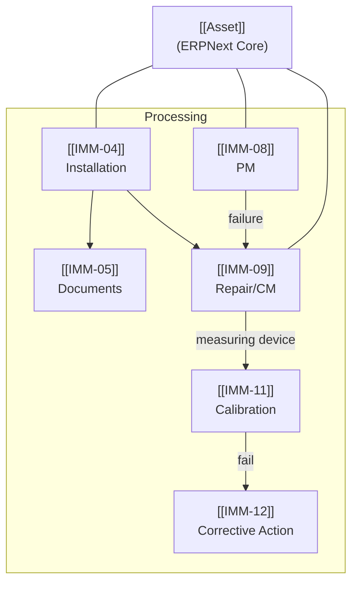

# AssetCore — Map of Content

> Wave 1 Scope: IMM-04, IMM-05, IMM-08, IMM-09, IMM-11, IMM-12  
> Generated: `2026-04-17 17:23`

## Modules

- [[IMM-04]] — IMM-04 — Asset Installation & Commissioning
- [[IMM-05]] — IMM-05 — Asset Document Management (NĐ 98/2021)
- [[IMM-08]] — IMM-08 — Preventive Maintenance (PM)
- [[IMM-09]] — IMM-09 — Corrective Maintenance (CM / Repair)
- [[IMM-11]] — IMM-11 — Calibration
- [[IMM-12]] — IMM-12 — Corrective Action / Incident Management

## DocTypes

- [[Asset]]
- [[Asset Commissioning]]
- [[Asset Repair]]
- [[Asset Document]]
- [[Asset QA Non Conformance]]
- [[Document Request]]
- [[Expiry Alert Log]]
- [[Required Document Type]]
- [[Commissioning Checklist]]
- [[Commissioning Document Record]]

## Business Rules

- [[BR_VR-01]] — `IMM-04` — Serial Number Uniqueness
- [[BR_VR-02]] — `IMM-04` — Required Documents Gate
- [[BR_VR-03]] — `IMM-04` — Baseline Test Completion
- [[BR_VR-04]] — `IMM-04` — Non-Conformance Release Block
- [[BR_VR-07]] — `IMM-04` — Radiation Device License Hold
- [[BR_GW-2]] — `IMM-04 → IMM-05` — IMM-05 Document Compliance Gateway
- [[BR_BR-07]] — `IMM-04 → IMM-05` — Auto-Import Document Set
- [[BR_IMM05-VR-01]] — `IMM-05` — Expiry After Issued Date
- [[BR_IMM05-VR-02]] — `IMM-05` — Unique Document Number
- [[BR_IMM05-VR-07]] — `IMM-05` — Legal/Certification Requires Expiry Date
- [[BR_IMM05-VR-08]] — `IMM-05` — File Format Validation
- [[BR_IMM05-VR-10]] — `IMM-05` — Exempt Fields Required
- [[BR_BR-SLA-PM]] — `IMM-08` — PM Next Due Date Calculation
- [[BR_BR-12-P1]] — `IMM-12` — P1 Incident SLA Escalation

## Quick Navigation

| Category | Links |
|----------|-------|
| Core DocTypes | [[Asset]] · [[Asset Commissioning]] · [[Asset Repair]] · [[Asset Document]] |
| Child Tables | [[Commissioning Checklist]] · [[Commissioning Document Record]] |
| QA | [[Asset QA Non Conformance]] · [[Expiry Alert Log]] |
| Modules | [[IMM-04]] · [[IMM-05]] · [[IMM-08]] · [[IMM-09]] · [[IMM-11]] · [[IMM-12]] |
