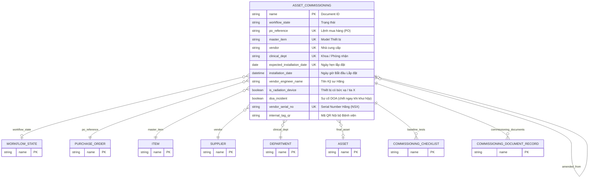

# Asset Commissioning

> **Module:** `IMM-04` | **App:** `assetcore` | **Generated:** 2026-04-17 17:23

## Entity Relationship

## Workflow — IMM-04 State Machine

```mermaid
flowchart TD
    DraftReception["Draft_Reception\n👤 HTM Technician"]
    style DraftReception fill:#4CAF50,color:#fff
    PendingDocVerify{"Pending_Doc_Verify\n👤 TBYT Officer"}
    style PendingDocVerify fill:#FF9800,color:#fff
    DraftReception --> PendingDocVerify
    ToBeInstalled["To_Be_Installed\n👤 Clinical Head"]
    style ToBeInstalled fill:#2196F3,color:#fff
    PendingDocVerify --> ToBeInstalled
    Installing["Installing\n👤 Vendor Tech"]
    style Installing fill:#2196F3,color:#fff
    ToBeInstalled --> Installing
    Identification["Identification\n👤 Biomed Engineer"]
    style Identification fill:#2196F3,color:#fff
    Installing --> Identification
    InitialInspection{"Initial_Inspection\n👤 Biomed Engineer"}
    style InitialInspection fill:#FF9800,color:#fff
    Identification --> InitialInspection
    NonConformance["Non_Conformance\n👤 Biomed/Vendor"]
    style NonConformance fill:#F44336,color:#fff
    InitialInspection --> NonConformance
    ClinicalHold{"Clinical_Hold\n👤 QA Officer"}
    style ClinicalHold fill:#FF9800,color:#fff
    NonConformance --> ClinicalHold
    ReInspection["Re_Inspection\n👤 Biomed Engineer"]
    style ReInspection fill:#2196F3,color:#fff
    ClinicalHold --> ReInspection
    PendingRelease{"Pending_Release\n👤 Workshop Head"}
    style PendingRelease fill:#FF9800,color:#fff
    ReInspection --> PendingRelease
    ClinicalRelease{"Clinical_Release\n👤 VP Block2"}
    style ClinicalRelease fill:#FF9800,color:#fff
    PendingRelease --> ClinicalRelease
    ClinicalReleaseSuccess(["Clinical_Release_Success\n👤 Board/CEO"])
    style ClinicalReleaseSuccess fill:#607D8B,color:#fff
    ClinicalRelease --> ClinicalReleaseSuccess
    ReturnToVendor(["Return_To_Vendor\n👤 Board"])
    style ReturnToVendor fill:#607D8B,color:#fff
    ClinicalReleaseSuccess --> ReturnToVendor
```

## Overview

**IMM-04** — Phiếu Lắp đặt & Nghiệm thu. Manages the full installation lifecycle from goods receipt (Draft) through QA inspection to Clinical Release. Creates the ERPNext Asset on successful submission.

## Fields

| Fieldname | Type | Label | Required | Options/Link |
|-----------|------|-------|----------|-------------|
| `workflow_state` | `Link` | Trạng thái |  | [[Workflow State]] |
| `po_reference` | `Link` | Lệnh mua hàng (PO) | ✅ | [[Purchase Order]] |
| `master_item` | `Link` | Model Thiết bị | ✅ | [[Item]] |
| `vendor` | `Link` | Nhà cung cấp | ✅ | [[Supplier]] |
| `clinical_dept` | `Link` | Khoa / Phòng nhận | ✅ | [[Department]] |
| `expected_installation_date` | `Date` | Ngày hẹn lắp đặt | ✅ |  |
| `installation_date` | `Datetime` | Ngày giờ Bắt đầu Lắp đặt |  |  |
| `vendor_engineer_name` | `Data` | Tên Kỹ sư Hãng |  |  |
| `is_radiation_device` | `Check` | Thiết bị có bức xạ / tia X |  |  |
| `doa_incident` | `Check` | Sự cố DOA (chết ngay khi khui hộp) |  |  |
| `vendor_serial_no` | `Data` | Serial Number Hãng (NSX) | ✅ |  |
| `internal_tag_qr` | `Data` | Mã QR Nội bộ Bệnh viện |  |  |
| `custom_moh_code` | `Data` | Mã BYT (Bộ Y tế) |  |  |
| `site_photo` | `Attach Image` | Ảnh Xác nhận Mặt bằng |  |  |
| `installation_evidence` | `Attach` | Bằng chứng Hoàn tất Lắp đặt |  |  |
| `qa_license_doc` | `Attach` | Giấy phép BYT / Cục An toàn Bức xạ |  |  |
| `baseline_tests` | `Table` | Lưới Đo kiểm An toàn Điện | ✅ | [[Commissioning Checklist]] |
| `commissioning_documents` | `Table` | Bảng kiểm Hồ sơ |  | [[Commissioning Document Record]] |
| `amend_reason` | `Small Text` | Lý do Sửa đổi (Amend) |  |  |
| `final_asset` | `Link` | Tài sản được tạo ra |  | [[Asset]] |
| `amended_from` | `Link` | Sửa đổi từ |  | [[Asset Commissioning]] |

## Outgoing Links (Link Fields)

- `workflow_state` → [[Workflow State]]
- `po_reference` → [[Purchase Order]] *(required)*
- `master_item` → [[Item]] *(required)*
- `vendor` → [[Supplier]] *(required)*
- `clinical_dept` → [[Department]] *(required)*
- `final_asset` → [[Asset]]
- `amended_from` → [[Asset Commissioning]]

## Child Tables

- `baseline_tests` → [[Commissioning Checklist]]
- `commissioning_documents` → [[Commissioning Document Record]]

## Business Rules

- [[BR_VR-01]] — **Serial Number Uniqueness**
  - Trigger: `validate()`
  - Block: Throw ValidationError khi trùng serial.
- [[BR_VR-02]] — **Required Documents Gate**
  - Trigger: `validate() khi workflow_state ∈ {Pending_Handover, Installing, Identification, Initial_Inspection, Re_Inspection, Pending_Release, Clinical_Release}`
  - Block: Throw ValidationError nếu CQ hoặc CO != Received.
- [[BR_VR-03]] — **Baseline Test Completion**
  - Trigger: `validate() khi workflow_state ∈ {Initial_Inspection, Re_Inspection, Clinical_Release}`
  - Block: VR-03a: Thiếu result. VR-03b: Có Fail nhưng cố Release.
- [[BR_VR-04]] — **Non-Conformance Release Block**
  - Trigger: `validate() khi workflow_state = Clinical_Release`
  - Block: Throw kèm danh sách NC chưa đóng.
- [[BR_VR-07]] — **Radiation Device License Hold**
  - Trigger: `validate() khi is_radiation_device = True AND workflow_state ∈ {Clinical_Release, Pending_Release}`
  - Block: Throw VR-07 nếu qa_license_doc trống.
- [[BR_GW-2]] — **IMM-05 Document Compliance Gateway**
  - Trigger: `validate() khi workflow_state ∈ {Clinical_Release, Pending_Release} AND final_asset IS SET`
  - Block: Throw kèm message 'GW-2 Compliance Block'.
- [[BR_BR-07]] — **Auto-Import Document Set**
  - Trigger: `on_submit() — sau khi mint_core_asset()`
  - Block: N/A — auto-create, log error nếu thất bại.

## Related DocTypes

- [[Asset]]
- [[Asset Commissioning]]
- [[Commissioning Checklist]]
- [[Commissioning Document Record]]
- [[Department]]
- [[Item]]
- [[Purchase Order]]
- [[Supplier]]
- [[Workflow State]]
