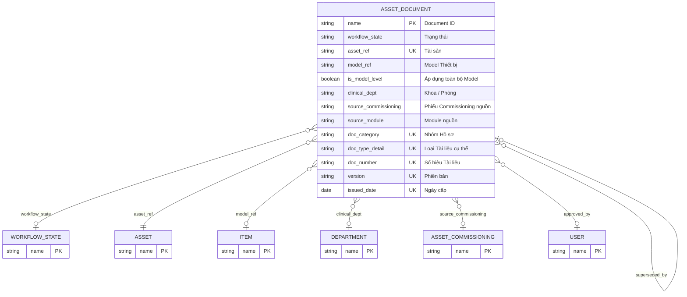

# Asset Document

> **Module:** `IMM-05` | **App:** `assetcore` | **Generated:** 2026-04-17 17:23

## Entity Relationship

## Overview

**IMM-05** — Kho Hồ sơ Thiết bị. Stores all legal, technical, and certification documents. Enforces NĐ 98/2021 compliance with automatic expiry alerting at 90/60/30/0 day thresholds.

## Fields

| Fieldname | Type | Label | Required | Options/Link |
|-----------|------|-------|----------|-------------|
| `workflow_state` | `Link` | Trạng thái |  | [[Workflow State]] |
| `asset_ref` | `Link` | Tài sản | ✅ | [[Asset]] |
| `model_ref` | `Link` | Model Thiết bị |  | [[Item]] |
| `is_model_level` | `Check` | Áp dụng toàn bộ Model |  |  |
| `clinical_dept` | `Link` | Khoa / Phòng |  | [[Department]] |
| `source_commissioning` | `Link` | Phiếu Commissioning nguồn |  | [[Asset Commissioning]] |
| `source_module` | `Data` | Module nguồn |  |  |
| `doc_category` | `Select` | Nhóm Hồ sơ | ✅ | Legal
Technical
Certification
Training
QA |
| `doc_type_detail` | `Data` | Loại Tài liệu cụ thể | ✅ |  |
| `doc_number` | `Data` | Số hiệu Tài liệu | ✅ |  |
| `version` | `Data` | Phiên bản | ✅ |  |
| `issued_date` | `Date` | Ngày cấp | ✅ |  |
| `expiry_date` | `Date` | Ngày hết hạn |  |  |
| `issuing_authority` | `Data` | Cơ quan cấp |  |  |
| `days_until_expiry` | `Int` | Số ngày còn lại |  |  |
| `is_expired` | `Check` | Đã hết hạn |  |  |
| `file_attachment` | `Attach` | File Tài liệu | ✅ |  |
| `file_name_display` | `Data` | Tên file |  |  |
| `approved_by` | `Link` | Người phê duyệt |  | [[User]] |
| `approval_date` | `Date` | Ngày phê duyệt |  |  |
| `rejection_reason` | `Small Text` | Lý do Từ chối |  |  |
| `superseded_by` | `Link` | Thay thế bởi |  | [[Asset Document]] |
| `archived_by_version` | `Data` | Lý do Archive |  |  |
| `archive_date` | `Date` | Ngày Archive |  |  |
| `change_summary` | `Small Text` | Tóm tắt thay đổi |  |  |
| `visibility` | `Select` | Phạm vi xem |  | Public
Internal_Only |
| `is_exempt` | `Check` | Miễn đăng ký NĐ98 |  |  |
| `exempt_reason` | `Small Text` | Lý do miễn đăng ký |  |  |
| `exempt_proof` | `Attach` | Văn bản miễn đăng ký |  |  |
| `notes` | `Text Editor` | Ghi chú nội bộ |  |  |

## Outgoing Links (Link Fields)

- `workflow_state` → [[Workflow State]]
- `asset_ref` → [[Asset]] *(required)*
- `model_ref` → [[Item]]
- `clinical_dept` → [[Department]]
- `source_commissioning` → [[Asset Commissioning]]
- `approved_by` → [[User]]
- `superseded_by` → [[Asset Document]]

## Business Rules

- [[BR_IMM05-VR-01]] — **Expiry After Issued Date**
  - Trigger: `validate()`
  - Block: Throw VR-01 nếu expiry_date <= issued_date.
- [[BR_IMM05-VR-02]] — **Unique Document Number**
  - Trigger: `validate()`
  - Block: Throw VR-02 nếu trùng.
- [[BR_IMM05-VR-07]] — **Legal/Certification Requires Expiry Date**
  - Trigger: `validate() khi doc_category ∈ {Legal, Certification}`
  - Block: Throw VR-07.
- [[BR_IMM05-VR-08]] — **File Format Validation**
  - Trigger: `validate() khi file_attachment IS SET`
  - Block: Throw VR-08 nếu sai định dạng.
- [[BR_IMM05-VR-10]] — **Exempt Fields Required**
  - Trigger: `validate() khi is_exempt = True`
  - Block: Throw VR-10.

## Related DocTypes

- [[Asset]]
- [[Asset Commissioning]]
- [[Asset Document]]
- [[Department]]
- [[Item]]
- [[User]]
- [[Workflow State]]
