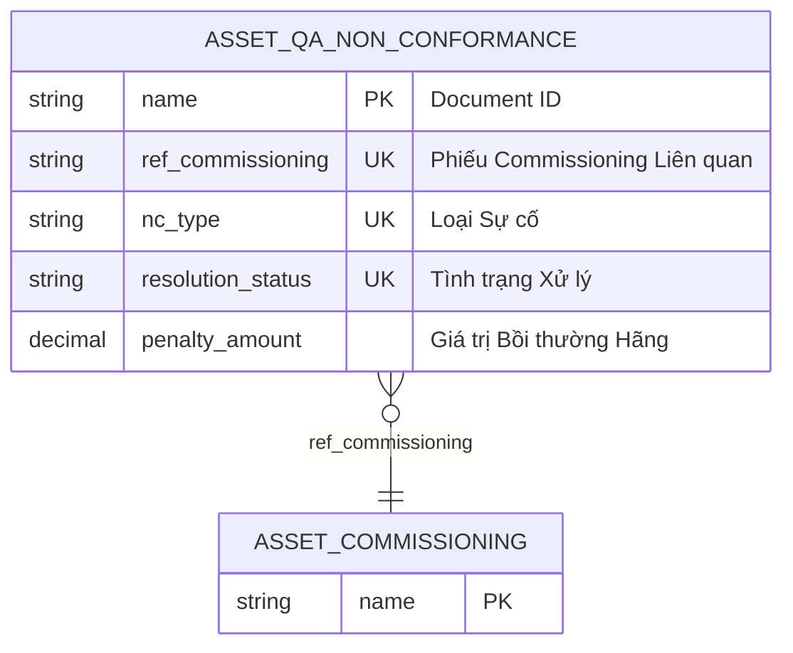

# Asset QA Non Conformance

> **Module:** `IMM-04` | **App:** `assetcore` | **Generated:** 2026-04-17 17:23

## Entity Relationship

## Overview

DOA/Damage incident report linked to Asset Commissioning. Blocks Clinical Release until resolved (VR-04).

## Fields

| Fieldname | Type | Label | Required | Options/Link |
|-----------|------|-------|----------|-------------|
| `ref_commissioning` | `Link` | Phiếu Commissioning Liên quan | ✅ | [[Asset Commissioning]] |
| `nc_type` | `Select` | Loại Sự cố | ✅ | DOA
Missing
Crash
Other |
| `resolution_status` | `Select` | Tình trạng Xử lý | ✅ | Open
Fixed
Return |
| `description` | `Small Text` | Mô tả Sự cố | ✅ |  |
| `damage_proof` | `Attach Image` | Ảnh Bằng chứng Hỏng hóc |  |  |
| `resolution_note` | `Text` | Ghi chú Cách khắc phục |  |  |
| `penalty_amount` | `Currency` | Giá trị Bồi thường Hãng |  |  |

## Outgoing Links (Link Fields)

- `ref_commissioning` → [[Asset Commissioning]] *(required)*

## Related DocTypes

- [[Asset Commissioning]]
