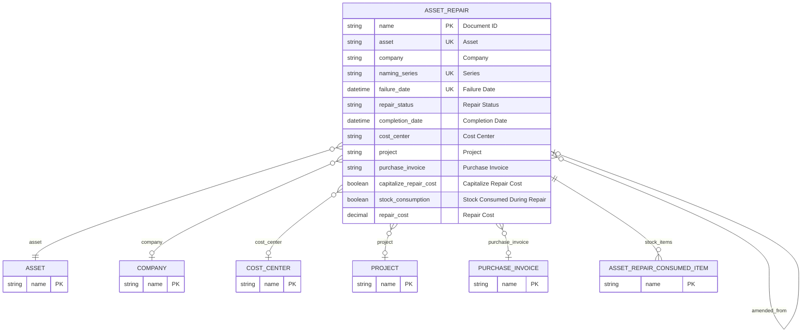

# Asset Repair

> **Module:** `IMM-09` | **App:** `assetcore` | **Generated:** 2026-04-17 17:23

## Entity Relationship

## Overview

ERPNext core Asset Repair record. Tracks corrective maintenance events, repair costs, and spare parts consumed. Maps to **IMM-09** in AssetCore workflow.

## Fields

| Fieldname | Type | Label | Required | Options/Link |
|-----------|------|-------|----------|-------------|
| `asset` | `Link` | Asset | ✅ | [[Asset]] |
| `company` | `Link` | Company |  | [[Company]] |
| `naming_series` | `Select` | Series | ✅ | ACC-ASR-.YYYY.- |
| `failure_date` | `Datetime` | Failure Date | ✅ |  |
| `repair_status` | `Select` | Repair Status |  | Pending
Completed
Cancelled |
| `completion_date` | `Datetime` | Completion Date |  |  |
| `cost_center` | `Link` | Cost Center |  | [[Cost Center]] |
| `project` | `Link` | Project |  | [[Project]] |
| `purchase_invoice` | `Link` | Purchase Invoice |  | [[Purchase Invoice]] |
| `capitalize_repair_cost` | `Check` | Capitalize Repair Cost |  |  |
| `stock_consumption` | `Check` | Stock Consumed During Repair |  |  |
| `repair_cost` | `Currency` | Repair Cost |  |  |
| `stock_items` | `Table` | Stock Items |  | [[Asset Repair Consumed Item]] |
| `total_repair_cost` | `Currency` | Total Repair Cost |  |  |
| `increase_in_asset_life` | `Int` | Increase In Asset Life(Months) |  |  |
| `description` | `Long Text` | Error Description |  |  |
| `actions_performed` | `Long Text` | Actions performed |  |  |
| `downtime` | `Data` | Downtime |  |  |
| `amended_from` | `Link` | Amended From |  | [[Asset Repair]] |

## Outgoing Links (Link Fields)

- `asset` → [[Asset]] *(required)*
- `company` → [[Company]]
- `cost_center` → [[Cost Center]]
- `project` → [[Project]]
- `purchase_invoice` → [[Purchase Invoice]]
- `amended_from` → [[Asset Repair]]

## Child Tables

- `stock_items` → [[Asset Repair Consumed Item]]

## Related DocTypes

- [[Asset]]
- [[Asset Repair]]
- [[Asset Repair Consumed Item]]
- [[Company]]
- [[Cost Center]]
- [[Project]]
- [[Purchase Invoice]]
