# Asset

> **Module:** `ERPNext Core` | **App:** `assetcore` | **Generated:** 2026-04-17 17:23

## Entity Relationship

```mermaid
erDiagram
    ASSET {
        string name PK "Document ID"
        string company UK "Company"
        string item_code UK "Item Code"
        string asset_owner "Asset Owner"
        string asset_owner_company "Asset Owner Company"
        boolean is_existing_asset "Is Existing Asset"
        boolean is_composite_asset "Is Composite Asset"
        string supplier "Supplier"
        string customer "Customer"
        string journal_entry_for_scrap "Journal Entry for Scrap"
        string naming_series "Naming Series"
        string asset_name UK "Asset Name"
        string custom_vendor_serial "Vendor Serial No"
    }
    COMPANY {
        string name PK
    }
    ASSET }o--|| COMPANY : "company"
    ITEM {
        string name PK
    }
    ASSET }o--|| ITEM : "item_code"
    ASSET }o--|o COMPANY : "asset_owner_company"
    SUPPLIER {
        string name PK
    }
    ASSET }o--|o SUPPLIER : "supplier"
    CUSTOMER {
        string name PK
    }
    ASSET }o--|o CUSTOMER : "customer"
    JOURNAL_ENTRY {
        string name PK
    }
    ASSET }o--|o JOURNAL_ENTRY : "journal_entry_for_scrap"
    ASSET_COMMISSIONING {
        string name PK
    }
    ASSET }o--|o ASSET_COMMISSIONING : "custom_comm_ref"
    ASSET_CATEGORY {
        string name PK
    }
    ASSET }o--|o ASSET_CATEGORY : "asset_category"
    LOCATION {
        string name PK
    }
    ASSET }o--|| LOCATION : "location"
    ASSET }o--|o ASSET : "split_from"
    EMPLOYEE {
        string name PK
    }
    ASSET }o--|o EMPLOYEE : "custodian"
    DEPARTMENT {
        string name PK
    }
    ASSET }o--|o DEPARTMENT : "department"
    COST_CENTER {
        string name PK
    }
    ASSET }o--|o COST_CENTER : "cost_center"
    PURCHASE_RECEIPT {
        string name PK
    }
    ASSET }o--|o PURCHASE_RECEIPT : "purchase_receipt"
    PURCHASE_INVOICE {
        string name PK
    }
    ASSET }o--|o PURCHASE_INVOICE : "purchase_invoice"
    FINANCE_BOOK {
        string name PK
    }
    ASSET }o--|o FINANCE_BOOK : "default_finance_book"
    ASSET }o--|o ASSET : "amended_from"
    ASSET_FINANCE_BOOK {
        string name PK
    }
    ASSET ||--o{ ASSET_FINANCE_BOOK : "finance_books"
```

## Overview

ERPNext core Fixed Asset record. Represents a physical device registered in the system. Extended by AssetCore with custom fields (vendor_serial, comm_ref, doc_completeness).

## Fields

| Fieldname | Type | Label | Required | Options/Link |
|-----------|------|-------|----------|-------------|
| `company` | `Link` | Company | ✅ | [[Company]] |
| `item_code` | `Link` | Item Code | ✅ | [[Item]] |
| `asset_owner` | `Select` | Asset Owner |  | 
Company
Supplier
Customer |
| `asset_owner_company` | `Link` | Asset Owner Company |  | [[Company]] |
| `is_existing_asset` | `Check` | Is Existing Asset |  |  |
| `is_composite_asset` | `Check` | Is Composite Asset |  |  |
| `supplier` | `Link` | Supplier |  | [[Supplier]] |
| `customer` | `Link` | Customer |  | [[Customer]] |
| `image` | `Attach Image` | Image |  |  |
| `journal_entry_for_scrap` | `Link` | Journal Entry for Scrap |  | [[Journal Entry]] |
| `naming_series` | `Select` | Naming Series |  | ACC-ASS-.YYYY.- |
| `asset_name` | `Data` | Asset Name | ✅ |  |
| `custom_vendor_serial` | `Data` | Vendor Serial No |  |  |
| `custom_internal_qr` | `Data` | Internal QR Tag |  |  |
| `custom_comm_ref` | `Link` | Commissioning Ref |  | [[Asset Commissioning]] |
| `custom_doc_completeness_pct` | `Percent` | Doc Completeness % |  |  |
| `custom_document_status` | `Select` | Document Status |  | 
Compliant
Non-Compliant
Expiring_Soon
Incomplete
Compliant (Exempt) |
| `custom_doc_status_summary` | `Data` | Doc Status Summary |  |  |
| `asset_category` | `Link` | Asset Category |  | [[Asset Category]] |
| `location` | `Link` | Location | ✅ | [[Location]] |
| `split_from` | `Link` | Split From |  | [[Asset]] |
| `custodian` | `Link` | Custodian |  | [[Employee]] |
| `department` | `Link` | Department |  | [[Department]] |
| `disposal_date` | `Date` | Disposal Date |  |  |
| `cost_center` | `Link` | Cost Center |  | [[Cost Center]] |
| `purchase_receipt` | `Link` | Purchase Receipt |  | [[Purchase Receipt]] |
| `purchase_receipt_item` | `Data` | Purchase Receipt Item |  |  |
| `purchase_invoice` | `Link` | Purchase Invoice |  | [[Purchase Invoice]] |
| `purchase_invoice_item` | `Data` | Purchase Invoice Item |  | Purchase Invoice Item |
| `purchase_date` | `Date` | Purchase Date | ✅ |  |
| `available_for_use_date` | `Date` | Available-for-use Date |  |  |
| `gross_purchase_amount` | `Currency` | Net Purchase Amount |  | currency |
| `asset_quantity` | `Int` | Asset Quantity |  |  |
| `additional_asset_cost` | `Currency` | Additional Asset Cost |  | Company:company:default_currency |
| `total_asset_cost` | `Currency` | Total Asset Cost |  | Company:company:default_currency |
| `calculate_depreciation` | `Check` | Calculate Depreciation |  |  |
| `opening_accumulated_depreciation` | `Currency` | Opening Accumulated Depreciation |  | Company:company:default_currency |
| `opening_number_of_booked_depreciations` | `Int` | Opening Number of Booked Depreciations |  |  |
| `is_fully_depreciated` | `Check` | Is Fully Depreciated |  |  |
| `finance_books` | `Table` | Finance Books |  | [[Asset Finance Book]] |
| `depreciation_method` | `Select` | Depreciation Method |  | 
Straight Line
Double Declining Balance
Manual |
| `value_after_depreciation` | `Currency` | Value After Depreciation |  | Company:company:default_currency |
| `total_number_of_depreciations` | `Int` | Total Number of Depreciations |  |  |
| `frequency_of_depreciation` | `Int` | Frequency of Depreciation (Months) |  |  |
| `next_depreciation_date` | `Date` | Next Depreciation Date |  |  |
| `policy_number` | `Data` | Policy number |  |  |
| `insurer` | `Data` | Insurer |  |  |
| `insured_value` | `Data` | Insured value |  |  |
| `insurance_start_date` | `Date` | Insurance Start Date |  |  |
| `insurance_end_date` | `Date` | Insurance End Date |  |  |
| `comprehensive_insurance` | `Data` | Comprehensive Insurance |  |  |
| `maintenance_required` | `Check` | Maintenance Required |  |  |
| `status` | `Select` | Status |  | Draft
Submitted
Cancelled
Partially Depreciated
Fully Depreciated
Sold
Scrapped
In Maintenance
Out of Order
Issue
Receipt
Capitalized
Work In Progress |
| `booked_fixed_asset` | `Check` | Booked Fixed Asset |  |  |
| `purchase_amount` | `Currency` | Purchase Amount |  |  |
| `default_finance_book` | `Link` | Default Finance Book |  | [[Finance Book]] |
| `depr_entry_posting_status` | `Select` | Depreciation Entry Posting Status |  | 
Successful
Failed |
| `amended_from` | `Link` | Amended From |  | [[Asset]] |

## Outgoing Links (Link Fields)

- `company` → [[Company]] *(required)*
- `item_code` → [[Item]] *(required)*
- `asset_owner_company` → [[Company]]
- `supplier` → [[Supplier]]
- `customer` → [[Customer]]
- `journal_entry_for_scrap` → [[Journal Entry]]
- `custom_comm_ref` → [[Asset Commissioning]]
- `asset_category` → [[Asset Category]]
- `location` → [[Location]] *(required)*
- `split_from` → [[Asset]]
- `custodian` → [[Employee]]
- `department` → [[Department]]
- `cost_center` → [[Cost Center]]
- `purchase_receipt` → [[Purchase Receipt]]
- `purchase_invoice` → [[Purchase Invoice]]
- `default_finance_book` → [[Finance Book]]
- `amended_from` → [[Asset]]

## Child Tables

- `finance_books` → [[Asset Finance Book]]

## Related DocTypes

- [[Asset]]
- [[Asset Category]]
- [[Asset Commissioning]]
- [[Asset Finance Book]]
- [[Company]]
- [[Cost Center]]
- [[Customer]]
- [[Department]]
- [[Employee]]
- [[Finance Book]]
- [[Item]]
- [[Journal Entry]]
- [[Location]]
- [[Purchase Invoice]]
- [[Purchase Receipt]]
- [[Supplier]]
