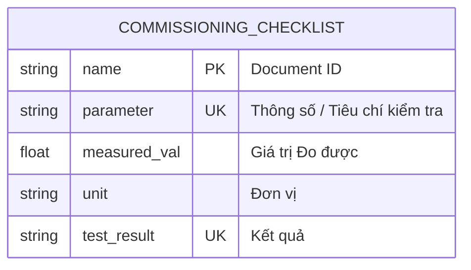

# Commissioning Checklist

> **Module:** `IMM-04` | **App:** `assetcore` | **Generated:** 2026-04-17 17:23

## Entity Relationship

## Overview

Child table of Asset Commissioning. Stores IEC 60601-1 electrical safety test results.

## Fields

| Fieldname | Type | Label | Required | Options/Link |
|-----------|------|-------|----------|-------------|
| `parameter` | `Data` | Thông số / Tiêu chí kiểm tra | ✅ |  |
| `measured_val` | `Float` | Giá trị Đo được |  |  |
| `unit` | `Data` | Đơn vị |  |  |
| `test_result` | `Select` | Kết quả | ✅ | 
Pass
Fail |
| `fail_note` | `Text` | Ghi chú Lỗi (Bắt buộc khi Fail) |  |  |
