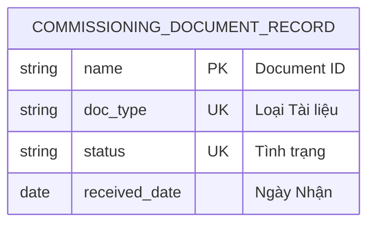

# Commissioning Document Record

> **Module:** `IMM-04` | **App:** `assetcore` | **Generated:** 2026-04-17 17:23

## Entity Relationship

## Overview

Child table of Asset Commissioning. Tracks receipt status of each required document (CO, CQ, Packing List, etc.).

## Fields

| Fieldname | Type | Label | Required | Options/Link |
|-----------|------|-------|----------|-------------|
| `doc_type` | `Select` | Loại Tài liệu | ✅ | CO - Chứng nhận Xuất xứ
CQ - Chứng nhận Chất lượng
Packing List
Manual / HDSD
Warranty Card
Training Certificate
Other |
| `status` | `Select` | Tình trạng | ✅ | Pending
Received
Missing |
| `received_date` | `Date` | Ngày Nhận |  |  |
| `remarks` | `Small Text` | Ghi chú |  |  |
