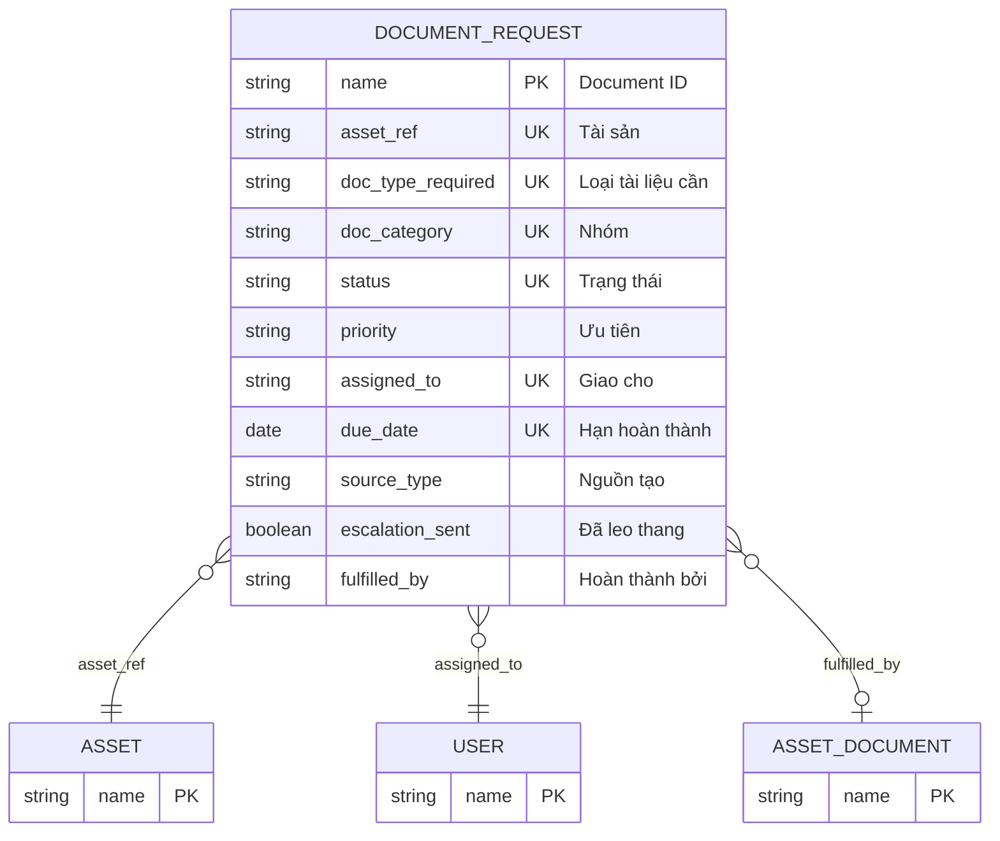

# Document Request

> **Module:** `IMM-05` | **App:** `assetcore` | **Generated:** 2026-04-17 17:23

## Entity Relationship

## Overview

Auto-escalating request for missing required documents. Created manually or by GW-2 compliance check. Escalates to 'Overdue' via daily scheduler.

## Fields

| Fieldname | Type | Label | Required | Options/Link |
|-----------|------|-------|----------|-------------|
| `asset_ref` | `Link` | Tài sản | ✅ | [[Asset]] |
| `doc_type_required` | `Data` | Loại tài liệu cần | ✅ |  |
| `doc_category` | `Select` | Nhóm | ✅ | Legal
Technical
Certification
Training
QA |
| `status` | `Select` | Trạng thái | ✅ | Open
In_Progress
Overdue
Fulfilled
Cancelled |
| `priority` | `Select` | Ưu tiên |  | Low
Medium
High
Critical |
| `assigned_to` | `Link` | Giao cho | ✅ | [[User]] |
| `due_date` | `Date` | Hạn hoàn thành | ✅ |  |
| `source_type` | `Select` | Nguồn tạo |  | Manual
Dashboard
GW2_Block
Scheduler |
| `escalation_sent` | `Check` | Đã leo thang |  |  |
| `request_note` | `Small Text` | Ghi chú yêu cầu |  |  |
| `fulfilled_by` | `Link` | Hoàn thành bởi |  | [[Asset Document]] |

## Outgoing Links (Link Fields)

- `asset_ref` → [[Asset]] *(required)*
- `assigned_to` → [[User]] *(required)*
- `fulfilled_by` → [[Asset Document]]

## Related DocTypes

- [[Asset]]
- [[Asset Document]]
- [[User]]
