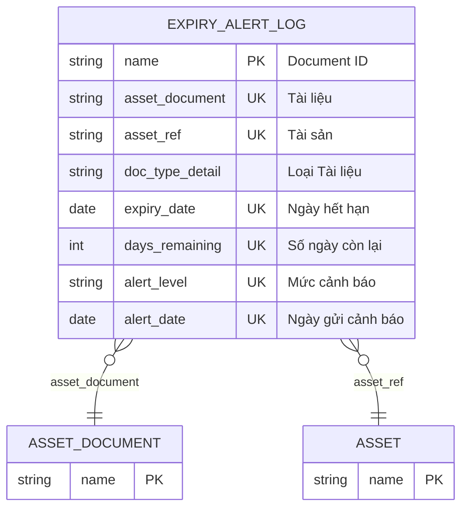

# Expiry Alert Log

> **Module:** `IMM-05` | **App:** `assetcore` | **Generated:** 2026-04-17 17:23

## Entity Relationship

## Overview

Immutable log of document expiry notifications. Created by daily scheduler at 90/60/30/0 day thresholds. Read-only after creation.

## Fields

| Fieldname | Type | Label | Required | Options/Link |
|-----------|------|-------|----------|-------------|
| `asset_document` | `Link` | Tài liệu | ✅ | [[Asset Document]] |
| `asset_ref` | `Link` | Tài sản | ✅ | [[Asset]] |
| `doc_type_detail` | `Data` | Loại Tài liệu |  |  |
| `expiry_date` | `Date` | Ngày hết hạn | ✅ |  |
| `days_remaining` | `Int` | Số ngày còn lại | ✅ |  |
| `alert_level` | `Select` | Mức cảnh báo | ✅ | Info
Warning
Critical
Danger |
| `alert_date` | `Date` | Ngày gửi cảnh báo | ✅ |  |
| `notified_users` | `Small Text` | Đã thông báo |  |  |

## Outgoing Links (Link Fields)

- `asset_document` → [[Asset Document]] *(required)*
- `asset_ref` → [[Asset]] *(required)*

## Related DocTypes

- [[Asset]]
- [[Asset Document]]
