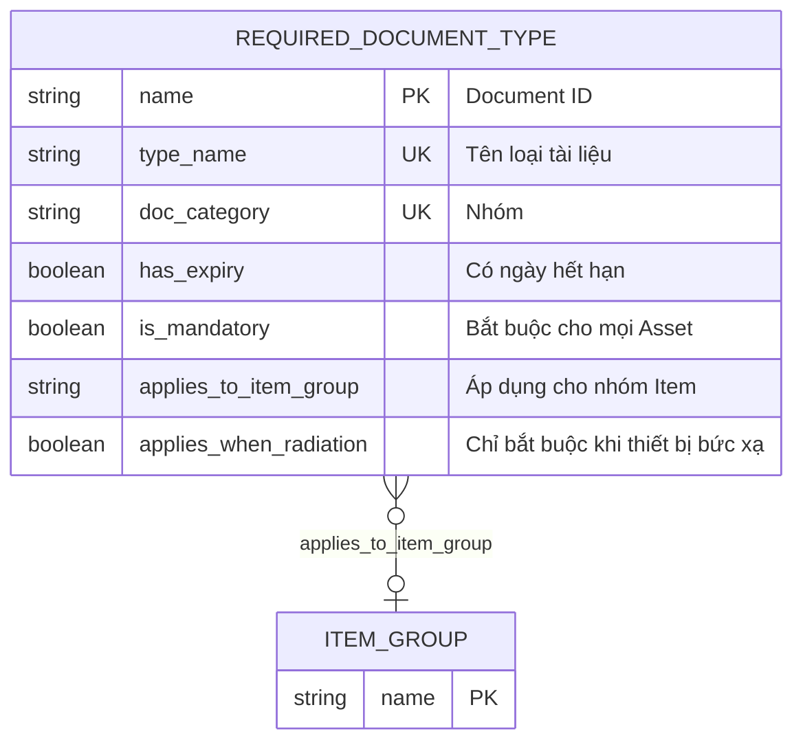

# Required Document Type

> **Module:** `IMM-05` | **App:** `assetcore` | **Generated:** 2026-04-17 17:23

## Entity Relationship

## Overview

Master configuration for mandatory document types per device category. Drives doc_completeness_pct calculation.

## Fields

| Fieldname | Type | Label | Required | Options/Link |
|-----------|------|-------|----------|-------------|
| `type_name` | `Data` | Tên loại tài liệu | ✅ |  |
| `doc_category` | `Select` | Nhóm | ✅ | Legal
Technical
Certification
Training
QA |
| `has_expiry` | `Check` | Có ngày hết hạn |  |  |
| `is_mandatory` | `Check` | Bắt buộc cho mọi Asset |  |  |
| `applies_to_item_group` | `Link` | Áp dụng cho nhóm Item |  | [[Item Group]] |
| `applies_when_radiation` | `Check` | Chỉ bắt buộc khi thiết bị bức xạ |  |  |

## Outgoing Links (Link Fields)

- `applies_to_item_group` → [[Item Group]]

## Related DocTypes

- [[Item Group]]
