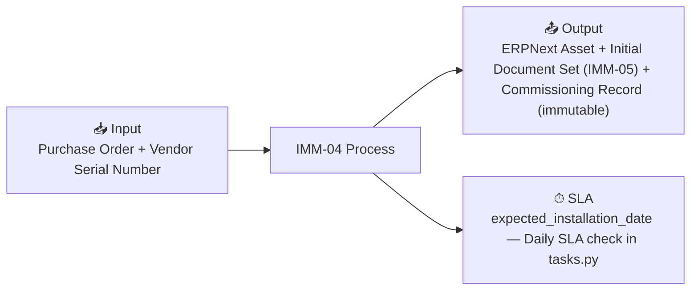

# IMM-04 — Asset Installation & Commissioning

## Summary

| Field | Value |
|-------|-------|
| **Module** | `IMM-04` |
| **Actor** | HTM Technician / Biomed Engineer / VP Block2 |
| **Primary DocType** | [[Asset Commissioning]] |
| **SLA** | expected_installation_date — Daily SLA check in tasks.py |
| **KPI** | TTI (Time to Install), Doc Completeness %, DOA Rate |

## Input / Output

- **Input:** Purchase Order + Vendor Serial Number
- **Output:** ERPNext Asset + Initial Document Set (IMM-05) + Commissioning Record (immutable)

## Workflow States

`Draft → Pending_Doc_Verify → Installing → Identification → Initial_Inspection → Clinical_Release → Clinical_Release_Success`

## Business Rules

- [[BR_VR-01]] — Serial Number Uniqueness
- [[BR_VR-02]] — Required Documents Gate
- [[BR_VR-03]] — Baseline Test Completion
- [[BR_VR-04]] — Non-Conformance Release Block
- [[BR_VR-07]] — Radiation Device License Hold
- [[BR_GW-2]] — IMM-05 Document Compliance Gateway
- [[BR_BR-07]] — Auto-Import Document Set
