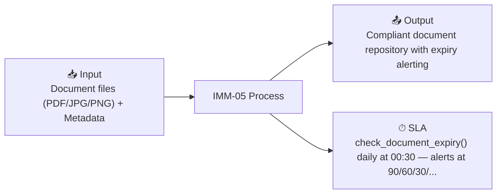

# IMM-05 — Asset Document Management (NĐ 98/2021)

## Summary

| Field | Value |
|-------|-------|
| **Module** | `IMM-05` |
| **Actor** | TBYT Officer / Tổ HC-QLCL / Workshop Head |
| **Primary DocType** | [[Asset Document]] |
| **SLA** | check_document_expiry() daily at 00:30 — alerts at 90/60/30/0 days |
| **KPI** | Doc Completeness % per Asset, Expiry count, Non-Compliant devices |

## Input / Output

- **Input:** Document files (PDF/JPG/PNG) + Metadata
- **Output:** Compliant document repository with expiry alerting

## Workflow States

`Draft → Pending_Review → Active → Expiring_Soon → Expired → Archived`

## Business Rules

- [[BR_IMM05-VR-01]] — Expiry After Issued Date
- [[BR_IMM05-VR-02]] — Unique Document Number
- [[BR_IMM05-VR-07]] — Legal/Certification Requires Expiry Date
- [[BR_IMM05-VR-08]] — File Format Validation
- [[BR_IMM05-VR-10]] — Exempt Fields Required
