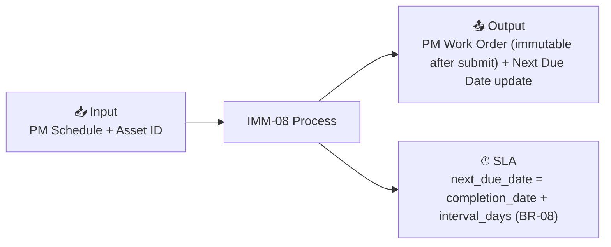

# IMM-08 — Preventive Maintenance (PM)

## Summary

| Field | Value |
|-------|-------|
| **Module** | `IMM-08` |
| **Actor** | HTM Technician / Biomed Engineer |
| **Primary DocType** | [[PM Work Order (pending implementation)]] |
| **SLA** | next_due_date = completion_date + interval_days (BR-08) |
| **KPI** | PM Compliance Rate, MTBF, On-time PM % |

## Input / Output

- **Input:** PM Schedule + Asset ID
- **Output:** PM Work Order (immutable after submit) + Next Due Date update

## Workflow States

`Scheduled → In Progress → Completed / Deferred`

## Business Rules

- [[BR_BR-SLA-PM]] — PM Next Due Date Calculation
