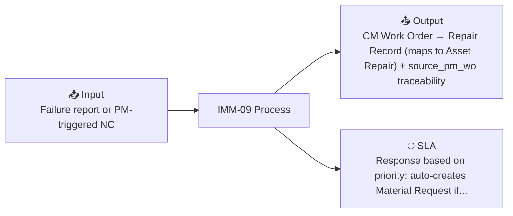

# IMM-09 — Corrective Maintenance (CM / Repair)

## Summary

| Field | Value |
|-------|-------|
| **Module** | `IMM-09` |
| **Actor** | HTM Technician / Workshop Head |
| **Primary DocType** | [[Asset Repair (ERPNext) / CM Work Order (pending)]] |
| **SLA** | Response based on priority; auto-creates Material Request if stock = 0 |
| **KPI** | MTTR, Repair Cost, First-Time Fix Rate |

## Input / Output

- **Input:** Failure report or PM-triggered NC
- **Output:** CM Work Order → Repair Record (maps to Asset Repair) + source_pm_wo traceability

## Workflow States

`Open → In Progress → Pending Parts → Completed`
