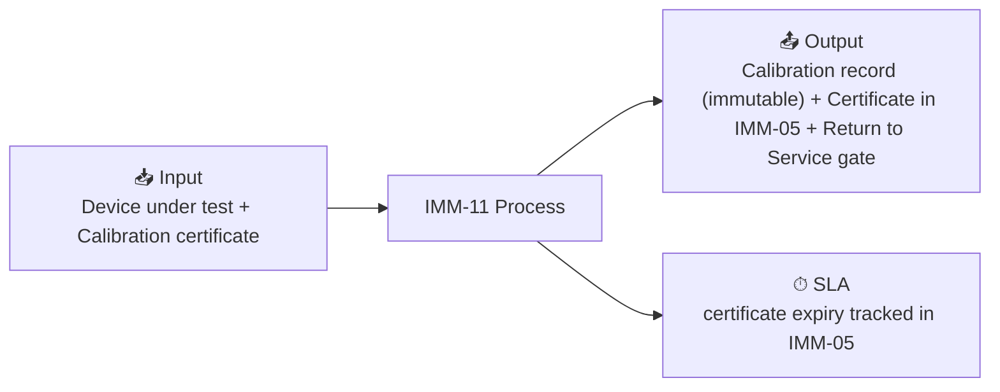

# IMM-11 — Calibration

## Summary

| Field | Value |
|-------|-------|
| **Module** | `IMM-11` |
| **Actor** | Biomed Engineer / External Calibration Body |
| **Primary DocType** | [[Calibration Record (pending implementation)]] |
| **SLA** | certificate expiry tracked in IMM-05 |
| **KPI** | Calibration compliance %, Out-of-tolerance rate |

## Input / Output

- **Input:** Device under test + Calibration certificate
- **Output:** Calibration record (immutable) + Certificate in IMM-05 + Return to Service gate

## Workflow States

`Scheduled → In Progress → Passed / Failed`
