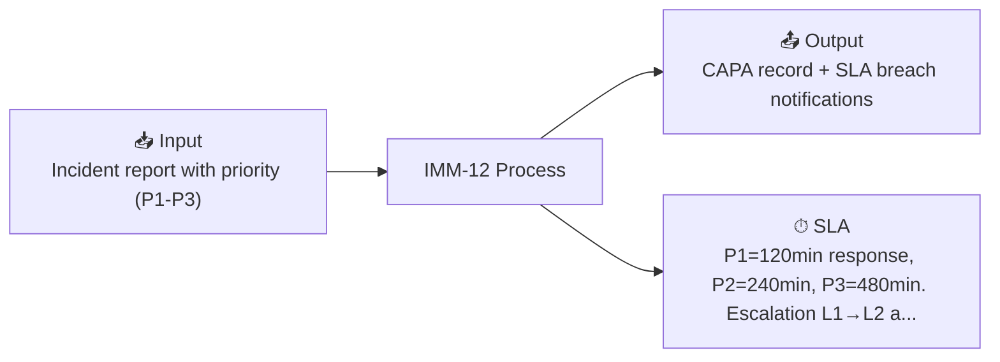

# IMM-12 — Corrective Action / Incident Management

## Summary

| Field | Value |
|-------|-------|
| **Module** | `IMM-12` |
| **Actor** | Clinical Staff (reporter) / Workshop Head (owner) |
| **Primary DocType** | [[Corrective Work Order (pending implementation)]] |
| **SLA** | P1=120min response, P2=240min, P3=480min. Escalation L1→L2 at +30min |
| **KPI** | SLA breach rate, CAPA closure rate, Repeat incident rate |

## Input / Output

- **Input:** Incident report with priority (P1-P3)
- **Output:** CAPA record + SLA breach notifications

## Workflow States

`Open → Acknowledged → Investigation → Resolved → Closed`

## Business Rules

- [[BR_BR-12-P1]] — P1 Incident SLA Escalation
